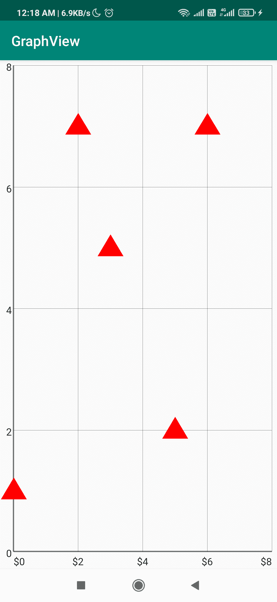
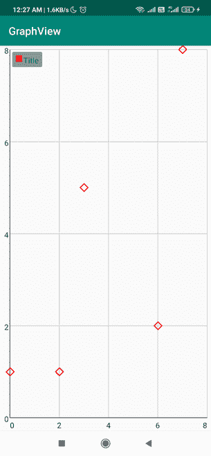

# 如何在标签中添加后缀和前缀&在安卓中给图形添加图例？

> 原文:[https://www . geesforgeks . org/如何在 android 中添加后缀和前缀到标签-添加图例到图形/](https://www.geeksforgeeks.org/how-to-add-suffix-and-prefix-to-the-label-add-legend-to-graph-in-android/)

当我们在寻找一个视图来表示一些统计数据或者寻找一个用户界面来在你的应用程序中显示一个图形时，那么在这篇文章中，我们将看看创建一个 [LineGraphView](https://www.geeksforgeeks.org/line-graph-view-in-android-with-example/) ，并在我们的安卓应用程序中为图形的标签添加和前缀。在本文中，我们将在我们的安卓应用程序中构建一个简单的线图视图，我们将在我们的应用程序中显示一些示例数据，并为标签添加后缀和前缀。

### **给标签添加后缀和前缀**

### **分步实施**

**第一步:创建新项目**

要在安卓工作室创建新项目，请参考[如何在安卓工作室创建/启动新项目](https://www.geeksforgeeks.org/android-how-to-create-start-a-new-project-in-android-studio/)。注意选择 **Java** 作为编程语言。

**第二步:将其添加到 build.gradle 文件**

> 实现' com.jjoe64:graphview:4.2.2 '

**步骤 3:使用 activity_main.xml 文件**

导航到**应用程序> res >布局> activity_main.xml** 并将下面的代码添加到该文件中。下面是 **activity_main.xml** 文件的代码。

## 可扩展标记语言

```java
<?xml version="1.0" encoding="utf-8"?>
<RelativeLayout 
    xmlns:android="http://schemas.android.com/apk/res/android"
    xmlns:tools="http://schemas.android.com/tools"
    android:layout_width="match_parent"
    android:layout_height="match_parent"
    tools:context=".MainActivity">

    <com.jjoe64.graphview.GraphView
        android:id="@+id/graphview"
        android:layout_width="match_parent"
        android:layout_height="match_parent" />

</RelativeLayout>
```

**第四步:使用****MainActivity.java 文件**

转到**MainActivity.java**文件，参考以下代码。以下是**MainActivity.java**文件的代码。代码中添加了注释，以更详细地理解代码。

## Java 语言(一种计算机语言，尤用于创建网站)

```java
import android.graphics.Color;
import android.os.Bundle;

import androidx.appcompat.app.AppCompatActivity;

import com.jjoe64.graphview.DefaultLabelFormatter;
import com.jjoe64.graphview.GraphView;
import com.jjoe64.graphview.series.DataPoint;
import com.jjoe64.graphview.series.PointsGraphSeries;

public class MainActivity extends AppCompatActivity {

    GraphView graphView;

    @Override
    protected void onCreate(Bundle savedInstanceState) {
        super.onCreate(savedInstanceState);
        setContentView(R.layout.activity_main);
        graphView = findViewById(R.id.graphview);

        // For creating Point Graph Series We use PointGraphSeries
        PointsGraphSeries<DataPoint> series = new PointsGraphSeries<>(getDataPoint());

        graphView.addSeries(series);

        // we use this method to define the 
        // shape that will be used for data points
        series.setShape(PointsGraphSeries.Shape.TRIANGLE);

        // we use this method to 
        // define the size of the shape
        series.setSize(50);

        // we use this method 
        // to set the color
        series.setColor(Color.RED);

        // adding the prefix and suffix here using gridlabelrenderer
        graphView.getGridLabelRenderer().setLabelFormatter(new DefaultLabelFormatter() {
            @Override
            public String formatLabel(double value, boolean isValueX) {

                // if valuex then add the prefix

                // return "{content}quot;+super.formatLabel(value, isValueX);
                // if valuex then add the suffix

                // return super.formatLabel(value, isValueX)+"{content}quot;;
                if (isValueX) {
                    return "{content}quot; + super.formatLabel(value, isValueX);
                }
                return super.formatLabel(value, isValueX);
            }
        });
    }

    private DataPoint[] getDataPoint() {
        DataPoint[] dp = new DataPoint[]{
                new DataPoint(0, 1),
                new DataPoint(2, 7),
                new DataPoint(3, 5),
                new DataPoint(5, 2),
                new DataPoint(6, 7),
        };
        return dp;
    }
}
```

**输出:**



### **添加图例**

要添加图例，请转到**文件并参考以下代码。以下是**MainActivity.java**文件的代码。代码中添加了注释，以更详细地理解代码。**

## **Java 语言(一种计算机语言，尤用于创建网站)**

```java
import android.graphics.Canvas;
import android.graphics.Color;
import android.graphics.Paint;
import android.os.Bundle;

import androidx.appcompat.app.AppCompatActivity;

import com.jjoe64.graphview.GraphView;
import com.jjoe64.graphview.series.DataPoint;
import com.jjoe64.graphview.series.DataPointInterface;
import com.jjoe64.graphview.series.PointsGraphSeries;

public class MainActivity extends AppCompatActivity {

    GraphView graphView;

    @Override
    protected void onCreate(Bundle savedInstanceState) {
        super.onCreate(savedInstanceState);
        setContentView(R.layout.activity_main);
        graphView = findViewById(R.id.graphview);
        PointsGraphSeries<DataPoint> series = new PointsGraphSeries<>(getDataPoint());

        graphView.addSeries(series);
        series.setShape(PointsGraphSeries.Shape.TRIANGLE);
        series.setSize(50);
        series.setColor(Color.RED);

        // setting custom shape
        series.setCustomShape(new PointsGraphSeries.CustomShape() {
            @Override
            public void draw(Canvas canvas, Paint paint, float x, float y, DataPointInterface dataPoint) {
                paint.setStrokeWidth(5);
                canvas.drawLine(x - 20, y, x, y - 20, paint);
                canvas.drawLine(x, y - 20, x + 20, y, paint);
                canvas.drawLine(x + 20, y, x, y + 20, paint);
                canvas.drawLine(x - 20, y, x, y + 20, paint);
            }
        });

        // adding title
        series.setTitle("Title");

        // setting visibility to true
        graphView.getLegendRenderer().setVisible(true);

        // setting fix position for the title
        graphView.getLegendRenderer().setFixedPosition(4, 5);

        // graphView.getLegendRenderer().setAlign(LegendRenderer.LegendAlign.TOP);
        graphView.getLegendRenderer().setTextColor(Color.BLUE);
        graphView.getLegendRenderer().setTextSize(40);
    }

    private DataPoint[] getDataPoint() {
        DataPoint[] dp = new DataPoint[]{
                new DataPoint(0, 1),
                new DataPoint(2, 1),
                new DataPoint(3, 5),
                new DataPoint(6, 2),
                new DataPoint(7, 8),
        };
        return dp;
    }
}
```

****输出:****

****