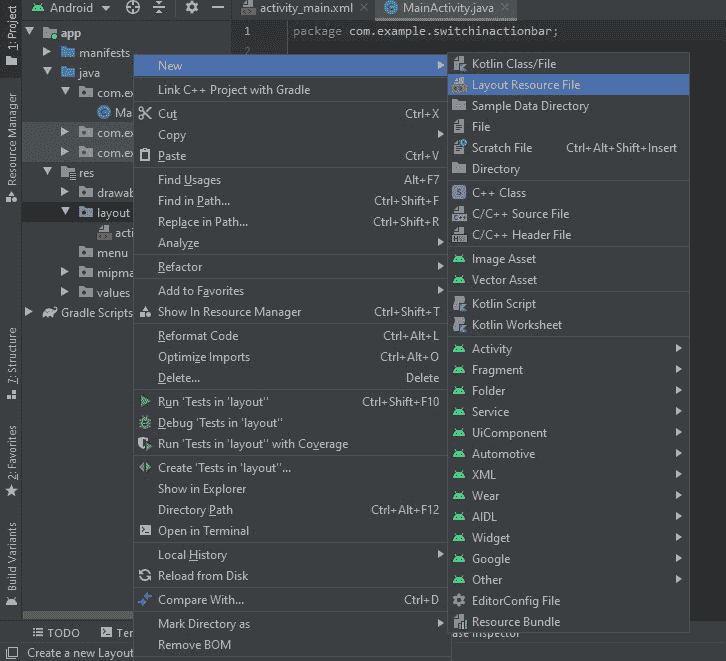

# 如何在安卓 ActionBar 中添加 Switch？

> 原文:[https://www . geesforgeks . org/如何在 android-actionbar 中添加开关/](https://www.geeksforgeeks.org/how-to-add-switch-in-android-actionbar/)

在 Android 中，Switch 是一个双态切换开关小部件，用于在两个选项之间进行选择。它通常是一个开/关按钮，指示开关的当前状态。在应用的[动作栏](https://www.geeksforgeeks.org/actionbar-in-android-with-example/)中可以使用开关的正常基本特征:

*   在应用程序中切换到暗模式或亮模式。
*   激活或停用应用程序的服务。
*   打开/关闭蓝牙或媒体相关功能等。

现在让我们看看实现这一点的分步实施。

### **分步实施**

**第一步:创建新项目**

要在安卓工作室创建新项目，请参考[如何在安卓工作室创建/启动新项目](https://www.geeksforgeeks.org/android-how-to-create-start-a-new-project-in-android-studio/)。注意选择 **Java** 作为编程语言。

**步骤 2:转到“res”并创建一个新目录，并将其命名为“menu”**

参考这篇在 Android Studio 中创建[菜单文件夹&菜单文件的文章，创建一个新的菜单资源文件，并将其命名为“ **action_menu** ”。另外，转到布局并创建一个新的布局资源文件，并将其命名为“ **use_switch** ”。](https://www.geeksforgeeks.org/how-to-create-menu-folder-menu-file-in-android-studio/)



**第三步:打开 action_menu.xml 文件，并在其中使用以下代码**

## 可扩展标记语言

```java
<?xml version="1.0" encoding="utf-8"?>
<menu xmlns:android="http://schemas.android.com/apk/res/android"
    xmlns:app="http://schemas.android.com/apk/res-auto">
    <item
        android:id="@+id/switch_action_bar"
        android:title="Switch"
        app:actionLayout="@layout/use_switch"
        app:showAsAction="always" />
</menu>
```

**第四步:打开 use_switch.xml 文件，并在其中使用以下代码**

## 可扩展标记语言

```java
<?xml version="1.0" encoding="utf-8"?>
<androidx.constraintlayout.widget.ConstraintLayout
    xmlns:android="http://schemas.android.com/apk/res/android"
    xmlns:app="http://schemas.android.com/apk/res-auto"
    android:layout_width="match_parent"
    android:layout_height="match_parent">

    <Switch
        android:id="@+id/switch2"
        android:layout_width="63dp"
        android:layout_height="58dp"
        android:padding="6dp"
        android:scaleX="1.3"
        android:scaleY="1.3"
        android:switchMinWidth="40dp"
        android:textSize="8sp"
        app:layout_constraintBottom_toBottomOf="parent"
        app:layout_constraintEnd_toEndOf="parent"
        app:layout_constraintHorizontal_bias="0.0"
        app:layout_constraintStart_toStartOf="parent"
        app:layout_constraintTop_toTopOf="parent"
        app:layout_constraintVertical_bias="0.001" />

</androidx.constraintlayout.widget.ConstraintLayout>
```

**第 5 步:使用 activity_main.xml 文件**

导航到**应用程序> res >布局> activity_main.xml** 并将下面的代码添加到该文件中。下面是 **activity_main.xml** 文件的代码。

## 可扩展标记语言

```java
<?xml version="1.0" encoding="utf-8"?>
<androidx.constraintlayout.widget.ConstraintLayout
    xmlns:android="http://schemas.android.com/apk/res/android"
    xmlns:app="http://schemas.android.com/apk/res-auto"
    xmlns:tools="http://schemas.android.com/tools"
    android:layout_width="match_parent"
    android:layout_height="match_parent"
    tools:context=".MainActivity">

    <!-- you can use any image according to you -->
    <ImageView
        android:id="@+id/imageView"
        android:layout_width="wrap_content"
        android:layout_height="wrap_content"
        app:layout_constraintBottom_toBottomOf="parent"
        app:layout_constraintEnd_toEndOf="parent"
        app:layout_constraintHorizontal_bias="0.0"
        app:layout_constraintStart_toStartOf="parent"
        app:layout_constraintTop_toTopOf="parent"
        app:layout_constraintVertical_bias="0.434"
        app:srcCompat="@drawable/gfgimage" />

    <ImageView
        android:id="@+id/imageView2"
        android:layout_width="wrap_content"
        android:layout_height="wrap_content"
        app:layout_constraintBottom_toTopOf="@+id/imageView"
        app:layout_constraintEnd_toEndOf="parent"
        app:layout_constraintHorizontal_bias="0.497"
        app:layout_constraintStart_toStartOf="parent"
        app:layout_constraintTop_toTopOf="parent"
        app:layout_constraintVertical_bias="0.918"
        app:srcCompat="@drawable/gfgimage" />

</androidx.constraintlayout.widget.ConstraintLayout>
```

**第 6 步:使用****MainActivity.java 文件**

转到**MainActivity.java**文件，参考以下代码。以下是**MainActivity.java**文件的代码。

## Java 语言(一种计算机语言，尤用于创建网站)

```java
import android.os.Bundle;
import android.view.Menu;
import android.view.MenuItem;
import android.widget.CompoundButton;
import android.widget.Switch;
import android.widget.Toast;

import androidx.appcompat.app.AppCompatActivity;

public class MainActivity extends AppCompatActivity {

    @Override
    protected void onCreate(Bundle savedInstanceState) {
        super.onCreate(savedInstanceState);
        setContentView(R.layout.activity_main);

    }

    @Override
    public boolean onCreateOptionsMenu(Menu menu) {
        getMenuInflater().inflate(R.menu.action_menu, menu);
        MenuItem itemswitch = menu.findItem(R.id.switch_action_bar);
        itemswitch.setActionView(R.layout.use_switch);

        final Switch sw = (Switch) menu.findItem(R.id.switch_action_bar).getActionView().findViewById(R.id.switch2);

        sw.setOnCheckedChangeListener(new CompoundButton.OnCheckedChangeListener() {
            @Override
            public void onCheckedChanged(CompoundButton buttonView, boolean isChecked) {
                if (isChecked) {
                    Toast.makeText(MainActivity.this, "Switch is working", Toast.LENGTH_SHORT).show();
                }
            }
        });
        return true;
    }
}
```

**输出:**

<video class="wp-video-shortcode" id="video-606711-1" width="640" height="360" preload="metadata" controls=""><source type="video/mp4" src="https://media.geeksforgeeks.org/wp-content/uploads/20210511223311/WhatsApp-Video-2021-05-11-at-22.31.41.mp4?_=1">[https://media.geeksforgeeks.org/wp-content/uploads/20210511223311/WhatsApp-Video-2021-05-11-at-22.31.41.mp4](https://media.geeksforgeeks.org/wp-content/uploads/20210511223311/WhatsApp-Video-2021-05-11-at-22.31.41.mp4)</video>

因此，我们开发了一个应用程序，可以使用应用程序操作栏中的开关来实现应用程序的基本功能。相同的过程可以应用于任何其他应用程序，在 ActionBar 中添加一个开关，并可以根据应用程序的需要实现任何功能。