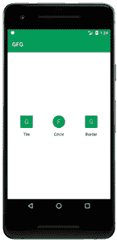

# 如何在安卓中给 ImageView 添加可绘制的文本？

> 原文:[https://www . geesforgeks . org/how-add-text-drawing-to-imageview-in-Android/](https://www.geeksforgeeks.org/how-to-add-text-drawable-to-imageview-in-android/)

在许多安卓应用程序中，你会看到一个功能，在这个功能中，你可以看到一个简单的文本显示在一个[图像视图](https://www.geeksforgeeks.org/imageview-in-android-with-example/)中，或者你可以看到一个文本显示在一个特定的图像或形状中。这种类型的视图大多出现在安卓设备上的联系人应用程序中。在该应用程序中，您将在圆形图像视图中看到每个联系人姓名的第一个字母。在本文中，我们将看看如何在我们的安卓应用程序中创建相同类型的视图。

### 我们将在本文中构建什么？

我们将构建一个简单的应用程序，其中我们将使用可绘制的文本在安卓的图像视图中显示一个简单的文本。我们将以不同的形状显示文本。下面是截图，从中我们可以看到我们将在本文中构建什么。



### **分步实施**

**第一步:创建新项目**

要在安卓工作室创建新项目，请参考[如何在安卓工作室创建/启动新项目](https://www.geeksforgeeks.org/android-how-to-create-start-a-new-project-in-android-studio/)。注意选择 **Java** 作为编程语言。

**第二步:添加依赖和 JitPack 存储库**

导航到**渐变脚本>构建.渐变(模块:应用)**，并在依赖项部分添加以下依赖项。

> 实现' com . amulyakhare:com . amulyakhare . textdrawinable:1 . 0 . 1 '

将 JitPack 存储库添加到构建文件中。将其添加到 allprojects{ }部分内存储库末尾的 root build.gradle 中。

> *所有项目{*
> 
> *存储库{*
> 
> *……*
> 
> *maven { URL’http://dl . bintray . com/amulyakhare/maven’}*
> 
> **}**
> 
> **}**

*添加这个依赖项后，同步您的项目，现在我们将开始实现它。*

***步骤 3:使用 activity_main.xml 文件***

*导航到**应用程序> res >布局> activity_main.xml** 并将下面的代码添加到该文件中。下面是 **activity_main.xml** 文件的代码。*

## *可扩展标记语言*

```java
*<?xml version="1.0" encoding="utf-8"?>
<RelativeLayout 
    xmlns:android="http://schemas.android.com/apk/res/android"
    xmlns:tools="http://schemas.android.com/tools"
    android:layout_width="match_parent"
    android:layout_height="match_parent"
    tools:context=".MainActivity">

    <!--on below line we are simply
        creating a horizontal linear layout-->
    <LinearLayout
        android:layout_width="match_parent"
        android:layout_height="wrap_content"
        android:layout_centerInParent="true"
        android:layout_margin="10dp"
        android:orientation="horizontal"
        android:weightSum="3">

        <!--on below line we are creating 3 linear layouts
            which is having an image view and text view-->
        <LinearLayout
            android:layout_width="0dp"
            android:layout_height="wrap_content"
            android:layout_margin="4dp"
            android:layout_weight="1"
            android:orientation="vertical">

            <!--on below line we are creating a new image view-->
            <ImageView
                android:id="@+id/idIVTile"
                android:layout_width="match_parent"
                android:layout_height="wrap_content"
                android:padding="8dp"
                android:src="@mipmap/ic_launcher" />

            <!--on below line we are displaying the 
                type of image in text view-->
            <TextView
                android:layout_width="match_parent"
                android:layout_height="wrap_content"
                android:padding="4dp"
                android:text="Tile"
                android:textAlignment="center"
                android:textAllCaps="false" />

        </LinearLayout>

        <LinearLayout
            android:layout_width="0dp"
            android:layout_height="wrap_content"
            android:layout_margin="4dp"
            android:layout_weight="1"
            android:orientation="vertical">

            <!--on below line we are 
                creating a new image view-->
            <ImageView
                android:id="@+id/idIVCircle"
                android:layout_width="match_parent"
                android:layout_height="wrap_content"
                android:padding="8dp"
                android:src="@mipmap/ic_launcher" />

            <!--on below line we are displaying
                the type of image in text view-->
            <TextView
                android:layout_width="match_parent"
                android:layout_height="wrap_content"
                android:padding="4dp"
                android:text="Circle"
                android:textAlignment="center"
                android:textAllCaps="false" />

        </LinearLayout>

        <LinearLayout
            android:layout_width="0dp"
            android:layout_height="wrap_content"
            android:layout_margin="4dp"
            android:layout_weight="1"
            android:orientation="vertical">

            <!--on below line we are creating a new image view-->
            <ImageView
                android:id="@+id/idIVBorder"
                android:layout_width="match_parent"
                android:layout_height="wrap_content"
                android:padding="8dp"
                android:src="@mipmap/ic_launcher" />

            <!--on below line we are displaying
                the type of image in text view-->
            <TextView
                android:layout_width="match_parent"
                android:layout_height="wrap_content"
                android:padding="4dp"
                android:text="Border"
                android:textAlignment="center"
                android:textAllCaps="false" />

        </LinearLayout>

    </LinearLayout>

</RelativeLayout>*
```

***第四步:使用****MainActivity.java 文件***

*转到**MainActivity.java**文件，参考以下代码。以下是**MainActivity.java**文件的代码。代码中添加了注释，以更详细地理解代码。*

## *Java 语言(一种计算机语言，尤用于创建网站)*

```java
*import android.os.Bundle;
import android.widget.ImageView;

import androidx.appcompat.app.AppCompatActivity;

import com.amulyakhare.textdrawable.TextDrawable;

public class MainActivity extends AppCompatActivity {

    // creating a variable for image view.
    private ImageView tileIV, borderIV, circleIV;

    @Override
    protected void onCreate(Bundle savedInstanceState) {
        super.onCreate(savedInstanceState);
        setContentView(R.layout.activity_main);

        // on below line we are initializing our image view
        tileIV = findViewById(R.id.idIVTile);
        borderIV = findViewById(R.id.idIVBorder);
        circleIV = findViewById(R.id.idIVCircle);

        // on below line we are creating a new text drawable
        TextDrawable tileImg = TextDrawable.builder()
                // begin config method is use to start the config.
                .beginConfig()
                // on below line we are setting width and height for our drawable.
                .width(130)  // width in px
                .height(130) // height in px
                // on below line we are ending the config.
                .endConfig()
                // as we are building a rectangle we are using 
                // a build rect method to create a new rectangle
                // and inside that we are passing the text 
                // as G and color for the drawable.
                .buildRect("G", getResources().getColor(R.color.purple_200));
        tileIV.setImageDrawable(tileImg);

        // below text drawable is for round rectangle
        TextDrawable roundRect = TextDrawable.builder().beginConfig()
                .width(130)  // width in px
                .height(130) // height in px
                .endConfig()
                // as we are building a rectangle with round corners we are calling a build round rect method
                // in that method we are passing the text, color and radius for our radius.
                .buildRoundRect("G", getResources().getColor(R.color.purple_200), 10); // radius in px
        borderIV.setImageDrawable(roundRect);

        // below text drawable is a circular.
        TextDrawable drawable2 = TextDrawable.builder().beginConfig()
                .width(130)  // width in px
                .height(130) // height in px
                .endConfig()
                // as we are building a circular drawable we
                // are calling a build round method.
                // in that method we are passing our text and color.
                .buildRound("F", getResources().getColor(R.color.purple_200));
        circleIV.setImageDrawable(drawable2);
    }
}*
```

*现在运行您的应用程序，并查看应用程序的输出。*

***输出:***

**