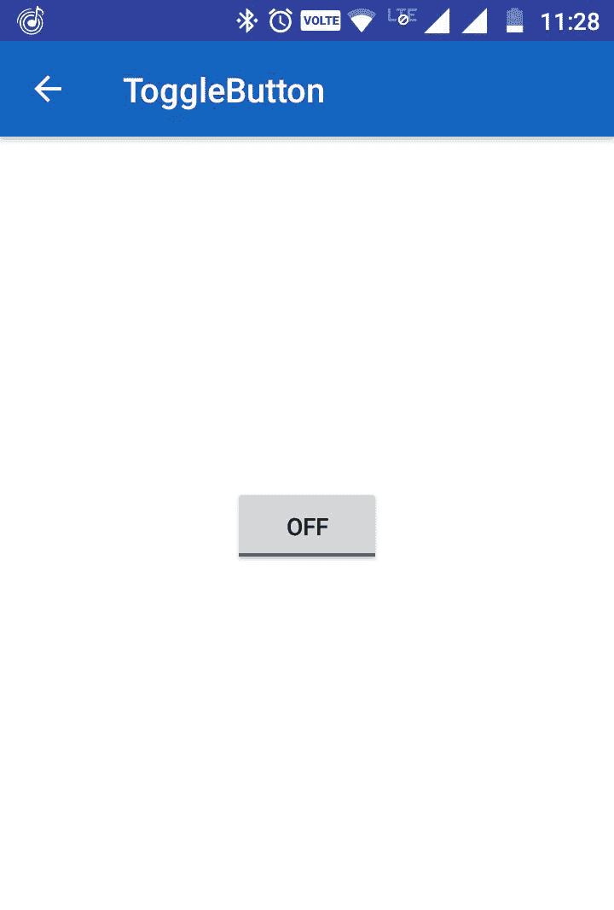
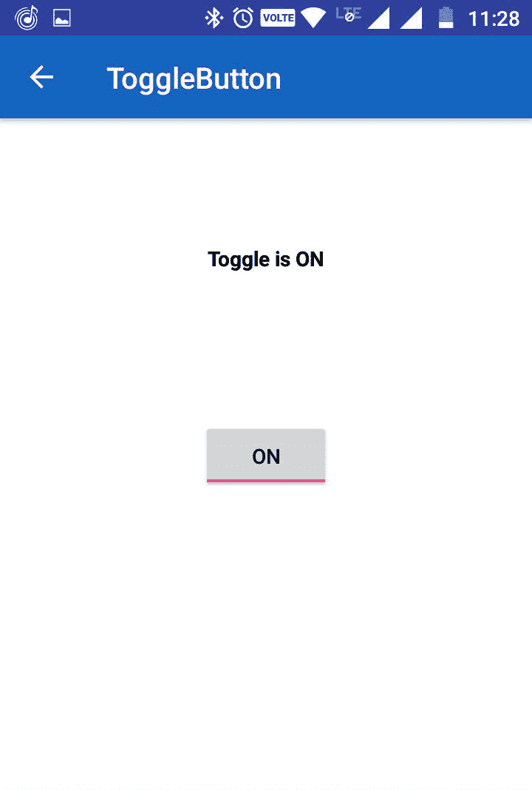
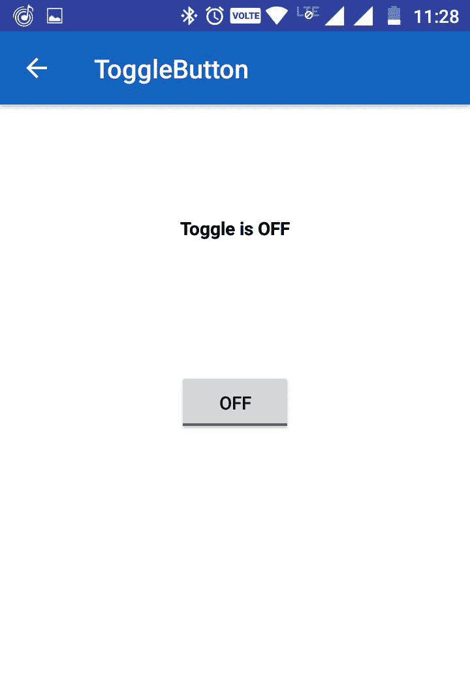

# 如何在安卓应用中添加切换按钮

> 原文:[https://www . geesforgeks . org/如何在安卓应用程序中添加切换按钮/](https://www.geeksforgeeks.org/how-to-add-toggle-button-in-an-android-application/)

**ToggleButton** 基本上是一个停止/播放或开/关按钮，指示灯指示 ToggleButton 的当前状态。ToggleButton 应用广泛，例如开/关音频、蓝牙、WiFi、热点等。这是**复合按钮**的一个子类。

ToggleButton 允许用户从手机的设置菜单中更改两种状态之间的设置，例如打开 WiFi、蓝牙等。开/关。自安卓 4.0 版本(API 级别 14)以来，它有另一种类型的切换按钮，称为**开关**，提供用户滑块控制。

以编程方式， **isChecked()** 方法用于检查切换按钮的当前状态。此方法返回一个布尔值。如果切换按钮为开，则返回真，否则返回假。下面是使用切换按钮的例子。

**接近**

*   **第一步:**新建一个项目，填写 app 所需的所有细节，如 app 名称、包名等。

    > T3】选择文件- >新建- >新建项目- >填写所需的详细信息,然后单击"完成

*   **步骤 2:** 在这一步中，打开 XML 文件并添加代码以显示切换按钮和文本视图。

    > res - >布局- >活动

    ## activity _ main . XML

    ```java
    <RelativeLayout
        xmlns:android="http://schemas.android.com/apk/res/android"  
        xmlns:app="http://schemas.android.com/apk/res-auto"  
        xmlns:tools="http://schemas.android.com/tools"  
        android:layout_width="match_parent"  
        android:layout_height="match_parent"  
        android:padding="16dp"  
        android:background="@color/white"  
        tools:context=".MainActivity">  

        <ToggleButton  
            android:id="@+id/toggleButton"  
            android:layout_width="wrap_content"  
            android:layout_height="wrap_content"  
            android:layout_centerHorizontal="true"  
            android:layout_centerVertical="true"  
            android:onClick="onToggleClick"  
            />  
        <TextView  
            android:id="@+id/textView"  
            android:layout_width="wrap_content"  
            android:layout_height="wrap_content"  
            android:layout_marginBottom="100dp"  
            android:layout_centerVertical="true"  
            android:layout_centerHorizontal="true"  
            android:layout_above="@+id/toggleButton"
            android:textStyle="bold"  
            android:textColor="@color/black"/>  
    </RelativeLayout>  
    ```

*   **第三步:**在这一步中，打开 MainActivity 并添加下面的代码来初始化切换按钮，并添加一个当用户点击切换按钮时将被调用的 onToggleClick 方法。此方法更改 textview 中的文本。

    > 打开应用- > Java - >包->Mainactivity.java

    ## MainActivity.Java

    ```java
    import androidx.appcompat.app.AppCompatActivity;
    import android.os.Bundle;
    import android.view.View;
    import android.widget.TextView;
    import android.widget.ToggleButton;

    public class MainActivity
        extends AppCompatActivity {

        ToggleButton togglebutton;
        TextView textview;
        @Override
        protected void onCreate(
            Bundle savedInstanceState)
        {
            super.onCreate(savedInstanceState);
            setContentView(R.layout.activity_main);

            togglebutton
                = (ToggleButton)findViewById(
                    R.id.toggleButton);

            textview
                = (TextView)findViewById(
                    R.id.textView);
        }

        public void onToggleClick(View view)
        {
            if (togglebutton.isChecked()) {
                textview.setText("Toggle is ON");
            }
            else {
                textview.setText("Toggle is OFF");
            }
        }
    }
    ```

**输出:**

现在用 USB 电缆连接您的设备，并启动应用程序。您将看到一个切换按钮。点击切换按钮，将显示切换按钮的状态。

  