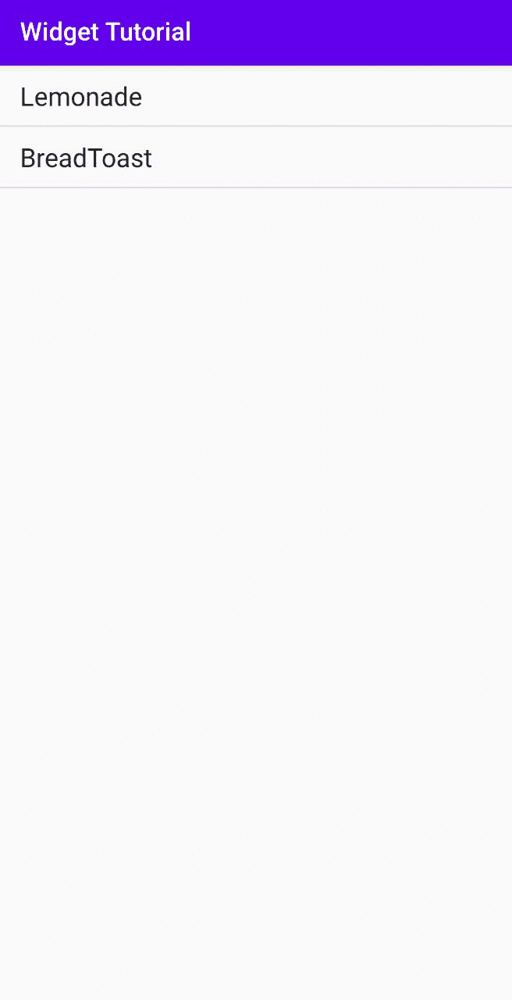
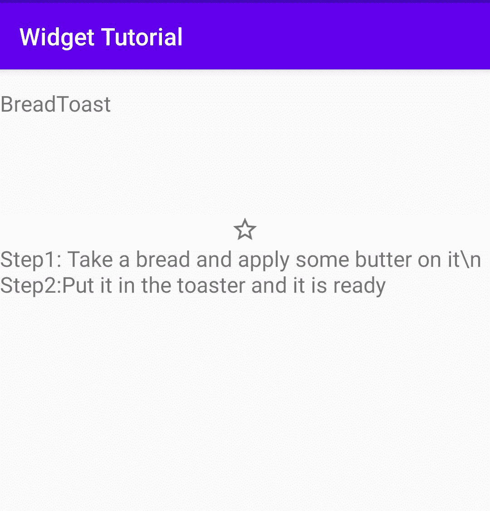
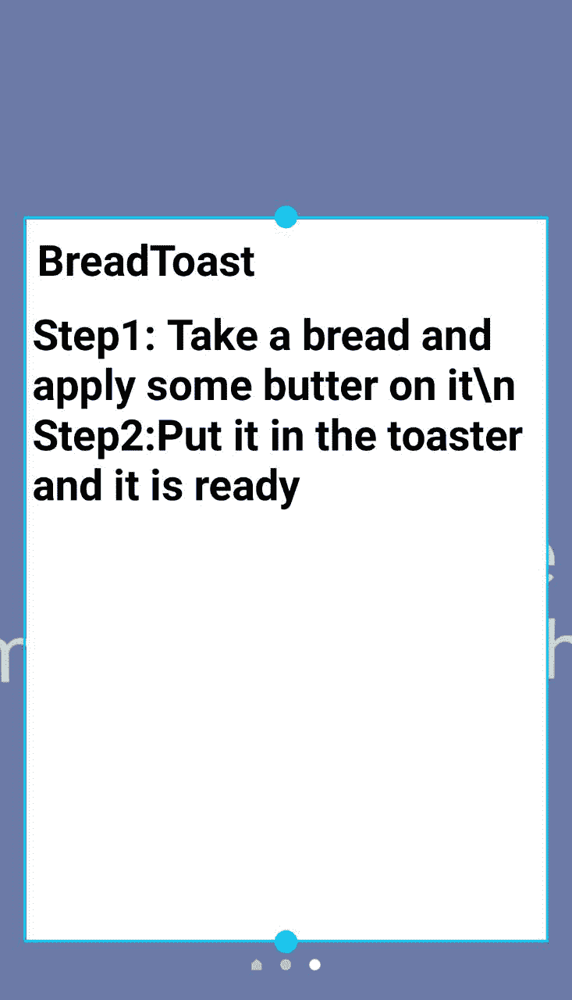

# 如何添加安卓应用的小部件？

> 原文:[https://www . geesforgeks . org/如何添加安卓应用小部件/](https://www.geeksforgeeks.org/how-to-add-widget-of-an-android-application/)

众所周知，手机上安装的许多[安卓](https://www.geeksforgeeks.org/introduction-to-android-development/)应用都包含小部件。最常见的例子是日历和时钟部件。**那么这些小部件是什么呢？** Widgets 只是一个存在于主屏幕上的小应用，除了通常出现在主屏幕上的小启动器图标。小部件确实会占用更多空间，并显示应用程序的最新信息。其中一些也是用户可调整大小的。小部件最常见的用例是启动应用程序或它的一些特定活动。

小部件基本上是一个广播消息，它使用接收器与应用程序通信，因此您还必须将它包含在您的清单文件中。这似乎是一个很大的工作，感谢[安卓工作室](https://www.geeksforgeeks.org/guide-to-install-and-set-up-android-studio/)它可以为我们做这一切。所以，直接去安卓工作室点击**app->New->Widget->app Widget**。给它一个名称，您就完成了小部件的设置。你甚至可以检查它，安装后将有一个简单的文本视图自己的小部件。

现在，在简要解释了什么是小部件之后，让我们深入研究如何创建它。设置应用程序的小部件有三个步骤。

*   **步骤 1:** 一个 WidgetProvider 类比如说 MyWidget，它扩展了 AppWidgetProvider 类。
*   **步骤 2:**WidgetProviderInfo，它是一个描述小部件元数据的 XML，包括最小高度和宽度等信息。
*   **第三步:**一个小部件布局文件，它将描述你的小部件的外观，但是它有其他布局文件的限制。

#### 主活动文件

现在让我们来创建我们自己的自定义小部件，现在需要编码。在 res 目录的 Layout 文件夹中创建一个 **MainActivity.xml** 文件，方式如下，包含一个 Listview。

## 可扩展标记语言

```java
<--!MainActivity.xml-->
<androidx.constraintlayout.widget.ConstraintLayout
       xmlns:android="http://schemas.android.com/apk/res/android"
    xmlns:app="http://schemas.android.com/apk/res-auto"
    xmlns:tools="http://schemas.android.com/tools"
    android:layout_width="match_parent"
    android:layout_height="match_parent"
    tools:context=".MainActivity">

     <!--List view to display all food items-->
    <ListView
        android:layout_width="match_parent"
        android:layout_height="match_parent"
        android:id="@+id/recipes"
        app:layout_constraintBottom_toBottomOf="parent"
        app:layout_constraintEnd_toEndOf="parent"
        app:layout_constraintTop_toTopOf="parent" />
</androidx.constraintlayout.widget.ConstraintLayout>
```

*   现在创建一个 java 文件，初始化所有视图，设置 Listview，并填充项目。
*   将 Java 文件命名为**MainActivity.Java**。

## Java 语言(一种计算机语言，尤用于创建网站)

```java
import android.appwidget.AppWidgetManager;
import android.os.Bundle;
import android.view.View;
import android.widget.ImageView;
import android.widget.TextView;
import android.widget.Toast;
import androidx.appcompat.app.AppCompatActivity;
import java.util.ArrayList;

public class DetailsActivity extends AppCompatActivity {
    TextView name, content;
    ImageView addToWidget;
    boolean added = false;

    // Take your steps of food processing as String variables
    // recipe1 and recipe2.
    private String recipe1
        = "Step1: Take a Lemon and required no of glasses of water" +
          "Step2: Squeeze out the lemon juice into glasses,stir well" +
          "and put iceCubes before serve";
    private String recipe2
        = "Step1: Take a bread and apply some butter on it" +
          "Step2:Put it in the toaster and it is ready";
    ArrayList<String> steps = new ArrayList<String>();
    public static Recipe recipe;
    AppWidgetManager appWidgetManager;
    int appWidgetId;
    @Override
    protected void onCreate(Bundle savedInstanceState)
    {
        super.onCreate(savedInstanceState);

        // attach xml file for detailsActivity,that will
        // show detail of every food item
        setContentView(R.layout.activity_details);

        // Add Steps into step ArrayList
        steps.add(recipe1);
        steps.add(recipe2);
        addToWidget = findViewById(R.id.addToWidget);

        // AppWidgetManager manages creating and updating
        // the multiple widgets an application can have.
        appWidgetManager = AppWidgetManager.getInstance(
            DetailsActivity.this);
        appWidgetId = 1;

        // Each AppWidget has a different appWidgetId to
        // make it unique.
        name = findViewById(R.id.name);
        content = findViewById(R.id.steps);
        final String heading
            = getIntent().getStringExtra("name");
        final int pos = getIntent().getIntExtra("pos", -1);
        recipe = new Recipe(heading, steps.get(pos));
        name.setText(heading);
        content.setText(steps.get(pos));

        // Attach clickListener on ImageView Object so when
        // we will click it will handle the widget adding
        // code.
        addToWidget.setOnClickListener(
            new View.OnClickListener() {
                @Override public void onClick(View view)
                {
                    added
                        = !added; // boolean variable to
                                  // know the state ,if
                                  // widget is added or not.
                    Toast
                        .makeText(DetailsActivity.this,
                                  "Click",
                                  Toast.LENGTH_SHORT)
                        .show();
                    if (added) {
                        // Calling updateAppWidget static
                        // method of RecipeWidget to update
                        // widges of app
                        RecipeWidget.updateAppWidget(
                            DetailsActivity.this,
                            appWidgetManager, appWidgetId,
                            recipe);
                        Toast
                            .makeText(DetailsActivity.this,
                                      "Added to Widget",
                                      Toast.LENGTH_SHORT)
                            .show();
                        addToWidget.setImageDrawable(
                            getResources().getDrawable(
                                R.drawable.add_widget));
                    }
                    else {

                        addToWidget.setImageDrawable(
                            getResources().getDrawable(
                                R.drawable.not_widget));
                        RecipeWidget.updateAppWidget(
                            DetailsActivity.this,
                            appWidgetManager, appWidgetId,
                            null);
                    }
                }
            });
    }
    // This method was created to pass Recipe object
    // information to AppWidget.
    public static Recipe getRecipe() { return recipe; }
}
```

**输出:**



#### **详细活动文件**

现在，我们在菜谱列表中添加了两个项目，每个项目都包含一个附带的 clicklistener，该 click listener 将导航到**DetailsActivity.java**，通过意图传递预期信息。以下是包含两个文本视图和一个添加小部件按钮(图像视图)的**的布局。**

## 可扩展标记语言

```java
<--!DetailsActivity.xml>
<?xml version="1.0" encoding="utf-8"?>
<androidx.constraintlayout.widget.ConstraintLayout
    xmlns:android="http://schemas.android.com/apk/res/android"
    xmlns:app="http://schemas.android.com/apk/res-auto"
    xmlns:tools="http://schemas.android.com/tools"
    android:layout_width="match_parent"
    android:layout_height="match_parent"
    tools:context=".DetailsActivity">

    <!--A Textview to display name of food-->
    <TextView
        android:id="@+id/name"
        android:layout_width="match_parent"
        android:layout_height="wrap_content"
        android:layout_marginTop="16dp"
        app:layout_constraintEnd_toEndOf="parent"
        app:layout_constraintHorizontal_bias="0.0"
        app:layout_constraintStart_toStartOf="parent"
        app:layout_constraintTop_toTopOf="parent"/>

    <!--A ImageView to let user add a widget by clicking on it -->
    <ImageView
        android:id="@+id/addToWidget"
        android:layout_width="match_parent"
        android:layout_height="wrap_content"
        android:background="@android:color/white"
        android:clickable="true"
        android:contentDescription="@string/addtowidget"
        android:focusable="true"
        android:src="@drawable/not_widget"
        app:layout_constraintBottom_toTopOf="@+id/steps"
        app:layout_constraintStart_toStartOf="parent"/>

      <!--A TextView to show steps -->
    <TextView
        android:id="@+id/steps"
        android:layout_width="match_parent"
        android:layout_height="wrap_content"
        app:layout_constraintBottom_toBottomOf="parent"
        app:layout_constraintEnd_toEndOf="parent"
        app:layout_constraintHorizontal_bias="0.0"
        app:layout_constraintStart_toStartOf="parent"
        app:layout_constraintTop_toBottomOf="@+id/name"
        app:layout_constraintVertical_bias="0.158"/>

</androidx.constraintlayout.widget.ConstraintLayout>
```

*   创建一个 **AppWidgetManager** 对象的实例。
*   给它一个 id，即 **AppWidgetId** ，使其唯一。
*   使用**app->new->vector asset->选择一个您希望您的图像显示的可绘制的**，就像我们选择了 star vector 一样(**r . drawing . addtowidget**)。

## Java 语言(一种计算机语言，尤用于创建网站)

```java
import android.appwidget.AppWidgetManager;
import android.os.Bundle;
import android.view.View;
import android.widget.ImageView;
import android.widget.TextView;
import android.widget.Toast;
import androidx.appcompat.app.AppCompatActivity;
import java.util.ArrayList;

public class DetailsActivity extends AppCompatActivity {
    TextView name, content;
    ImageView addToWidget;
    boolean added = false;

    // Take your steps of food processing as String variables
    // recipe1 and recipe2.
    private String recipe1
        = "Step1: Take a Lemon and required no of glasses of water" +
          "Step2: Squeeze out the lemon juice into glasses,stir well" +
          "and put iceCubes before serve";
    private String recipe2
        = "Step1: Take a bread and apply some butter on it" +
          "Step2:Put it in the toaster and it is ready";
    ArrayList<String> steps = new ArrayList<String>();
    public static Recipe recipe;
    AppWidgetManager appWidgetManager;
    int appWidgetId;
    @Override
    protected void onCreate(Bundle savedInstanceState)
    {
        super.onCreate(savedInstanceState);

        // attach xml file for detailsActivity,that will
        // show detail of every food item
        setContentView(R.layout.activity_details);

        // Add Steps into step ArrayList
        steps.add(recipe1);
        steps.add(recipe2);
        addToWidget = findViewById(R.id.addToWidget);

        // AppWidgetManager manages creating and updating
        // the multiple widgets an application can have.
        appWidgetManager = AppWidgetManager.getInstance(
            DetailsActivity.this);
        appWidgetId = 1;

        // Each AppWidget has a different appWidgetId to
        // make it unique.
        name = findViewById(R.id.name);
        content = findViewById(R.id.steps);
        final String heading
            = getIntent().getStringExtra("name");
        final int pos = getIntent().getIntExtra("pos", -1);
        recipe = new Recipe(heading, steps.get(pos));
        name.setText(heading);
        content.setText(steps.get(pos));

        // Attach clickListener on ImageView Object so when
        // we will click it will handle the widget adding
        // code.
        addToWidget.setOnClickListener(
            new View.OnClickListener() {
                @Override public void onClick(View view)
                {
                    added
                        = !added; // boolean variable to
                                  // know the state ,if
                                  // widget is added or not.
                    Toast
                        .makeText(DetailsActivity.this,
                                  "Click",
                                  Toast.LENGTH_SHORT)
                        .show();
                    if (added) {
                        // Calling updateAppWidget static
                        // method of RecipeWidget to update
                        // widges of app
                        RecipeWidget.updateAppWidget(
                            DetailsActivity.this,
                            appWidgetManager, appWidgetId,
                            recipe);
                        Toast
                            .makeText(DetailsActivity.this,
                                      "Added to Widget",
                                      Toast.LENGTH_SHORT)
                            .show();
                        addToWidget.setImageDrawable(
                            getResources().getDrawable(
                                R.drawable.add_widget));
                    }
                    else {

                        addToWidget.setImageDrawable(
                            getResources().getDrawable(
                                R.drawable.not_widget));
                        RecipeWidget.updateAppWidget(
                            DetailsActivity.this,
                            appWidgetManager, appWidgetId,
                            null);
                    }
                }
            });
    }
    // This method was created to pass Recipe object
    // information to AppWidget.
    public static Recipe getRecipe() { return recipe; }
}
```

**输出:**



#### **Recipe.Java 文件**

现在，每个配方包含一个配方名称(字符串)和一个配方步骤(字符串)，为了便于维护，我们将创建一个配方对象。

## Java 语言(一种计算机语言，尤用于创建网站)

```java
package com.tanya.widgettutorial;

public class Recipe {
    // The recipe include name of food item and steps to
    // cook it.
    private String name;
    private String steps;
    public Recipe(String name, String steps)
    {
        this.name = name;
        this.steps = steps;
    }
    // Getters and Setters
    public String getName() { return name; }

    public void setName(String name) { this.name = name; }

    public String getSteps() { return steps; }
```

**关于一个小部件，你必须知道三个字:**

*   **RemoteView:** 现在，之前我提到过小部件布局和其他任何布局都是一样的。因此，基本上，小部件布局是基于远程视图的，因为它们在你的主屏幕上被视为一个独立的应用程序。RemoteView 用于描述将在另一个进程中显示的视图层次结构。
*   **onUpdate()** 方法: **onUpdate()** 方法在创建新 Widget 时调用，也在 Widgetinfo.xml 文件中设置的每个更新间隔期间调用，即在 xml 目录下为应用程序创建 Widget 时生成。
*   **AppWidgetManager 类:**这个类包含了家里所有小部件的信息。它还提供了对所有现有小部件强制更新的访问。

#### **RecipeWidget.Java**

## Java 语言(一种计算机语言，尤用于创建网站)

```java
package com.tanya.widgettutorial;

public class Recipe {
    // The recipe include name of food item and steps to
    // cook it.
    private String name;
    private String steps;
    public Recipe(String name, String steps)
    {
        this.name = name;
        this.steps = steps;
    }
    // Getters and Setters
    public String getName() { return name; }

    public void setName(String name) { this.name = name; }

    public String getSteps() { return steps; }
```

**输出:**

