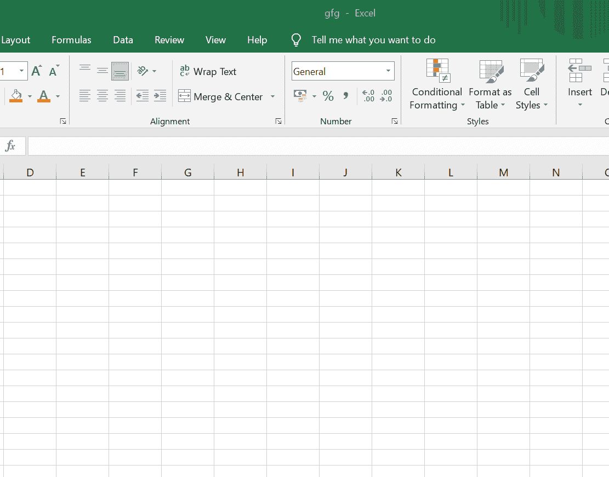
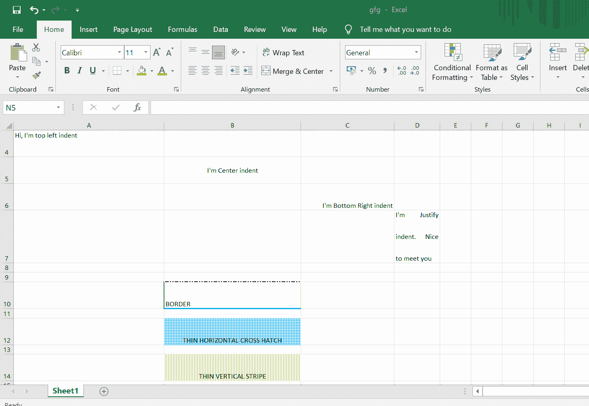

# 如何使用 Java 对电子表格中的单元格应用不同的样式？

> 原文:[https://www . geesforgeks . org/如何使用 java 将不同的样式应用到电子表格的单元格中/](https://www.geeksforgeeks.org/how-to-apply-different-styles-to-a-cell-in-a-spreadsheet-using-java/)

[Apache POI](https://www.geeksforgeeks.org/apache-poi-introduction/) 是一个功能强大的 API，用户可以使用 java 程序基于 Microsoft Office 创建、操作和显示各种文件格式。使用兴趣点，应该能够对以下文件格式执行创建、修改和显示/读取操作。例如，Java 不提供使用 Excel 文件的内置支持，所以我们需要为这项工作寻找开源的 API。它是由 Apache 软件基金会开发和分发的一个开源库，用于使用 Java 程序设计或修改 Microsoft Office 文件。它包含将用户输入数据或文件解码成微软办公文档的类和方法。这里可以应用不同的样式，如字体、颜色、单元格合并、对齐等。在 Java 程序中使用这个概念。

Apache POI 架构:它由构成架构的各种组件组成，以形成一个工作系统:

*   **POIFS(不良混淆实现文件系统):**这个组件是所有其他 POI 元素的基本因素。它用于显式读取不同的文件。
*   **HSSF(恐怖电子表格格式):**用来读写 MS-Excel 文件的 xls 格式。
*   **XSSF (XML 电子表格格式):**用于 MS-Excel 的 xlsx 文件格式。
*   **HPSF(恐怖属性集格式):**用于提取 MS-Office 文件的属性集。
*   **HWPF(恐怖文字处理器格式):**用于 MS-Word 文档扩展文件的读写。
*   **XWPF (XML 文字处理器格式):**用于 MS-Word 的 Docx 扩展文件的读写。
*   **HSLF(恐怖幻灯片版式格式):**用于阅读、创建和编辑 PowerPoint 演示文稿。
*   **HDGF(恐怖图格式):**包含 MS-Visio 二进制文件的类和方法。
*   **HPBF(恐怖发布者格式):**用于读写 MS-Publisher 文件。

Jar 文件是包含一个或多个 java 类文件的 Zip 档案。这使得图书馆的使用更加方便。目录和 Jar 文件被添加到构建路径中，并在运行时可供类加载器查找其中的特定类。我们一般用。jar 文件以 Java 类文件和相关元数据和资源(文本、图像等)的形式分发 Java 应用程序或库。).

> 人们可以说 JAR = JavaARchive

**进场:**

*   **步骤 1:** 导入必要的。像 HSSF、XML 这样的 jar 文件，并将它们添加到您的构建路径中。
*   **第 2 步:**使用“new XSSFWorkbook()”创建工作簿，其中我们必须使用“workbook.createSheet('Sheet1 ')创建电子表格或 Excel 文件，我们将在其中应用不同的样式。



*   **步骤 3:** 应用样式，这里使用命令电子表格合并单元格。添加合并区域。我们必须提供行和列的范围地址及其参数。
*   **第 4 步**:现在确定单元格对齐的下一个样式。为此，我们有两个命令
    *   " style 1 . set alignment(Xsfcellstyle。用于确定对齐和
    *   " style 1 . setverticalaalignment(XSSFCellStyle。用于确定垂直对齐
*   **第五步:**对于给单元格应用边框，我们可以使用“setBorderBottom/Left/Top/Right(XSSFCleeName。BorderName)"。
*   **第六步:**更改参数中的边框名称，以经历不同的边框样式。
*   **第七步:**填充颜色和添加图案，首先使用“setFillBackgroundColor(HSSFColor)设置单元格的背景颜色。COLOR_NAME.index)”。
*   **第八步:**然后通过“设置填充模式(XSSFCellStyle)”设置你喜欢的模式。模式名)”。
*   **步骤 9:** 最后，使用“设置对齐方式(XSSFCellStyle)”设置对齐方式。ALIGN _ TYPE)；

**实现:**对已经创建的本地目录下的空 Excel 文件执行上述程序步骤。

1.  通过创建 XSSFSheet 对象来创建跨页
2.  使用 *createRow()* 方法在上面的 XSSFSheet 中创建一行。
    *   稍后，设置一行的高度
3.  创建 XSSFCell 类型的对象，并在为其创建的行上方进行类型转换。
4.  设置单元格值。
5.  合并细胞。
6.  排列细胞。
7.  调整对齐方式。
8.  与牢房接壤。
9.  在单元格中填充颜色。
10.  通过创建文件输出流对象，在本地目录中创建新文件。
11.  写入在初始步骤中创建的上述工作簿。
12.  关闭文件的连接。

**示例:**

## Java 语言(一种计算机语言，尤用于创建网站)

```
// Java Program to apply different styles
// to a cell in a spreadsheet

// Importing java input/output classes
import java.io.File;
import java.io.FileOutputStream;
// Importing Apache POI modules
import org.apache.poi.hssf.util.HSSFColor;
import org.apache.poi.ss.usermodel.IndexedColors;
import org.apache.poi.ss.util.CellRangeAddress;
import org.apache.poi.xssf.usermodel.XSSFCell;
import org.apache.poi.xssf.usermodel.XSSFCellStyle;
import org.apache.poi.xssf.usermodel.XSSFRow;
import org.apache.poi.xssf.usermodel.XSSFSheet;
import org.apache.poi.xssf.usermodel.XSSFWorkbook;

// Class- for styling cells
public class GFG {

    // Main driver method
    public static void main(String[] args) throws Exception
    {

        // Create a Work Book
        XSSFWorkbook workbook = new XSSFWorkbook();

        // Step 1: Create a Spread Sheet by
        // creating an object of XSSFSheet
        XSSFSheet spreadsheet
            = workbook.createSheet("Sheet1");

        // Step 2(a): Creating a row in above XSSFSheet
        // using createRow() method
        XSSFRow row = spreadsheet.createRow((short)1);

        // Step 2(b): Setting height of a row
        row.setHeight((short)800);

        // Step 3: Creating an object of type XSSFCell and
        // typecasting above row created to it
        XSSFCell cell = (XSSFCell)row.createCell((short)1);

        // Step 4: Setting cell values
        cell.setCellValue("Merged cells");

        // Step 5: MERGING CELLS
        // This statement for merging cells

        spreadsheet.addMergedRegion(new CellRangeAddress(
            1, // first row (0-based)
            1, // last row (0-based)
            1, // first column (0-based)
            4 // last column (0-based)
            ));

        // Step 6: CELL Alignment
        row = spreadsheet.createRow(5);

        cell = (XSSFCell)row.createCell(0);
        row.setHeight((short)800);

        // 6(a) Top Left alignment
        XSSFCellStyle style1 = workbook.createCellStyle();

        spreadsheet.setColumnWidth(0, 8000);
        style1.setAlignment(XSSFCellStyle.ALIGN_LEFT);
        style1.setVerticalAlignment(
            XSSFCellStyle.VERTICAL_TOP);

        cell.setCellValue("Hi, I'm top left indent");
        cell.setCellStyle(style1);
        row = spreadsheet.createRow(6);
        cell = (XSSFCell)row.createCell(1);
        row.setHeight((short)800);

        // 6(b) Center Align Cell Contents
        XSSFCellStyle style2 = workbook.createCellStyle();

        style2.setAlignment(XSSFCellStyle.ALIGN_CENTER);
        style2.setVerticalAlignment(
            XSSFCellStyle.VERTICAL_CENTER);
        cell.setCellValue("I'm Center Aligned indent");
        cell.setCellStyle(style2);
        row = spreadsheet.createRow(7);
        cell = (XSSFCell)row.createCell(2);
        row.setHeight((short)800);

        // 6(c) Bottom Right alignment
        XSSFCellStyle style3 = workbook.createCellStyle();

        style3.setAlignment(XSSFCellStyle.ALIGN_RIGHT);
        style3.setVerticalAlignment(
            XSSFCellStyle.VERTICAL_BOTTOM);
        cell.setCellValue("I'm Bottom Right indent");
        cell.setCellStyle(style3);
        row = spreadsheet.createRow(8);
        cell = (XSSFCell)row.createCell(3);

        // Step 7: Justifying Alignment
        XSSFCellStyle style4 = workbook.createCellStyle();

        style4.setAlignment(XSSFCellStyle.ALIGN_JUSTIFY);
        style4.setVerticalAlignment(
            XSSFCellStyle.VERTICAL_JUSTIFY);
        cell.setCellValue(
            "I'm Justify indent nice to meet you");
        cell.setCellStyle(style4);

        // Step 8: CELL BORDER
        row = spreadsheet.createRow((short)10);

        row.setHeight((short)800);
        cell = (XSSFCell)row.createCell((short)1);
        cell.setCellValue("BORDER");
        XSSFCellStyle style5 = workbook.createCellStyle();

        style5.setBorderBottom(XSSFCellStyle.BORDER_THICK);
        style5.setBottomBorderColor(
            IndexedColors.BLUE.getIndex());
        style5.setBorderLeft(XSSFCellStyle.BORDER_DOUBLE);
        style5.setLeftBorderColor(
            IndexedColors.GREEN.getIndex());
        style5.setBorderRight(XSSFCellStyle.BORDER_HAIR);
        style5.setRightBorderColor(
            IndexedColors.RED.getIndex());
        style5.setBorderTop(XSSFCellStyle.BIG_SPOTS);
        style5.setTopBorderColor(
            IndexedColors.Black.getIndex());
        cell.setCellStyle(style5);

        // Step 9: Fill Colors

        // 9(a) Background color
        row = spreadsheet.createRow((short)10);

        cell = (XSSFCell)row.createCell((short)1);
        XSSFCellStyle style6 = workbook.createCellStyle();

        style6.setFillBackgroundColor(HSSFColor.BLUE.index);
        style6.setFillPattern(
            XSSFCellStyle.FILL_HORIZONTAL_CROSS_HATCH);
        style6.setAlignment(XSSFCellStyle.ALIGN_FILL);

        spreadsheet.setColumnWidth(1, 8000);
        cell.setCellValue("FILL HORIZONTAL CROSS HATCH");
        cell.setCellStyle(style6);

        // 9(b) Foreground color
        row = spreadsheet.createRow((short)12);

        cell = (XSSFCell)row.createCell((short)1);
        XSSFCellStyle style7 = workbook.createCellStyle();
        style7.setFillForegroundColor(
            HSSFColor.GREEN.index);
        style7.setFillPattern(
            XSSFCellStyle.THIN_VERTICAL_STRIPE);
        style7.setAlignment(XSSFCellStyle.ALIGN_FILL);

        cell.setCellValue("THIN VERTICAL STRIPE");
        cell.setCellStyle(style7);

        // Step 10: Creating a new file in the local
        // directory by creating object of FileOutputStream
        FileOutputStream out = new FileOutputStream(
            new File("C:/poiexcel/stlingcells.xlsx"));

        // Step 11: Write to above workbook created in
        // initial step
        workbook.write(out);

        // Step 12: Close the file connection
        out.close();

        // Display message for console window when
        // program is successfully executed
        System.out.println("gfg.xlsx success");
    }
}
```

**输出**

