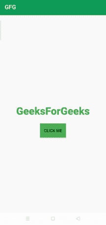

# 如何在安卓中应用视图动画效果？

> 原文:[https://www . geesforgeks . org/如何应用-查看-动画-安卓特效/](https://www.geeksforgeeks.org/how-to-apply-view-animations-effects-in-android/)

**安卓视图动画**用于在安卓应用中的[文本视图](https://www.geeksforgeeks.org/textview-widget-in-android-using-java-with-examples/)和[编辑文本](https://www.geeksforgeeks.org/edittext-widget-in-android-using-java-with-examples/)上应用惊人的动画。这样的动画以一种新的方式为应用程序提供了流畅的外观。在本文中，我们将在[安卓工作室](https://www.geeksforgeeks.org/android-studio-main-window/)中开发安卓视图动画效果。

### 我们将在本文中构建什么？

在本文中，我们将开发一个示例应用程序，在其活动上使用 **TextView** 动画效果。下面给出了一个示例 gif，以了解我们将在本文中做什么。请注意，我们将使用 **Java** 语言来实现这个项目。



### 逐步实施

**第一步:创建新项目**

要在安卓工作室创建新项目，请参考[如何在安卓工作室创建/启动新项目](https://www.geeksforgeeks.org/android-how-to-create-start-a-new-project-in-android-studio/)。注意选择 **Java** 作为编程语言。

**第二步:添加依赖关系**

现在，导航到**渐变脚本>构建.渐变(模块:应用)**在依赖项部分添加下面的依赖项。

## Java 语言(一种计算机语言，尤用于创建网站)

```
implementation 'com.daimajia.androidanimations:library:2.4@aar'
```

现在，同步您的项目，现在我们拥有了实施过程中所需的一切，现在，开始实施吧。

**步骤 3:使用 activity_main.xml 文件**

现在，转到**应用程序> res >布局> activity_main.xml** 并将下面编写的代码粘贴到 **activity_main.xml** 文件中。

## 可扩展标记语言

```
<?xml version="1.0" encoding="utf-8"?>
<RelativeLayout 
    xmlns:android="http://schemas.android.com/apk/res/android"
    xmlns:app="http://schemas.android.com/apk/res-auto"
    xmlns:tools="http://schemas.android.com/tools"
    android:layout_width="match_parent"
    android:layout_height="match_parent"
    android:id="@+id/relative_layout"
    tools:context=".MainActivity">

    <!-- TextView to display text-->
    <TextView
        android:id="@+id/textView"
        android:layout_width="750px"
        android:layout_height="200px"
        android:layout_centerInParent="true"
        android:fontFamily="sans-serif-black"
        android:text="GeeksForGeeks"
        android:textColor="#4CAF50"
        android:textSize="35dp" />

    <!--Button to perform click event-->
    <Button
        android:id="@+id/button"
        android:layout_width="wrap_content"
        android:layout_height="wrap_content"
        android:layout_below="@id/textView"
        android:layout_centerInParent="true"
        android:background="#4CAF50"
        android:text="Click Me" />

</RelativeLayout>
```

**步骤 4:使用 MainActivity.java 文件**

转到 **app > java >包名>MainActivity.java**文件，参考以下代码。以下是**MainActivity.java**文件的代码。代码中添加了注释，以更详细地理解代码。

## Java 语言(一种计算机语言，尤用于创建网站)

```
import android.os.Bundle;
import android.view.View;
import android.widget.Button;
import android.widget.TextView;

import androidx.appcompat.app.AppCompatActivity;
import com.daimajia.androidanimations.library.Techniques;
import com.daimajia.androidanimations.library.YoYo;

public class MainActivity extends AppCompatActivity {

   // declaring textView
   TextView textView;

   // declaring button
   Button button;
    @Override
    protected void onCreate(Bundle savedInstanceState) {
        super.onCreate(savedInstanceState);
        setContentView(R.layout.activity_main);

        // initializing textView by findViewById
        textView= findViewById(R.id.textView);

        // initializing button by findViewById
        button= findViewById(R.id.button);

        // apply click event to button
        button.setOnClickListener(new View.OnClickListener() {
            @Override
            public void onClick(View v) {

                // making animated textView using YoYo.with()
                // Tada can be replaced with other animation Effects
                YoYo.with(Techniques.Tada)
                        .duration(700)
                        .repeat(5)
                        .playOn(findViewById(R.id.textView));
            }
        });
    }
}
```

### **注:**

我们也可以使用像 Tada 这样的其他动画效果。下面列出了一些美丽的效果及其类别:

*   **注意:**闪光，脉冲，橡皮筋乐队，摇动，摆动，摆动，弹跳，塔达，站立，波浪
*   **特殊:**铰链、滚入、卷展、着陆、起飞、脱落
*   **弹跳:**弹跳，弹跳向下，弹跳向左，弹跳向右，弹跳向上
*   **渐隐:**渐隐、渐隐、渐隐、渐隐、渐隐、渐隐、渐隐、渐隐、渐隐、渐隐左、渐隐、渐隐上
*   **翻转:**翻转，翻转，翻转
*   **旋转:**旋转输入，旋转输出，旋转输出，旋转输出，旋转输出，旋转输出
*   **幻灯片:**幻灯片快速、幻灯片向右、幻灯片向内、幻灯片向左、幻灯片向外、幻灯片向外、幻灯片向外
*   **缩放:T1】 ZoomIn、zoom inwn、zoominleft、zoominright、zoom InP、ZoomOut、ZoomOutDown、zoomoutdown、ZoomOutRight、ZoomOutUp**

仅此而已，现在应用程序已准备好安装在设备上。下面是应用程序的输出。

**输出:**

<video class="wp-video-shortcode" id="video-580348-1" width="640" height="360" preload="metadata" controls=""><source type="video/mp4" src="https://media.geeksforgeeks.org/wp-content/uploads/20210322201820/gfg_output_text.mp4?_=1">[https://media.geeksforgeeks.org/wp-content/uploads/20210322201820/gfg_output_text.mp4](https://media.geeksforgeeks.org/wp-content/uploads/20210322201820/gfg_output_text.mp4)</video>