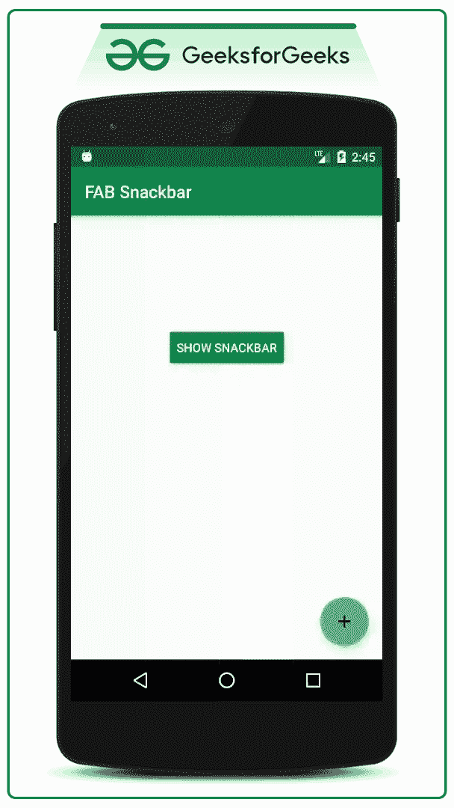
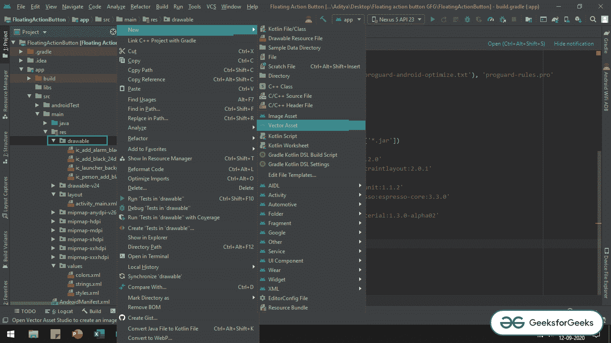
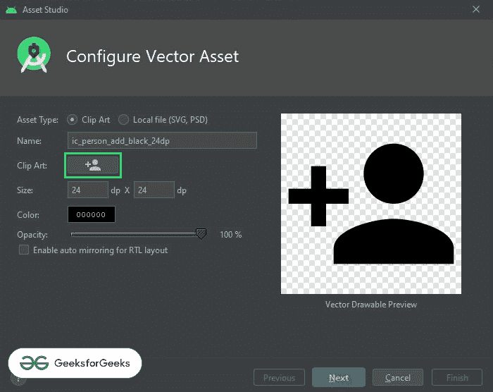
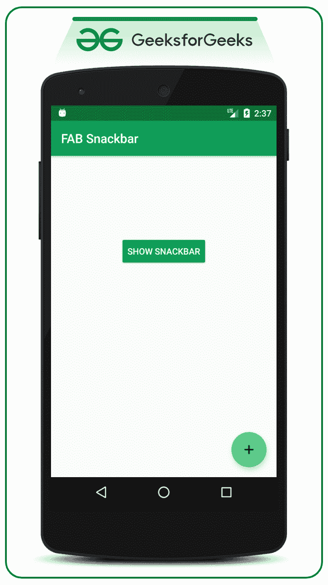

# 如何避免安卓中 Snackbar 重叠浮动动作按钮？

> 原文:[https://www . geeksforgeeks . org/如何避免-snackbar-重叠-浮动-操作-android 中的按钮/](https://www.geeksforgeeks.org/how-to-avoid-snackbar-overlap-floating-action-button-in-android/)

**先决条件:**

*   [安卓浮动动作按钮(FAB)示例](https://www.geeksforgeeks.org/floating-action-button-fab-in-android-with-example/)
*   [如何在安卓中添加 Snackbar](https://www.geeksforgeeks.org/how-to-add-a-snackbar-in-android/)

如果一个人已经在他的安卓应用程序中实现了[浮动动作按钮(FAB)](https://www.geeksforgeeks.org/floating-action-button-fab-in-android-with-example/) ，并且在同一个应用程序中还存在一个 [Snackbar](https://www.geeksforgeeks.org/how-to-add-a-snackbar-in-android/) 实现，那么 Snackbar 肯定会与浮动动作按钮重叠。请看下面的 GIF，它显示了 Snackbar 和浮动操作按钮问题:



### 如何解决这个问题？

因此，在本文中，让我们通过在安卓中举一个简单的例子来解决这个问题。注意，我们将使用 **Java** 语言实现这个例子。

**第一步:创建新项目**

要在安卓工作室创建新项目，请参考[如何在安卓工作室创建/启动新项目](https://www.geeksforgeeks.org/android-how-to-create-start-a-new-project-in-android-studio/)。注意选择 **Java** 作为编程语言。

**第二步:添加对应用级 Gradle 文件的依赖。**

*   这里我们使用的是由谷歌材质设计团队设计开发的浮动动作按钮。
*   将 [build.gradle(app)](https://www.geeksforgeeks.org/android-build-gradle/) 文件中的依赖项添加为:

> *实现‘com . Google . Android . material:material:1 . 3 . 0-alpha 02’*

*   确保将依赖项添加到应用程序级别的 Gradle 文件中。添加依赖项后，您需要点击出现在[安卓工作室 IDE](https://www.geeksforgeeks.org/guide-to-install-and-set-up-android-studio/) 右上角的“**立即同步**”按钮。
*   当用户单击“立即同步”按钮时，请确保您已连接到网络，以便它可以下载所需的文件。
*   如果您无法获得上述步骤，请参考下图:


**第三步:将 FAB 图标添加到可绘制文件**

*   出于演示目的，将在可绘制文件夹中导入 3 个图标，用户可以导入他/她选择的图标。可以通过**右键单击可绘制文件夹- >新建- >矢量资源**来实现。参考下图导入矢量图标。



*   现在选择您的矢量图标:



**第 4 步:使用 activity_main.xml 文件**

*   在 activity_main.xml 文件中，添加一个浮动动作按钮和一个按钮。所以每当用户点击[按钮](https://www.geeksforgeeks.org/button-in-kotlin/)时，就会弹出一个滚动条。
*   在 activity_main.xml 文件中调用以下代码。为了清楚理解，请参考下面给出的代码中的注释:

## 可扩展标记语言

```java
<?xml version="1.0" encoding="utf-8"?>
<androidx.constraintlayout.widget.ConstraintLayout
    xmlns:android="http://schemas.android.com/apk/res/android"
    xmlns:app="http://schemas.android.com/apk/res-auto"
    xmlns:tools="http://schemas.android.com/tools"
    android:layout_width="match_parent"
    android:layout_height="match_parent"
    tools:context=".MainActivity">

    <Button
        android:id="@+id/show_snackbar_button"
        android:layout_width="wrap_content"
        android:layout_height="wrap_content"
        android:gravity="center"
        android:text="SHOW SNACKBAR"
        app:layout_constraintBottom_toTopOf="@+id/add_fab"
        app:layout_constraintEnd_toEndOf="parent"
        app:layout_constraintStart_toStartOf="parent"
        app:layout_constraintTop_toTopOf="parent"
        tools:ignore="MissingConstraints" />

    <!--Add simple Parent Floating Action Button-->
    <com.google.android.material.floatingactionbutton.FloatingActionButton
        android:id="@+id/add_fab"
        android:layout_width="wrap_content"
        android:layout_height="wrap_content"
        android:layout_gravity="end"
        android:layout_marginEnd="16dp"
        android:layout_marginBottom="16dp"
        android:src="@drawable/ic_baseline_ac_unit_24"
        app:fabSize="normal"
        app:layout_constraintBottom_toBottomOf="parent"
        app:layout_constraintEnd_toEndOf="parent" />

</androidx.constraintlayout.widget.ConstraintLayout>
```

**产生如下输出 UI:**



**第五步:使用 MainActivity.java 文件**

*   现在在 MainActivity.java 文件中以编程方式解决这个问题。
*   我们可以在下面的代码中观察到**在点击监听器上显示 SNACKBAR** 按钮我们已经将 AnchorView 设置为父 FAB。这样父 FAB 将是可见的，即使在 Snackbar 弹出后，Snackbar 也将显示在 FAB 的顶部。
*   调用以下代码，并在代码中添加注释，以更详细地理解代码。

## Java 语言(一种计算机语言，尤用于创建网站)

```java
import android.os.Bundle;
import android.view.View;
import android.widget.Button;
import androidx.appcompat.app.AppCompatActivity;
import com.google.android.material.floatingactionbutton.FloatingActionButton;
import com.google.android.material.snackbar.Snackbar;

public class MainActivity extends AppCompatActivity {

    Button mSnackBarButton;
    FloatingActionButton mAddFab;

    @Override
    protected void onCreate(Bundle savedInstanceState) {
        super.onCreate(savedInstanceState);
        setContentView(R.layout.activity_main);

        // Register the show snackbar button with appropriate ID
        mSnackBarButton = findViewById(R.id.show_snackbar_button);

        // also register the floating action button with appropriate ID
        mAddFab = findViewById(R.id.add_fab);

        // Build and show the simple Snackbar with action button on it
        mSnackBarButton.setOnClickListener(new View.OnClickListener() {
            @Override
            public void onClick(View view) {
                Snackbar snackbar = Snackbar.make(view, "This is sample snackbar", Snackbar.LENGTH_SHORT);
                // Set the Anchor View to particular view to display the snackbar to top of it
                snackbar.setAnchorView(mAddFab);
                snackbar.setAction("OKAY", new View.OnClickListener() {
                    @Override
                    public void onClick(View view) {
                        // Do appropriate action on click of snackbar action button
                    }
                });
                snackbar.show();
            }
        });
    }
}
```

### 输出:在模拟器上运行

<video class="wp-video-shortcode" id="video-491034-1" width="640" height="360" preload="metadata" controls=""><source type="video/mp4" src="https://media.geeksforgeeks.org/wp-content/uploads/20200922024503/GFG_frame_nexus_5.mp4?_=1">[https://media.geeksforgeeks.org/wp-content/uploads/20200922024503/GFG_frame_nexus_5.mp4](https://media.geeksforgeeks.org/wp-content/uploads/20200922024503/GFG_frame_nexus_5.mp4)</video>