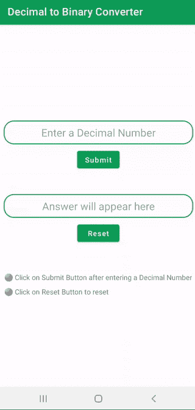
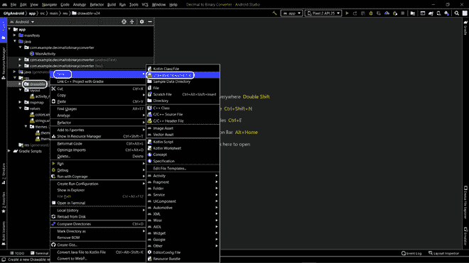
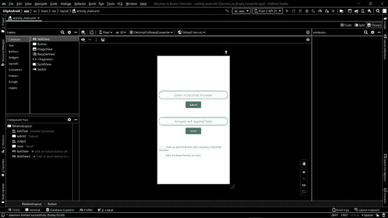
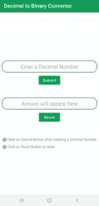
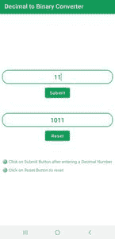

# 如何在安卓工作室搭建十进制到二进制的转换器安卓 App？

> 原文:[https://www . geesforgeks . org/如何构建十进制到二进制的转换器-Android-app-in-Android-studio/](https://www.geeksforgeeks.org/how-to-build-a-decimal-to-binary-converter-android-app-in-android-studio/)

这个应用会把一个**十进制数**转换成一个**二进制数**。有些人可能还写了一个 [java 程序来将十进制数转换成二进制数](https://www.geeksforgeeks.org/java-program-for-decimal-to-binary-conversion/)，但是在制作一个应用程序的时候，让我们看看如何做到这一点。

### 简要经历

我们将从**创建一个新项目**开始，该项目有一个**空活动**。创建项目后，我们将添加**可绘制资源文件**，该文件将用于为[编辑文本](https://www.geeksforgeeks.org/working-with-the-edittext-in-android/)提供一个箱式形状或轮廓。然后我们将使用 **XML 文件**，在这里我们将添加两个编辑文本，[按钮](https://www.geeksforgeeks.org/button-in-kotlin/)和[文本视图](https://www.geeksforgeeks.org/textview-widget-in-android-using-java-with-examples/)。最后，我们将前往**MainActivity.java**并创建一些功能，当用户点击按钮时，这些功能将会工作。请注意，我们将使用 **Java** 语言来实现应用程序。下面给出了一个示例 gif，以了解我们将在本文中实现什么。



### 逐步实施

**步骤 1:创建一个活动为空的新项目**

要在安卓工作室创建新项目，请参考[如何在安卓工作室创建/启动新项目](https://www.geeksforgeeks.org/android-how-to-create-start-a-new-project-in-android-studio/)。注意选择 **Java** 作为编程语言。


**第二步:添加可绘制的资源文件**

导航至**应用/资源/可绘制**，右键点击可绘制文件夹，进入**新建/可绘制资源文件**。



将文件命名为“ **edit_text_border** ”(您可以根据自己的意愿命名任何内容，但请注意字母不应以大写形式出现)，在默认设置下，单击确定按钮。


**第三步:使用可绘制的资源文件**

在可绘制资源“edit_text_border.xml”的 XML 文件中，我们将首先将形状定义为矩形。然后在形状上添加一个笔画，在形状周围形成一个轮廓。在相同的属性下，我们将指定笔画的宽度和颜色。最后，我们将通过指定拐角的半径在拐角处给出一个圆形。请参考下面的 XML 代码来理解上面的行:

## 可扩展标记语言

```java
<?xml version="1.0" encoding="utf-8"?>
<shape xmlns:android="http://schemas.android.com/apk/res/android"
    android:shape = "rectangle">

    <stroke
        android:width="2dp"
        android:color="@color/gfg_official"/>

    <corners
        android:radius="20dp"/>

</shape>
```

**第 4 步:使用 activity_main.xml 文件**

导航到**app/RES/layout/activity _ main . XML**，并将下面的代码添加到该文件中。在 activity_main.xml 文件中，我们要添加**两个 EditText** 用于**输入**和**输出**文本进行显示，**两个按钮**用于**提交**将提交输入，**清除**进行重置，我已经添加了**两个 TextView** 来显示一些文本，这样我们就可以指导用户如何使用这个 app 了。下面是 **activity_main.xml** 文件的代码。

## 可扩展标记语言

```java
<?xml version="1.0" encoding="utf-8"?>
<RelativeLayout
    xmlns:android="http://schemas.android.com/apk/res/android"
    xmlns:tools="http://schemas.android.com/tools"
    android:layout_width="match_parent"
    android:layout_height="match_parent"
    tools:context=".MainActivity">

    <EditText
        android:id="@+id/editText"
        android:layout_width="match_parent"
        android:layout_height="wrap_content"
        android:layout_marginLeft="8dp"
        android:layout_marginTop="200dp"
        android:layout_marginRight="8dp"
        android:background="@drawable/edit_text_border"
        android:hint="Enter a Decimal Number"
        android:inputType="numberDecimal"
        android:padding="10dp"
        android:textAlignment="center"
        android:textSize="20sp" />

    <Button
        android:id="@+id/submit"
        android:layout_width="wrap_content"
        android:layout_height="wrap_content"
        android:layout_below="@id/editText"
        android:layout_centerHorizontal="true"
        android:layout_margin="8dp"
        android:text="Submit"
        android:textAllCaps="false" />

    <EditText
        android:id="@+id/output"
        android:layout_width="match_parent"
        android:layout_height="wrap_content"
        android:layout_below="@id/submit"
        android:layout_marginLeft="8dp"
        android:layout_marginTop="40dp"
        android:layout_marginRight="8dp"
        android:background="@drawable/edit_text_border"
        android:hint="Answer will appear here"
        android:padding="10dp"
        android:textAlignment="center"
        android:textSize="20sp" />

    <Button
        android:id="@+id/reset"
        android:layout_width="wrap_content"
        android:layout_height="wrap_content"
        android:layout_below="@id/output"
        android:layout_centerHorizontal="true"
        android:layout_margin="8dp"
        android:text="Reset"
        android:textAllCaps="false" />

    <TextView
        android:id="@+id/textView"
        android:layout_width="wrap_content"
        android:layout_height="wrap_content"
        android:layout_below="@id/reset"
        android:layout_marginLeft="10dp"
        android:layout_marginTop="50dp"
        android:text="⚫ Click on Submit Button after entering a Decimal Number"
        android:textSize="15dp" />

    <TextView
        android:id="@+id/textView3"
        android:layout_width="wrap_content"
        android:layout_height="wrap_content"
        android:layout_below="@id/textView"
        android:layout_marginLeft="10dp"
        android:layout_marginTop="10dp"
        android:text="⚫ Click on Reset Button to reset"
        android:textSize="15dp" />

</RelativeLayout>
```

在为应用程序编写了 XML 文件的代码之后，设计看起来如下:



**步骤 5:使用 ActivityMain.java 文件**

转到**MainActivity.java**文件，参考以下代码。**注释**添加在代码内部，以更详细地理解代码。

## Java 语言(一种计算机语言，尤用于创建网站)

```java
import android.os.Bundle;
import android.view.View;
import android.widget.Button;
import android.widget.EditText;

import androidx.appcompat.app.AppCompatActivity;

public class MainActivity extends AppCompatActivity {

    // Giving name to the variables for
    // two EditTexts and two Buttons
    // input is where the user will
    // input the decimal number
    // output is where the user will get
    // the output in the form of binary number
    // submit is the button created to submit
    // the decimal number entered by the user
    // clear is the button to clear the answer
    EditText input, output;
    Button submit, reset;

    @Override
    protected void onCreate(Bundle savedInstanceState) {
        super.onCreate(savedInstanceState);
        setContentView(R.layout.activity_main);

        // Calling the EditText by id which we gave in xml file
        input = (EditText) findViewById(R.id.editText);
        output = (EditText) findViewById(R.id.output);

        submit = (Button) findViewById(R.id.submit);

        // It is set so that when the user clicks
        // on submit button, the data
        // gets send in the function created below
        // which will convert it and then
        // show the answer to the user in the output
        submit.setOnClickListener(new View.OnClickListener() {
            @Override
            public void onClick(View v) {

                // Creating a string method argument
                String string = input.getText().toString();

                // Here, we are parsing a string method
                // argument into an integer object
                int i = Integer.parseInt(string);

                // Converts and stores it in the form of string
                String binary = Integer.toBinaryString(i);

                // It will show the output in the
                // second edit text that we created
                output.setText(binary);
            }
        });

        // Here, we will define a function which
        // will clear the whole text and reset it
        reset = (Button) findViewById(R.id.reset);
        reset.setOnClickListener(new View.OnClickListener() {
            @Override
            public void onClick(View v) {
                input.setText("");
                output.setText("");
            }
        });

    }
}
```

**输出:**

图像

 

<video class="wp-video-shortcode" id="video-599742-1" width="640" height="360" preload="metadata" controls=""><source type="video/mp4" src="https://media.geeksforgeeks.org/wp-content/uploads/20210429104004/video.mp4?_=1">[https://media.geeksforgeeks.org/wp-content/uploads/20210429104004/video.mp4](https://media.geeksforgeeks.org/wp-content/uploads/20210429104004/video.mp4)</video>