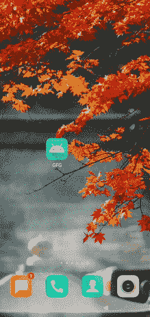

# 如何在安卓系统中构建类似脸书的定制回收视图？

> 原文:[https://www . geeksforgeeks . org/如何在安卓中构建类似 facebook 的定制回收视图/](https://www.geeksforgeeks.org/how-to-build-a-facebook-like-custom-recyclerview-in-android/)

我们已经看到在我们的应用程序中用简单的数据在安卓系统中实现[回收视图。在本文中，我们将看一下**脸书喜欢的定制回收视图在安卓**中的实现。](https://www.geeksforgeeks.org/android-recyclerview/)

### 我们将在本文中构建什么？

我们将构建一个简单的应用程序，在我们的安卓应用程序中显示脸书像回收视图。我们将从文章中给出的一个简单的 API([https://jsonkeeper.com/b/OB3B](https://jsonkeeper.com/b/OB3B))中获取这些数据。在这个应用编程接口的帮助下，我们将在回收视图中显示这些数据。下面给出了一个 GIF 示例，来了解一下我们将在本文中做什么。注意，我们将使用 **Java** 语言来实现这个项目。



### **分步实施**

**第一步:创建新项目**

要在安卓工作室创建新项目，请参考[如何在安卓工作室创建/启动新项目](https://www.geeksforgeeks.org/android-how-to-create-start-a-new-project-in-android-studio/)。注意选择 **Java** 作为编程语言。

**第二步:在你的 build.gradle 文件**中添加下面的依赖项，下面是[截击](https://www.geeksforgeeks.org/volley-library-in-android/)的依赖项，我们将使用它从 API 获取数据。要添加此依赖项，请导航至**应用程序>渐变脚本> build.gradle(应用程序)**，并在依赖项部分添加以下依赖项。

> *//从 json 文件加载数据的依赖。*
> 
> *实现‘com . Android .凌空:凌空:1 . 1 . 1’*
> 
> *//从 url 加载图像的依赖关系。*
> 
> *实现‘com . squareup . Picasso:Picasso:2.71828’*
> 
> *//创建圆图像的依赖。*
> 
> *实现‘de . hdodenhof:circleimageview:3 . 1 . 0’*

**第三步:在你的 AndroidManifest.xml 文件中添加互联网权限**

当我们从互联网加载数据时，为此，我们必须将互联网权限添加到我们的 **AndroidManifest.xml** 文件中。导航到**应用程序> AndroidManifest.xml** 文件，并在其中添加以下代码。

## 可扩展标记语言

```java
<uses-permission android:name="android.permission.INTERNET" />
<uses-permission android:name="android.permission.ACCESS_NETWORK_STATE" />
```

**第 4 步:使用 activity_main.xml 文件**

导航到**应用程序> res >布局> activity_main.xml** 并将下面的代码添加到该文件中。下面是 **activity_main.xml** 文件的代码。

## 可扩展标记语言

```java
<?xml version="1.0" encoding="utf-8"?>
<RelativeLayout
    xmlns:android="http://schemas.android.com/apk/res/android"
    xmlns:tools="http://schemas.android.com/tools"
    android:layout_width="match_parent"
    android:layout_height="match_parent"
    tools:context=".MainActivity">

    <!--recycler view for displaying
        our Facebook posts-->
    <androidx.recyclerview.widget.RecyclerView
        android:id="@+id/idRVInstaFeeds"
        android:layout_width="match_parent"
        android:layout_height="match_parent" />

    <!--progressbar for displaying
        our loading indicator-->
    <ProgressBar
        android:id="@+id/idLoadingPB"
        android:layout_width="wrap_content"
        android:layout_height="wrap_content"
        android:layout_centerInParent="true"
        android:visibility="visible" />

</RelativeLayout>
```