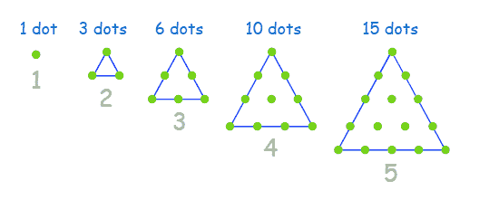
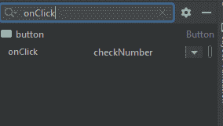

# 如何在安卓工作室搭建数字造型安卓 App？

> 原文:[https://www . geesforgeks . org/如何构建数字形状-Android-app-in-Android-studio/](https://www.geeksforgeeks.org/how-to-build-a-number-shapes-android-app-in-android-studio/)

安卓是一个需要学习和探索的广阔领域，为了让这个学习之旅更加有趣和富有成效，我们应该用新的逻辑不断尝试新的问题。所以，今天我们要在安卓工作室开发一个应用程序，告诉我们有形状的数字。我们将讨论两种类型的数字，即三角形和正方形。所以，首先让我们知道它们到底是什么:

### 1.三角数

一个能形成三角形点状图案的数称为三角数。例如，1、3、6、10、15 是三角数。



### 2.平方数

一个数乘以它自己的乘积称为平方数。例如 1、4、9、16 等。在本申请中，我们将讨论一个数是三角形还是正方形，两者都不是，还是两者都不是。

### **分步实施**

**第一步:创建新项目**

要在安卓工作室创建新项目，请参考[如何在安卓工作室创建/启动新项目](https://www.geeksforgeeks.org/android-how-to-create-start-a-new-project-in-android-studio/)。注意选择 **Java** 作为编程语言。

**步骤 2:使用 activity_main.xml 文件**

导航到**应用程序> res >布局> activity_main.xml** 并将下面的代码添加到该文件中。下面是 **activity_main.xml** 文件的代码。

## 可扩展标记语言

```java
<?xml version="1.0" encoding="utf-8"?>
<androidx.constraintlayout.widget.ConstraintLayout
    xmlns:android="http://schemas.android.com/apk/res/android"
    xmlns:app="http://schemas.android.com/apk/res-auto"
    xmlns:tools="http://schemas.android.com/tools"
    android:layout_width="match_parent"
    android:layout_height="match_parent"
    android:background="#E3B5B5"
    tools:context=".MainActivity">

    <TextView
        android:id="@+id/textView2"
        android:layout_width="279dp"
        android:layout_height="51dp"
        android:text="Number Shapes"
        android:textColor="#29629A"
        android:textSize="36sp"
        android:textStyle="bold"
        app:layout_constraintBottom_toBottomOf="parent"
        app:layout_constraintHorizontal_bias="0.592"
        app:layout_constraintLeft_toLeftOf="parent"
        app:layout_constraintRight_toRightOf="parent"
        app:layout_constraintTop_toTopOf="parent"
        app:layout_constraintVertical_bias="0.08" />

    <TextView
        android:id="@+id/textView"
        android:layout_width="338dp"
        android:layout_height="47dp"
        android:text="Enter a number to check it is triangular,square,both or neither."
        android:textColor="#303F9F"
        android:textSize="20sp"
        app:layout_constraintBottom_toBottomOf="parent"
        app:layout_constraintEnd_toEndOf="parent"
        app:layout_constraintHorizontal_bias="1.0"
        app:layout_constraintStart_toStartOf="parent"
        app:layout_constraintTop_toBottomOf="@+id/textView2"
        app:layout_constraintVertical_bias="0.056" />

    <EditText
        android:id="@+id/editTextNumber"
        android:layout_width="0dp"
        android:layout_height="wrap_content"
        android:ems="10"
        android:hint="Enter Number"
        android:inputType="number"
        app:layout_constraintBottom_toBottomOf="parent"
        app:layout_constraintEnd_toEndOf="parent"
        app:layout_constraintHorizontal_bias="0.0"
        app:layout_constraintStart_toStartOf="parent"
        app:layout_constraintTop_toBottomOf="@+id/textView"
        app:layout_constraintVertical_bias="0.097" />

    <Button
        android:id="@+id/button"
        android:layout_width="wrap_content"
        android:layout_height="wrap_content"
        android:onClick="checkNumber"
        android:text="Check Number"
        app:layout_constraintBottom_toBottomOf="parent"
        app:layout_constraintEnd_toEndOf="parent"
        app:layout_constraintStart_toStartOf="parent"
        app:layout_constraintTop_toBottomOf="@+id/editTextNumber"
        app:layout_constraintVertical_bias="0.153" />

</androidx.constraintlayout.widget.ConstraintLayout>
```

写了这么多代码后，我们的用户界面如下所示:


不要忘记用 java 代码将“支票号码”按钮与函数链接起来。为此，请执行以下步骤:

选择按钮“检查号码”，并在属性中点击搜索。



在那里写检查号。将程序的逻辑写在 java 文件中的 **checkNumber()** 函数中。

**第三步:使用****MainActivity.java 文件**

转到**MainActivity.java**文件，参考以下代码。以下是**MainActivity.java**文件的代码。代码中添加了注释，以更详细地理解代码。

## Java 语言(一种计算机语言，尤用于创建网站)

```java
import android.os.Bundle;
import android.view.View;
import android.widget.EditText;
import android.widget.Toast;

import androidx.appcompat.app.AppCompatActivity;

public class MainActivity extends AppCompatActivity {

    class number {

        int num;

        public boolean isTriangular() {
            int a = 1;
            int triangular_number = 1;

            while (triangular_number < num) {
                a++;
                triangular_number = triangular_number + a;
            }
            if (triangular_number == num) {
                return true;
            } else
                return false;
        }

        public boolean isSquare() {
            double squareRoot = Math.sqrt(num);
            if (squareRoot == Math.floor(squareRoot))
                return true;
            else return false;
        }
    }

    public void checkNumber(View view) {
        String message = "";
        EditText input_number = findViewById(R.id.editTextNumber);
        if (input_number.getText().toString().isEmpty()) {
            message = "Please enter a number!";
        } else {
            number mynum = new number();
            mynum.num = Integer.parseInt(input_number.getText().toString());

            if (mynum.isSquare()) {
                if (mynum.isTriangular()) {
                    message = mynum.num + " is both a square and triangular number";
                } else {
                    message = mynum.num + " is a square number.";
                }
            } else if (mynum.isTriangular()) {
                message = mynum.num + "is a triangular number.";
            } else
                message = "It is neither triangular nor a square number";
        }
        Toast.makeText(this, message, Toast.LENGTH_SHORT).show();
    }

    @Override
    protected void onCreate(Bundle savedInstanceState) {
        super.onCreate(savedInstanceState);
        setContentView(R.layout.activity_main);
    }
}
```

在实现以上所有步骤后，我们的应用程序如下运行:

**输出:**

<video class="wp-video-shortcode" id="video-592251-1" width="640" height="360" preload="metadata" controls=""><source type="video/mp4" src="https://media.geeksforgeeks.org/wp-content/uploads/20210415132049/Number_shapes_app.mp4?_=1">[https://media.geeksforgeeks.org/wp-content/uploads/20210415132049/Number_shapes_app.mp4](https://media.geeksforgeeks.org/wp-content/uploads/20210415132049/Number_shapes_app.mp4)</video>

因此，我们制作了一个讲述数字形状的基本应用程序，通过制作这个应用程序，我们了解了三角形和正方形的数字，如何用 java 代码链接我们的按钮，并准备了一个简单的 UI。