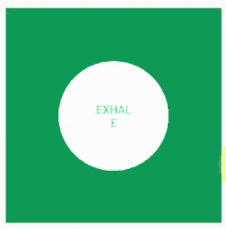

# 如何构建一个简单的呼吸运动安卓应用？

> 原文:[https://www . geeksforgeeks . org/如何构建一个简单的安卓应用程序来呼吸运动/](https://www.geeksforgeeks.org/how-to-build-a-simple-android-app-for-breathing-exercise/)

安卓手机非常方便，可以即时提供信息。假设你一直在飞，或者在照顾病人，或者在参加会议等等。，很多时候。在那些时候，有可能会感到压力，因此冥想在快速运转的生活中非常重要。这里提供了呼吸练习应用程序的源代码，这肯定会有助于获得更大的活力和热情。下面给出了一个示例 GIF，以了解我们将在本文中做什么。注意，我们将使用 **Java** 语言来实现这个项目。



### 逐步实施

**第一步:创建新项目**

要在安卓工作室创建新项目，请参考[如何在安卓工作室创建/启动新项目](https://www.geeksforgeeks.org/android-how-to-create-start-a-new-project-in-android-studio/)。注意选择 **Java** 作为编程语言。

**第二步:在进入编码部分之前，你首先要做一些前置任务**

转到**应用程序>RES>values>colors . XML**文件，为您的应用程序设置颜色。

## 可扩展标记语言

```
<?xml version="1.0" encoding="utf-8"?>
<resources>
    <color name="colorPrimaryLight">#5db839</color>
    <color name="colorPrimary">#0F9D58</color>
    <color name="colorPrimaryDark">#0F9D58</color>
    <color name="colorAccent">#FF4081</color>
</resources>
```

转到 **Gradle 脚本> build.gradle(模块:app)** 文件，导入以下依赖项，点击上面弹出的“**立即同步**”。

> 编译文件树(目录:“libs”，包括:[“*”。罐子'])
> 
> androidTestCompile(' com . Android . support . test . espresso:espresso-core:2 . 2 . 2 '，{ 0
> 
> 排除组:“com.android.support”，模块:“support-annotations”
> 
> })

以下是 **build.gradle(模块:应用)**文件的完整代码:

## Java 语言(一种计算机语言，尤用于创建网站)

```
apply plugin: 'com.android.application'

android {
    compileSdkVersion 27
    buildToolsVersion "27.0.3"
    defaultConfig {
        applicationId "com.example.breath"
        minSdkVersion 21
        targetSdkVersion 27
        versionCode 1
        versionName "1.0"
        testInstrumentationRunner "android.support.test.runner.AndroidJUnitRunner"
        vectorDrawables.useSupportLibrary = true
    }
    buildTypes {
        release {
            minifyEnabled false
            proguardFiles getDefaultProguardFile('proguard-android.txt'), 'proguard-rules.pro'
        }
    }
}

dependencies {
    compile fileTree(dir: 'libs', include: ['*.jar'])
    androidTestCompile('com.android.support.test.espresso:espresso-core:2.2.2', {
        exclude group: 'com.android.support', module: 'support-annotations'
    })
    compile 'com.android.support:appcompat-v7:27.1.0'
    compile 'com.android.support:design:27.1.0'
    compile 'com.android.support.constraint:constraint-layout:1.0.2'
    testCompile 'junit:junit:4.12'
}
```

**第三步:设计 UI 部分**

**使用 activity_main.xml 文件:**

转到 **activity_main.xml** 文件，参考以下代码。下面是 **activity_main.xml** 文件的代码。

## 可扩展标记语言

```
<?xml version="1.0" encoding="utf-8"?>
<LinearLayout 
    xmlns:android="http://schemas.android.com/apk/res/android"
    android:layout_width="match_parent"
    android:layout_height="match_parent"
    android:fitsSystemWindows="true"
    android:orientation="vertical">

    <include layout="@layout/content_main" />

</LinearLayout>
```

这里包含了 **content_main.xml** 。下面是它的代码:

## 可扩展标记语言

```
<?xml version="1.0" encoding="utf-8"?>
<android.support.constraint.ConstraintLayout 
    xmlns:android="http://schemas.android.com/apk/res/android"
    xmlns:app="http://schemas.android.com/apk/res-auto"
    xmlns:tools="http://schemas.android.com/tools"
    android:id="@+id/lt_content"
    android:layout_width="match_parent"
    android:layout_height="match_parent"
    app:layout_behavior="@string/appbar_scrolling_view_behavior"
    tools:context="com.example.breath.view.MainActivity">

    <View
        android:id="@+id/view_circle_outer"
        android:layout_width="0dp"
        android:layout_height="0dp"
        android:layout_marginLeft="@dimen/activity_horizontal_margin"
        android:layout_marginRight="@dimen/activity_horizontal_margin"
        android:background="@drawable/bg_circle_outer"
        app:layout_constraintBottom_toBottomOf="parent"
        app:layout_constraintDimensionRatio="1:1"
        app:layout_constraintLeft_toLeftOf="parent"
        app:layout_constraintRight_toRightOf="parent"
        app:layout_constraintTop_toTopOf="parent" />

    <View
        android:id="@+id/view_circle_inner"
        android:layout_width="150dp"
        android:layout_height="150dp"
        android:background="@drawable/bg_circle_inner"
        app:layout_constraintBottom_toBottomOf="parent"
        app:layout_constraintLeft_toLeftOf="parent"
        app:layout_constraintRight_toRightOf="parent"
        app:layout_constraintTop_toTopOf="parent"
        app:layout_constraintVertical_bias="0.501" />

    <TextView
        android:id="@+id/txt_status"
        android:layout_width="50dp"
        android:layout_height="wrap_content"
        android:gravity="center"
        android:text="HOLD"
        android:textColor="#4dd1b2"
        android:textSize="@dimen/hold_text_size"
        app:layout_constraintBottom_toBottomOf="@+id/view_circle_inner"
        app:layout_constraintLeft_toLeftOf="@+id/view_circle_inner"
        app:layout_constraintRight_toRightOf="@+id/view_circle_inner"
        app:layout_constraintTop_toTopOf="@+id/view_circle_inner" />

</android.support.constraint.ConstraintLayout>
```

在上面的代码中可以看到**“BG _ circle _ inner**”和“ **bg_circle_outer** ”。我们需要在可绘制文件夹中创建(转到**可绘制>右键单击>新建>可绘制资源文件**)。

以下是 **bg_circle_inner.xml** 文件的代码:

## 可扩展标记语言

```
<?xml version="1.0" encoding="utf-8"?>
<shape
    xmlns:android="http://schemas.android.com/apk/res/android"
    android:shape="oval">
    <solid android:color="@android:color/white" />
</shape>
```

以下是 **bg_circle_outer.xml** 文件的代码:

## 可扩展标记语言

```
<?xml version="1.0" encoding="utf-8"?>
<shape 
    xmlns:android="http://schemas.android.com/apk/res/android"
    android:shape="oval">

    <gradient
        android:angle="90"
        android:endColor="@color/colorPrimaryDark"
        android:startColor="@color/colorPrimaryLight" />

</shape>
```

基本上， **bg_circle_outer.xml 和 bg_circle_inner.xml** 是创建椭圆形的 xml 文件，在 **content_main.xml** 中使用。他们的意思是显示“T4”吸气和“T6】呼气的目的。

**第 4 步:使用 Java 文件**

**处理 MainActivity.java 文件:**

转到**MainActivity.java**文件，参考以下代码。以下是**MainActivity.java**文件的代码。

## Java 语言(一种计算机语言，尤用于创建网站)

```
import android.os.Bundle;
import android.os.Handler;
import android.support.constraint.ConstraintLayout;
import android.support.design.widget.FloatingActionButton;
import android.support.v7.app.AppCompatActivity;
import android.util.Log;
import android.view.View;
import android.view.animation.Animation;
import android.view.animation.AnimationUtils;
import android.widget.TextView;

import com.example.breath.R;
import com.example.breath.utils.Constants;
import com.example.breath.utils.SettingsUtils;

public class MainActivity extends AppCompatActivity implements SettingsDialog.SettingsChangeListener {

    private static final String TAG = MainActivity.class.getSimpleName();

    private ConstraintLayout contentLayout;
    private TextView statusText;
    private View outerCircleView, innerCircleView;
    private FloatingActionButton fab;

    private Animation animationInhaleText, animationExhaleText, animationInhaleInnerCircle, animationExhaleInnerCircle;
    private Handler handler = new Handler();

    private int holdDuration = 0;

    @Override
    protected void onCreate(Bundle savedInstanceState) {
        super.onCreate(savedInstanceState);
        setContentView(R.layout.activity_main);

        contentLayout = findViewById(R.id.lt_content);

        statusText = findViewById(R.id.txt_status);
        statusText.setText(Constants.INHALE);

        outerCircleView = findViewById(R.id.view_circle_outer);
        innerCircleView = findViewById(R.id.view_circle_inner);

        setupBackgroundColor();

        prepareAnimations();
        statusText.startAnimation(animationInhaleText);
        innerCircleView.startAnimation(animationInhaleInnerCircle);
    }

    private void setupBackgroundColor() {
        int backgroundResId = SettingsUtils.getBackgroundByPresetPosition(SettingsUtils.getSelectedPreset());
        setOuterCircleBackground(R.color.colorPrimaryDark);
    }

    private void setOuterCircleBackground(int backgroundResId) {
        outerCircleView.setBackgroundResource(backgroundResId);
    }

    private void setInhaleDuration(int duration) {
        animationInhaleText.setDuration(duration);
        animationInhaleInnerCircle.setDuration(duration);
    }

    private void setExhaleDuration(int duration) {
        animationExhaleText.setDuration(duration);
        animationExhaleInnerCircle.setDuration(duration);
    }

    private void prepareAnimations() {
        int inhaleDuration = SettingsUtils.getSelectedInhaleDuration();
        int exhaleDuration = SettingsUtils.getSelectedExhaleDuration();
        holdDuration = SettingsUtils.getSelectedHoldDuration();

        // Inhale - make large
        animationInhaleText = AnimationUtils.loadAnimation(this, R.anim.anim_text_inhale);
        animationInhaleText.setFillAfter(true);
        animationInhaleText.setAnimationListener(inhaleAnimationListener);

        animationInhaleInnerCircle = AnimationUtils.loadAnimation(this, R.anim.anim_inner_circle_inhale);
        animationInhaleInnerCircle.setFillAfter(true);
        animationInhaleInnerCircle.setAnimationListener(inhaleAnimationListener);

        setInhaleDuration(inhaleDuration);

        // Exhale - make small
        animationExhaleText = AnimationUtils.loadAnimation(this, R.anim.anim_text_exhale);
        animationExhaleText.setFillAfter(true);
        animationExhaleText.setAnimationListener(exhaleAnimationListener);

        animationExhaleInnerCircle = AnimationUtils.loadAnimation(this, R.anim.anim_inner_circle_exhale);
        animationExhaleInnerCircle.setFillAfter(true);
        animationExhaleInnerCircle.setAnimationListener(exhaleAnimationListener);

        setExhaleDuration(exhaleDuration);

    }

    private Animation.AnimationListener inhaleAnimationListener = new Animation.AnimationListener() {
        @Override
        public void onAnimationStart(Animation animation) {

        }

        @Override
        public void onAnimationEnd(Animation animation) {
            Log.d(TAG, "inhale animation end");
            statusText.setText(Constants.HOLD);
            handler.postDelayed(new Runnable() {
                @Override
                public void run() {
                    statusText.setText(Constants.EXHALE);
                    statusText.startAnimation(animationExhaleText);
                    innerCircleView.startAnimation(animationExhaleInnerCircle);
                }
            }, holdDuration);
        }

        @Override
        public void onAnimationRepeat(Animation animation) {
        }
    };

    private Animation.AnimationListener exhaleAnimationListener = new Animation.AnimationListener() {
        @Override
        public void onAnimationStart(Animation animation) {
        }

        @Override
        public void onAnimationEnd(Animation animation) {
            Log.d(TAG, "exhale animation end");
            statusText.setText(Constants.HOLD);
            handler.postDelayed(new Runnable() {
                @Override
                public void run() {
                    statusText.setText(Constants.INHALE);
                    statusText.startAnimation(animationInhaleText);
                    innerCircleView.startAnimation(animationInhaleInnerCircle);
                }
            }, holdDuration);
        }

        @Override
        public void onAnimationRepeat(Animation animation) {
        }
    };

    @Override
    public void onPresetChanged(int backgroundResId) {
        setOuterCircleBackground(backgroundResId);
    }

    @Override
    public void onInhaleValueChanged(int duration) {
        setInhaleDuration(duration);
    }

    @Override
    public void onExhaleValueChanged(int duration) {
        setExhaleDuration(duration);
    }

    @Override
    public void onHoldValueChanged(int duration) {
        holdDuration = duration;
    }
}
```

[创建一个新的 java 类](https://www.geeksforgeeks.org/how-to-create-classes-in-android-studio/)并将文件命名为**设置工具。**下面是**SettingsUtils.java**类文件的代码。

## Java 语言(一种计算机语言，尤用于创建网站)

```
public class SettingsUtils {

    public static int getBackgroundByPresetPosition(int position) {
        Preset preset = Preset.values()[position];
        return preset.getResId();
    }

    public static void saveSelectedPreset(int presetIndex) {
        BreathePreferences.getInstance().putInt(BreathePreferences.SELECTED_PRESET_KEY, presetIndex);
    }

    public static int getSelectedPreset() {
        int preset = BreathePreferences.getInstance().getInt(BreathePreferences.SELECTED_PRESET_KEY);
        return preset != -1 ? preset : Constants.DEFAULT_PRESET_INDEX;
    }

    public static void saveSelectedInhaleDuration(int duration) {
        BreathePreferences.getInstance().putInt(BreathePreferences.SELECTED_INHALE_DURATION_KEY, duration);
    }

    public static int getSelectedInhaleDuration() {
        int duration = BreathePreferences.getInstance().getInt(BreathePreferences.SELECTED_INHALE_DURATION_KEY);
        return duration != -1 ? duration : Constants.DEFAULT_DURATION;
    }

    public static void saveSelectedExhaleDuration(int duration) {
        BreathePreferences.getInstance().putInt(BreathePreferences.SELECTED_EXHALE_DURATION_KEY, duration);
    }

    public static int getSelectedExhaleDuration() {
        int duration = BreathePreferences.getInstance().getInt(BreathePreferences.SELECTED_EXHALE_DURATION_KEY);
        return duration != -1 ? duration : Constants.DEFAULT_DURATION;
    }

    public static void saveSelectedHoldDuration(int duration) {
        BreathePreferences.getInstance().putInt(BreathePreferences.SELECTED_HOLD_DURATION_KEY, duration);
    }

    public static int getSelectedHoldDuration() {
        int duration = BreathePreferences.getInstance().getInt(BreathePreferences.SELECTED_HOLD_DURATION_KEY);
        return duration != -1 ? duration : Constants.DEFAULT_DURATION;
    }
}
```