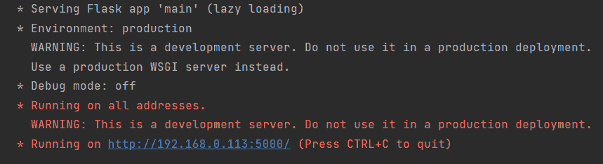
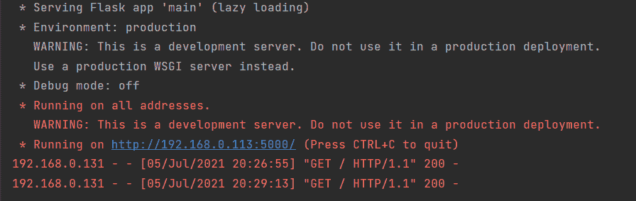
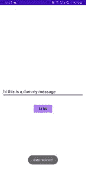
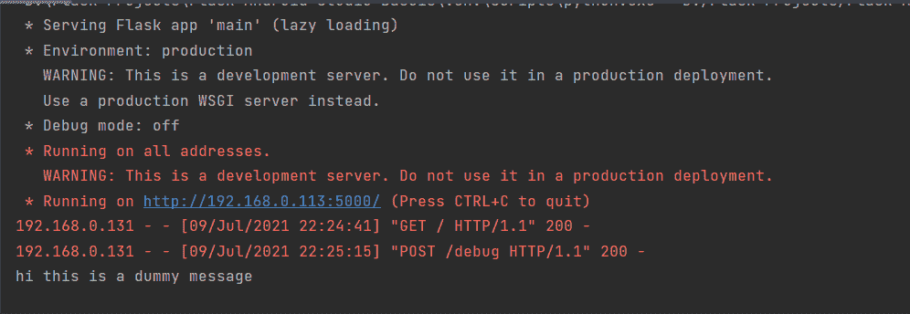

# 如何用 Flask 后端构建一个简单的安卓应用？

> 原文:[https://www . geeksforgeeks . org/如何构建一个简单的 Android-app-with-flask-后端/](https://www.geeksforgeeks.org/how-to-build-a-simple-android-app-with-flask-backend/)

Flask 是 Python 的一个应用编程接口，允许我们构建网络应用程序。它是由阿明·罗纳奇开发的。Flask 的框架比 Django 的框架更明确，也更容易学习，因为它实现一个简单的网络应用程序的基础代码更少。网络应用程序框架或网络框架是模块和库的集合，帮助开发人员编写应用程序，而无需编写底层代码，如协议、线程管理等。Flask 基于 WSGI(Web 服务器网关接口)工具包和 Jinja2 模板引擎。下面的文章将演示**如何在开发安卓应用程序时使用 Flask 作为后端。**

### **分步**实施

**第一步:安装砂箱**

打开终端，输入以下命令安装烧瓶

```
pip install flask
```

**第 2 步:将 OkHttp 依赖项添加到 build.gradle 文件**

OkHttp 是 Square 开发的一个库，用于发送和接收基于 Http 的网络请求。为了在安卓应用程序中发出 HTTP 请求，我们使用了 OkHttp。该库用于进行同步和异步调用。如果一个网络调用是同步的，那么代码将等待，直到我们从试图与之通信的服务器得到响应。这可能会导致延迟或性能滞后。如果网络调用是异步的，执行不会等到服务器响应，应用程序将运行，如果服务器响应，将执行回调。

**安卓依赖**

在安卓工作室的 [build.gradle](https://www.geeksforgeeks.org/android-build-gradle/) 文件中添加以下依赖项

```
implementation("com.squareup.okhttp3:okhttp:4.9.0")
```

**第三步:使用安卓清单。XML 文件**

在<application>标签上方添加以下一行</application>

```
<uses-permission android:name="android.permission.INTERNET"/>
```

在<application>标签内添加以下一行</application>

```
android:usesCleartextTraffic="true">
```

**第四步:Python 脚本**

*   @ app . route(“/”)与 showHomePage()函数相关联。假设服务器运行在一个 IP 地址为 192.168.0.113、端口号为 5000 的系统上。现在，如果将网址“http://192.168.0.113:5000/”输入浏览器，将执行 showHomePage 功能，并返回响应“这是主页”。
*   app.run()将在本地主机上托管服务器，而 app . run(host =“0 . 0 . 0 . 0 ”)将在机器的 IP 地址上托管服务器
*   默认情况下，将使用端口 5000，我们可以使用 app.run()中的“port”参数进行更改

## 计算机编程语言

```
from flask import Flask

# Flask Constructor
app = Flask(__name__)

# decorator to associate
# a function with the url
@app.route("/")
def showHomePage():
      # response from the server
    return "This is home page"

if __name__ == "__main__":
  app.run(host="0.0.0.0")
```

**运行 Python 脚本**

运行 python 脚本，服务器将被托管。



**第 5 步:使用 activity_main.xml 文件**

*   创建一个[约束布局](https://www.geeksforgeeks.org/constraintlayout-in-android/)。
*   在约束布局中添加一个标识为“页面名称”的[文本视图](https://www.geeksforgeeks.org/textview-widget-in-android-using-java-with-examples/)，以显示来自服务器的响应
*   因此，在 android studio 的 **activity_main.xml** 文件中添加以下代码。

## 可扩展标记语言

```
<?xml version="1.0" encoding="utf-8"?>
<androidx.constraintlayout.widget.ConstraintLayout
    xmlns:android="http://schemas.android.com/apk/res/android"
    xmlns:app="http://schemas.android.com/apk/res-auto"
    xmlns:tools="http://schemas.android.com/tools"
    android:layout_width="match_parent"
    android:layout_height="match_parent"
    android:background="@color/white"
    tools:context=".MainActivity">

    <TextView
        android:id="@+id/pagename"
        android:layout_width="0dp"
        android:layout_height="wrap_content"
        android:layout_marginStart="12dp"
        android:layout_marginEnd="12dp"
        android:textAlignment="center"
        android:textColor="@color/black"
        android:textSize="16sp"
        android:textStyle="bold"
        app:layout_constraintBottom_toBottomOf="parent"
        app:layout_constraintEnd_toEndOf="parent"
        app:layout_constraintStart_toStartOf="parent"
        app:layout_constraintTop_toTopOf="parent" />

</androidx.constraintlayout.widget.ConstraintLayout>
```

**第 6 步:使用****MainActivity.java 文件**

转到**MainActivity.java**文件，参考以下代码。首先，我们需要一个 OkHttp 客户端来发出请求

```
OkHttpClient okhttpclient = new OkHttpClient();
```

接下来，用服务器的网址创建一个请求。在我们的例子中，它是“http://192.168.0.113:5000/”。请注意网址末尾的“/”，我们正在发送主页请求。

```
Request request = new Request.Builder().url("http://192.168.0.113:5000/").build();
```

现在，用上面的请求打个电话。完整的代码如下。如果服务器关闭或无法访问，将调用 onFailure()，因此我们在 TextView 中显示一个文本，上面写着“服务器关闭”。如果请求成功，将调用 onResponse()。我们可以使用在 onResponse()中收到的响应参数来访问响应

```
// to access the response we get from the server
response.body().string; 
```

以下是**MainActivity.java**文件的代码。代码中添加了注释，以更详细地理解代码。

## Java 语言(一种计算机语言，尤用于创建网站)

```
import android.os.Bundle;
import android.widget.TextView;
import android.widget.Toast;

import androidx.appcompat.app.AppCompatActivity;

import org.jetbrains.annotations.NotNull;

import java.io.IOException;

import okhttp3.Call;
import okhttp3.Callback;
import okhttp3.OkHttpClient;
import okhttp3.Request;
import okhttp3.Response;

public class MainActivity extends AppCompatActivity {

    // declare attribute for textview
    private TextView pagenameTextView;

    @Override
    protected void onCreate(Bundle savedInstanceState) {
        super.onCreate(savedInstanceState);
        setContentView(R.layout.activity_main);
        pagenameTextView = findViewById(R.id.pagename);

        // creating a client
        OkHttpClient okHttpClient = new OkHttpClient();

        // building a request
        Request request = new Request.Builder().url("http://192.168.0.113:5000/").build();

        // making call asynchronously
        okHttpClient.newCall(request).enqueue(new Callback() {
            @Override
            // called if server is unreachable
            public void onFailure(@NotNull Call call, @NotNull IOException e) {
                runOnUiThread(new Runnable() {
                    @Override
                    public void run() {
                        Toast.makeText(MainActivity.this, "server down", Toast.LENGTH_SHORT).show();
                        pagenameTextView.setText("error connecting to the server");
                    }
                });
            }

            @Override
            // called if we get a
            // response from the server
            public void onResponse(
                    @NotNull Call call,
                    @NotNull Response response)
                    throws IOException {pagenameTextView.setText(response.body().string());
            }
        });
    }
}
```

> **注:**
> 
> *   确保安卓应用程序运行在与托管服务器的系统连接到同一网络的设备上。(如果 flask 服务器运行在连接到‘ABC’WIFI 的机器上，我们需要将我们的 android 设备连接到同一个‘ABC’网络)
> *   如果应用程序无法连接到服务器，请确保您的防火墙允许端口 5000 上的连接。如果没有，请在防火墙高级设置中创建入站规则。

**输出:**


安卓应用正在运行

**第 7 步:检查 Python 编辑器中的请求**

如果发出请求，我们可以看到发出请求的设备的 IP 地址、发出请求的时间和请求类型(在我们的例子中，请求类型是 GET)。



### 开机自检请求

我们可以使用 okhttp 客户端通过服务器发送数据。在导入语句中添加以下行

```
from flask import request
```

我们需要将路由的方法设置为 POST。让我们添加一个方法并关联一个路由。该方法将我们在 android 应用程序中输入的文本打印到 pycharm 的控制台上。在 **showHomePage()** 方法后增加以下几行。

```
@app.route("/debug", methods=["POST"])
def debug():
    text = request.form["sample"]
    print(text)
    return "received"
```

完整的脚本如下

## 计算机编程语言

```
from flask import Flask

# import request
from flask import request
app = Flask(__name__)

@app.route("/")
def showHomePage():
    return "This is home page"

@app.route("/debug", methods=["POST"])
def debug():
    text = request.form["sample"]
    print(text)
    return "received" 

if __name__ == "__main__":
  app.run(host="0.0.0.0")
```

在安卓工作室创建一个 DummyActivity.java。一旦我们从服务器收到来自 **showHomePage()** 方法的响应，这个活动就会开始。在**MainActivity.java**onResponse()回调中添加以下行。

```
Intent intent = new Intent(MainActivity.this, DummyActivity.class);
startActivity(intent);
finish();
```

**步骤 1:使用 activity_dummy.xml 文件**

*   添加一个 id 为 dummy_text 的 [EditText](https://www.geeksforgeeks.org/edittext-widget-in-android-using-java-with-examples/) 。
*   添加一个 id 为 dummy_send 且文本为“发送”的[按钮](https://www.geeksforgeeks.org/button-in-kotlin/)。

## 可扩展标记语言

```
<?xml version="1.0" encoding="utf-8"?>
<androidx.constraintlayout.widget.ConstraintLayout
    xmlns:android="http://schemas.android.com/apk/res/android"
    xmlns:app="http://schemas.android.com/apk/res-auto"
    xmlns:tools="http://schemas.android.com/tools"
    android:layout_width="match_parent"
    android:layout_height="match_parent"
    android:background="@color/white"
    tools:context=".DummyActivity">

    <EditText
        android:id="@+id/dummy_text"
        android:layout_width="match_parent"
        android:layout_height="wrap_content"
        android:layout_marginStart="12dp"
        android:layout_marginEnd="12dp"
        android:backgroundTint="@color/black"
        android:hint="enter any text"
        android:textColor="@color/black"
        android:textColorHint="#80000000"
        app:layout_constraintBottom_toBottomOf="parent"
        app:layout_constraintEnd_toEndOf="parent"
        app:layout_constraintStart_toStartOf="parent"
        app:layout_constraintTop_toTopOf="parent" />

    <Button
        android:id="@+id/dummy_send"
        android:layout_width="wrap_content"
        android:layout_height="wrap_content"
        android:text="Send"
        app:layout_constraintBottom_toBottomOf="parent"
        app:layout_constraintEnd_toEndOf="parent"
        app:layout_constraintStart_toStartOf="parent"
        app:layout_constraintTop_toBottomOf="@+id/dummy_text"
        app:layout_constraintVertical_bias="0.1" />

</androidx.constraintlayout.widget.ConstraintLayout>
```

**步骤 2:使用 DummyActivity.java 文件**

*   我们使用一个表单来使用 OkHTTP 客户端发送数据。
*   在构建请求时，我们将此表单作为参数传递给 post()。
*   添加一个 onClickListener()来发出开机自检请求。
*   如果发送了数据，我们得到了响应，我们会显示一个祝酒词，确认数据已经收到。

以下是**DummyActivity.java**文件的代码。代码中添加了注释，以更详细地理解代码。

## Java 语言(一种计算机语言，尤用于创建网站)

```
import android.os.Bundle;
import android.view.View;
import android.widget.Button;
import android.widget.EditText;
import android.widget.Toast;

import androidx.appcompat.app.AppCompatActivity;

import org.jetbrains.annotations.NotNull;

import java.io.IOException;

import okhttp3.Call;
import okhttp3.Callback;
import okhttp3.FormBody;
import okhttp3.OkHttpClient;
import okhttp3.Request;
import okhttp3.RequestBody;
import okhttp3.Response;

public class DummyActivity extends AppCompatActivity {

    private EditText editText;
    private Button button;
    private OkHttpClient okHttpClient;

    @Override
    protected void onCreate(Bundle savedInstanceState) {
        super.onCreate(savedInstanceState);
        setContentView(R.layout.activity_dummy);
        editText = findViewById(R.id.dummy_text);
        button = findViewById(R.id.dummy_send);
        okHttpClient = new OkHttpClient();

        button.setOnClickListener(new View.OnClickListener() {
            @Override
            public void onClick(View v) {

                String dummyText = editText.getText().toString();

                // we add the information we want to send in
                // a form. each string we want to send should
                // have a name. in our case we sent the
                // dummyText with a name 'sample'
                RequestBody formbody
                        = new FormBody.Builder()
                        .add("sample", dummyText)
                        .build();

                // while building request
                // we give our form
                // as a parameter to post()
                Request request = new Request.Builder().url("http://192.168.0.113:5000/debug")
                        .post(formbody)
                        .build();
                okHttpClient.newCall(request).enqueue(new Callback() {
                    @Override
                    public void onFailure(
                            @NotNull Call call,
                            @NotNull IOException e) {
                        runOnUiThread(new Runnable() {
                            @Override
                            public void run() {
                                Toast.makeText(getApplicationContext(), "server down", Toast.LENGTH_SHORT).show();
                            }
                        });
                    }

                    @Override
                    public void onResponse(@NotNull Call call, @NotNull Response response) throws IOException {
                        if (response.body().string().equals("received")) {
                            runOnUiThread(new Runnable() {
                                @Override
                                public void run() {
                                    Toast.makeText(getApplicationContext(), "data received", Toast.LENGTH_SHORT).show();
                                }
                            });
                        }
                    }
                });
            }
        });
    }
}
```

**输出:**



**检查烧瓶控制台**

这里我们可以看到安卓应用程序发出了 POST 请求。我们甚至可以看到我们通过服务器发送的数据

