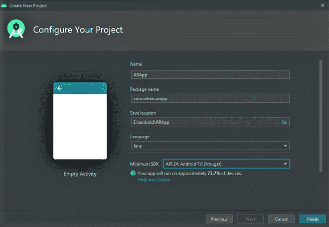
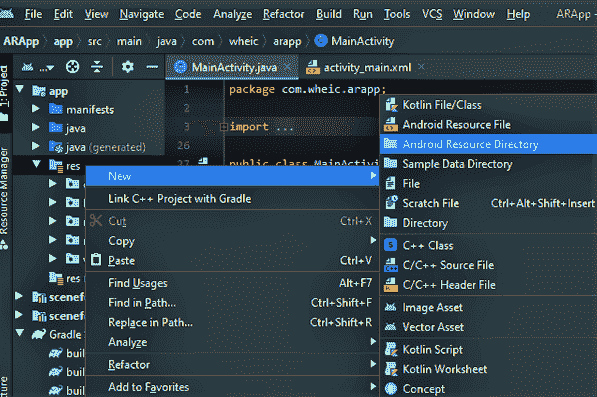
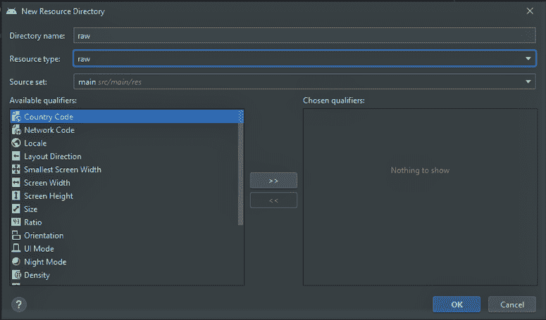
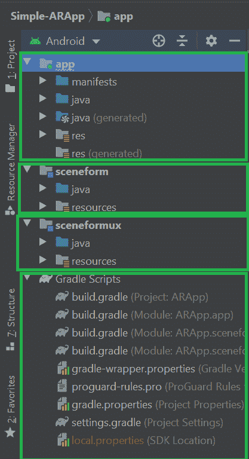

# 如何构建简单的增强现实安卓 App？

> 原文:[https://www . geesforgeks . org/how-to-build-a-simple-augmented-reality-Android-app/](https://www.geeksforgeeks.org/how-to-build-a-simple-augmented-reality-android-app/)

[增强现实](https://www.geeksforgeeks.org/understanding-augmented-reality/)从科幻故事到科学现实跨越了漫长的道路。以这种技术进步的速度，当我们也能像托尼·斯塔克在他的实验室中那样在这个真实的物理世界中操纵数字数据时，可能不会太远。当我们将声音、文本、图像等信息叠加到现实世界中时，我们也可以通过一种特殊的媒介，即增强现实与之交互。世界著名的“口袋妖怪 GO”应用程序只是增强现实应用程序的另一个例子。让我们使用 JAVA 在**安卓工作室制作一个非常简单的增强现实应用。这个应用程序显示了使用手机摄像头定制或下载的 3d 模型。下面给出了一个 GIF 示例，以了解我们将在这篇文章中做什么。**


### **术语**

*   **ARCore:** 根据谷歌的说法，ARCore 是一个增强现实的平台。ARCore 实际上帮助手机感知其环境并与世界互动。ARCore 主要使用 3 个关键原则–**运动跟踪、理解环境和光线估计**。[这里](https://developers.google.com/ar/discover/supported-devices)是谷歌提供的支持 ARCore 的手机列表。
*   **Sceneform:** 根据谷歌的说法，Sceneform 是一个 3d 框架，帮助开发者在不太了解 OpenGL 的情况下构建 ARCore 应用。Sceneform 有很多功能，比如检查相机权限、操作 3d 资源等等。

### **分步实施**

**第一步:创建新项目**

要在安卓工作室创建新项目，请参考[如何在安卓工作室创建/启动新项目](https://www.geeksforgeeks.org/android-how-to-create-start-a-new-project-in-android-studio/)。

> **注:**
> 
> *   选择 **Java** 作为编程语言。
> *   请注意保存应用程序的位置，因为我们稍后需要该路径。
> *   选择“**最小 SDK** ”作为“ **API 24: Android 7.0(牛轧糖)**”



**第二步:获取三维模型**

Sceneform 1.16.0 仅支持 **glTF** 文件。通用传输格式是指通用传输格式。现在**。glb** 文件是 GL 传输格式的二进制版本。这些类型的 3d 模型文件用于 VR、AR，因为它支持运动和动画。

*   对于 3d 模型，你必须得到一个**。glb** 文件。
*   有两种方式，可以抓取 3d 模型，**从网上下载**，或者**自己做一个**。
*   如果你想从网上下载，去谷歌这个超赞的 3d 模型库 [poly](https://poly.google.com/) ，搜索任何 **glb 文件**。为你的项目下载其中任何一个。
*   或者，拿个 **3D 电脑绘图软件**自己做个 3D 模型。
*   我用完全免费下载的 **Blender** 为 GEEKS 文字做了一个 GEEKS 的 3d 模型。从[这里](https://github.com/Jetty53/Simple-ARApp/blob/master/app/src/main/res/raw/gfg_gold_text_stand_2.glb)获取此文件。
*   将模型导出为**。glb** 文件到特定文件夹，文件名必须包含**小写字母**或**数字**。


*   回到安卓工作室。
*   在左侧面板上，右键单击 **res** 目录。前往**新增>安卓资源目录**。会弹出一个窗口。



*   将**资源类型**:更改为**原始**。点击**确定**。在 res 目录下会生成一个原始文件夹。



*   复制**。**将保存 glb 文件的目录下的 glb 文件粘贴到原始文件夹下。

**第三步:下载并设置场景表单 1.16.0**

嗯，对于增强现实应用，我们需要场景化软件开发工具包。SceneForm 1.15.0 非常有名，但是最近，在最新的 Android Studio 4.1 中获取“Google Sceneform Tools (Beta)”插件时，我遇到了一些插件错误。所以我在这里，使用 Sceneform 1.16.0 SDK 并手动设置它。

*   前往本 **GitHub** [**链接**](https://github.com/google-ar/sceneform-android-sdk/releases/tag/v1.16.0) 。
*   下载“**sceneform-Android-SDK-1 . 16 . 0 . zip**”文件。
*   提取您创建项目的“**场景变形工具**和“**场景变形工具**文件夹。(“E:\android\ARApp”给我)
*   去安卓工作室
*   转到**渐变脚本>设置。渐变(项目设置)**
*   添加这些行:

> //这将把 sceneformsrc 文件夹添加到项目中
> 
> include:' sceneform '
> 
> 项目(':sceneform ')。项目目录=新文件(场景格式)
> 
> //这将在您的项目中添加 sceneformux 文件夹
> 
> 包括:sceneformux
> 
> 项目(':sceneformux ')。项目目录=新文件(“场景格式/用户”)

*   之后转到**梯度脚本>构建.梯度(模块:应用)**
*   将此行**添加到** **依赖关系块中。**

> api 项目(“:sceneformux”)

*   然后在“android”块内的同一个文件中，在“buildTypes”块之后添加这些行(如果还没有的话):

> //在您的项目中支持 java 8
> 
> 编译{
> 
> source compatibility JavaRough。版本 1_8
> 
> target compatibility JavaRough。版本 1_8
> 
> }

*   毕竟这些改动点击了上面弹出的**立即同步**。现在安卓文件结构会是这样的。



*   然后去**应用>舱单> AndroidManifest.xml**
*   在“**应用程序**块之前添加以下几行:

## 可扩展标记语言

```java
<!--This permits the user to access Camera-->
<uses-permission android:name="android.permission.CAMERA" />

<!--This helps to check a specific feature in the phone's hardware,
    here it is OpenGlES version. Sceneform needs OpenGLES Version 3.0 or later-->
<uses-feature android:glEsVersion="0x00030000" android:required="true" />

<!--Indicates that this app requires Google Play Services for AR.
    Limits app visibility in the Google Play Store to ARCore supported devices-->
<uses-feature android:name="android.hardware.camera.ar" android:required="true"/>
```

在此之后，在“**活动**”块之前添加此行。

## 可扩展标记语言

```java
<!-- ARCore need to be installed, as the app does not include any non-AR features.
     For an "AR Optional" app, specify "optional" instead of "required".-->
<meta-data android:name="com.google.ar.core" android:value="required" />
```

下面是 **AndroidManifest.xml** 文件的完整代码。

## 可扩展标记语言

```java
<?xml version="1.0" encoding="utf-8"?>
<manifest xmlns:android="http://schemas.android.com/apk/res/android"
    package="com.wheic.arapp">

    <!--This helps to permit the user to access Camera-->
    <uses-permission android:name="android.permission.CAMERA" />

    <!--This helps to check a specific feature in the phone's hardware,
        here it is OpenGl ES version 3-->
    <uses-feature
        android:glEsVersion="0x00030000"
        android:required="true" />

    <!--Here it is checking for AR feature in phone camera-->
    <uses-feature
        android:name="android.hardware.camera.ar"
        android:required="true" />

    <application
        android:allowBackup="true"
        android:icon="@mipmap/ic_launcher"
        android:label="@string/app_name"
        android:roundIcon="@mipmap/ic_launcher_round"
        android:supportsRtl="true"
        android:theme="@style/Theme.ARApp">

        <meta-data
            android:name="com.google.ar.core"
            android:value="required" />

        <activity android:name=".MainActivity">
            <intent-filter>
                <action android:name="android.intent.action.MAIN" />

                <category android:name="android.intent.category.LAUNCHER" />
            </intent-filter>
        </activity>
    </application>

</manifest>
```