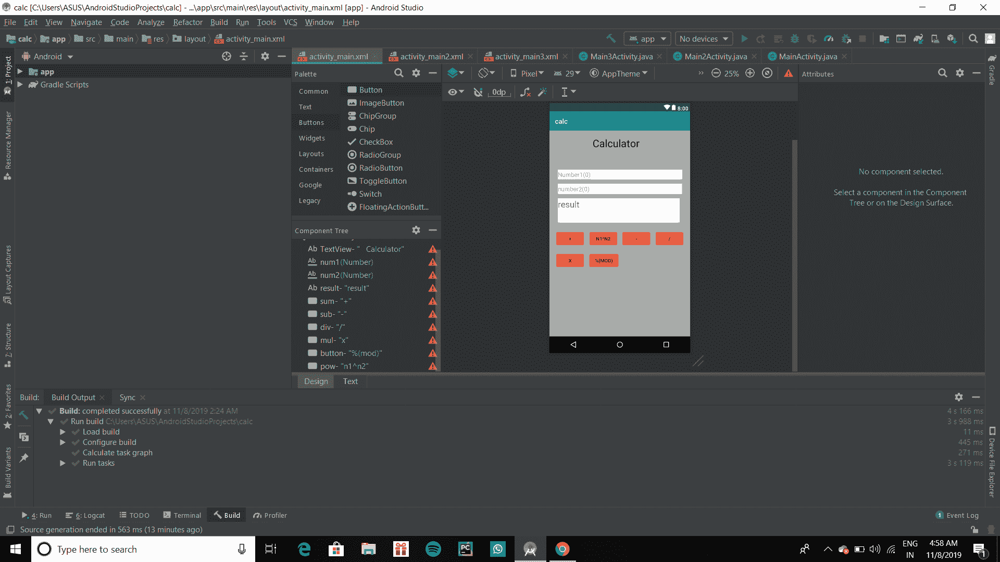

# 如何使用 Android Studio 构建一个简单的 Calculator 应用？

> 原文:[https://www . geeksforgeeks . org/如何使用安卓工作室构建一个简单的计算器应用/](https://www.geeksforgeeks.org/how-to-build-a-simple-calculator-app-using-android-studio/)

**先决条件:**

*   [新手安卓应用开发基础](https://www.geeksforgeeks.org/android-app-development-fundamentals-for-beginners/)
*   [安卓工作室安装设置指南](https://www.geeksforgeeks.org/guide-to-install-and-set-up-android-studio/)
*   [安卓|从第一个 app/安卓项目开始](https://www.geeksforgeeks.org/android-how-to-create-start-a-new-project-in-android-studio/)
*   [安卓|运行你的第一个安卓应用](https://www.geeksforgeeks.org/android-running-your-first-android-app/)

创建一个简单的计算器，它可以根据用户输入执行基本的算术运算，如加法、减法、乘法或除法。下面给出一个视频样本，了解一下在本文中我们要做什么。注意，我们将使用 **Java** 语言来实现这个项目。

<video class="wp-video-shortcode" id="video-366204-1" width="640" height="360" preload="metadata" controls=""><source type="video/mp4" src="https://media.geeksforgeeks.org/wp-content/uploads/20210629133649/build-a-simple-Calculator-app-using-Android-Studio.mp4?_=1">[https://media.geeksforgeeks.org/wp-content/uploads/20210629133649/build-a-simple-Calculator-app-using-Android-Studio.mp4](https://media.geeksforgeeks.org/wp-content/uploads/20210629133649/build-a-simple-Calculator-app-using-Android-Studio.mp4)</video>

### **分步实施**

**第一步:创建新项目**

要在安卓工作室创建新项目，请参考[如何在安卓工作室创建/启动新项目](https://www.geeksforgeeks.org/android-how-to-create-start-a-new-project-in-android-studio/)。注意选择 **Java** 作为编程语言。

**步骤 2:使用 activity_main.xml 文件**

导航到**应用程序> res >布局> activity_main.xml** 并将下面的代码添加到该文件中。下面是 **activity_main.xml** 文件的代码。

## 可扩展标记语言

```java
<?xml version="1.0" encoding="utf-8"?>
<androidx.constraintlayout.widget.ConstraintLayout
    xmlns:android="http://schemas.android.com/apk/res/android"
    xmlns:app="http://schemas.android.com/apk/res-auto"
    xmlns:tools="http://schemas.android.com/tools"
    android:layout_width="match_parent"
    android:layout_height="match_parent"
    android:background="#8BC34A"
    android:backgroundTint="@android:color/darker_gray"
    tools:context=".MainActivity">

    <!-- Text View to display our basic heading of "calculator"-->
    <TextView
        android:layout_width="194dp"
        android:layout_height="43dp"
        android:layout_marginStart="114dp"
        android:layout_marginLeft="114dp"
        android:layout_marginTop="58dp"
        android:layout_marginEnd="103dp"
        android:layout_marginRight="103dp"
        android:layout_marginBottom="502dp"
        android:scrollbarSize="30dp"
        android:text=" Calculator"
        android:textAppearance="@style/TextAppearance.AppCompat.Body1"
        android:textSize="30dp"
        app:layout_constraintBottom_toBottomOf="parent"
        app:layout_constraintEnd_toEndOf="parent"
        app:layout_constraintStart_toStartOf="parent"
        app:layout_constraintTop_toTopOf="parent" />

    <!-- Edit Text View to input the values -->
    <EditText
        android:id="@+id/num1"
        android:layout_width="364dp"
        android:layout_height="28dp"
        android:layout_marginStart="72dp"
        android:layout_marginTop="70dp"
        android:layout_marginEnd="71dp"
        android:layout_marginBottom="416dp"
        android:background="@android:color/white"
        android:ems="10"
        android:hint="Number1(0)"
        android:inputType="number"
        app:layout_constraintBottom_toBottomOf="parent"
        app:layout_constraintEnd_toEndOf="parent"
        app:layout_constraintStart_toStartOf="parent"
        app:layout_constraintTop_toTopOf="parent" />

    <!-- Edit Text View to input 2nd value-->
    <EditText
        android:id="@+id/num2"
        android:layout_width="363dp"
        android:layout_height="30dp"
        android:layout_marginStart="72dp"
        android:layout_marginTop="112dp"
        android:layout_marginEnd="71dp"
        android:layout_marginBottom="374dp"
        android:background="@android:color/white"
        android:ems="10"
        android:hint="number2(0)"
        android:inputType="number"
        app:layout_constraintBottom_toBottomOf="parent"
        app:layout_constraintEnd_toEndOf="parent"
        app:layout_constraintStart_toStartOf="parent"
        app:layout_constraintTop_toTopOf="parent" />

    <!-- Text View to display result -->
    <TextView
        android:id="@+id/result"
        android:layout_width="356dp"
        android:layout_height="71dp"
        android:layout_marginStart="41dp"
        android:layout_marginTop="151dp"
        android:layout_marginEnd="48dp"
        android:layout_marginBottom="287dp"
        android:background="@android:color/white"
        android:text="result"
        android:textColorLink="#673AB7"
        android:textSize="25sp"
        app:layout_constraintBottom_toBottomOf="parent"
        app:layout_constraintEnd_toEndOf="parent"
        app:layout_constraintStart_toStartOf="parent"
        app:layout_constraintTop_toTopOf="parent" />

    <!-- A button to perform 'sum' operation -->
    <Button
        android:id="@+id/sum"
        android:layout_width="wrap_content"
        android:layout_height="wrap_content"
        android:layout_marginStart="16dp"
        android:layout_marginTop="292dp"
        android:layout_marginEnd="307dp"
        android:layout_marginBottom="263dp"
        android:backgroundTint="@android:color/holo_red_light"
        android:onClick="doSum"
        android:text="+"
        app:layout_constraintBottom_toBottomOf="parent"
        app:layout_constraintEnd_toEndOf="parent"
        app:layout_constraintStart_toStartOf="parent"
        app:layout_constraintTop_toTopOf="parent" />

    <!-- A button to perform subtraction operation. -->
    <Button
        android:id="@+id/sub"
        android:layout_width="wrap_content"
        android:layout_height="wrap_content"
        android:layout_marginStart="210dp"
        android:layout_marginTop="292dp"
        android:layout_marginEnd="113dp"
        android:layout_marginBottom="263dp"
        android:backgroundTint="@android:color/holo_red_light"
        android:onClick="doSub"
        android:text="-"
        app:layout_constraintBottom_toBottomOf="parent"
        app:layout_constraintEnd_toEndOf="parent"
        app:layout_constraintStart_toStartOf="parent"
        app:layout_constraintTop_toTopOf="parent" />

    <!-- A button to perform division. -->
    <Button
        android:id="@+id/div"
        android:layout_width="wrap_content"
        android:layout_height="wrap_content"
        android:layout_marginStart="307dp"
        android:layout_marginTop="292dp"
        android:layout_marginEnd="16dp"
        android:layout_marginBottom="263dp"
        android:backgroundTint="@android:color/holo_red_light"
        android:onClick="doDiv"
        android:text="/"
        app:layout_constraintBottom_toBottomOf="parent"
        app:layout_constraintEnd_toEndOf="parent"
        app:layout_constraintHorizontal_bias="0.0"
        app:layout_constraintStart_toStartOf="parent"
        app:layout_constraintTop_toTopOf="parent" />

    <!-- A button to perform multiplication. -->
    <Button
        android:id="@+id/mul"
        android:layout_width="wrap_content"
        android:layout_height="wrap_content"
        android:layout_marginStart="16dp"
        android:layout_marginTop="356dp"
        android:layout_marginEnd="307dp"
        android:layout_marginBottom="199dp"
        android:backgroundTint="@android:color/holo_red_light"
        android:onClick="doMul"
        android:text="x"
        app:layout_constraintBottom_toBottomOf="parent"
        app:layout_constraintEnd_toEndOf="parent"
        app:layout_constraintStart_toStartOf="parent"
        app:layout_constraintTop_toTopOf="parent" />

    <!-- A button to perform a modulus function. -->
    <Button
        android:id="@+id/button"
        android:layout_width="92dp"
        android:layout_height="48dp"
        android:layout_marginStart="113dp"
        android:layout_marginTop="356dp"
        android:layout_marginEnd="206dp"
        android:layout_marginBottom="199dp"
        android:backgroundTint="@android:color/holo_red_light"
        android:onClick="doMod"
        android:text="%(mod)"
        app:layout_constraintBottom_toBottomOf="parent"
        app:layout_constraintEnd_toEndOf="parent"
        app:layout_constraintStart_toStartOf="parent"
        app:layout_constraintTop_toTopOf="parent" />

    <!-- A button to perform a power function. -->
    <Button
        android:id="@+id/pow"
        android:layout_width="wrap_content"
        android:layout_height="wrap_content"
        android:layout_marginStart="113dp"
        android:layout_marginTop="292dp"
        android:layout_marginEnd="210dp"
        android:layout_marginBottom="263dp"
        android:backgroundTint="@android:color/holo_red_light"
        android:onClick="doPow"
        android:text="n1^n2"
        app:layout_constraintBottom_toBottomOf="parent"
        app:layout_constraintEnd_toEndOf="parent"
        app:layout_constraintStart_toStartOf="parent"
        app:layout_constraintTop_toTopOf="parent" />

</androidx.constraintlayout.widget.ConstraintLayout>
```

**使用此代码后，用户界面将类似:**



**第三步:使用****MainActivity.java 文件**

在类内打开那里的**MainActivity.java**文件，制作一个名为 doSum(视图 v)的方法。在这种方法中，首先，我们必须将两个[编辑文本](https://www.geeksforgeeks.org/working-with-the-edittext-in-android/)与变量联系起来，以便我们可以使用它们进行输入。所以把这些编辑框和我们写的变量联系起来

```java
"EditText e1=(EditText )findViewById(R.id.num1);"
```

这里 num1 是文本框的 id，我们只是给 id 为“num1”的文本框一个变量名“e1”。同样，我们必须对变量名为“e2”的第二个文本框使用相同的语句。对于第三个文本框，我们使用了

```java
"TextView t1=(TextView) findViewById(R.id.result);"
```

这里我们使用了文本视图，因为我们只需要显示文本，避免用户改变文本。现在我们必须使用 **getText()** 函数以字符串的形式输入数字。输入语句将是

```java
"String s11=e1.getText().toString();"
```

这里 s11 存储在文本框 1 中输入的数字。我们必须对另一个文本框(e2)做同样的事情。现在以整数形式存储数字并应用加法。将附加值存储在另一个变量中。要显示存储在 sum 中的数据，我们必须使用 setText()，如下所示:

```java
result.setText(final_sum.toString())
```

final_sum 存储总和，有必要将其转换为字符串(。toString())。下面是**文件的代码。代码中添加了注释，以更详细地理解代码。**

## **Java 语言(一种计算机语言，尤用于创建网站)**

```java
import android.os.Bundle;
import android.view.View;
import android.widget.EditText;
import android.widget.TextView;

import androidx.appcompat.app.AppCompatActivity;

public class MainActivity extends AppCompatActivity {

    EditText e1, e2;
    TextView t1;
    int num1, num2;

    @Override
    protected void onCreate(Bundle savedInstanceState) {
        super.onCreate(savedInstanceState);
        setContentView(R.layout.activity_main);
    }

    // a public method to get the input numbers
    public boolean getNumbers() {

        // defining the edit text 1 to e1
        e1 = (EditText) findViewById(R.id.num1);

        // defining the edit text 2 to e2
        e2 = (EditText) findViewById(R.id.num2);

        // defining the text view to t1
        t1 = (TextView) findViewById(R.id.result);

        // taking input from text box 1
        String s1 = e1.getText().toString();

        // taking input from text box 2
        String s2 = e2.getText().toString();

        // condition to check if box is not empty
        if ((s1.equals(null) && s2.equals(null))
                || (s1.equals("") && s2.equals(""))) {

            String result = "Please enter a value";
            t1.setText(result);

            return false;
        } else {
            // converting string to int.
            num1 = Integer.parseInt(s1);

            // converting string to int.
            num2 = Integer.parseInt(s2);
        }

        return true;
    }

    // a public method to perform addition
    public void doSum(View v) {

        // get the input numbers
        if (getNumbers()) {
            int sum = num1 + num2;
            t1.setText(Integer.toString(sum));
        }
    }

    // a public method to perform power function
    public void doPow(View v) {

        // get the input numbers
        if (getNumbers()) {
            double sum = Math.pow(num1, num2);
            t1.setText(Double.toString(sum));
        }
    }

    // a public method to perform subtraction
    public void doSub(View v) {

        // get the input numbers
        if (getNumbers()) {
            int sum = num1 - num2;
            t1.setText(Integer.toString(sum));
        }
    }

    // a public method to perform multiplication
    public void doMul(View v) {

        // get the input numbers
        if (getNumbers()) {
            int sum = num1 * num2;
            t1.setText(Integer.toString(sum));
        }
    }

    // a public method to perform Division
    public void doDiv(View v) {

        // get the input numbers
        if (getNumbers()) {

            // displaying the text in text view assigned as t1
            double sum = num1 / (num2 * 1.0);
            t1.setText(Double.toString(sum));
        }
    }

    // a public method to perform modulus function
    public void doMod(View v) {

        // get the input numbers
        if (getNumbers()) {
            double sum = num1 % num2;
            t1.setText(Double.toString(sum));
        }
    }
}
```

****输出:****

**<video class="wp-video-shortcode" id="video-366204-2" width="640" height="360" preload="metadata" controls=""><source type="video/mp4" src="https://media.geeksforgeeks.org/wp-content/uploads/20210629133649/build-a-simple-Calculator-app-using-Android-Studio.mp4?_=2">[https://media.geeksforgeeks.org/wp-content/uploads/20210629133649/build-a-simple-Calculator-app-using-Android-Studio.mp4](https://media.geeksforgeeks.org/wp-content/uploads/20210629133649/build-a-simple-Calculator-app-using-Android-Studio.mp4)</video>**