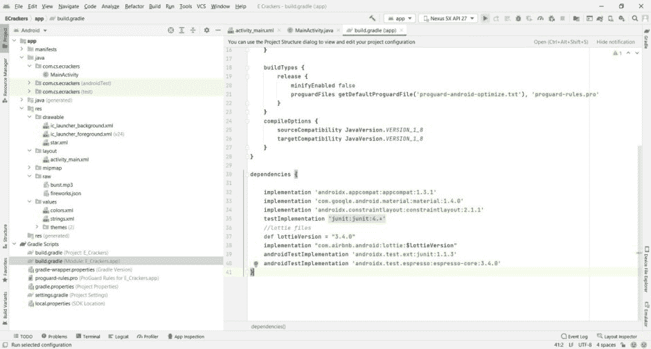

# 如何用安卓构建一个简单的 e-cracker 应用？

> 原文:[https://www . geeksforgeeks . org/如何使用安卓构建一个简单的电子饼干应用/](https://www.geeksforgeeks.org/how-to-build-a-simple-e-crackers-app-using-android/)

**先决条件:**

*   [新手安卓应用开发基础](https://www.geeksforgeeks.org/android-app-development-fundamentals-for-beginners/)
*   [安卓工作室安装设置指南](https://www.geeksforgeeks.org/guide-to-install-and-set-up-android-studio/)
*   [如何在安卓工作室创建/启动新项目？](https://www.geeksforgeeks.org/android-how-to-create-start-a-new-project-in-android-studio/)
*   [运行你的第一个安卓应用](https://www.geeksforgeeks.org/android-running-your-first-android-app/)
*   [如何在安卓应用中添加洛蒂动画](https://www.geeksforgeeks.org/how-to-add-lottie-animation-in-an-android-app/)
*   [安卓中的 MediaPlayer 类](https://www.geeksforgeeks.org/mediaplayer-class-in-android/)

在本文中，我们将构建一个简单的电子饼干应用程序。它由一个单独的 [RelativeLayout](https://www.geeksforgeeks.org/android-relativelayout-in-kotlin/) 组成。它的背景设置为黑色。然后我们将在布局上随机填充星星的图像，以获得天空的感觉。然后我们将把[添加到布局中，以检测点击。一旦用户轻敲屏幕，它就会爆发出焰火。我们将获得触摸位置的 X 和 Y 坐标，并使用](https://www.geeksforgeeks.org/how-to-detect-touch-event-on-screen-programmatically-in-android/)[洛蒂文件](https://www.geeksforgeeks.org/how-to-add-lottie-animation-in-an-android-app/)作为烟花，以及[媒体播放器](https://www.geeksforgeeks.org/mediaplayer-class-in-android/)类作为音效。我们将使用 **Java** 在 Android 中构建整个应用程序。

<video class="wp-video-shortcode" id="video-712686-1" width="640" height="360" preload="metadata" controls=""><source type="video/mp4" src="https://media.geeksforgeeks.org/wp-content/uploads/20211104200015/Untitled-265_1440p.mp4?_=1">[https://media.geeksforgeeks.org/wp-content/uploads/20211104200015/Untitled-265_1440p.mp4](https://media.geeksforgeeks.org/wp-content/uploads/20211104200015/Untitled-265_1440p.mp4)</video>

### 逐步实施

**第一步:创建新项目**

要在安卓工作室创建新项目，请参考[如何在安卓工作室创建/启动新项目](https://www.geeksforgeeks.org/android-how-to-create-start-a-new-project-in-android-studio/)。注意选择 **Java** 作为编程语言。

**第二步:添加依赖关系**

在进入编码部分之前，让我们添加必要的依赖项。我们必须为项目添加的唯一依赖项是**洛蒂文件**。洛蒂是一个开源的动画文件格式，可以在我们的应用程序中使用。转到应用级 **build.gradle** 文件并添加以下依赖项，然后单击立即同步。

```
def lottieVersion = "3.4.0"
implementation "com.airbnb.android:lottie:$lottieVersion"
```

这里有一个参考，



**第三步:添加资源文件**

让我们添加必要的矢量资源和可绘制的资源文件。转到**应用程序> res >可绘制**并为星星添加以下矢量文件。

**star.xml** (星形图标)

## 可扩展标记语言

```
<vector android:height="24dp" android:tint="#FFFFFF"
    android:viewportHeight="24" android:viewportWidth="24"
    android:width="24dp" xmlns:android="http://schemas.android.com/apk/res/android">
    <path android:fillColor="@android:color/white" android:pathData="M12,17.27L18.18,21l-1.64,-7.03L22,9.24l-7.19,-0.61L12,2 9.19,8.63 2,9.24l5.46,4.73L5.82,21z"/>
</vector>
```