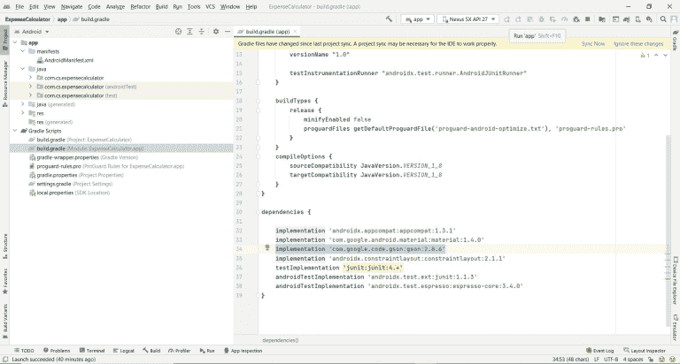
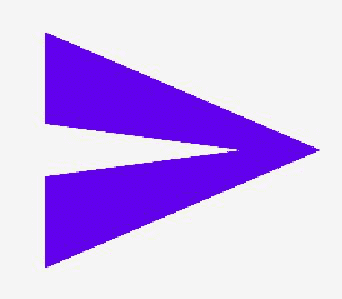
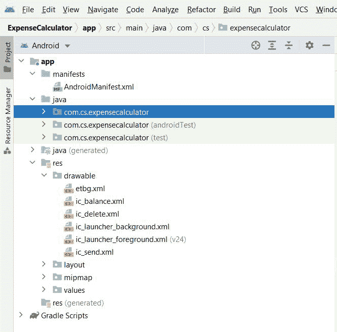

# 如何在安卓中构建一个简单的费用计算器应用？

> 原文:[https://www . geeksforgeeks . org/如何构建一个简单的费用计算器-app-in-android/](https://www.geeksforgeeks.org/how-to-build-a-simple-expense-calculator-app-in-android/)

**先决条件:**

*   [新手安卓应用开发基础](https://www.geeksforgeeks.org/android-app-development-fundamentals-for-beginners/)
*   [安卓工作室安装设置指南](https://www.geeksforgeeks.org/guide-to-install-and-set-up-android-studio/)
*   [如何在安卓工作室创建/启动新项目？](https://www.geeksforgeeks.org/android-how-to-create-start-a-new-project-in-android-studio/)
*   [运行你的第一个安卓应用](https://www.geeksforgeeks.org/android-running-your-first-android-app/)
*   [安卓中的回收视图，示例](https://www.geeksforgeeks.org/android-recyclerview/)
*   [安卓共享偏好设置示例](https://www.geeksforgeeks.org/shared-preferences-in-android-with-examples/)

一个简单的费用计算器可以让你以一种简化的方式增加收入和支出。这是我们将要构建的应用程序的一瞥。该应用程序包含一个带有回收视图的单个[活动](https://www.geeksforgeeks.org/introduction-to-activities-in-android/)，两个[编辑文本](https://www.geeksforgeeks.org/edittext-widget-in-android-using-java-with-examples/)(一个输入金额，另一个输入交易的简短说明)，一个可点击的[文本视图](https://www.geeksforgeeks.org/textview-widget-in-android-using-java-with-examples/)指定损失或收益，一个可点击的图像将交易添加到回收视图，最后一个自定义的[操作栏](https://www.geeksforgeeks.org/actionbar-in-android-with-example/)显示余额。它包括在本地存储数据的共享首选项。下面给出了一个示例视频，以了解我们将在本文中做什么。注意，我们将使用 **Java** 语言来实现这个项目。

<video class="wp-video-shortcode" id="video-701784-1" width="640" height="360" preload="metadata" controls=""><source type="video/mp4" src="https://media.geeksforgeeks.org/wp-content/uploads/20211015184748/Expense-Calculator.mp4?_=1">[https://media.geeksforgeeks.org/wp-content/uploads/20211015184748/Expense-Calculator.mp4](https://media.geeksforgeeks.org/wp-content/uploads/20211015184748/Expense-Calculator.mp4)</video>

### **分步实施**

**第一步:创建新项目**

要在安卓工作室创建新项目，请参考[如何在安卓工作室创建/启动新项目](https://www.geeksforgeeks.org/android-how-to-create-start-a-new-project-in-android-studio/)。注意选择 **Java** 作为编程语言。

**第二步:**

在进入编码部分之前，让我们添加必要的依赖项。我们必须为项目添加的唯一依赖项是 **Gson** 。它是一个 Java 库，可以用来将 Java 对象转换成它们的 JSON 表示。它还可以用于将 JSON 字符串转换为等效的 Java 对象。转到应用级 **build.gradle** 文件并添加以下依赖项，然后单击立即同步。

```java
implementation 'com.google.code.gson:gson:2.8.6'
```

这里有一个参考，



**第三步:**

让我们添加必要的矢量资源和可绘制的资源文件。转到**应用程序> res >可绘制**并添加以下 xml 文件。

*T1(删除图标)*

## 可扩展标记语言

```java
<vector xmlns:android="http://schemas.android.com/apk/res/android"
    android:width="24dp"
    android:height="24dp"
    android:viewportWidth="24"
    android:viewportHeight="24"
    android:tint="?attr/colorControlNormal">
  <path
      android:fillColor="@android:color/white"
      android:pathData="M6,19c0,1.1 0.9,2 2,2h8c1.1,0 2,-0.9 2,-2V7H6v12zM19,4h-3.5l-1,-1h-5l-1,1H5v2h14V4z"/>
</vector>
```

***预览:***


*T1(发送图标)*

## 可扩展标记语言

```java
<vector xmlns:android="http://schemas.android.com/apk/res/android"
    android:width="24dp"
    android:height="24dp"
    android:viewportWidth="24"
    android:viewportHeight="24"
    android:tint="?attr/colorPrimarySurface"
    android:autoMirrored="true">
  <path
      android:fillColor="@color/white"
      android:pathData="M2.01,21L23,12 2.01,3 2,10l15,2 -15,2z"/>
</vector>
```

***预览:***



***ic_balance.xml** (钱包图标)*

## 可扩展标记语言

```java
<vector android:height="24dp" android:tint="#FFFFFF"
    android:viewportHeight="24" android:viewportWidth="24"
    android:width="24dp" xmlns:android="http://schemas.android.com/apk/res/android">
    <path android:fillColor="@android:color/white" android:pathData="M21,18v1c0,1.1 -0.9,2 -2,2L5,21c-1.11,0 -2,-0.9 -2,-2L3,5c0,-1.1 0.89,-2 2,-2h14c1.1,0 2,0.9 2,2v1h-9c-1.11,0 -2,0.9 -2,2v8c0,1.1 0.89,2 2,2h9zM12,16h10L22,8L12,8v8zM16,13.5c-0.83,0 -1.5,-0.67 -1.5,-1.5s0.67,-1.5 1.5,-1.5 1.5,0.67 1.5,1.5 -0.67,1.5 -1.5,1.5z"/>
</vector>
```

***预览:***


***etbg.xml** (编辑文本选择器)*

## 可扩展标记语言

```java
<?xml version="1.0" encoding="utf-8"?>
<selector xmlns:android="http://schemas.android.com/apk/res/android">
  <item android:state_focused="false">
      <shape android:shape="rectangle">
          <corners android:radius="3dp"/>
          <stroke android:color="#DDD" android:width="2dp"/>
      </shape>
  </item>
    <item android:state_focused="true">
        <shape android:shape="rectangle">
            <corners android:radius="3dp"/>
            <stroke android:color="@color/purple_500" android:width="2dp"/>
        </shape>
    </item>
</selector>
```

下面是截图供参考。



**第四步:**

现在，让我们为自定义操作栏和回收视图行布局添加布局资源文件。转到 **app > res >布局**并添加以下 xml 文件。下面是 ***自定义 _ 动作 _ 条*** **的代码。xml** 文件。

## 可扩展标记语言

```java
<?xml version = "1.0" encoding = "utf-8"?>
<LinearLayout 
    xmlns:android="http://schemas.android.com/apk/res/android"
    xmlns:app="http://schemas.android.com/apk/res-auto"
    android:layout_width="match_parent"
    android:layout_height="wrap_content"
    android:background="@color/purple_500"
    android:gravity="center_vertical"
    android:paddingStart="5dp"
    android:paddingTop="10dp"
    android:paddingEnd="5dp"
    android:paddingBottom="10dp">

    <TextView
        android:id="@+id/textView"
        android:layout_width="wrap_content"
        android:layout_height="match_parent"
        android:layout_marginEnd="10dp"
        android:text="Expense Calculator"
        android:textColor="@color/white"
        android:textSize="20sp"
        android:textStyle="bold" />

    <ImageView
        android:id="@+id/imageView"
        android:layout_width="wrap_content"
        android:layout_height="match_parent"
        android:layout_marginStart="10dp"
        android:layout_marginEnd="10dp"
        app:srcCompat="@drawable/ic_balance" />

    <TextView
        android:id="@+id/tvBalance"
        android:layout_width="wrap_content"
        android:layout_height="match_parent"
        android:gravity="start"
        android:text="0.00"
        android:textColor="@color/white"
        android:textSize="20sp" />

</LinearLayout>
```