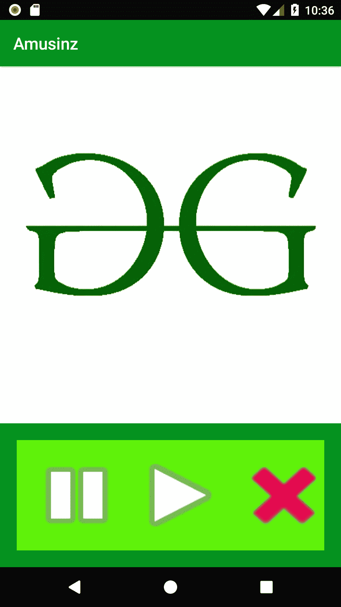
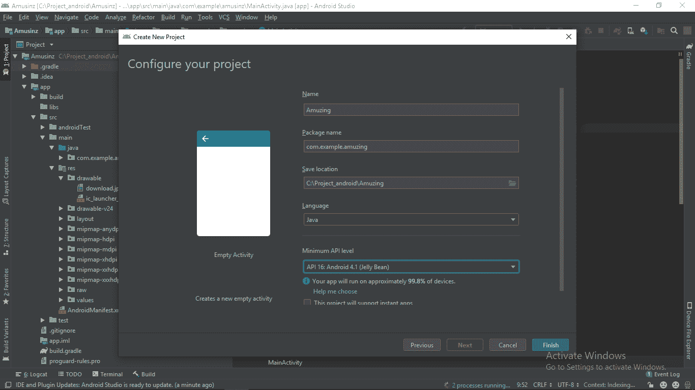
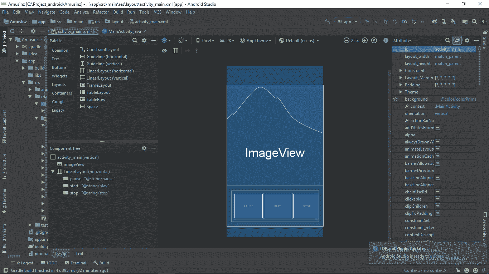

# 如何使用 Android Studio 构建简单的音乐播放器 app

> 原文:[https://www . geesforgeks . org/如何构建一个简单的音乐播放器-应用-使用-安卓-studio/](https://www.geeksforgeeks.org/how-to-build-a-simple-music-player-app-using-android-studio/)

这是一个非常简单的应用程序，适合初学者学习概念。以下**先决条件**在开始之前已经足够好了。

*   [安卓入门基础](https://www.geeksforgeeks.org/android-app-development-fundamentals-for-beginners/)
*   [安装设置安卓工作室](https://www.geeksforgeeks.org/guide-to-install-and-set-up-android-studio/)
*   [首个安卓 app 项目](https://www.geeksforgeeks.org/android-how-to-create-start-a-new-project-in-android-studio/)
*   [如何运行你的第一款安卓应用](https://www.geeksforgeeks.org/android-running-your-first-android-app/)

您将在本文中学到以下内容:

*   实现 MediaPlayer 类并使用其暂停、播放和停止等方法。
*   在我们的项目中使用外部文件(图像、音频等)。
*   构建我们的音乐播放器安卓应用的界面。

完成以下所有后续步骤后，我们的应用将如下所示:


**第一步:打开一个新的安卓项目**
打开安卓工作室后，你必须使用**空活动**创建一个**新项目**，语言为 **Java** ，并按照你的意愿给你的项目一个唯一的名字，但不要忘记保留第一个字母大写。

1.  转到左上角，然后点击**文件- >新建- >新建项目**，如下图截图所示。
    T3】
2.  选择**清空活动**，如下图截图所示。
    T3】
3.  Give your project a name, choose java and use lower level API so that your app can run on older version of android phones(I am using Api 16: Android 4.1 Jelly Bean).
    

    **第二步:设计应用的用户界面**
    在这个应用中，我们使用了 4 个组件:

4.  **a**imageView**–显示我们给定的歌曲图像**
5.  **3 **Buttons**:

    *   播放我们歌曲的播放按钮
    *   暂停按钮，暂停我们的歌曲
    *   停止我们歌曲的停止按钮

    (注意:如果我们在按下暂停键后按下播放键，我们的歌曲将在暂停后立即继续播放，但如果我们在停止后按下播放键，我们的歌曲将从头开始播放)

    这些组件通过以下两种布局实现:** 
6.  ****垂直线形布局****
7.  ****Horizontal LinearLayout

    线性布局(垂直)内部有两个组件:

    *   imageView 组件
    *   线性布局(水平)

    这种布局将把我们的应用屏幕垂直分成两半。**图像视图**组件将位于上半部，**水平线性布局**将位于下半部。水平布局将包含三个按钮(播放、暂停和停止按钮)。这种水平布局将在我们的应用程序屏幕的下半部分将这三个按钮一个接一个地水平对齐。
    要清楚了解这一点，请浏览我们 app 的以下蓝字和**组件树**:
    

    在我们的应用程序中，我通过添加以下代码行，使用了不同的播放、暂停和停止按钮样式:

    > Android:background =“@ Android:draw able/IC _ media _ play”为播放按钮
    > Android:background =“@ Android:draw able/IC _ media _ pause”为暂停按钮
    > Android:background =“@ Android:draw able/IC _ delete”为停止按钮

    这里 geeksforgeeks 标志用在应用程序中。选择图像，然后将其粘贴到可绘制目录中。目录的路径:

    > **项目->app->src->main->RES->可绘制**

    设置所有组件的 id，并用按钮添加 onClick 方法。下面是 activity_main.xml 文件的 XML 代码。

    ```java
    <?xml version="1.0" encoding="utf-8"?>
    <LinearLayout xmlns:android="http://schemas.android.com/apk/res/android"
        xmlns:tools="http://schemas.android.com/tools"
        android:id="@+id/activity_main"
        android:layout_width="match_parent"
        android:layout_height="match_parent"
        android:background="@color/colorPrimary"
        android:orientation="vertical"
        android:theme="@style/Theme.AppCompat"
        tools:context=".MainActivity">

        <ImageView
            android:id="@+id/imageView"
            android:layout_width="match_parent"
            android:layout_height="430dp"
            android:background="@drawable/download"
            android:contentDescription="@string/todo" />

        <LinearLayout
            android:layout_width="match_parent"
            android:layout_height="match_parent"
            android:layout_margin="20dp"
            android:background="@color/colorAccent"
            android:orientation="horizontal"
            android:padding="10dp">

            <Button
                android:id="@+id/pause"
                style="@style/Widget.AppCompat.Button.Borderless.Colored"
                android:layout_width="125dp"
                android:layout_height="match_parent"
                android:background="@android:drawable/ic_media_pause"
                android:onClick="musicpause" />

            <Button
                android:id="@+id/start"
                style="@style/Widget.AppCompat.Button.Borderless"
                android:layout_width="125dp"
                android:layout_height="match_parent"
                android:background="@android:drawable/ic_media_play"
                android:onClick="musicplay" />

            <Button
                android:id="@+id/stop"
                style="@style/Widget.AppCompat.Button.Borderless"
                android:layout_width="125dp"
                android:layout_height="match_parent"
                android:background="@android:drawable/ic_delete"
                android:onClick="musicstop" />
        </LinearLayout>
    </LinearLayout>
    ```

    **第三步:把音乐文件添加到我们的 app**
    把 mp3 文件添加到 raw 文件夹。您可以通过以下方式到达那里:

    > 应用->资源->原始

    如果没有原始文件夹，则通过右键单击 res 目录来创建它，然后:

    > res->新建->目录

    将新创建的目录命名为 raw，并添加该文件夹中的所有音频文件。不允许在此拖放文件。您必须复制源文件，然后右键单击原始目录并单击粘贴。使用浏览器中的“**show**”(如果您使用的是 windows)转到该特定文件。确保新名称包含所有小字母。唯一有效的字符是(a-z 和 0-9 以及 _)

    **第四步:让我们对应用的功能进行编码**

    1.  制作一个名为**音乐**的 **MediaPlayer** 类的对象。它是**安卓包**中的一个内置类。MediaPlayer 类的所有属性都可以被这个音乐对象使用:

        > 媒体播放器音乐

    2.  We will add our music file to this newly created object by using **create** function :

        > music = MediaPlayer.create(this，r . raw . sound)；

        *请注意，不需要添加. mp3 或。wav 或您正在使用的任何文件类型。只需添加文件的名称。(我已经将我的文件命名为 sound.mp3，所以使用了 R.raw.sound)*

    3.  MediaPlayer 类有一个内置函数叫做 **start** 我们将这个函数用于播放按钮。它将开始这首歌。

        > 公虚空 playSong(观五){
        > 乐。start()；
        > }

    4.  对于暂停按钮，我们将使用内置功能**暂停**。这将暂停歌曲。

        > 公虚空贫塞松(观五){
        > 议员。pause()；
        > }

    5.  For **stop** button we will use the inbuilt **stop** function. This function also deletes the object (music), so we create a new object with the same name.

        > public void stop song(View v){
        > MP . stop()；
        > }
        > 
        > music = MediaPlayer.create(this，r . raw . sound)；

        *注意:音频文件存储在 app 中，所以一定要添加小文件*

        **完整的 Java 代码:MainActivity.java 文件**

        ```java
        package com.example.amusinz;

        import android.media.MediaPlayer;
        import android.support.v7.app.AppCompatActivity;
        import android.os.Bundle;
        import android.view.View;

        public class MainActivity
            extends AppCompatActivity {

            // Instantiating the MediaPlayer class
            MediaPlayer music;

            @Override
            protected void onCreate(
                Bundle savedInstanceState)
            {
                super.onCreate(savedInstanceState);
                setContentView(R.layout.activity_main);

                // Adding the music file to our
                // newly created object music
                music = MediaPlayer.create(
                    this, R.raw.sound);
            }

            // Plaing the music
            public void musicplay(View v)
            {
                music.start();
            }

            // Pausing the music
            public void musicpause(View v)
            {
                music.pause();
            }

            // Stoping the music
            public void musicstop(View v)
            {
                music.stop();
                music
                    = MediaPlayer.create(
                        this, R.raw.sound);
            }
        }
        ```

        **第五步:让我们运行我们的应用**
        点击顶部工具栏上的**运行**按钮运行我们的代码。
        你可以通过两种方式运行你的应用:

        *   使用安卓虚拟设备(模拟器)
        *   通过使用 USB 连接您的手机

        您必须在手机中启用开发人员选项，并将 USB 调试模式设置为打开，才能运行您的应用程序。
        *请注意，仿真器消耗大量 ram，所以您的系统应该有足够的 ram 来启动仿真器，建议使用 4gb 或更大的 RAM 来提高仿真器的性能。*****