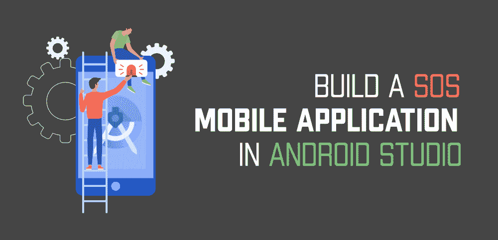

# 如何在安卓工作室搭建 SOS 移动应用？

> 原文:[https://www . geesforgeks . org/how-to-build-a-SOS-mobile-in-Android-studio/](https://www.geeksforgeeks.org/how-to-build-a-sos-mobile-application-in-android-studio/)

紧急呼救应用程序基本上是先进的紧急应用程序，如果你和/或你的亲人发现自己处于危及生命的紧急情况下，需要立即援助，它们可以拯救你和/或你的亲人。当你需要一些个人帮助时，你可以打开手机，给别人打电话或发信息寻求帮助。但是在像攻击、性侵犯、抢劫、骚扰、事故、火灾、助产等危及生命的紧急情况下，我们没有时间打开手机，相反，我们需要一些无障碍的方法，通过这些方法我们可以在不实际操作手机的情况下寻求帮助。在本文中，我们将为 android 构建这样一个应用程序。



你能想出一些最简单的方法来刺激手机的某些功能，而不需要打开手机屏幕吗？其中一个方法就是摇动你的手机。我们将创建一项服务，在这项服务中，我们将通过电话收听震动事件。当我们注册摇动事件时，即当用户摇动电话时，我们将向用户先前添加到应用程序的所有联系人发送带有预定义消息的用户位置。现在，随着安卓的每一次发布，谷歌都对获取用户位置做出了一些严格的规定，在数据安全方面也很重要。这使得为较新版本的安卓创建这样一个紧急呼救应用程序变得困难。

### 先决条件

*   [服务](https://www.geeksforgeeks.org/services-in-android-with-example/)，
*   [运行时权限管理](https://www.geeksforgeeks.org/android-how-to-request-permissions-in-android-application/)，
*   [填充列表视图](https://www.geeksforgeeks.org/android-listview-in-java-with-example/)，
*   [广播接收器](https://www.geeksforgeeks.org/broadcast-receiver-in-android-with-example/)，
*   安卓系统中的数据库管理

## 逐步实施

### **第一步:创建新项目**

要在安卓工作室创建新项目，请参考[如何在安卓工作室创建/启动新项目](https://www.geeksforgeeks.org/android-how-to-create-start-a-new-project-in-android-studio/)。注意选择 **Java** 作为编程语言。

### **步骤 2:创建联系人模块**

创建一个联系人文件夹，在这个文件夹中，我们将处理所有文件，这些文件将由用户在紧急情况下选择发送消息的联系人填充列表视图。

**步骤 2.1:为联系人创建模型类**

创建一个模型类来保存联系人的数据，主要是姓名和电话号码。除了通常的构造函数、获取函数和设置函数之外，我们还有一个额外的 validate(String)方法。此方法检查检索到的电话号码格式是否正确(+91XXXXXXXXXXXXXXX)。如果不是，则转换字符串并返回格式化的字符串。以下是**ContactModel.java**文件的代码。

## Java 语言(一种计算机语言，尤用于创建网站)

```
public class ContactModel {
    private int id;
    private String phoneNo;
    private String name;

    // constructor
    public ContactModel(int id, String name, String phoneNo) {
        this.id = id;
        this.phoneNo = validate(phoneNo);
        this.name = name;
    }

    // validate the phone number, and reformat is necessary
    private String validate(String phone) {

        // creating StringBuilder for both the cases
        StringBuilder case1 = new StringBuilder("+91");
        StringBuilder case2 = new StringBuilder("");

        // check if the string already has a "+"
        if (phone.charAt(0) != '+') {
            for (int i = 0; i < phone.length(); i++) {
                // remove any spaces or "-"
                if (phone.charAt(i) != '-' && phone.charAt(i) != ' ') {
                    case1.append(phone.charAt(i));
                }
            }
            return case1.toString();
        } else {
            for (int i = 0; i < phone.length(); i++) {
                // remove any spaces or "-"
                if (phone.charAt(i) != '-' || phone.charAt(i) != ' ') {
                    case2.append(phone.charAt(i));
                }
            }
            return case2.toString();
        }

    }

    public String getPhoneNo() {
        return phoneNo;
    }

    public int getId() {
        return id;
    }

    public String getName() {
        return name;
    }

    public void setName(String name) {
        this.name = name;
    }
}
```

**步骤 2.2:创建数据库助手类**

我们需要将用户选择的所有联系人存储到数据库中，以便应用程序每次需要时都可以使用。我们将在这个数据库的帮助下填充列表视图，并且在发送消息时，我们将从这个数据库中检索列表中的联系人。以下是**DbHelper.java**文件的代码。

## Java 语言(一种计算机语言，尤用于创建网站)

```
import android.content.ContentValues;
import android.content.Context;
import android.database.Cursor;
import android.database.sqlite.SQLiteDatabase;
import android.database.sqlite.SQLiteOpenHelper;

import java.util.ArrayList;
import java.util.List;

public class DbHelper extends SQLiteOpenHelper {

    // Database Version
    private static final int DATABASE_VERSION = 1;

    // Database Name
    private static final String DATABASE_NAME = "contactdata";

    // Country table name
    private static final String TABLE_NAME= "contacts";

    // Country Table Columns names
    private static final String KEY_ID = "id";
    private static final String NAME = "Name";
    private static final String PHONENO = "PhoneNo";

    public DbHelper(Context context){
        super(context, DATABASE_NAME, null, DATABASE_VERSION);
    }

    @Override
    public void onCreate(SQLiteDatabase db) {

        // create the table for the first time
        String CREATE_COUNTRY_TABLE = "CREATE TABLE " + TABLE_NAME + "("
                + KEY_ID + " INTEGER PRIMARY KEY," + NAME + " TEXT,"
                + PHONENO + " TEXT" + ")";
        db.execSQL(CREATE_COUNTRY_TABLE);
    }

    @Override
    public void onUpgrade(SQLiteDatabase sqLiteDatabase, int i, int i1) {

    }

    // method to add the contact
    public void addcontact(ContactModel contact){
        SQLiteDatabase db=this.getWritableDatabase();
        ContentValues c=new ContentValues();
        c.put(NAME,contact.getName());
        c.put(PHONENO,contact.getPhoneNo());
        db.insert(TABLE_NAME,null,c);
        db.close();
    }

    // method to retrieve all the contacts in List
    public List<ContactModel> getAllContacts(){
        List<ContactModel> list=new ArrayList<>();
        String query="SELECT * FROM "+TABLE_NAME;
        SQLiteDatabase db=this.getReadableDatabase();
        Cursor c=db.rawQuery(query,null);
        if(c.moveToFirst()) {
            do {

                list.add(new ContactModel(c.getInt(0),c.getString(1),c.getString(2)));

            } while (c.moveToNext());
        }
        return list;
    }

    // get the count of data, this will allow user
    // to not add more that five contacts in database
    public int count(){
        int count=0;
        String query="SELECT COUNT(*) FROM "+TABLE_NAME;
        SQLiteDatabase db = this.getReadableDatabase();
        Cursor c=db.rawQuery(query,null);
        if(c.getCount()>0){
            c.moveToFirst();
            count=c.getInt(0);
        }
        c.close();
        return count;
    }

    // Deleting single country
    public void deleteContact(ContactModel contact) {
        SQLiteDatabase db = this.getWritableDatabase();
        int i=db.delete(TABLE_NAME,KEY_ID + " = ?",
                new String[] { String.valueOf(contact.getId()) });

        db.close();
    }
}
```

**步骤 2.3:创建 CustomAdapter.java**

为了处理列表视图中的数据，我们需要一个[定制适配器](https://www.geeksforgeeks.org/custom-arrayadapter-with-listview-in-android/)。我们将在[线路布局](https://www.geeksforgeeks.org/linearlayout-and-its-important-attributes-with-examples-in-android/)上添加一个长点击监听器，这样每当用户想要从列表视图中删除一个现有项目时，他可以简单地长按该项目。作为回报，我们会显示一个要求确认的对话框。用户确认后，我们也将从数据库中删除该项目。以下是**CustomAdapter.java**文件的代码。

## Java 语言(一种计算机语言，尤用于创建网站)

```
import android.content.Context;
import android.content.DialogInterface;
import android.view.LayoutInflater;
import android.view.View;
import android.view.ViewGroup;
import android.widget.ArrayAdapter;
import android.widget.LinearLayout;
import android.widget.TextView;
import android.widget.Toast;

import androidx.annotation.NonNull;

import com.google.android.material.dialog.MaterialAlertDialogBuilder;
import com.raghav.sos.R;

import java.util.List;

public class CustomAdapter extends ArrayAdapter<ContactModel> {

    Context context;
    List<ContactModel> contacts;

    public CustomAdapter(@NonNull Context context, List<ContactModel> contacts) {
        super(context, 0, contacts);
        this.context = context;
        this.contacts = contacts;
    }

    @Override
    public View getView(int position, View convertView, ViewGroup parent) {

        // create a database helper object 
        // to handle the database manipulations
        DbHelper db = new DbHelper(context);

        // Get the data item for this position
        ContactModel c = getItem(position);

        // Check if an existing view is being reused, otherwise inflate the view
        if (convertView == null) {
            convertView = LayoutInflater.from(getContext()).inflate(R.layout.item_user, parent, false);
        }

        LinearLayout linearLayout = (LinearLayout) convertView.findViewById(R.id.linear);

        // Lookup view for data population
        TextView tvName = (TextView) convertView.findViewById(R.id.tvName);
        TextView tvPhone = (TextView) convertView.findViewById(R.id.tvPhone);

        // Populate the data into the template
        // view using the data object
        tvName.setText(c.getName());
        tvPhone.setText(c.getPhoneNo());

        linearLayout.setOnLongClickListener(new View.OnLongClickListener() {
            @Override
            public boolean onLongClick(View view) {
                // generate an MaterialAlertDialog Box
                new MaterialAlertDialogBuilder(context)
                        .setTitle("Remove Contact")
                        .setMessage("Are you sure want to remove this contact?")
                        .setPositiveButton("YES", new DialogInterface.OnClickListener() {
                            @Override
                            public void onClick(DialogInterface dialogInterface, int i) {
                                // delete the specified contact from the database
                                db.deleteContact(c);
                                // remove the item from the list
                                contacts.remove(c);
                                // notify the listview that dataset has been changed
                                notifyDataSetChanged();
                                Toast.makeText(context, "Contact removed!", Toast.LENGTH_SHORT).show();
                            }
                        })
                        .setNegativeButton("NO", new DialogInterface.OnClickListener() {
                            @Override
                            public void onClick(DialogInterface dialogInterface, int i) {

                            }
                        })
                        .show();
                return false;
            }
        });
        // Return the completed view to render on screen
        return convertView;
    }

    // this method will update the ListView
    public void refresh(List<ContactModel> list) {
        contacts.clear();
        contacts.addAll(list);
        notifyDataSetChanged();
    }
}
```

**第 2.4 步:item_user.xml**

列表视图中每个项目的布局文件。

## 可扩展标记语言

```
<?xml version="1.0" encoding="utf-8"?>
<LinearLayout 
    xmlns:android="http://schemas.android.com/apk/res/android"
    android:id="@+id/linear"
    android:layout_width="match_parent"
    android:layout_height="wrap_content"
    android:orientation="vertical"
    android:padding="4dp">

    <androidx.cardview.widget.CardView
        android:id="@+id/cardview"
        android:layout_width="match_parent"
        android:layout_height="wrap_content">

        <LinearLayout
            android:layout_width="match_parent"
            android:layout_height="match_parent"
            android:orientation="vertical">

            <TextView
                android:id="@+id/tvName"
                style="@style/TextAppearance.AppCompat.Medium"
                android:layout_width="match_parent"
                android:layout_height="wrap_content"
                android:text="Name"
                android:textColor="@color/design_default_color_secondary" />

            <TextView
                android:id="@+id/tvPhone"
                style="@style/TextAppearance.AppCompat.Large"
                android:layout_width="match_parent"
                android:layout_height="wrap_content"
                android:text="Phone"
                android:textColor="@color/design_default_color_secondary_variant"
                android:textStyle="bold" />

        </LinearLayout>

    </androidx.cardview.widget.CardView>

</LinearLayout>
```

### 步骤 3:创建服务模块

该模块将包含抖动检测、运行服务和注册广播接收器的所有必要功能。

**步骤 3.1:创建震动检测器类**

在这里，我们实现了 SensorEventListener，它用于在传感器数据有新变化时接收来自 SensorManager 的通知。现在，为了记录摇动事件，当用户摇动手机时，传感器体验的重力必须大于 1G。这是因为在某些情况下，手机可能会在口袋里或车里晃动。为了解决这个缺点，我们还包括一个计数机制，该机制将对抖动次数进行计数，即如果用户连续摇动设备 3 次，那么我们将记录一个抖动事件。为此，两次连续摇动之间的时间应该最小，即大约 500 毫秒。我们还会在静止 3 秒后将抖动计数归零。这将允许用户再次摇动手机发送消息。以下是**ShakeDetector.java**文件的代码。

## Java 语言(一种计算机语言，尤用于创建网站)

```
import android.hardware.Sensor;
import android.hardware.SensorEvent;
import android.hardware.SensorEventListener;
import android.hardware.SensorManager;

public class ShakeDetector implements SensorEventListener {

    /*
     * The gForce that is necessary to register as shake.
     * Must be greater than 1G (one earth gravity unit).
     * You can install "G-Force", by Blake La Pierre
     * from the Google Play Store and run it to see how
     *  many G's it takes to register a shake
     */
    private static final float SHAKE_THRESHOLD_GRAVITY = 2.7F;
    private static final int SHAKE_SLOP_TIME_MS = 500;
    private static final int SHAKE_COUNT_RESET_TIME_MS = 3000;

    private OnShakeListener mListener;
    private long mShakeTimestamp;
    private int mShakeCount;

    public void setOnShakeListener(OnShakeListener listener) {
        this.mListener = listener;
    }

    public interface OnShakeListener {
        public void onShake(int count);
    }

    @Override
    public void onAccuracyChanged(Sensor sensor, int accuracy) {
        // ignore
    }

    @Override
    public void onSensorChanged(SensorEvent event) {

        if (mListener != null) {
            float x = event.values[0];
            float y = event.values[1];
            float z = event.values[2];

            float gX = x / SensorManager.GRAVITY_EARTH;
            float gY = y / SensorManager.GRAVITY_EARTH;
            float gZ = z / SensorManager.GRAVITY_EARTH;

            // gForce will be close to 1 when there is no movement.
            Float f = new Float(gX * gX + gY * gY + gZ * gZ);
            Double d = Math.sqrt(f.doubleValue());
            float gForce = d.floatValue();

            if (gForce > SHAKE_THRESHOLD_GRAVITY) {
                final long now = System.currentTimeMillis();
                // ignore shake events too close to each other (500ms)
                if (mShakeTimestamp + SHAKE_SLOP_TIME_MS > now) {
                    return;
                }

                // reset the shake count after 3 seconds of no shakes
                if (mShakeTimestamp + SHAKE_COUNT_RESET_TIME_MS < now) {
                    mShakeCount = 0;
                }

                mShakeTimestamp = now;
                mShakeCount++;

                mListener.onShake(mShakeCount);
            }
        }
    }
}
```

**步骤 3.2:创建传感器服务**

创建传感器服务。从安卓 6 开始，谷歌就加入了一些关于后台服务的额外安全检查。现在对服务的处理与以前完全不同。

我们在构建这个应用程序时的主要关注点应该是，即使应用程序没有运行(甚至从最近的版本中删除)，我们如何保持服务运行。

对于在主机应用程序停止运行时运行的服务，称为在后台运行的服务。为了让服务在后台运行，我们需要一些额外的权限。在安卓 0 及以上版本中，我们不能有后台服务，相反，我们可以使用前台服务。前台服务执行用户可察觉的操作。

对于每个前台操作，必须显示优先级为低或更高的状态栏警告。用户会意识到应用程序正在前台运行，并以这种方式使用机器资源。除非服务中断或退出前台，否则无法忽略该消息。

## Java 语言(一种计算机语言，尤用于创建网站)

```
@RequiresApi(Build.VERSION_CODES.O)
private void startMyOwnForeground()
{
    String NOTIFICATION_CHANNEL_ID = "example.permanence";
    String channelName = "Background Service";
    NotificationChannel chan = new NotificationChannel(
        NOTIFICATION_CHANNEL_ID, channelName,
        NotificationManager.IMPORTANCE_MIN);

    NotificationManager manager = (NotificationManager)getSystemService(Context.NOTIFICATION_SERVICE);
    assert manager != null;
    manager.createNotificationChannel(chan);

    NotificationCompat.Builder notificationBuilder = new NotificationCompat.Builder(this, NOTIFICATION_CHANNEL_ID);
    Notification notification = notificationBuilder.setOngoing(true)
              .setContentTitle("You are protected.")
              .setContentText("We are there for you")

              // this is important, otherwise the
              // notification will show the way you want i.e.
              // it will show some default notification
              .setSmallIcon(R.drawable.ic_launcher_foreground)
              .setPriority(NotificationManager.IMPORTANCE_MIN)
              .setCategory(Notification.CATEGORY_SERVICE)
              .build();
    startForeground(2, notification);
}
```

如果启动一个以 START STICKY 返回类型启动的服务，即使主机活动没有在前台运行，它也会在后台运行。如果安卓因内存错误或其他原因不得不强制关闭程序，服务将在没有用户干预的情况下重新启动。

## Java 语言(一种计算机语言，尤用于创建网站)

```
@Override
public int onStartCommand(Intent intent, int flags, int startId) {
    super.onStartCommand(intent, flags, startId);

    return START_STICKY;
}
```

为了让用户知道 Shake 事件已经注册，或者说消息已经传递，我们创建了一个 vibrate()方法。这将使手机以规定的波形振动。

## Java 语言(一种计算机语言，尤用于创建网站)

```
// method to vibrate the phone
public void vibrate()
{
    final Vibrator vibrator = (Vibrator)getSystemService(Context.VIBRATOR_SERVICE);

    VibrationEffect vibEff;
    // Android Q and above have some predefined vibrating
    // patterns
    if (Build.VERSION.SDK_INT >= Build.VERSION_CODES.Q) {
        vibEff = VibrationEffect.createPredefined(VibrationEffect.EFFECT_DOUBLE_CLICK);
        vibrator.cancel();
        vibrator.vibrate(vibEff);
    }
    else {
        vibrator.vibrate(500);
    }
}
```

现在，为了获取用户位置，我们将使用 FusedLocationProviderClient。FusedLocationProviderClient 有一个名为 getCurremtLocation()的函数。此方法提供用户被要求时的当前位置。但是这种方法需要打开手机的全球定位系统。否则，它将返回空位置。从安卓操作系统及以上，为了获取位置或任何可以向应用程序显示用户位置的东西，定位服务或全球定位系统应该打开。因此，用户知道应用程序的位置使用。

## Java 语言(一种计算机语言，尤用于创建网站)

```
FusedLocationProviderClient fusedLocationClient = LocationServices.getFusedLocationProviderClient(getApplicationContext());

fusedLocationClient.getCurrentLocation(LocationRequest.PRIORITY_BALANCED_POWER_ACCURACY, new CancellationToken() {
            @Override
            public boolean isCancellationRequested()
            {
                return false;
            }
            @NonNull
            @Override
            public CancellationToken onCanceledRequested(
                @NonNull OnTokenCanceledListener
                    onTokenCanceledListener)
            {
                return null;
            }
        })
    .addOnSuccessListener(
        new OnSuccessListener<Location>() {
            @Override
            public void onSuccess(Location location)
            {
                // check if location is null
                // for both the cases we will create
                // different messages
                if (location != null) {
                    ...
                }
                else {
                    ...
                }
            }
        })
    .addOnFailureListener(new OnFailureListener() {
        @Override
        public void onFailure(@NonNull Exception e)
        {
            ...
        }
    });
```

此外，当我们成功检索位置时，我们创建一个 SMSManager 对象，它将帮助我们从数据库向所有联系人发送消息。如果用户的位置服务没有打开，我们可以在没有坐标的情况下生成不同的消息。以便接收紧急消息的人知道主机设备当时没有位置服务。然后，他可以直接与附近的警察部门协调，然后警察部门可以跟踪该人的设备位置。

## Java 语言(一种计算机语言，尤用于创建网站)

```
SmsManager smsManager = SmsManager.getDefault();
DbHelper db = new DbHelper(SensorService.this);
List<ContactModel> list = db.getAllContacts();
for (ContactModel c : list) {
    String message
        = "Hey, " + c.getName()
          + "I am in DANGER, i need help. Please urgently reach me out. Here are my coordinates.\n "
          + "http://maps.google.com/?q="
          + location.getLatitude() + ","
          + location.getLongitude();
    smsManager.sendTextMessage(c.getPhoneNo(), null,
                               message, null, null);
}
```

到目前为止，我们所做的一切都将继续，直到活动处于前台或运行状态。但是当用户终止应用程序时会怎样呢？还是锁手机？为此，我们创建了一个**广播接收器**。

以下是**SensorService.java**文件的完整代码。

## Java 语言(一种计算机语言，尤用于创建网站)

```
import android.annotation.SuppressLint;
import android.app.Notification;
import android.app.NotificationChannel;
import android.app.NotificationManager;
import android.app.Service;
import android.content.Context;
import android.content.Intent;
import android.hardware.Sensor;
import android.hardware.SensorManager;
import android.location.Location;
import android.os.Build;
import android.os.IBinder;
import android.os.VibrationEffect;
import android.os.Vibrator;
import android.telephony.SmsManager;
import android.util.Log;

import androidx.annotation.NonNull;
import androidx.annotation.RequiresApi;
import androidx.core.app.NotificationCompat;

import com.google.android.gms.location.FusedLocationProviderClient;
import com.google.android.gms.location.LocationRequest;
import com.google.android.gms.location.LocationServices;
import com.google.android.gms.tasks.CancellationToken;
import com.google.android.gms.tasks.OnFailureListener;
import com.google.android.gms.tasks.OnSuccessListener;
import com.google.android.gms.tasks.OnTokenCanceledListener;
import com.raghav.sos.Contacts.ContactModel;
import com.raghav.sos.Contacts.DbHelper;
import com.raghav.sos.R;

import java.util.List;

public class SensorService extends Service {

    private SensorManager mSensorManager;
    private Sensor mAccelerometer;
    private ShakeDetector mShakeDetector;

    public SensorService() {
    }

    @Override
    public IBinder onBind(Intent intent) {
        // TODO: Return the communication channel to the service.
        throw new UnsupportedOperationException("Not yet implemented");
    }

    @Override
    public int onStartCommand(Intent intent, int flags, int startId) {
        super.onStartCommand(intent, flags, startId);

        return START_STICKY;
    }

    @Override
    public void onCreate() {

        super.onCreate();

        // start the foreground service
        if (Build.VERSION.SDK_INT >= Build.VERSION_CODES.O)
            startMyOwnForeground();
        else
            startForeground(1, new Notification());

        // ShakeDetector initialization
        mSensorManager = (SensorManager) getSystemService(Context.SENSOR_SERVICE);
        mAccelerometer = mSensorManager.getDefaultSensor(Sensor.TYPE_ACCELEROMETER);
        mShakeDetector = new ShakeDetector();
        mShakeDetector.setOnShakeListener(new ShakeDetector.OnShakeListener() {

            @SuppressLint("MissingPermission")
            @Override
            public void onShake(int count) {
                // check if the user has shacked
                // the phone for 3 time in a row
                if (count == 3) {

                    // vibrate the phone
                    vibrate();

                    // create FusedLocationProviderClient to get the user location
                    FusedLocationProviderClient fusedLocationClient = LocationServices.getFusedLocationProviderClient(getApplicationContext());

                    // use the PRIORITY_BALANCED_POWER_ACCURACY
                    // so that the service doesn't use unnecessary power via GPS
                    // it will only use GPS at this very moment
                    fusedLocationClient.getCurrentLocation(LocationRequest.PRIORITY_BALANCED_POWER_ACCURACY, new CancellationToken() {
                        @Override
                        public boolean isCancellationRequested() {
                            return false;
                        }

                        @NonNull
                        @Override
                        public CancellationToken onCanceledRequested(@NonNull OnTokenCanceledListener onTokenCanceledListener) {
                            return null;
                        }
                    }).addOnSuccessListener(new OnSuccessListener<Location>() {
                        @Override
                        public void onSuccess(Location location) {
                            // check if location is null
                            // for both the cases we will
                            // create different messages
                            if (location != null) {

                                // get the SMSManager
                                SmsManager smsManager = SmsManager.getDefault();

                                // get the list of all the contacts in Database
                                DbHelper db = new DbHelper(SensorService.this);
                                List<ContactModel> list = db.getAllContacts();

                                // send SMS to each contact
                                for (ContactModel c : list) {
                                    String message = "Hey, " + c.getName() + "I am in DANGER, i need help. Please urgently reach me out. Here are my coordinates.\n " + "http://maps.google.com/?q=" + location.getLatitude() + "," + location.getLongitude();
                                    smsManager.sendTextMessage(c.getPhoneNo(), null, message, null, null);
                                }
                            } else {
                                String message = "I am in DANGER, i need help. Please urgently reach me out.\n" + "GPS was turned off.Couldn't find location. Call your nearest Police Station.";
                                SmsManager smsManager = SmsManager.getDefault();
                                DbHelper db = new DbHelper(SensorService.this);
                                List<ContactModel> list = db.getAllContacts();
                                for (ContactModel c : list) {
                                    smsManager.sendTextMessage(c.getPhoneNo(), null, message, null, null);
                                }
                            }
                        }
                    }).addOnFailureListener(new OnFailureListener() {
                        @Override
                        public void onFailure(@NonNull Exception e) {
                            Log.d("Check: ", "OnFailure");
                            String message = "I am in DANGER, i need help. Please urgently reach me out.\n" + "GPS was turned off.Couldn't find location. Call your nearest Police Station.";
                            SmsManager smsManager = SmsManager.getDefault();
                            DbHelper db = new DbHelper(SensorService.this);
                            List<ContactModel> list = db.getAllContacts();
                            for (ContactModel c : list) {
                                smsManager.sendTextMessage(c.getPhoneNo(), null, message, null, null);
                            }
                        }
                    });

                }
            }
        });

        // register the listener
        mSensorManager.registerListener(mShakeDetector, mAccelerometer, SensorManager.SENSOR_DELAY_UI);
    }

    // method to vibrate the phone
    public void vibrate() {

        final Vibrator vibrator = (Vibrator) getSystemService(Context.VIBRATOR_SERVICE);
        VibrationEffect vibEff;

        // Android Q and above have some predefined vibrating patterns
        if (Build.VERSION.SDK_INT >= Build.VERSION_CODES.Q) {
            vibEff = VibrationEffect.createPredefined(VibrationEffect.EFFECT_DOUBLE_CLICK);
            vibrator.cancel();
            vibrator.vibrate(vibEff);
        } else {
            vibrator.vibrate(500);
        }

    }

    // For Build versions higher than Android Oreo, we launch
    // a foreground service in a different way. This is due to the newly
    // implemented strict notification rules, which require us to identify
    // our own notification channel in order to view them correctly.
    @RequiresApi(Build.VERSION_CODES.O)
    private void startMyOwnForeground() {
        String NOTIFICATION_CHANNEL_ID = "example.permanence";
        String channelName = "Background Service";
        NotificationChannel chan = new NotificationChannel(NOTIFICATION_CHANNEL_ID, channelName, NotificationManager.IMPORTANCE_MIN);

        NotificationManager manager = (NotificationManager) getSystemService(Context.NOTIFICATION_SERVICE);
        assert manager != null;
        manager.createNotificationChannel(chan);

        NotificationCompat.Builder notificationBuilder = new NotificationCompat.Builder(this, NOTIFICATION_CHANNEL_ID);
        Notification notification = notificationBuilder.setOngoing(true)
                .setContentTitle("You are protected.")
                .setContentText("We are there for you")

                // this is important, otherwise the notification will show the way
                // you want i.e. it will show some default notification
                .setSmallIcon(R.drawable.ic_launcher_foreground)

                .setPriority(NotificationManager.IMPORTANCE_MIN)
                .setCategory(Notification.CATEGORY_SERVICE)
                .build();
        startForeground(2, notification);
    }

    @Override
    public void onDestroy() {
        // create an Intent to call the Broadcast receiver
        Intent broadcastIntent = new Intent();
        broadcastIntent.setAction("restartservice");
        broadcastIntent.setClass(this, ReactivateService.class);
        this.sendBroadcast(broadcastIntent);
        super.onDestroy();
    }

}
```

**步骤 3.3:创建广播接收器**

每当服务被销毁时，都会调用 onDestroy 方法，我们将使用该方法在服务实际被销毁之前调用广播接收器。

作为回报，广播接收器再次启动服务。我们的问题解决了！！该服务现在在后台没有主机活动的情况下运行。

以下是**ReactivateService.java**文件的完整代码。

## Java 语言(一种计算机语言，尤用于创建网站)

```
import android.content.BroadcastReceiver;
import android.content.Context;
import android.content.Intent;
import android.os.Build;
import android.util.Log;

public class ReactivateService extends BroadcastReceiver {

    @Override
    public void onReceive(Context context, Intent intent) {
        Log.d("Check: ","Receiver Started");
        if (Build.VERSION.SDK_INT >= Build.VERSION_CODES.O) {
            context.startForegroundService(new Intent(context, SensorService.class));
        } else {
            context.startService(new Intent(context, SensorService.class));
        }
    }
}
```

**步骤 4:使用** **主活动**

转到**MainActivity.java**文件，参考以下代码。以下是**MainActivity.java**文件的代码。代码中添加了注释，以更详细地理解代码。

## Java 语言(一种计算机语言，尤用于创建网站)

```
import android.Manifest;
import android.annotation.SuppressLint;
import android.app.Activity;
import android.app.ActivityManager;
import android.content.Context;
import android.content.Intent;
import android.content.pm.PackageManager;
import android.database.Cursor;
import android.net.Uri;
import android.os.Build;
import android.os.Bundle;
import android.os.PowerManager;
import android.provider.ContactsContract;
import android.provider.Settings;
import android.util.Log;
import android.view.View;
import android.widget.Button;
import android.widget.ListView;
import android.widget.Toast;

import androidx.annotation.NonNull;
import androidx.annotation.Nullable;
import androidx.appcompat.app.AppCompatActivity;
import androidx.core.app.ActivityCompat;

import com.raghav.sos.Contacts.ContactModel;
import com.raghav.sos.Contacts.CustomAdapter;
import com.raghav.sos.Contacts.DbHelper;
import com.raghav.sos.ShakeServices.ReactivateService;
import com.raghav.sos.ShakeServices.SensorService;

import java.util.List;

public class MainActivity extends AppCompatActivity {

    private static final int IGNORE_BATTERY_OPTIMIZATION_REQUEST = 1002;
    private static final int PICK_CONTACT = 1;

    // create instances of various classes to be used
    Button button1;
    ListView listView;
    DbHelper db;
    List<ContactModel> list;
    CustomAdapter customAdapter;

    @Override
    protected void onCreate(Bundle savedInstanceState) {
        super.onCreate(savedInstanceState);
        setContentView(R.layout.activity_main);

        // check for runtime permissions
        if (Build.VERSION.SDK_INT >= Build.VERSION_CODES.M) {
            if (ActivityCompat.checkSelfPermission(this, Manifest.permission.ACCESS_COARSE_LOCATION) == PackageManager.PERMISSION_DENIED) {
                requestPermissions(new String[]{Manifest.permission.ACCESS_FINE_LOCATION, Manifest.permission.SEND_SMS, Manifest.permission.READ_CONTACTS}, 100);
            }
        }

        // this is a special permission required only by devices using
        // Android Q and above. The Access Background Permission is responsible
        // for populating the dialog with "ALLOW ALL THE TIME" option
        if (Build.VERSION.SDK_INT >= Build.VERSION_CODES.Q) {
            requestPermissions(new String[]{Manifest.permission.ACCESS_BACKGROUND_LOCATION}, 100);
        }

        // check for BatteryOptimization,
        PowerManager pm = (PowerManager) getSystemService(POWER_SERVICE);
        if (Build.VERSION.SDK_INT >= Build.VERSION_CODES.M) {
            if (pm != null && !pm.isIgnoringBatteryOptimizations(getPackageName())) {
                askIgnoreOptimization();
            }
        }

        // start the service
        SensorService sensorService = new SensorService();
        Intent intent = new Intent(this, sensorService.getClass());
        if (!isMyServiceRunning(sensorService.getClass())) {
            startService(intent);
        }

        button1 = findViewById(R.id.Button1);
        listView = (ListView) findViewById(R.id.ListView);
        db = new DbHelper(this);
        list = db.getAllContacts();
        customAdapter = new CustomAdapter(this, list);
        listView.setAdapter(customAdapter);

        button1.setOnClickListener(new View.OnClickListener() {
            @Override
            public void onClick(View v) {
                // calling of getContacts()
                if (db.count() != 5) {
                    Intent intent = new Intent(Intent.ACTION_PICK, ContactsContract.Contacts.CONTENT_URI);
                    startActivityForResult(intent, PICK_CONTACT);
                } else {
                    Toast.makeText(MainActivity.this, "Can't Add more than 5 Contacts", Toast.LENGTH_SHORT).show();
                }
            }
        });
    }

    // method to check if the service is running
    private boolean isMyServiceRunning(Class<?> serviceClass) {
        ActivityManager manager = (ActivityManager) getSystemService(Context.ACTIVITY_SERVICE);
        for (ActivityManager.RunningServiceInfo service : manager.getRunningServices(Integer.MAX_VALUE)) {
            if (serviceClass.getName().equals(service.service.getClassName())) {
                Log.i("Service status", "Running");
                return true;
            }
        }
        Log.i("Service status", "Not running");
        return false;
    }

    @Override
    protected void onDestroy() {
        Intent broadcastIntent = new Intent();
        broadcastIntent.setAction("restartservice");
        broadcastIntent.setClass(this, ReactivateService.class);
        this.sendBroadcast(broadcastIntent);
        super.onDestroy();
    }

    @Override
    public void onRequestPermissionsResult(int requestCode, @NonNull String[] permissions, @NonNull int[] grantResults) {
        super.onRequestPermissionsResult(requestCode, permissions, grantResults);
        if (requestCode == 100) {
            if (grantResults[0] == PackageManager.PERMISSION_DENIED) {
                Toast.makeText(this, "Permissions Denied!\n Can't use the App!", Toast.LENGTH_SHORT).show();
            }
        }
    }

    @Override
    protected void onActivityResult(int requestCode, int resultCode, @Nullable Intent data) {
        super.onActivityResult(requestCode, resultCode, data);

        // get the contact from the PhoneBook of device
        switch (requestCode) {
            case (PICK_CONTACT):
                if (resultCode == Activity.RESULT_OK) {

                    Uri contactData = data.getData();
                    Cursor c = managedQuery(contactData, null, null, null, null);
                    if (c.moveToFirst()) {

                        String id = c.getString(c.getColumnIndexOrThrow(ContactsContract.Contacts._ID));
                        String hasPhone = c.getString(c.getColumnIndex(ContactsContract.Contacts.HAS_PHONE_NUMBER));
                        String phone = null;
                        try {
                            if (hasPhone.equalsIgnoreCase("1")) {
                                Cursor phones = getContentResolver().query(ContactsContract.CommonDataKinds.Phone.CONTENT_URI, null, ContactsContract.CommonDataKinds.Phone.CONTACT_ID + " = " + id, null, null);
                                phones.moveToFirst();
                                phone = phones.getString(phones.getColumnIndex("data1"));
                            }
                            String name = c.getString(c.getColumnIndex(ContactsContract.Contacts.DISPLAY_NAME));
                            db.addcontact(new ContactModel(0, name, phone));
                            list = db.getAllContacts();
                            customAdapter.refresh(list);
                        } catch (Exception ex) {
                        }
                    }
                }
                break;
        }
    }

    // this method prompts the user to remove any 
    // battery optimisation constraints from the App
    private void askIgnoreOptimization() {

        if (android.os.Build.VERSION.SDK_INT >= android.os.Build.VERSION_CODES.M) {
            @SuppressLint("BatteryLife") Intent intent = new Intent(Settings.ACTION_REQUEST_IGNORE_BATTERY_OPTIMIZATIONS);
            intent.setData(Uri.parse("package:" + getPackageName()));
            startActivityForResult(intent, IGNORE_BATTERY_OPTIMIZATION_REQUEST);
        }

    }

}
```

导航到 **app > res >布局> activity_main.xml** 并将下面的代码添加到该文件中。下面是**activity _ main . XML**文件的代码。

## 可扩展标记语言

```
<?xml version="1.0" encoding="utf-8"?>
<LinearLayout 
    xmlns:android="http://schemas.android.com/apk/res/android"
    xmlns:tools="http://schemas.android.com/tools"
    android:layout_width="match_parent"
    android:layout_height="match_parent"
    android:orientation="vertical"
    tools:context=".MainActivity">

    <Button
        android:id="@+id/Button1"
        android:layout_width="match_parent"
        android:layout_height="wrap_content"
        android:layout_margin="12dp"
        android:background="#0F9D58"
        android:text="Add Emergency Contact "
        android:textColor="#FFFFFF" />

    <ListView
        android:id="@+id/ListView"
        android:layout_width="match_parent"
        android:layout_height="match_parent" />

</LinearLayout>
```

**第 5 步:使用 AndroidManifest.xml**

## 可扩展标记语言

```
<?xml version="1.0" encoding="utf-8"?>
<manifest xmlns:android="http://schemas.android.com/apk/res/android"
    xmlns:tools="http://schemas.android.com/tools"
    package="com.raghav.sos">

    <uses-permission android:name="android.permission.READ_CONTACTS"/>
    <uses-permission android:name="android.permission.VIBRATE"/>
    <uses-permission android:name="android.permission.SEND_SMS"/>
    <uses-permission android:name="android.permission.ACCESS_FINE_LOCATION"/>
    <uses-permission android:name="android.permission.ACCESS_COARSE_LOCATION" />
    <uses-permission android:name="android.permission.FOREGROUND_SERVICE"/>

    <!--This permission is necessary for devices 
      with Android O and above, so that 
      we can use the location ALL THE TIME-->
    <uses-permission android:name="android.permission.ACCESS_BACKGROUND_LOCATION"/>

    <!-- We also ask user to remove any battery optimization constraints duing runtime -->
    <uses-permission android:name="android.permission.REQUEST_IGNORE_BATTERY_OPTIMIZATIONS"/>

    <application
        android:allowBackup="true"
        android:icon="@mipmap/ic_launcher"
        android:label="@string/app_name"
        android:roundIcon="@mipmap/ic_launcher_round"
        android:supportsRtl="true"
        android:theme="@style/Theme.SOS">

        <!-- register the receiver -->
        <receiver
            android:name=".ShakeServices.ReactivateService"
            android:enabled="true"
            android:exported="true"/>

        <!-- register the service -->
        <service
            android:name=".ShakeServices.SensorService"
            android:enabled="true"
            android:exported="true" />

        <activity android:name=".MainActivity">
            <intent-filter>
                <action android:name="android.intent.action.MAIN" />

                <category android:name="android.intent.category.LAUNCHER" />
            </intent-filter>
        </activity>
    </application>

</manifest>
```

**输出:**

<video class="wp-video-shortcode" id="video-594379-1" width="640" height="360" preload="metadata" controls=""><source type="video/mp4" src="https://media.geeksforgeeks.org/wp-content/uploads/20210419221317/out.mp4?_=1">[https://media.geeksforgeeks.org/wp-content/uploads/20210419221317/out.mp4](https://media.geeksforgeeks.org/wp-content/uploads/20210419221317/out.mp4)</video>

### **未来范围**

1.  您可以添加个人紧急援助选项，如指示附近警察局、医院、出租车等的地图。
2.  您创建了一个逻辑，每 1 或 2 分钟发送一次用户位置，而用户不会再次摇动设备。
3.  您可以添加语音或/和视频录制功能。
4.  此外，您可以在握手时向多个或一个人添加呼叫。
5.  你可以尝试添加 OpenCellId，这将允许你获取最近的移动塔的位置。但是请再次记住，为了计算位置，您需要一些设备信息(没有全球定位系统)，这将需要您的全球定位系统或定位服务打开。
6.  用户界面中的变化之门总是敞开的。

> **备注:**
> 
> 1.允许应用程序自动启动，以便在屏幕关闭时使用应用程序。
> 
> 2.移除应用程序上的任何电池优化限制。这可能会让安卓扼杀这项服务。
> 
> 3.允许所有权限，特别是通过允许应用程序始终使用设备位置来允许位置权限。这将允许服务在抖动事件被注册时使用设备位置。

**github link:**[https://github . com/raghavtilak/SOS](https://github.com/raghavtilak/SOS)