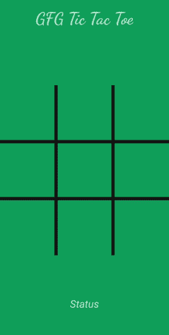

# 如何在安卓中构建井字游戏？

> 原文:[https://www . geeksforgeeks . org/如何在安卓中构建井字游戏/](https://www.geeksforgeeks.org/how-to-build-a-tic-tac-toe-game-in-android/)

在本文中，我们将使用安卓系统中的 **Java** 和 **XML** 构建一个井字游戏项目。井字游戏是基于两人游戏。每个玩家在 X 和 o 之间选择。玩家一次同时玩一个动作。在一次移动中，玩家可以从 3×3 的格子中选择任意位置。这里的目标是在水平、垂直或对角线方向获得三个连续的 X 或 O。这个应用程序中只有一个活动。本活动将展示一个 3×3 的网格。游戏状态将显示在底部。下面给出了一个示例 GIF，以了解我们将在本文中做什么。

### **分步实施**

**第一步:创建新项目**

要在安卓工作室创建新项目，请参考[如何在安卓工作室创建/启动新项目](https://www.geeksforgeeks.org/android-how-to-create-start-a-new-project-in-android-studio/)。注意选择 **Java** 作为编程语言。

**第二步:在进入编码部分之前，你首先要做一些前置任务**

**添加图片:**所有图片如下。将它们保存在资源中的可绘制文件夹中。转到**应用程序>资源>可绘制**并粘贴以下文件:

*   [网格](https://media.geeksforgeeks.org/wp-content/uploads/20201230114433/grid-300x300.png)
*   [O](https://media.geeksforgeeks.org/wp-content/uploads/20201230114434/o-300x300.png)
*   [X](https://media.geeksforgeeks.org/wp-content/uploads/20201230114437/x.png)

**在 themes.xml 文件中将样式更改为 NOACtionbar:**