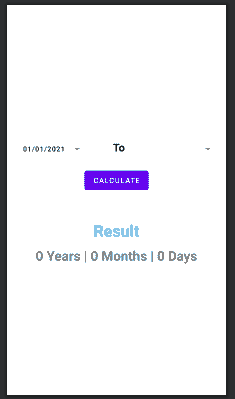

# 如何在安卓工作室搭建年龄计算器？

> 原文:[https://www . geeksforgeeks . org/如何在安卓工作室中构建年龄计算器/](https://www.geeksforgeeks.org/how-to-build-age-calculator-in-android-studio/)

各位极客好，今天我们要做一个应用来计算年龄或者两个日期之间的时间段。通过这个应用程序，人们可以计算他/她的确切年龄，也可以计算两个日期之间的确切差异。

**先决条件:**

在做这个应用之前，可以通过文章[程序计算年龄](https://www.geeksforgeeks.org/program-calculate-age/)来更好的理解这个应用中用到的概念。

### 我们将在本文中构建什么？

在本应用中，我们将使用两个[日期选择器](https://www.geeksforgeeks.org/slider-date-picker-in-android/)，用户可以分别选择日期 1 和日期 2。一个[按钮](https://www.geeksforgeeks.org/button-in-kotlin/)用于执行计算部分，并在名为结果的[文本视图](https://www.geeksforgeeks.org/textview-widget-in-android-using-java-with-examples/)中显示结果。注意，我们将使用 **Java** 语言实现这个应用程序。下面给出了一个示例视频，以了解我们将在本文中做什么。

<video class="wp-video-shortcode" id="video-644595-1" width="640" height="360" preload="metadata" controls=""><source type="video/mp4" src="https://media.geeksforgeeks.org/wp-content/uploads/20210712135438/WhatsApp-Video-2021-07-12-at-13.52.51.mp4?_=1">[https://media.geeksforgeeks.org/wp-content/uploads/20210712135438/WhatsApp-Video-2021-07-12-at-13.52.51.mp4](https://media.geeksforgeeks.org/wp-content/uploads/20210712135438/WhatsApp-Video-2021-07-12-at-13.52.51.mp4)</video>

### 逐步实施

**第一步:创建新项目**

*   打开一个新项目。
*   我们将使用 Java 语言来处理空活动。保持所有其他选项不变。
*   您可以在方便的时候更改项目的名称。
*   将有两个名为 **activity_main.xml 和 MainActivity.java 的默认文件。**

如果你不知道如何在安卓工作室创建新项目，那么你可以参考[如何在安卓工作室创建/启动新项目？](https://www.geeksforgeeks.org/android-how-to-create-start-a-new-project-in-android-studio/)

**步骤 2:导航到构建脚本> build.gradle(模块)文件，并向其中添加以下依赖项**

```
implementation 'joda-time:joda-time:2.9.1'
```

**步骤 3:使用 activity_main.xml 文件**

在这里，我们将设计应用程序的用户界面。我们将在他们各自的作品中使用以下组件:

*   按钮 1:选择用户想要输入的第一个日期。
*   按钮 2:选择用户想要输入的第二个日期。
*   按钮 3:执行计算
*   显示最终输出(年龄)。

导航到**应用程序> res >布局> activity_main.xml** 并将下面的代码添加到该文件中。

## 可扩展标记语言

```
<?xml version="1.0" encoding="utf-8"?>
<!-- Parent layout as linear layout-->
<LinearLayout 
    xmlns:android="http://schemas.android.com/apk/res/android"
    xmlns:tools="http://schemas.android.com/tools"
    android:layout_width="match_parent"
    android:layout_height="match_parent"
    android:gravity="center"
    android:orientation="vertical"
    android:padding="10dp"
    tools:context=".MainActivity">

    <!-- linear layout to show datepickers-->
    <LinearLayout
        android:layout_width="match_parent"
        android:layout_height="wrap_content">

        <!-- to select the first date-->
        <Button
            android:id="@+id/bt_birth"
            android:layout_width="150dp"
            android:layout_height="50dp"
            android:background="@android:color/transparent"
            android:drawableRight="@drawable/ic_baseline"
            android:text="01/01/2021"
            android:textColor="@color/black"
            android:textSize="13sp" />

        <!-- displaying message as "to"-->
        <TextView
            android:layout_width="100dp"
            android:layout_height="50dp"
            android:gravity="center_horizontal"
            android:text="To"
            android:textColor="@color/black"
            android:textSize="20sp"
            android:textStyle="bold" />

        <!-- to display date number 2-->
        <Button
            android:id="@+id/bt_today"
            android:layout_width="145dp"
            android:layout_height="50dp"
            android:background="@android:color/transparent"
            android:drawableRight="@drawable/ic_baseline"
            android:textColor="@color/black"
            android:textSize="13sp" />

    </LinearLayout>
    <!-- to perform the calculation-->
    <Button
        android:id="@+id/btn_calculate"
        android:layout_width="wrap_content"
        android:layout_height="wrap_content"
        android:layout_marginTop="10dp"
        android:text="calculate" />

    <!-- to display the message "Result"-->
    <TextView
        android:layout_width="wrap_content"
        android:layout_height="wrap_content"
        android:layout_marginTop="50dp"
        android:text="Result"
        android:textColor="@android:color/holo_blue_bright"
        android:textSize="30sp"
        android:textStyle="bold" />

    <!-- To show the final output(age)-->
    <TextView
        android:id="@+id/tv_result"
        android:layout_width="wrap_content"
        android:layout_height="wrap_content"
        android:layout_marginTop="10dp"
        android:text="0 Years | 0 Months | 0 Days"
        android:textSize="25sp"
        android:textStyle="bold" />

</LinearLayout>
```

实现上述代码后， **activity_main.xml** 文件的设计如下。



**第四步:使用 MainActivity.java 文件**

在**MainActivity.java**文件中，按钮上使用 onClickListerner 来选择日期和执行计算。在**MainActivity.java**文件中使用以下代码。

## Java 语言(一种计算机语言，尤用于创建网站)

```
import android.app.DatePickerDialog;
import android.graphics.Color;
import android.graphics.drawable.ColorDrawable;
import android.os.Bundle;
import android.view.View;
import android.widget.Button;
import android.widget.DatePicker;
import android.widget.TextView;
import android.widget.Toast;

import androidx.appcompat.app.AppCompatActivity;

import org.joda.time.Period;
import org.joda.time.PeriodType;

import java.text.ParseException;
import java.text.SimpleDateFormat;
import java.util.Calendar;
import java.util.Date;

public class MainActivity extends AppCompatActivity {

    // initializing variables
    Button btn_birth, btn_today, btn_calculate;
    TextView tvResult;
    DatePickerDialog.OnDateSetListener dateSetListener1, dateSetListener2;

    @Override
    protected void onCreate(Bundle savedInstanceState) {
        super.onCreate(savedInstanceState);
        setContentView(R.layout.activity_main);

        // assign variables
        btn_birth = findViewById(R.id.bt_birth);
        btn_today = findViewById(R.id.bt_today);
        btn_calculate = findViewById(R.id.btn_calculate);
        tvResult = findViewById(R.id.tv_result);

        // calendar format is imported to pick date
        Calendar calendar = Calendar.getInstance();

        // for year
        int year = calendar.get(Calendar.YEAR);

        // for month
        int month = calendar.get(Calendar.MONTH);

        // for date
        int day = calendar.get(Calendar.DAY_OF_MONTH);

        SimpleDateFormat simpleDateFormat = new SimpleDateFormat("dd/MM/yyyy");

        // to set the current date as by default
        String date = simpleDateFormat.format(Calendar.getInstance().getTime());
        btn_today.setText(date);

        // action to be performed when button 1 is clicked
        btn_birth.setOnClickListener(new View.OnClickListener() {
            @Override
            public void onClick(View view) {
                // date picker dialog is used
                // and its style and color are also passed
                DatePickerDialog datePickerDialog = new DatePickerDialog(MainActivity.this, android.R.style.Theme_Holo_Light_Dialog_MinWidth, dateSetListener1, year, month, day
                );
                // to set background for datepicker
                datePickerDialog.getWindow().setBackgroundDrawable(new ColorDrawable(Color.TRANSPARENT));
                datePickerDialog.show();
            }
        });

        // it is used to set teh date which user selects
        dateSetListener1 = new DatePickerDialog.OnDateSetListener() {
            @Override
            public void onDateSet(DatePicker view, int year, int month, int day) {
                // here month+1 is used so that
                // actual month number can be displayed
                // otherwise it starts from 0 and it shows
                // 1 number less for every month
                // example- for january month=0
                month = month + 1;
                String date = day + "/" + month + "/" + year;
                btn_birth.setText(date);
            }
        };

        // action to be performed when button 2 is clicked
        btn_today.setOnClickListener(new View.OnClickListener() {
            @Override
            public void onClick(View view) {
                // date picker dialog is used
                // and its style and color are also passed
                DatePickerDialog datePickerDialog = new DatePickerDialog(MainActivity.this, android.R.style.Theme_Holo_Light_Dialog_MinWidth, dateSetListener2, year, month, day
                );
                // to set background for datepicker
                datePickerDialog.getWindow().setBackgroundDrawable(new ColorDrawable(Color.TRANSPARENT));
                datePickerDialog.show();
            }
        });

        // it is used to set teh date which user selects
        dateSetListener2 = new DatePickerDialog.OnDateSetListener() {
            @Override
            public void onDateSet(DatePicker view, int year, int month, int day) {
                // here month+1 is used so that
                // actual month number can be displayed
                // otherwise it starts from 0 and it shows
                // 1 number less for every month
                // example- for january month=0
                month = month + 1;
                String date = day + "/" + month + "/" + year;
                btn_today.setText(date);
            }
        };

        // action to be performed when calculate button is clicked
        btn_calculate.setOnClickListener(new View.OnClickListener() {
            @Override
            public void onClick(View view) {
                // converting the inputted date to string
                String sDate = btn_birth.getText().toString();
                String eDate = btn_today.getText().toString();
                SimpleDateFormat simpleDateFormat1 = new SimpleDateFormat("dd/MM/yyyy");
                try {
                    // converting it to date format
                    Date date1 = simpleDateFormat1.parse(sDate);
                    Date date2 = simpleDateFormat1.parse(eDate);

                    long startdate = date1.getTime();
                    long endDate = date2.getTime();

                    // condition
                    if (startdate <= endDate) {
                        org.joda.time.Period period = new Period(startdate, endDate, PeriodType.yearMonthDay());
                        int years = period.getYears();
                        int months = period.getMonths();
                        int days = period.getDays();

                        // show the final output
                        tvResult.setText(years + " Years |" + months + "Months |" + days + "Days");
                    } else {
                        // show message
                        Toast.makeText(MainActivity.this, "BirthDate should not be larger then today's date!", Toast.LENGTH_SHORT).show();
                    }
                } catch (ParseException e) {
                    e.printStackTrace();
                }
            }
        });
    }
}
```

恭喜你！我们已经成功地应用程序来计算年龄或两个日期之间的差异。这是我们应用程序的最终输出。

**输出:**

<video class="wp-video-shortcode" id="video-644595-2" width="640" height="360" preload="metadata" controls=""><source type="video/mp4" src="https://media.geeksforgeeks.org/wp-content/uploads/20210712135438/WhatsApp-Video-2021-07-12-at-13.52.51.mp4?_=2">[https://media.geeksforgeeks.org/wp-content/uploads/20210712135438/WhatsApp-Video-2021-07-12-at-13.52.51.mp4](https://media.geeksforgeeks.org/wp-content/uploads/20210712135438/WhatsApp-Video-2021-07-12-at-13.52.51.mp4)</video>