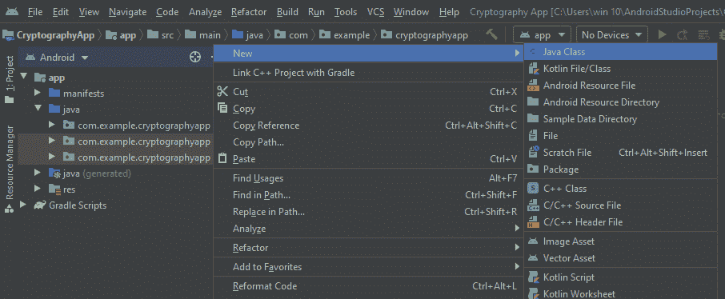

# 如何在安卓系统中搭建测试运动传感器的应用？

> 原文:[https://www . geeksforgeeks . org/如何构建一个应用程序来测试安卓系统中的运动传感器/](https://www.geeksforgeeks.org/how-to-build-an-application-to-test-motion-sensors-in-android/)

在本文中，我们将使用安卓系统中的 **Java 和 XML** 构建一个**运动传感器测试应用程序**项目。应用程序将使用设备的硬件来检测移动。检测运动所需的部件是**加速度计**和**陀螺仪**。加速度计是一种电子传感器，用于通过测量设备的加速度和运动来检测设备在空间中的位置。而陀螺仪感测设备的角运动。在这个应用中，当我们移动设备时，我们将观察到屏幕颜色的变化。这个应用程序中只有一个活动。

### 逐步实施

**第一步:创建新项目**

在安卓工作室创建新项目请参考 [**【如何在安卓工作室创建/启动新项目】**](https://www.geeksforgeeks.org/android-how-to-create-start-a-new-project-in-android-studio/) 。注意选择 **Java** 作为编程语言。

**第二步:在进入编码部分之前，你首先要做一些前置任务**

**在 AndroidMainfest.xml 中添加特性:**我们需要添加这个应用需要的硬件需求。我们需要的两个组件是陀螺仪和加速度计。将以下内容添加到您的**和**文件中。

> <uses-feature android:name="”android.hardware.sensor.accelerometer”" android:required="”true”/"></uses-feature>
> 
> <uses-feature android:name="”android.hardware.sensor.gyroscope”" android:required="”true”/"></uses-feature>

为加速度计和陀螺仪创建两个 Java 类，并将该类命名为**加速度计**和**陀螺仪**。

**在 themes.xml 文件中将样式更改为 NOACtionbar:**