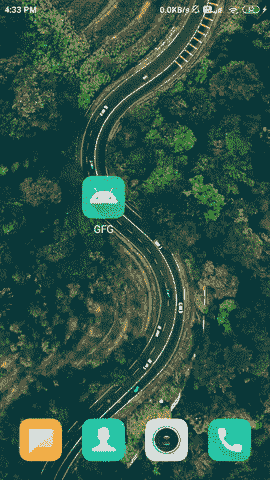

# 如何在安卓系统中构建类似 Instagram 的自定义 RecyclerView？

> 原文:[https://www . geeksforgeeks . org/如何在安卓中构建类似 instagram 的定制回收视图/](https://www.geeksforgeeks.org/how-to-build-an-instagram-like-custom-recyclerview-in-android/)

我们已经看到在我们的应用程序中用简单的数据在安卓系统中实现[回收视图。在本文中，我们将看一下 **Instagram 在安卓**中的实现。](https://www.geeksforgeeks.org/android-recyclerview/)

### 我们将在本文中构建什么？

我们将构建一个简单的应用程序，其中我们将显示来自 Instagram 配置文件的数据，我们将使用官方 Instagram 应用编程接口从用户的 Instagram 配置文件中加载数据，并在自定义的 RecyclerView 中显示这些数据。下面给出了一个 GIF 示例，来了解一下在本文中要做什么。请注意，我们将使用 **Java** 语言来实现这个项目。



### **分步实施**

**第一步:创建新项目**

要在安卓工作室创建新项目，请参考[如何在安卓工作室创建/启动新项目](https://www.geeksforgeeks.org/android-how-to-create-start-a-new-project-in-android-studio/)。注意选择 **Java** 作为编程语言。

**第二步:在你的 build.gradle 文件**中添加下面的依赖项

下面是[截击](https://www.geeksforgeeks.org/volley-library-in-android/)的依赖关系，我们将使用它从应用编程接口获取数据。要添加此依赖项，请导航至**应用程序>渐变脚本> build.gradle(应用程序)**，并在依赖项部分添加以下依赖项。

> //从 json 文件加载数据的依赖关系。
> 
> 实现‘com . Android .凌空:凌空:1 . 1 . 1’
> 
> //从 url 加载图像的依赖关系。
> 
> 实现' com.squareup .毕加索:毕加索:2.71828 '
> 
> //创建圆形图像的相关性。
> 
> 实现' de . hdodenhof:circleimageview:3 . 1 . 0 '

**第三步:创建 API 获取数据生成 API**

现在为 Instagram 帖子创建一个基本的显示应用编程接口，我们将创建一个显示这些数据的应用编程接口。你可以参考[如何在安卓中生成公共 Instagram Feeds 的 API URL？](https://www.geeksforgeeks.org/how-to-generate-api-url-for-public-instagram-feeds-in-android/)现在我们已经用访问令牌创建了 URL，我们将使用这个 URL 来获取 JSON 数据。

**第四步:在 AndroidManifest.xml 文件**中添加互联网权限

当我们从网上下载数据时。为此，我们必须将互联网权限添加到我们的 **AndroidManifest.xml** 文件中。导航到**应用程序> AndroidManifest.xml** 文件，并在其中添加以下代码。

## 可扩展标记语言

```java
<uses-permission android:name="android.permission.INTERNET" />
<uses-permission android:name="android.permission.ACCESS_NETWORK_STATE" />
```

**第 5 步:使用 activity_main.xml 文件**

导航到**应用程序> res >布局> activity_main.xml** 并将下面的代码添加到该文件中。下面是 **activity_main.xml** 文件的代码。

## 可扩展标记语言

```java
<?xml version="1.0" encoding="utf-8"?>
<RelativeLayout 
    xmlns:android="http://schemas.android.com/apk/res/android"
    xmlns:tools="http://schemas.android.com/tools"
    android:layout_width="match_parent"
    android:layout_height="match_parent"
    tools:context=".MainActivity">

    <!--recycler view for displaying
        our Instagram posts-->
    <androidx.recyclerview.widget.RecyclerView
        android:id="@+id/idRVInstaFeeds"
        android:layout_width="match_parent"
        android:layout_height="match_parent" />

    <!--progressbar for displaying 
        our loading indicator-->
    <ProgressBar
        android:id="@+id/idLoadingPB"
        android:layout_width="wrap_content"
        android:layout_height="wrap_content"
        android:layout_centerInParent="true"
        android:visibility="visible" />

</RelativeLayout>
```

**第 6 步:创建一个新的布局文件来显示我们的回收视图**的每个项目

导航至 **app > res >布局>右键点击>新建>布局资源文件**并将文件命名为 **insta_feed_rv_item** 并添加以下代码。

## 可扩展标记语言

```java
<?xml version="1.0" encoding="utf-8"?>
<RelativeLayout 
    xmlns:android="http://schemas.android.com/apk/res/android"
    android:layout_width="match_parent"
    android:layout_height="wrap_content">

    <LinearLayout
        android:id="@+id/idLLTopBar"
        android:layout_width="match_parent"
        android:layout_height="wrap_content"
        android:orientation="horizontal"
        android:padding="4dp">

        <!--circle image for displaying the user image-->
        <de.hdodenhof.circleimageview.CircleImageView
            android:id="@+id/idCVAuthor"
            android:layout_width="40dp"
            android:layout_height="40dp"
            android:layout_margin="5dp" />

        <!--text view for displaying user name-->
        <TextView
            android:id="@+id/idTVAuthorName"
            android:layout_width="match_parent"
            android:layout_height="wrap_content"
            android:layout_gravity="center"
            android:layout_margin="3dp"
            android:padding="3dp"
            android:text="geeks_for_geeks"
            android:textColor="@color/black"
            android:textStyle="bold" />
    </LinearLayout>

    <!--image view to display the post image-->
    <ImageView
        android:id="@+id/idIVPost"
        android:layout_width="match_parent"
        android:layout_height="300dp"
        android:layout_below="@id/idLLTopBar"
        android:adjustViewBounds="true"
        android:scaleType="centerCrop" />

    <!--text view to display likes count-->
    <TextView
        android:id="@+id/idTVLikes"
        android:layout_width="match_parent"
        android:layout_height="wrap_content"
        android:layout_below="@id/idIVPost"
        android:layout_margin="6dp"
        android:padding="5dp"
        android:text="likes"
        android:textColor="@color/black"
        android:textStyle="bold" />

    <!--text view to display the caption
        in instagram post-->
    <TextView
        android:id="@+id/idTVPostDesc"
        android:layout_width="match_parent"
        android:layout_height="wrap_content"
        android:layout_below="@id/idTVLikes"
        android:layout_margin="6dp"
        android:padding="5dp"
        android:textColor="@color/black"
        android:textSize="11sp" />

</RelativeLayout>
```

**第 7 步:创建一个模态类来存储我们提要的数据**

导航到**应用程序> java >你的应用程序的包名>右键单击它>新建> Java 类**并将你的类命名为 **InstaModal** 。

## Java 语言(一种计算机语言，尤用于创建网站)

```java
public class InstaModal {
    // variables for storing data 
    // of our recycler view item
    private String id;
    private String media_type;
    private String permalink;
    private String media_url;
    private String username;
    private String caption;
    private String timestamp;

    public String getAuthor_url() {
        return author_url;
    }

    public void setAuthor_url(String author_url) {
        this.author_url = author_url;
    }

    public int getLikesCount() {
        return likesCount;
    }

    public void setLikesCount(int likesCount) {
        this.likesCount = likesCount;
    }

    private String author_url;
    private int likesCount;

    public String getId() {
        return id;
    }

    public void setId(String id) {
        this.id = id;
    }

    public String getMedia_type() {
        return media_type;
    }

    public void setMedia_type(String media_type) {
        this.media_type = media_type;
    }

    public String getPermalink() {
        return permalink;
    }

    public void setPermalink(String permalink) {
        this.permalink = permalink;
    }

    public String getMedia_url() {
        return media_url;
    }

    public void setMedia_url(String media_url) {
        this.media_url = media_url;
    }

    public String getUsername() {
        return username;
    }

    public void setUsername(String username) {
        this.username = username;
    }

    public String getCaption() {
        return caption;
    }

    public void setCaption(String caption) {
        this.caption = caption;
    }

    public String getTimestamp() {
        return timestamp;
    }

    public void setTimestamp(String timestamp) {
        this.timestamp = timestamp;
    }

    public InstaModal(String id, String media_type, String permalink, String media_url, String username,
                      String caption, String timestamp, String author_url, int likesCount) {
        this.id = id;
        this.media_type = media_type;
        this.permalink = permalink;
        this.media_url = media_url;
        this.username = username;
        this.caption = caption;
        this.timestamp = timestamp;
        this.author_url = author_url;
        this.likesCount = likesCount;
    }
}
```

**步骤 8:创建一个适配器类，用于将该数据设置到我们的回收视图**的每个项目中

导航到**应用程序> java >你的应用程序的包名>右键单击它>新 java 类**并将其命名为**instagramfeedveadapter**并添加下面的代码。

## Java 语言(一种计算机语言，尤用于创建网站)

```java
import android.content.Context;
import android.view.LayoutInflater;
import android.view.View;
import android.view.ViewGroup;
import android.widget.ImageView;
import android.widget.TextView;

import androidx.annotation.NonNull;
import androidx.recyclerview.widget.RecyclerView;

import com.squareup.picasso.Picasso;

import java.util.ArrayList;

import de.hdodenhof.circleimageview.CircleImageView;

public class InstagramFeedRVAdapter extends RecyclerView.Adapter<InstagramFeedRVAdapter.ViewHolder> {

    private ArrayList<InstaModal> instaModalArrayList;
    private Context context;

    public InstagramFeedRVAdapter(ArrayList<InstaModal> instaModalArrayList, Context context) {
        this.instaModalArrayList = instaModalArrayList;
        this.context = context;
    }

    @NonNull
    @Override
    public InstagramFeedRVAdapter.ViewHolder onCreateViewHolder(@NonNull ViewGroup parent, int viewType) {
        // inflating our layout for item of recycler view item.
        View view = LayoutInflater.from(parent.getContext()).inflate(R.layout.insta_feed_rv_item, parent, false);
        return new InstagramFeedRVAdapter.ViewHolder(view);
    }

    @Override
    public void onBindViewHolder(@NonNull InstagramFeedRVAdapter.ViewHolder holder, int position) {
        InstaModal modal = instaModalArrayList.get(position);
        holder.authorTV.setText(modal.getUsername());
        if (modal.getMedia_type().equals("IMAGE")) {
            Picasso.get().load(modal.getMedia_url()).into(holder.postIV);
        }
        holder.desctv.setText(modal.getCaption());
        holder.likeTV.setText("" + modal.getLikesCount() + " likes");
        Picasso.get().load(modal.getAuthor_url()).into(holder.authorIV);
    }

    @Override
    public int getItemCount() {
        return instaModalArrayList.size();
    }

    public class ViewHolder extends RecyclerView.ViewHolder {

        CircleImageView authorIV;
        private TextView authorTV;
        private ImageView postIV;
        private TextView likeTV, desctv;

        public ViewHolder(@NonNull View itemView) {
            super(itemView);
            authorIV = itemView.findViewById(R.id.idCVAuthor);
            authorTV = itemView.findViewById(R.id.idTVAuthorName);
            postIV = itemView.findViewById(R.id.idIVPost);
            likeTV = itemView.findViewById(R.id.idTVLikes);
            desctv = itemView.findViewById(R.id.idTVPostDesc);
        }
    }
}
```

**第九步:使用****MainActivity.java 文件**

转到**MainActivity.java**文件，参考以下代码。以下是**MainActivity.java**文件的代码。代码中添加了注释，以更详细地理解代码。

## Java 语言(一种计算机语言，尤用于创建网站)

```java
import android.os.Bundle;
import android.view.View;
import android.widget.ProgressBar;
import android.widget.Toast;

import androidx.appcompat.app.AppCompatActivity;
import androidx.recyclerview.widget.LinearLayoutManager;
import androidx.recyclerview.widget.RecyclerView;

import com.android.volley.Request;
import com.android.volley.RequestQueue;
import com.android.volley.Response;
import com.android.volley.VolleyError;
import com.android.volley.toolbox.JsonObjectRequest;
import com.android.volley.toolbox.Volley;

import org.json.JSONArray;
import org.json.JSONException;
import org.json.JSONObject;

import java.util.ArrayList;

public class MainActivity extends AppCompatActivity {

    // creating variables for our requestqueue, 
    // array list, progressbar, edittext, 
    // image button and our recycler view.
    private RequestQueue mRequestQueue;
    private ArrayList<InstaModal> instaModalArrayList;
    private ProgressBar progressBar;

    @Override
    protected void onCreate(Bundle savedInstanceState) {
        super.onCreate(savedInstanceState);
        setContentView(R.layout.activity_main);

        // initializing our views.
        progressBar = findViewById(R.id.idLoadingPB);
        instaModalArrayList = new ArrayList<>();

        // calling method to load
        // data in recycler view.
        getInstagramData();
    }

    private void getInstagramData() {
        // below line is use to initialize the variable for our request queue.
        mRequestQueue = Volley.newRequestQueue(MainActivity.this);

        // below line is use to clear cache this will
        // be use when our data is being updated.
        mRequestQueue.getCache().clear();

        // below is the url for getting data 
        // from API in json format.
        String url = "Enter your URL";

        // below line we are  creating a new request queue.
        RequestQueue queue = Volley.newRequestQueue(MainActivity.this);
        JsonObjectRequest jsonObjectRequest = new JsonObjectRequest(Request.Method.GET, url, null, new Response.Listener<JSONObject>() {
            @Override
            public void onResponse(JSONObject response) {
                progressBar.setVisibility(View.GONE);
                try {
                    JSONArray dataArray = response.getJSONArray("data");
                    for (int i = 0; i < dataArray.length(); i++) {
                        // below line is to extract data from JSON file.
                        JSONObject dataObj = dataArray.getJSONObject(i);
                        String id = dataObj.getString("id");
                        String media_type = dataObj.getString("media_type");
                        String permalink = dataObj.getString("permalink");
                        String media_url = dataObj.getString("media_url");
                        String username = dataObj.getString("username");
                        String caption = dataObj.getString("caption");
                        String timestamp = dataObj.getString("timestamp");

                        // below line is to add a constant author image URL to our recycler view.
                        String author_url = "https://instagram.fnag5-1.fna.fbcdn.net/v/t51.2885-19/s320x320/75595203_828043414317991_4596848371003555840_n.jpg?_nc_ht=instagram.fnag5-1.fna.fbcdn.net&_nc_ohc=WzA_n4sdoQIAX9B5HWJ&tp=1&oh=05546141f5e40a8f02525b497745a3f2&oe=6031653B";
                        int likesCount = 100 + (i * 10);

                        // below line is use to add data to our modal class.
                        InstaModal instaModal = new InstaModal(id, media_type, permalink, media_url, username, caption, timestamp, author_url, likesCount);

                        // below line is use to add modal 
                        // class to our array list.
                        instaModalArrayList.add(instaModal);

                        // below line we are creating an adapter class and adding our array list in it.
                        InstagramFeedRVAdapter adapter = new InstagramFeedRVAdapter(instaModalArrayList, MainActivity.this);
                        RecyclerView instRV = findViewById(R.id.idRVInstaFeeds);

                        // below line is for setting linear layout manager to our recycler view.
                        LinearLayoutManager linearLayoutManager = new LinearLayoutManager(MainActivity.this, RecyclerView.VERTICAL, false);

                        // below line is to set layout manager to our recycler view.
                        instRV.setLayoutManager(linearLayoutManager);

                        // below line is to set adapter 
                        // to our recycler view.
                        instRV.setAdapter(adapter);
                    }
                } catch (JSONException e) {
                    // handling error case.
                    e.printStackTrace();
                    Toast.makeText(MainActivity.this, "Fail to get Data.." + e.getMessage(), Toast.LENGTH_SHORT).show();
                }
            }
        }, new Response.ErrorListener() {
            @Override
            public void onErrorResponse(VolleyError error) {
                // handling error message.
                Toast.makeText(MainActivity.this, "Fail to get Data.." + error, Toast.LENGTH_SHORT).show();
            }
        });
        queue.add(jsonObjectRequest);
    }
}
```

现在运行您的应用程序，并查看应用程序的输出。

### **输出:**

<video class="wp-video-shortcode" id="video-548227-1" width="640" height="360" preload="metadata" controls=""><source type="video/mp4" src="https://media.geeksforgeeks.org/wp-content/uploads/20210120175412/Screenrecorder-2021-01-20-16-33-04-649.mp4?_=1">[https://media.geeksforgeeks.org/wp-content/uploads/20210120175412/Screenrecorder-2021-01-20-16-33-04-649.mp4](https://media.geeksforgeeks.org/wp-content/uploads/20210120175412/Screenrecorder-2021-01-20-16-33-04-649.mp4)</video>

**点击下方链接查看项目:**[https://github . com/ChaitanyaMunje/library app/tree/InstagramCustomListVIew](https://github.com/ChaitanyaMunje/LibraryApp/tree/InstagramCustomListVIew)