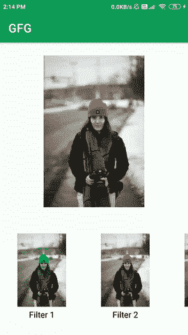

# 如何在安卓系统中构建类似 Instagram 的图像滤镜？

> 原文:[https://www . geesforgeks . org/how-build-image-filters-like-insta gram-in-Android/](https://www.geeksforgeeks.org/how-to-build-image-filters-like-instagram-in-android/)

现在，每天都有许多社交媒体应用程序提供如此多的过滤器，以至于我们可以使用它们来使我们在应用程序中的形象更加美丽和吸引人。这种功能通常出现在 Instagram、Snapchat 和许多社交媒体应用程序中。在本文中，我们将看看这个类似 Instagram 的过滤器部分在 Android 中的实现。

### 我们将在本文中构建什么？

我们将构建一个简单的应用程序，其中我们将显示一个[图像视图](https://www.geeksforgeeks.org/imageview-in-kotlin/)，我们将在下面提供不同类型的图像过滤选项。点击每个图像过滤器后，该过滤器将应用于我们的原始图像。下面给出了一个 GIF 示例，来了解一下我们将在本文中做什么。注意，我们将使用 **Java** 语言来实现这个项目。



### **分步实施**

**第一步:创建新项目**

在安卓工作室创建新项目请参考 [如何在安卓工作室创建/启动新项目](https://www.geeksforgeeks.org/android-how-to-create-start-a-new-project-in-android-studio/) 。注意选择 **Java** 作为编程语言。

**第二步:添加依赖和 JitPack 存储库**

导航到**渐变脚本>构建.渐变(模块:应用)**，并在依赖项部分添加以下依赖项。

> 实现' com . github . mukeshsolaki:photo filter:1 . 0 . 2 '

将 JitPack 存储库添加到构建文件中。将其添加到 allprojects{ }部分内存储库末尾的 root build.gradle 中。

> 所有项目{
> 
> 存储库{
> 
> …
> 
> maven { URL " https://jitpack . io " }
> 
> }
> 
> }

添加这个依赖项后，同步您的项目，现在我们将开始实现它。

**步骤 3:使用 activity_main.xml 文件**

导航到**应用程序> res >布局> activity_main.xml** 并将下面的代码添加到该文件中。下面是 **activity_main.xml** 文件的代码。

## 可扩展标记语言

```java
<?xml version="1.0" encoding="utf-8"?>
<RelativeLayout 
    xmlns:android="http://schemas.android.com/apk/res/android"
    xmlns:tools="http://schemas.android.com/tools"
    android:layout_width="match_parent"
    android:layout_height="match_parent"
    android:orientation="vertical"
    tools:context=".MainActivity">

    <!--Imageview for our original image-->
    <ImageView
        android:id="@+id/idIVOriginalImage"
        android:layout_width="match_parent"
        android:layout_height="300dp"
        android:layout_centerHorizontal="true"
        android:layout_margin="20dp"
        android:padding="5dp"
        android:src="@drawable/image" />

    <!--horizontal scroll view for displaying
        all our image filters-->
    <HorizontalScrollView
        android:layout_width="match_parent"
        android:layout_height="wrap_content"
        android:layout_below="@id/idIVOriginalImage"
        android:layout_marginTop="20dp">

        <LinearLayout
            android:layout_width="match_parent"
            android:layout_height="wrap_content"
            android:orientation="horizontal">

            <!--We are creating a linear layout for displaying 
                each item in horizontal scroll view-->
            <LinearLayout
                android:id="@+id/idLLVignette"
                android:layout_width="150dp"
                android:layout_height="wrap_content"
                android:layout_margin="5dp"
                android:orientation="vertical">

                <!--We are displaying the image view how it
                    will look after applying the filter-->
                <ImageView
                    android:id="@+id/idIVOne"
                    android:layout_width="140dp"
                    android:layout_height="140dp"
                    android:layout_gravity="center"
                    android:src="@drawable/image" />

                <!--Text view for displaying our filter name-->
                <TextView
                    android:layout_width="match_parent"
                    android:layout_height="wrap_content"
                    android:padding="4dp"
                    android:text="Filter 1"
                    android:textAlignment="center"
                    android:textColor="@color/black" />

            </LinearLayout>

            <LinearLayout
                android:id="@+id/idLLTint"
                android:layout_width="150dp"
                android:layout_height="wrap_content"
                android:layout_margin="5dp"
                android:orientation="vertical">

                <ImageView
                    android:id="@+id/idIVTwo"
                    android:layout_width="140dp"
                    android:layout_height="140dp"
                    android:layout_gravity="center"
                    android:src="@drawable/image" />

                <TextView
                    android:layout_width="match_parent"
                    android:layout_height="wrap_content"
                    android:padding="4dp"
                    android:text="Filter 2"
                    android:textAlignment="center"
                    android:textColor="@color/black" />

            </LinearLayout>

            <LinearLayout
                android:id="@+id/idLLTemperature"
                android:layout_width="150dp"
                android:layout_height="wrap_content"
                android:layout_margin="5dp"
                android:orientation="vertical">

                <ImageView
                    android:id="@+id/idIVThree"
                    android:layout_width="140dp"
                    android:layout_height="140dp"
                    android:layout_gravity="center"
                    android:src="@drawable/image" />

                <TextView
                    android:layout_width="match_parent"
                    android:layout_height="wrap_content"
                    android:padding="4dp"
                    android:text="Filter 3"
                    android:textAlignment="center"
                    android:textColor="@color/black" />

            </LinearLayout>

            <LinearLayout
                android:id="@+id/idLLSharpen"
                android:layout_width="150dp"
                android:layout_height="wrap_content"
                android:layout_margin="5dp"
                android:orientation="vertical">

                <ImageView
                    android:id="@+id/idIVFour"
                    android:layout_width="140dp"
                    android:layout_height="140dp"
                    android:layout_gravity="center"
                    android:src="@drawable/image" />

                <TextView
                    android:layout_width="match_parent"
                    android:layout_height="wrap_content"
                    android:padding="4dp"
                    android:text="Filter 4"
                    android:textAlignment="center"
                    android:textColor="@color/black" />

            </LinearLayout>

            <LinearLayout
                android:id="@+id/idLLSepia"
                android:layout_width="150dp"
                android:layout_height="wrap_content"
                android:layout_margin="5dp"
                android:orientation="vertical">

                <ImageView
                    android:id="@+id/idIVFive"
                    android:layout_width="140dp"
                    android:layout_height="140dp"
                    android:layout_gravity="center"
                    android:src="@drawable/image" />

                <TextView
                    android:layout_width="match_parent"
                    android:layout_height="wrap_content"
                    android:padding="4dp"
                    android:text="Filter 5"
                    android:textAlignment="center"
                    android:textColor="@color/black" />

            </LinearLayout>

            <LinearLayout
                android:id="@+id/idLLSaturate"
                android:layout_width="150dp"
                android:layout_height="wrap_content"
                android:layout_margin="5dp"
                android:orientation="vertical">

                <ImageView
                    android:id="@+id/idIVSix"
                    android:layout_width="140dp"
                    android:layout_height="140dp"
                    android:layout_gravity="center"
                    android:src="@drawable/image" />

                <TextView
                    android:layout_width="match_parent"
                    android:layout_height="wrap_content"
                    android:padding="4dp"
                    android:text="Filter 6"
                    android:textAlignment="center"
                    android:textColor="@color/black" />

            </LinearLayout>

            <LinearLayout
                android:id="@+id/idLLRotate"
                android:layout_width="150dp"
                android:layout_height="wrap_content"
                android:layout_margin="5dp"
                android:orientation="vertical">

                <ImageView
                    android:id="@+id/idIVSeven"
                    android:layout_width="140dp"
                    android:layout_height="140dp"
                    android:layout_gravity="center"
                    android:src="@drawable/image" />

                <TextView
                    android:layout_width="match_parent"
                    android:layout_height="wrap_content"
                    android:padding="4dp"
                    android:text="Filter 7"
                    android:textAlignment="center"
                    android:textColor="@color/black" />

            </LinearLayout>

            <LinearLayout
                android:id="@+id/idLLPosterize"
                android:layout_width="150dp"
                android:layout_height="wrap_content"
                android:layout_margin="5dp"
                android:orientation="vertical">

                <ImageView
                    android:id="@+id/idIVEight"
                    android:layout_width="140dp"
                    android:layout_height="140dp"
                    android:layout_gravity="center"
                    android:src="@drawable/image" />

                <TextView
                    android:layout_width="match_parent"
                    android:layout_height="wrap_content"
                    android:padding="4dp"
                    android:text="Filter 8"
                    android:textAlignment="center"
                    android:textColor="@color/black" />

            </LinearLayout>

            <LinearLayout
                android:id="@+id/idLLNone"
                android:layout_width="150dp"
                android:layout_height="wrap_content"
                android:layout_margin="5dp"
                android:orientation="vertical">

                <ImageView
                    android:id="@+id/idIVNine"
                    android:layout_width="140dp"
                    android:layout_height="140dp"
                    android:layout_gravity="center"
                    android:src="@drawable/image" />

                <TextView
                    android:layout_width="match_parent"
                    android:layout_height="wrap_content"
                    android:padding="4dp"
                    android:text="Filter 9"
                    android:textAlignment="center"
                    android:textColor="@color/black" />

            </LinearLayout>

            <LinearLayout
                android:id="@+id/idLLNegative"
                android:layout_width="150dp"
                android:layout_height="wrap_content"
                android:layout_margin="5dp"
                android:orientation="vertical">

                <ImageView
                    android:id="@+id/idIVTen"
                    android:layout_width="140dp"
                    android:layout_height="140dp"
                    android:layout_gravity="center"
                    android:src="@drawable/image" />

                <TextView
                    android:layout_width="match_parent"
                    android:layout_height="wrap_content"
                    android:padding="4dp"
                    android:text="Filter 10"
                    android:textAlignment="center"
                    android:textColor="@color/black" />

            </LinearLayout>

        </LinearLayout>

    </HorizontalScrollView>

</RelativeLayout>
```

**第四步:使用****MainActivity.java 文件**

转到**文件，参考以下代码。以下是**MainActivity.java**文件的代码。代码中添加了注释，以更详细地理解代码。**

## **Java 语言(一种计算机语言，尤用于创建网站)**

```java
import android.graphics.Bitmap;
import android.graphics.BitmapFactory;
import android.os.Bundle;
import android.view.View;
import android.widget.ImageView;

import androidx.appcompat.app.AppCompatActivity;

import com.mukesh.image_processing.ImageProcessor;

public class MainActivity extends AppCompatActivity {

    // creating a bitmap for our original
    // image and all image filters.
    Bitmap bitmap;

    // creating a variable for image view.
    ImageView oneIV, twoIV, threeIV, fourIV, fiveIV, sixIV, sevenIV, eightIV, nineIV, tenIV, originalIV;
    Bitmap oneBitMap, twoBitMap, threeBitmap, fourBitMap, fiveBitMap, sixBitMap, sevenBitMap, eightBitMap, nineBitMap, tenBitMap;

    @Override
    protected void onCreate(Bundle savedInstanceState) {
        super.onCreate(savedInstanceState);
        setContentView(R.layout.activity_main);

        // creating a variable for our image processor.
        ImageProcessor processor = new ImageProcessor();

        // initializing bitmap with our image resource.
        bitmap = BitmapFactory.decodeResource(getResources(), R.drawable.image);

        // initializing image views for our filters 
        // and original image on which we will 
        // be applying our filters.
        oneIV = findViewById(R.id.idIVOne);
        twoIV = findViewById(R.id.idIVTwo);
        threeIV = findViewById(R.id.idIVThree);
        fourIV = findViewById(R.id.idIVFour);
        fiveIV = findViewById(R.id.idIVFive);
        sixIV = findViewById(R.id.idIVSix);
        sevenIV = findViewById(R.id.idIVSeven);
        eightIV = findViewById(R.id.idIVEight);
        nineIV = findViewById(R.id.idIVNine);
        tenIV = findViewById(R.id.idIVTen);
        originalIV = findViewById(R.id.idIVOriginalImage);

        // below line is use to add tint effect to our original
        // image bitmap and storing that in one bitmap.
        oneBitMap = processor.tintImage(bitmap, 90);

        // after storing it to one bitmap 
        // we are setting it to imageview.
        oneIV.setImageBitmap(oneBitMap);

        // below line is use to apply gaussian blur effect
        // to our original image bitmap.
        twoBitMap = processor.applyGaussianBlur(bitmap);
        twoIV.setImageBitmap(twoBitMap);

        // below line is use to add sepia toing effect 
        // to our original image bitmap.
        threeBitmap = processor.createSepiaToningEffect(bitmap, 1, 2, 1, 5);
        threeIV.setImageBitmap(threeBitmap);

        // below line is use to apply saturation
        // filter to our original image bitmap.
        fourBitMap = processor.applySaturationFilter(bitmap, 3);
        fourIV.setImageBitmap(fourBitMap);

        // below line is use to apply snow effect 
        // to our original image bitmap.
        fiveBitMap = processor.applySnowEffect(bitmap);
        fiveIV.setImageBitmap(fiveBitMap);

        // below line is use to add gray scale
        // to our image view.
        sixBitMap = processor.doGreyScale(bitmap);
        sixIV.setImageBitmap(sixBitMap);

        // below line is use to add engrave effect 
        // to our image view.
        sevenBitMap = processor.engrave(bitmap);
        sevenIV.setImageBitmap(sevenBitMap);

        // below line is use to create a contrast 
        // effect to our image view.
        eightBitMap = processor.createContrast(bitmap, 1.5);
        eightIV.setImageBitmap(eightBitMap);

        // below line is use to add shadow effect 
        // to our original bitmap.
        nineBitMap = processor.createShadow(bitmap);
        nineIV.setImageBitmap(nineBitMap);

        // below line is use to add flea
        // effect to our image view.
        tenBitMap = processor.applyFleaEffect(bitmap);
        tenIV.setImageBitmap(tenBitMap);

        // below line is use to call on click 
        // listener for our all image filters.
        initializeOnCLickListerns();
    }

    private void initializeOnCLickListerns() {
        oneIV.setOnClickListener(new View.OnClickListener() {
            @Override
            public void onClick(View v) {
                // on clicking on each filter we are 
                // setting that filter to our original image.
                originalIV.setImageBitmap(oneBitMap);
            }
        });

        twoIV.setOnClickListener(new View.OnClickListener() {
            @Override
            public void onClick(View v) {
                originalIV.setImageBitmap(twoBitMap);
            }
        });

        threeIV.setOnClickListener(new View.OnClickListener() {
            @Override
            public void onClick(View v) {
                originalIV.setImageBitmap(threeBitmap);
            }
        });

        fourIV.setOnClickListener(new View.OnClickListener() {
            @Override
            public void onClick(View v) {
                originalIV.setImageBitmap(fourBitMap);
            }
        });

        fiveIV.setOnClickListener(new View.OnClickListener() {
            @Override
            public void onClick(View v) {
                originalIV.setImageBitmap(fiveBitMap);
            }
        });

        sixIV.setOnClickListener(new View.OnClickListener() {
            @Override
            public void onClick(View v) {
                originalIV.setImageBitmap(sixBitMap);
            }
        });

        sevenIV.setOnClickListener(new View.OnClickListener() {
            @Override
            public void onClick(View v) {
                originalIV.setImageBitmap(sevenBitMap);
            }
        });

        eightIV.setOnClickListener(new View.OnClickListener() {
            @Override
            public void onClick(View v) {
                originalIV.setImageBitmap(eightBitMap);
            }
        });

        nineIV.setOnClickListener(new View.OnClickListener() {
            @Override
            public void onClick(View v) {
                originalIV.setImageBitmap(nineBitMap);
            }
        });

        tenIV.setOnClickListener(new View.OnClickListener() {
            @Override
            public void onClick(View v) {
                originalIV.setImageBitmap(tenBitMap);
            }
        });
    }
}
```

**此项目中使用的图像被添加到可绘制文件夹中。要导航图像，导航至**应用程序> res >可绘制**，您将在该文件夹中找到图像。现在运行该应用程序，并查看下面代码的输出:**

### ****输出:****

> ****注意:**虽然我们使用的是**位图**，但是加载该应用程序需要一些时间，并且将图像解码为位图需要一些时间。**

**<video class="wp-video-shortcode" id="video-545596-1" width="640" height="360" preload="metadata" controls=""><source type="video/mp4" src="https://media.geeksforgeeks.org/wp-content/uploads/20210116144117/Screenrecorder-2021-01-16-14-14-32-849.mp4?_=1">[https://media.geeksforgeeks.org/wp-content/uploads/20210116144117/Screenrecorder-2021-01-16-14-14-32-849.mp4](https://media.geeksforgeeks.org/wp-content/uploads/20210116144117/Screenrecorder-2021-01-16-14-14-32-849.mp4)</video>**