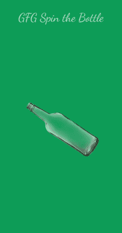

# 如何在安卓中构建自旋瓶游戏应用？

> 原文:[https://www . geesforgeks . org/如何构建-旋转瓶子-游戏-安卓应用/](https://www.geeksforgeeks.org/how-to-build-spin-the-bottle-game-application-in-android/)

在本文中，我们将在安卓中使用 **Java 和 XML** 构建一个旋转瓶子游戏项目。该应用程序基于多人游戏。一个玩家旋转瓶子，瓶子旋转的方向将决定谁被选中完成一项任务或其他任务。这个应用程序中只有一个活动。下面给出了一个 GIF 示例，来了解一下我们将在本文中做什么。



### 逐步实施

**第一步:创建新项目**

在安卓工作室创建新项目请参考 [**【如何在安卓工作室创建/启动新项目】**](https://www.geeksforgeeks.org/android-how-to-create-start-a-new-project-in-android-studio/) 。注意选择 **Java** 作为编程语言。

**第二步:在进入编码部分之前，你首先要做一些前置任务**

*   **添加瓶子图片**:前往 **app - > res - >可抽拉**添加此瓶子[T5】图片](https://media.geeksforgeeks.org/wp-content/uploads/20210106100702/bottle-229x300.png) 。
*   **修改 colors.xml 文件:**

## 可扩展标记语言

```java
<?xml version="1.0" encoding="utf-8"?>
<resources>
    <color name="colorPrimary">#6200EE</color>
    <color name="colorPrimaryDark">#3700B3</color>
    <color name="colorAccent">#03DAC5</color>
    <color name="green">#0F9D58</color>
</resources>
```

**步骤 3:使用 activity_main.xml 文件**

XML 代码用于构建活动的结构及其样式部分。它在活动的顶部包含一个[文本视图](https://www.geeksforgeeks.org/textview-widget-in-android-using-java-with-examples/) 来显示标题。然后它在活动中心包含一个瓶子的[图像视图](https://www.geeksforgeeks.org/imageview-in-kotlin/)。下面是 **activity_main.xml** 文件的代码。

## 可扩展标记语言

```java
<?xml version="1.0" encoding="utf-8"?>
<RelativeLayout 
    xmlns:android="http://schemas.android.com/apk/res/android"
    xmlns:tools="http://schemas.android.com/tools"
    android:layout_width="match_parent"
    android:layout_height="match_parent"
    android:background="@color/green"
    tools:context=".MainActivity">

    <!--to show the game title-->
    <TextView
        android:layout_width="wrap_content"
        android:layout_height="wrap_content"
        android:layout_centerHorizontal="true"
        android:layout_marginTop="40dp"
        android:fontFamily="cursive"
        android:text="GFG Spin the Bottle"
        android:textSize="40dp" />

    <!--image of the bottle with 
        an onClick function-->
    <ImageView
        android:id="@+id/bottle"
        android:layout_width="300dp"
        android:layout_height="300dp"
        android:layout_centerInParent="true"
        android:onClick="spinBottle"
        android:src="@drawable/bottle" />

</RelativeLayout>
```

**步骤 4:使用 MainActivity.java 文件**

我们将在 Java 文件中创建一个函数，当点击瓶子的图像时将调用这个函数。在这个函数中，我们将生成一个从 1-1800 的随机数，它将是图像旋转的方向。为此，我们将使用 **Random()** 函数。我们将创建一个具有四个参数的**旋转成像**函数的方法。这些参数是初始方向、最终方向、X 方向的旋转枢轴和 Y 方向的旋转枢轴。因为我们希望图像从中心旋转，所以我们将中心作为枢轴。因此:

*   初始方向= 0，
*   最终方向=从 0–1800 随机生成的数字，
*   pivotX =图像宽度的一半，
*   pivotY =图像高度的一半。
*   每次旋转后，初始方向=最终方向。

以下是**MainActivity.java**文件的代码。代码中添加了注释，以更详细地理解代码。

## Java 语言(一种计算机语言，尤用于创建网站)

```java
import android.os.Bundle;
import android.view.View;
import android.view.animation.Animation;
import android.view.animation.RotateAnimation;
import android.widget.ImageView;

import androidx.appcompat.app.AppCompatActivity;

import java.util.Random;

public class MainActivity extends AppCompatActivity {

    private ImageView bot;
    private Random rand = new Random();
    private int lstDr;
    private boolean spn;

    @Override
    protected void onCreate(Bundle savedInstanceState) {
        super.onCreate(savedInstanceState);
        setContentView(R.layout.activity_main);
        bot = findViewById(R.id.bottle);
    }

    // onClick function
    public void spinBottle(View v) {
        // check if the bottled has stopped spinning
        if (!spn) {

            // generate a random number from 1-1800
            int num = rand.nextInt(1800);

            // set the pivot to the centre of the image
            float pX = bot.getWidth() / 2;
            float pY = bot.getHeight() / 2;

            // pass parameters in RoatateAnimation function
            Animation rot = new RotateAnimation(lstDr, num, pX, pY);

            // set rotate duration 2500 millisecs
            rot.setDuration(2500);

            // rotation will persist after finishing
            rot.setFillAfter(true);
            rot.setAnimationListener(new Animation.AnimationListener() {
                @Override
                public void onAnimationStart(Animation animation) {
                    spn = true;
                }

                @Override
                public void onAnimationEnd(Animation animation) {
                    spn = false;
                }

                @Override
                public void onAnimationRepeat(Animation animation) {
                }
            });

            // change the last direction
            lstDr = num;

            // start the animation
            bot.startAnimation(rot);
        }
    }
}
```

### 输出:

<video class="wp-video-shortcode" id="video-540552-1" width="640" height="360" preload="metadata" controls=""><source type="video/mp4" src="https://media.geeksforgeeks.org/wp-content/uploads/20210106120007/Edited_20210106_115244.mp4?_=1">[https://media.geeksforgeeks.org/wp-content/uploads/20210106120007/Edited_20210106_115244.mp4](https://media.geeksforgeeks.org/wp-content/uploads/20210106120007/Edited_20210106_115244.mp4)</video>