# 如何调用或消费 Spring Boot 外部 API？

> 原文:[https://www . geesforgeks . org/如何在春季启动时调用或消费外部 API/](https://www.geeksforgeeks.org/how-to-call-or-consume-external-api-in-spring-boot/)

Spring Boot 建在春天的顶端，包含了春天的所有特征。现在正成为开发人员的最爱，因为这是一个快速的生产就绪环境，使开发人员能够直接专注于逻辑，而不是在配置和设置上挣扎。Spring Boot 是一个基于微服务的框架，在其中制作一个生产就绪的应用程序只需要很少的时间。在这里，我们将学习如何创建一个使用外部 API 的 Spring Boot 应用程序。在本课程中，我们将经历以下几个阶段:

**程序:**

1.  创建 Spring Boot 项目。
2.  创建休息控制器并映射应用编程接口请求。
3.  构建并运行项目。
4.  调用外部 API 服务并进行测试。

现在让我们在视觉辅助的帮助下自动化每一个细节步骤

**第一步:**创建 Spring Boot 项目

首先，访问[网站](https://start.spring.io/)，创建一个春季开机项目。您也可以使用“依赖项”部分添加另一个依赖项。这里我们不需要任何额外的依赖。

> 请记住:您可以通过单击“生成”选项卡来下载 spring boot 项目。

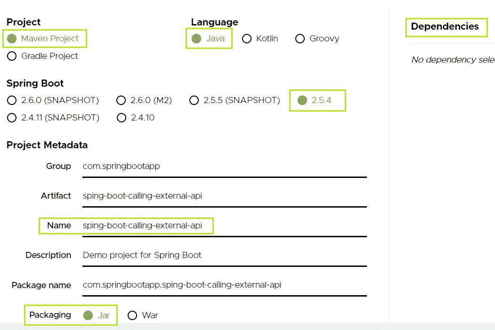

创建 spring boot 项目

下载项目后，将其导入到您的 Eclipse IDE 中，然后示例如下所示:

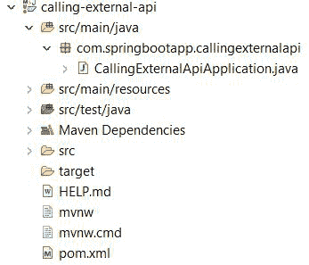

春季开机项目

> **注意:** pom.xml 包含您的项目所需的所有依赖项，如下所示:

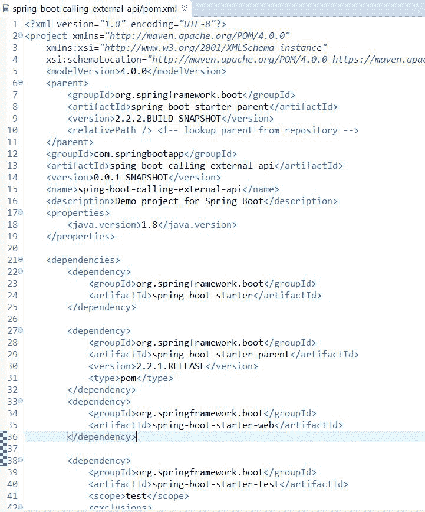

pom.xml 文件

**步骤 2:** 创建休息控制器并映射请求

现在，让我们在休息控制器类中创建一个示例休息应用编程接口调用。这个调用将简单地返回“Hello world”作为输出。我们将使用这个应用编程接口，并在同一个应用程序中调用它。

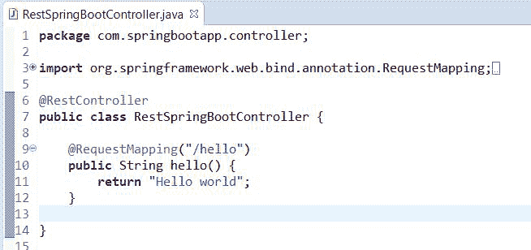

你好世界 API 示例

**步骤 3:** 构建并运行项目

我们可以通过启动 spring boot 应用程序来检查输出。

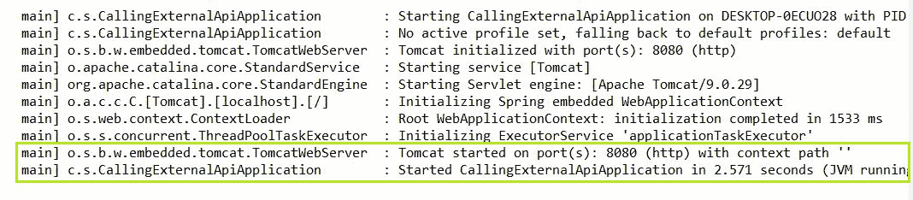

启动应用程序

现在打开邮差，发送指定网址的 GET 请求:***http://localhost:8080/hello***

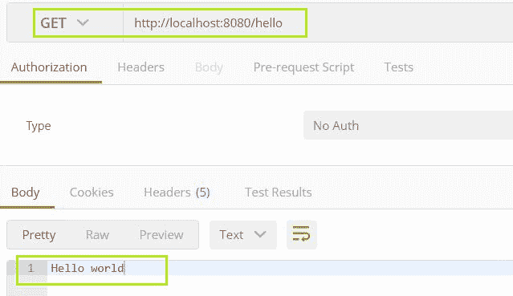

我们的示例“你好”应用编程接口服务正在本地主机:8080 上工作。现在我们将看到如何使用 Rest 模板调用这个服务。

**第四步:调用外部 API 服务并测试**

在这里，在调用外部应用编程接口之前，首先，我们将了解什么是 Rest 模板，如下所述:

休息模板是 Spring 的核心类，用于创建使用 RESTful 网络服务的应用程序。您可以使用 Rest Template 类中可用的方法来使用所有 HTTP 方法的 web 服务。

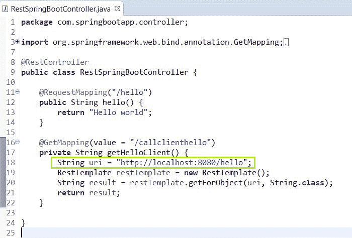

*   在这里，我们将 GetMapping 指定为“callclienthello”，这样就可以在该分机上进行外部呼叫。
*   接下来，定义可以访问您的服务的客户 URI。
*   创建休息模板对象，然后使用 **getForObject** 方法可以调用定义的服务。
*   现在我们的“你好”服务也将在分机“callclienthello”上提供。
*   让我们测试一下，输出如下:

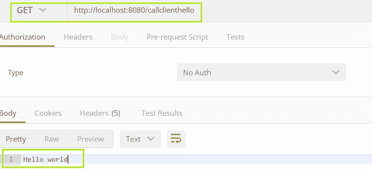

如您所见，我们得到了与示例“你好”API 调用相同的输出。现在让我们看另一个例子，在这个例子中，我们将调用通过互联网提供的外部应用编程接口。例如**“https://rest counters . eu/rest/v2/all”。**如果我们现在发送给定国家/地区 API 的请求，那么它将返回国家/地区列表，然后我们将从[邮递员](https://www.geeksforgeeks.org/introduction-postman-api-development/)处对其进行测试，如下图所示

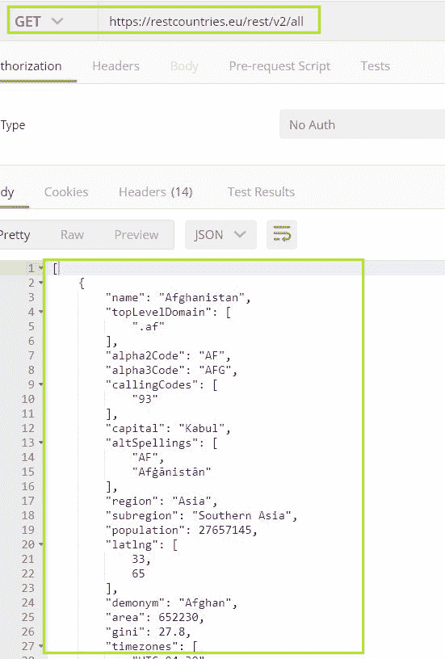

现在，我们将从我们的春季启动应用程序中调用这个国家 API。

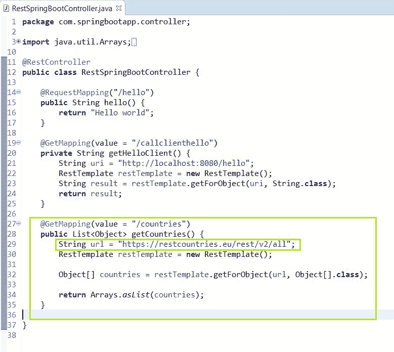

在这里，我将“获取地图”设为“国家”，这样我们就可以使用该分机拨打外部电话。我们已经定义了一个外部应用编程接口，我们想用它在网址中进行调用。让我们通过发送请求来查看 postman 中的输出:

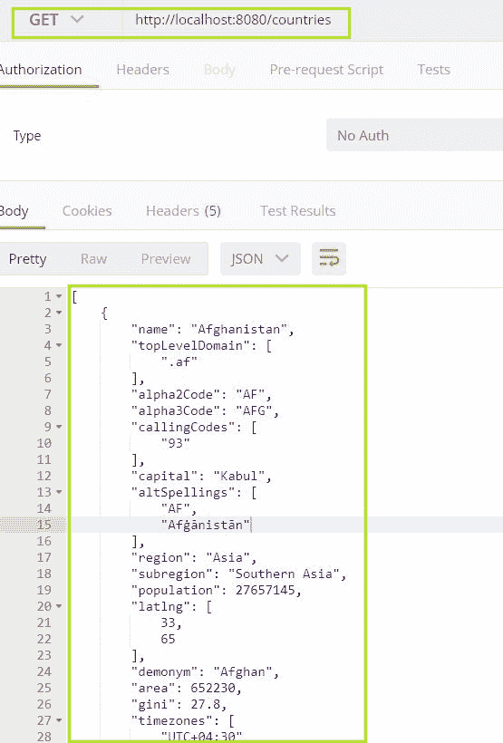

正如你在这里看到的，国家应用编程接口，即“https://rest counters . eu/rest/v2/all”，现在在扩展“国家”上可用。通过这种方式，您可以使用 Spring Rest Template 类调用外部 API 服务。