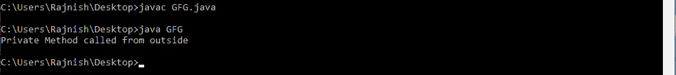
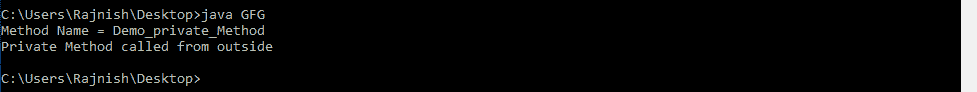

# 如何借助反射 API 从 Java 中的另一个类调用私有方法？

> 原文:[https://www . geesforgeks . org/如何借助反射 api 从另一个 java 类调用私有方法/](https://www.geeksforgeeks.org/how-to-call-private-method-from-another-class-in-java-with-help-of-reflection-api/)

我们可以在 Java 中从另一个类调用一个类的[私有方法](https://www.geeksforgeeks.org/private-and-final-methods-in-Java/)(在 Java 中使用[私有访问修饰符](https://www.geeksforgeeks.org/access-modifiers-Java/)来定义)。

我们可以通过使用 Java 的一些预定义方法来改变类的运行时行为。对于访问不同类的私有方法，我们将使用[反射 API](https://www.geeksforgeeks.org/reflection-in-Java/) 。

要调用私有方法，我们将使用以下方法 [Java.lang.class](https://www.geeksforgeeks.org/Java-lang-class-class-Java-set-1/) 和 [Java.lang.reflect.Method](https://www.geeksforgeeks.org/reflection-in-Java/)

*   [方法[] getDeclaredMethods()](https://www.geeksforgeeks.org/Java-lang-class-class-Java-set-2/) :此方法返回一个 Method 对象，该对象反映了此 class 对象表示的类或接口的指定声明方法。
*   [设置可访问()](https://docs.oracle.com/Javase/8/docs/api/Java/lang/reflect/AccessibleObject.html#setAccessible(boolean)):将该对象的可访问标志设置为指示的布尔值。值为 true 表示反射对象在使用时应该禁止 Java 语言访问检查。值为 false 表示反射的对象应该强制执行 Java 语言访问检查。
*   [invoke()](https://docs.oracle.com/Javase/8/docs/api/Java/lang/reflect/Method.html#invoke-Java.lang.Object-Java.lang.Object...-) :它用指定的参数在指定的对象上调用这个 method 对象表示的底层方法。

    **下面的程序演示了 Java 中私有方法的调用:**

    *   **例 1:** 当私有函数的名字已经知道时。

        ```
        // Java program to call
        // private method of a
        // class from another class

        import Java.lang.reflect.Method;

        // The class containing
        // a private method and
        // a public method
        class Check {

            // Private method
            private void private_Method()
            {
                System.out.println("Private Method "
                                   + "called from outside");
            }

            // Public method
            public void printData()
            {
                System.out.println("Public Method");
            }
        }

        // Driver code
        class GFG {

            public static void main(String[] args)
                throws Exception
            {
                Check c = new Check();

                // Using getDeclareMethod() method
                Method m = Check.class
                               .getDeclaredMethod("private_Method");

                // Using setAccessible() method
                m.setAccessible(true);

                // Using invoke() method
                m.invoke(c);
            }
        }
        ```

        **输出:** [](https://media.geeksforgeeks.org/wp-content/uploads/20190610233304/Annotation-2019-06-10-233218.png) 
    *   **例 2:** 当私有函数的名称未知但类名已知时。

        ```
        // Java program to call private method
        // of a class from another class

        import Java.lang.reflect.Method;

        // The class contains a private method
        class Check {

            // Private method
            private void Demo_private_Method()
            {
                System.out.println("Private Method "
                                   + "called from outside");
            }

            // Public method
            public void printData()
            {
                System.out.println("Public Method");
            }
        }

        // Driver code
        class GFG {

            public static void main(String[] args)
                throws Exception
            {
                Check c = new Check();
                Method m;

                // Using getDeclareMethod() method
                Method method[]
                    = Check.class.getDeclaredMethods();

                for (int i = 0; i < method.length; i++) {
                    String meth
                        = new String(method[i].toString());
                    if (meth.startsWith("private")) {

                        String s = method[i].toString();

                        int a = s.indexOf(".");
                        int b = s.indexOf("(");

                        // Method name retrieved
                        String method_name = s.substring(a + 1, b);

                        // Print method name
                        System.out.println("Method Name = "
                                           + method_name);

                        // Using getDeclareMethod() method
                        m = Check.class.getDeclaredMethod(method_name);

                        // Using setAccessible() method
                        m.setAccessible(true);

                        // Using invoke() method
                        m.invoke(c);
                    }
                }
            }
        }
        ```

        **输出:** [](https://media.geeksforgeeks.org/wp-content/uploads/20190610235309/Annotation-2019-06-10-235245.png)