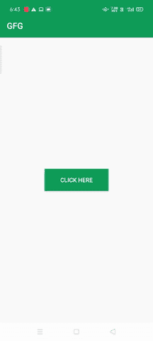
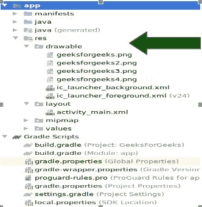

# 安卓如何通过按钮点击事件改变背景图像？

> 原文:[https://www . geesforgeks . org/如何更改-背景-点击按钮图像-安卓中的事件/](https://www.geeksforgeeks.org/how-to-change-background-image-by-button-clicking-event-in-android/)

背景图像在美化任何应用程序中起着重要的作用。因此，像 WhatsApp、Messenger 这样的大多数社交媒体应用程序都将此作为其功能的一部分提供给用户。因此，记住这一点，我们将开发一个安卓应用程序，其中背景图像将通过点击按钮得到改变。

### 我们将在本文中构建什么？

我们将构建一个简单的应用程序，其中我们将显示一个[按钮](https://www.geeksforgeeks.org/handling-click-events-button-android/)，通过点击按钮的事件，我们将改变应用程序中的背景图像。请注意，我们将制作一组保存在可绘制文件夹中的图像，并使用**随机类**随机访问这些图像。我们将使用 **Java** 语言来实现这个项目。所以，在不浪费更多时间的情况下，让我们来看看实现。下面给出了一个 GIF 示例，来了解一下我们在本文中要做什么。注意，我们将使用 **Java** 语言来实现这个项目。



### **分步实施**

**第一步:创建新项目**

要在安卓工作室创建新项目，请参考[如何在安卓工作室创建/启动新项目](https://www.geeksforgeeks.org/android-how-to-create-start-a-new-project-in-android-studio/)。注意选择 **Java** 作为编程语言。

**第二步:采集图像并保存**

现在，下载一些图片作为背景，然后导航到 **app > res >可绘制文件夹**并使用复制粘贴方法将所有下载的图片保存在可绘制文件夹中。



**步骤 3:使用 activity_main.xml 文件**

现在，我们将设计应用程序的布局部分。所以，导航到 **app > res >布局> activity_main.xml** ，将下面写好的代码粘贴到 **activity_main.xml** 文件中。

## 可扩展标记语言

```
<?xml version="1.0" encoding="utf-8"?>
<RelativeLayout 
    xmlns:android="http://schemas.android.com/apk/res/android"
    xmlns:tools="http://schemas.android.com/tools"
    android:id="@+id/relative_layout"
    android:layout_width="match_parent"
    android:layout_height="match_parent"
    android:gravity="center"
    android:orientation="vertical"
    tools:context=".MainActivity">

    <!--Button to perform clicking event 
        to change background images-->
    <Button
        android:id="@+id/Button"
        android:layout_width="150dp"
        android:layout_height="52dp"
        android:layout_margin="12dp"
        android:background="#0F9D58"
        android:text="Click Here"
        android:textColor="#FFFFFF" />

</RelativeLayout>
```

**步骤 4:使用 MainActivity.java 文件**

接下来，我们将开发应用程序的后端部分。所以，导航到 **app > java >包名>MainActivity.java**并将下面写的代码粘贴到**MainActivity.java**文件中。在代码中添加注释，以更详细地理解代码。

## Java 语言(一种计算机语言，尤用于创建网站)

```
import android.os.Bundle;
import android.view.View;
import android.widget.Button;

import androidx.appcompat.app.AppCompatActivity;
import androidx.core.content.ContextCompat;

import java.util.Random;

public class MainActivity extends AppCompatActivity {
    Button button;
    View screenView;
    int[] back_images;

    @Override
    protected void onCreate(Bundle savedInstanceState) {
        super.onCreate(savedInstanceState);
        setContentView(R.layout.activity_main);

        // array creation of images which are stored
        // in drawable folder under res folder
        back_images = new int[]{R.drawable.geeksforgeeks, R.drawable.geeksforgeeks2,
                                R.drawable.geeksforgeeks3, R.drawable.geeksforgeeks4};
        button = findViewById(R.id.Button);
        screenView = findViewById(R.id.relative_layout);

        button.setOnClickListener(new View.OnClickListener() {
            @Override
            public void onClick(View v) {

                // fetching length of array
                int array_length = back_images.length;

                // object creation of random class
                Random random = new Random();

                // generation of random number
                int random_number = random.nextInt(array_length);

                // set background images on screenView
                // using setBackground() method.
                screenView.setBackground(ContextCompat.getDrawable(getApplicationContext(), back_images[random_number]));
            }
        });
    }
}
```

现在我们的应用程序可以安装了。所以，点击**运行**按钮运行应用程序。这是应用程序的输出视频。

### 输出:

<video class="wp-video-shortcode" id="video-550751-1" width="640" height="360" preload="metadata" controls=""><source type="video/mp4" src="https://media.geeksforgeeks.org/wp-content/uploads/20210130184828/gfg_output_video.mp4?_=1">[https://media.geeksforgeeks.org/wp-content/uploads/20210130184828/gfg_output_video.mp4](https://media.geeksforgeeks.org/wp-content/uploads/20210130184828/gfg_output_video.mp4)</video>

**Github 链接:**要获得更多帮助，请浏览这个[存储库](https://github.com/Blitzcoder01/GFG_Background_Image_Change_Application)。