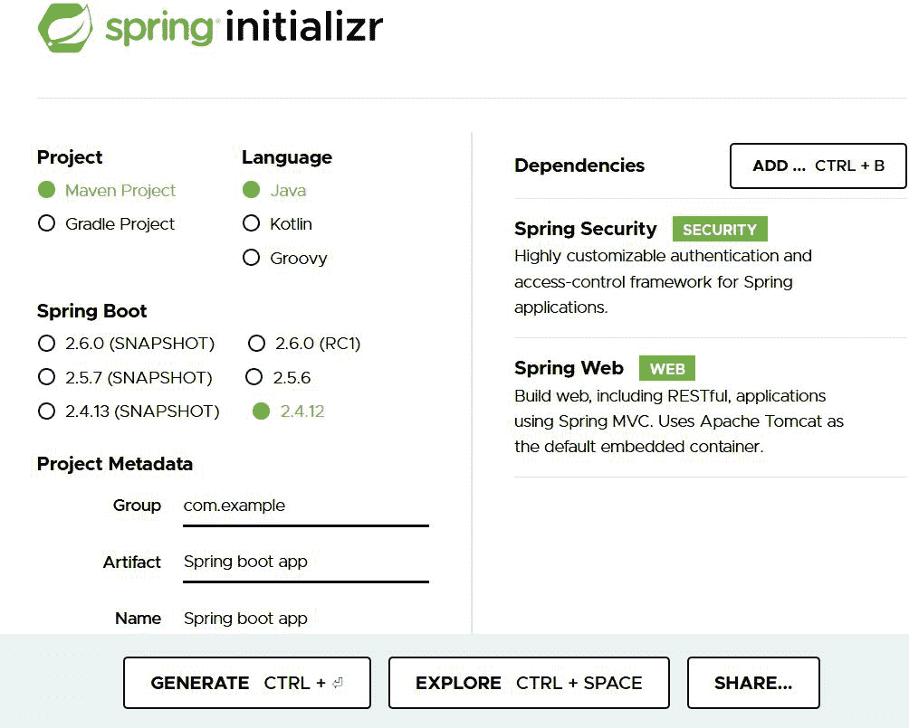
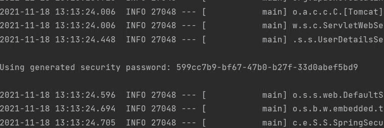
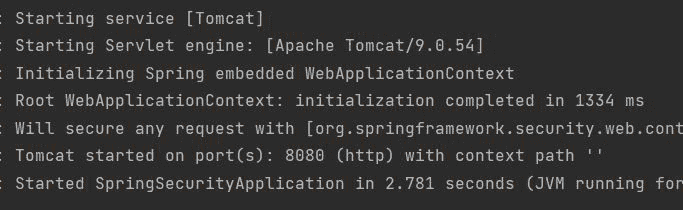
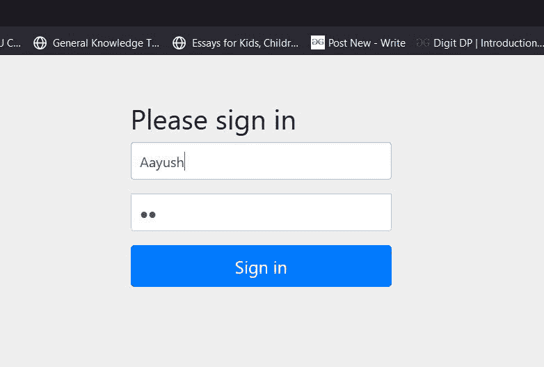
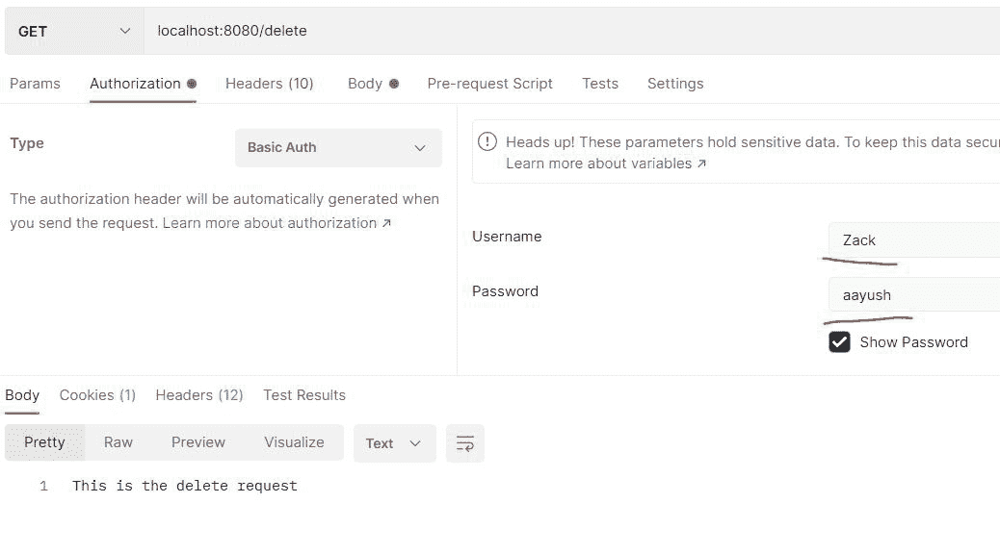

# 如何在 Spring Security 中更改默认用户和密码？

> 原文:[https://www . geesforgeks . org/如何更改-默认-春季用户和密码-安全/](https://www.geeksforgeeks.org/how-to-change-default-user-and-password-in-spring-security/)

**Spring Security** 是一个功能强大且高度可定制的身份验证和访问控制框架。这是保护基于 Spring 的应用程序的事实标准。Spring Security 是一个专注于为 Java 应用程序提供身份验证和授权的框架。与所有 Spring 项目一样，Spring Security 的真正威力在于它可以轻松扩展以满足定制需求。Spring Security 的一些关键特性包括:

1.  对身份验证和授权的全面和可扩展的支持
2.  防止像会话固定、点击劫持、跨站点请求伪造等攻击
3.  Servlet 应用编程接口集成
4.  与 Spring Web MVC 的可选集成

在本文中，我们将讨论如何在 spring security 中更改默认用户和密码。**在 spring security** 中有两种方式可以更改默认用户和密码

*   **方法 1:在应用属性文件**中更改
*   **方法 2:创建自定义注释的启用网络安全类**

更改 spring 项目的应用程序属性是覆盖默认用户名和密码的最简单方法之一。让我们讨论一下

> **注**:首先我们需要在我们的项目中建立 spring 应用。

[Spring Initializr](https://www.geeksforgeeks.org/spring-initializr/) 是一个基于 web 的工具，使用它我们可以很容易地生成 Spring Boot 项目的结构。它还为元数据模型中表达的项目提供了各种不同的特性。这个模型允许我们配置 JVM 支持的依赖列表。在这里，我们将使用 spring 初始化器创建应用程序的结构。

**第一步:转到弹簧初始化器**

按照要求填写细节。对于此应用:

```java
Project: Maven
Language: Java
Spring Boot: 2.4.12
Packaging: JAR
Java: 8
Dependencies: Spring Web, Spring Security
```



单击生成，它将下载初始项目。

**第二步:**提取 zip 文件。现在打开一个合适的 IDE，然后转到文件>从现有资源>新建>项目【Spring-boot-app】并选择 pom.xml。在提示符下单击导入更改并等待项目同步，如下图所示:


> **注意**:在 Maven 的导入项目窗口中，确保选择了创建项目时选择的相同版本的 JDK。

**第三步:**转到 src >主>Java>com . gfg . spring . boot . app，运行主应用

***SpringBootAppApplication.java**T3】*

## Java 语言(一种计算机语言，尤用于创建网站)

```java
@SpringBootApplication
public class SpringBootAppApplication {

    public static void main(String[] args) {
        SpringBootAppApplication.run(SpringBootAppApplication.class, args);
    }

}
```

**终端输出:**



### **方法 1:** 在应用程序属性文件中更改

Spring security 生成默认密码为了覆盖，我们必须在 applications.properties 文件中配置我们自己的用户名和密码

**应用程序.属性**

```java
spring.security.user.name=Aayush
spring.security.user.password=12
```

现在运行主应用程序

**终端输出:**



我们可以看到在这种情况下没有生成默认密码，因为我们已经覆盖了默认密码。现在转到任何浏览器，键入 localhost:8080，并尝试访问任何我们无法访问的本地 API。首先，我们必须绕过安全性。



用户名和密码与我们在 application.properties 文件中提到的相同。

### **方法 2** :创建自定义注释的启用网络安全类

转到 src > main > java > com . gfg . spring . boot . app，创建两个 Java 文件一个是 controller.java，另一个是 config.java

**controller.java**

## Java 语言(一种计算机语言，尤用于创建网站)

```java
@RestController
public class controller {

    @GetMapping("/delete") 
    public String delete()
    {
        return "This is the delete request";
    }
}
```

上面的 java 文件用于设置控制器，以处理来自客户端的传入请求。现在我们必须配置我们将使用 config.java 文件的请求。

**config.java**

## Java 语言(一种计算机语言，尤用于创建网站)

```java
@EnableWebSecurity
public class config extends WebSecurityConfigurerAdapter {

    // Adding the roles
    @Override
    protected void configure(AuthenticationManagerBuilder auth) throws Exception {
        auth.inMemoryAuthentication()
                .withUser("Zack")
                .password("aayush")
                .roles("admin_role")
                .and()
                .withUser("Aayush")
                .password("Saini")
                .roles("student_role");
    }

    // Configuring the api 
      // according to the roles.
    @Override
    protected void configure(HttpSecurity http) throws Exception {
        http.
                httpBasic()
                .and()
                .authorizeRequests()
                .antMatchers("/delete").hasRole("admin_role")
                .and()
                .formLogin();
    }

      // Function to encode the password
      // assign to the particular roles.
    @Bean
    public PasswordEncoder getPasswordEncoder(){
        return NoOpPasswordEncoder.getInstance();
    }
}
```

WebSecurityConfigureAdapter 类用于配置传入的请求主要有两种方法用于配置。第一种方法用于为 spring 应用服务器添加角色，另一种方法用于根据角色区分请求。现在运行 spring 应用程序的主应用程序


> **注意**:没有生成默认密码，因为我们已经使用了外部配置来处理用户凭证。

### 在邮差中测试应用编程接口

***去找邮递员，输入 localhost:8080/删除***

**使用管理员角色:**

