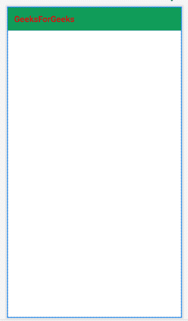
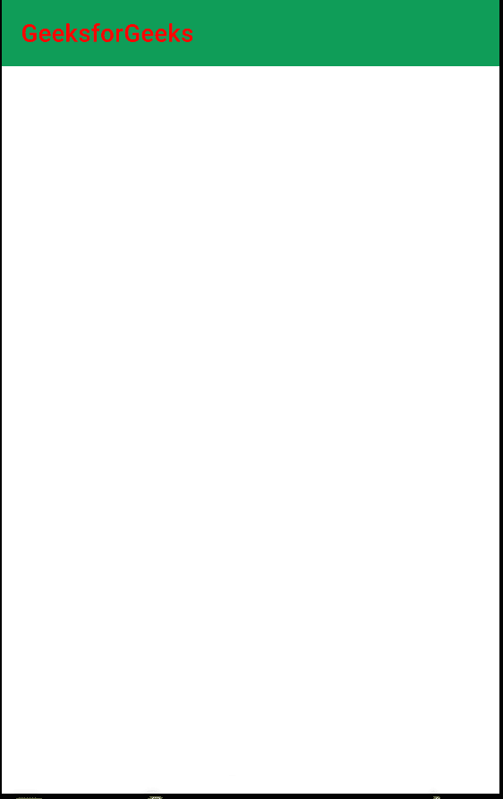

# 如何在安卓应用中更改工具栏标题的文本颜色？

> 原文:[https://www . geesforgeks . org/如何更改文本-工具栏颜色-安卓应用中的标题/](https://www.geeksforgeeks.org/how-to-change-text-color-of-toolbar-title-in-an-android-app/)

在安卓应用程序中，工具栏标题出现在应用程序的上部。下面是一个示例图像，显示了工具栏标题的位置。


在上图中，您可能会看到工具栏标题的颜色是白色，这是默认的。因此，在本文中，您将学习如何在安卓应用程序中更改工具栏标题的文本颜色。有两种方法可以更改工具栏标题的颜色。

### 方法 1:通过在活动文件中添加子文本视图

在方法 1 中，只需转到 activity_main.xml 文件，并在工具栏小部件中添加一个带有文本颜色属性的 [TextView](https://www.geeksforgeeks.org/textview-in-kotlin/) 。 **activity_main.xml** 文件的完整代码如下。

## 可扩展标记语言

```
<?xml version="1.0" encoding="utf-8"?>
<RelativeLayout
    xmlns:android="http://schemas.android.com/apk/res/android"
    xmlns:tools="http://schemas.android.com/tools"
    android:layout_width="match_parent"
    android:layout_height="match_parent"
    tools:context=".MainActivity">

    <androidx.appcompat.widget.Toolbar
        android:id="@+id/toolbar"
        android:layout_width="match_parent"
        android:layout_height="?attr/actionBarSize"
        android:background="#0F9D58">

        <TextView
            android:id="@+id/custom_title"
            android:layout_width="wrap_content"
            android:layout_height="wrap_content"
            android:text="GeeksForGeeks"
            android:textColor="#D61010"
            android:textSize="20sp"
            android:textStyle="bold" />

    </androidx.appcompat.widget.Toolbar>

</RelativeLayout>
```

**输出 UI:**



### 方法 2:通过编程设置文本颜色

**步骤 1:使用 activity_main.xml 文件**

转到 **activity_main.xml** 文件，参考以下代码。下面是 **activity_main.xml** 文件的代码。

## 可扩展标记语言

```
<?xml version="1.0" encoding="utf-8"?>
<RelativeLayout
    xmlns:android="http://schemas.android.com/apk/res/android"
    xmlns:tools="http://schemas.android.com/tools"
    android:layout_width="match_parent"
    android:layout_height="match_parent"
    tools:context=".MainActivity">

    <androidx.appcompat.widget.Toolbar
        android:id="@+id/toolbar"
        android:layout_width="match_parent"
        android:layout_height="?attr/actionBarSize"
        android:background="#0F9D58">
    </androidx.appcompat.widget.Toolbar>

</RelativeLayout>
```

**第 2 步:主题. xml 文件的更改**

转到**应用程序> res >值>主题>主题. xml 文件**并在 **<资源>标签**中添加以下行。

> <item name="”windowNoTitle”">真</item>

**步骤 3:使用主活动文件**

在活动的 **onCreate()** 方法中，调用活动的 **setSupportActionBar()** 方法，并传递活动的工具栏。此方法将工具栏设置为活动的应用程序栏。在活动中添加以下代码，以设置工具栏标题的文本颜色。以下是**MainActivity.java/mainactivity . kt**文件的完整代码。

## Java 语言(一种计算机语言，尤用于创建网站)

```
import android.graphics.Color;
import android.os.Bundle;
import androidx.appcompat.app.AppCompatActivity;
import androidx.appcompat.widget.Toolbar;

public class MainActivity extends AppCompatActivity {
    @Override
    protected void onCreate(Bundle savedInstanceState) {
        super.onCreate(savedInstanceState);
        setContentView(R.layout.activity_main);

        Toolbar toolbar = findViewById(R.id.toolbar);
        toolbar.setTitleTextColor(Color.RED);
        setSupportActionBar(toolbar);
    }
}
```

## 我的锅

```
import android.graphics.Color
import android.os.Bundle
import androidx.appcompat.app.AppCompatActivity
import androidx.appcompat.widget.Toolbar

class MainActivity : AppCompatActivity() {
    override fun onCreate(savedInstanceState: Bundle?) {
        super.onCreate(savedInstanceState)
        setContentView(R.layout.activity_main)

        val toolbar: Toolbar = findViewById(R.id.toolbar)
        toolbar.setTitleTextColor(Color.RED)
        setSupportActionBar(toolbar)
    }
}
```

**输出:**

