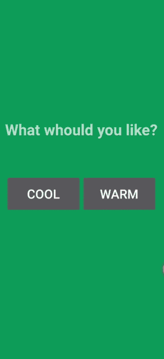

# 如何在安卓中点击按钮后改变背景颜色？

> 原文:[https://www . geesforgeks . org/如何在安卓中点击按钮后更改背景颜色/](https://www.geeksforgeeks.org/how-to-change-the-background-color-after-clicking-the-button-in-android/)

在本文中，我们将看到如何通过单击按钮来更改屏幕背景。为此，我们将使用 **onClick()** 方法。当我们点击按钮时，onClick 函数被调用。要为按钮设置点击处理程序事件，我们需要在 XML 文件中定义**安卓:onClick** 属性。我们也可以在 Java 文件中使用 **onClickListener()** 在点击按钮时以编程方式调用这个函数。下面给出了一个 GIF 示例，来了解一下我们在本文中要做什么。注意，我们将使用 **Java** 语言来实现这个项目。



### 逐步实施

**第一步:创建新项目**

要在安卓工作室创建新项目，请参考[如何在安卓工作室创建/启动新项目](https://www.geeksforgeeks.org/android-how-to-create-start-a-new-project-in-android-studio/)。注意选择 **Java** 作为编程语言。

**第二步:定义颜色**

预定义字符串和颜色总是比硬编码更好，因此我们将定义颜色。

*   导航至**应用- > res - >值- > colors.xml** 打开 **colors.xml** 文件
*   用名称在资源标签内创建一个颜色标签，并用其**十六进制代码设置颜色。**

在 **colors.xml** 文件中添加以下行。

## 可扩展标记语言

```
<color name="colorPrimary">#6200EE</color>
<color name="colorPrimaryDark">#3700B3</color>
<color name="colorAccent">#03DAC5</color>
<color name="green">#0F9D58</color>
<color name="cool">#188FCF</color>
<color name="warm">#F1D416</color>
```

**第三步:使用 activity_main.xml 文件**

转到 **activity_main.xml** 文件，参考以下代码。下面是 **activity_main.xml** 文件的代码。

## 可扩展标记语言

```
<?xml version="1.0" encoding="utf-8"?>
<RelativeLayout
    xmlns:android="http://schemas.android.com/apk/res/android"
    xmlns:tools="http://schemas.android.com/tools"
    android:id="@+id/rlVar1"
    android:layout_width="match_parent"
    android:layout_height="match_parent"
    android:background="@color/green"
    tools:context=".MainActivity">

    <TextView
        android:id="@+id/tvVar1"
        android:layout_width="wrap_content"
        android:layout_height="wrap_content"
        android:layout_centerHorizontal="true"
        android:layout_marginTop="240dp"
        android:text="What whould you like?"
        android:textSize="30dp"
        android:textStyle="bold" />

    <LinearLayout
        android:layout_width="wrap_content"
        android:layout_height="wrap_content"
        android:layout_below="@+id/tvVar1"
        android:layout_centerInParent="true"
        android:layout_marginTop="60dp"
        android:orientation="horizontal"
        android:padding="10dp">

        <Button
            android:id="@+id/btVar1"
            android:layout_width="150dp"
            android:layout_height="wrap_content"
            android:padding="20dp"
            android:text="Cool"
            android:textSize="25dp" />

        <Button
            android:id="@+id/btVar2"
            android:layout_width="150dp"
            android:layout_height="wrap_content"
            android:padding="20dp"
            android:text="Warm"
            android:textSize="25dp" />

    </LinearLayout>

</RelativeLayout>
```

**步骤 4:使用 MainActivity.java 文件**

*   用函数名**安卓:onClick="changeBackground"** 设置 **onClick()** 属性，
*   之后，在主持此布局的活动中，创建一个同名的函数，或者
*   您可以不使用 onClick()属性，而是直接设置 onClickListener()并对其函数进行编码
*   在功能内部使用**设置背景资源(R.color.button_color)** 功能，这将设置带有颜色 button_color 的背景。

以下是**MainActivity.java**文件的代码。代码中添加了注释，以更详细地理解代码。

## Java 语言(一种计算机语言，尤用于创建网站)

```
import android.os.Bundle;
import android.view.View;
import android.widget.Button;
import android.widget.RelativeLayout;

import androidx.appcompat.app.AppCompatActivity;

public class MainActivity extends AppCompatActivity {

    @Override
    protected void onCreate(Bundle savedInstanceState) {
        super.onCreate(savedInstanceState);
        setContentView(R.layout.activity_main);

        Button button1, button2;
        final RelativeLayout relativeLayout;

        // set button 1 with its id
        button1 = findViewById(R.id.btVar1);

        // set button 2 with its id
        button2 = findViewById(R.id.btVar2);

        // set relative layout with its id
        relativeLayout = findViewById(R.id.rlVar1);

        // onClick function for button 1
        button1.setOnClickListener(new View.OnClickListener() {
            @Override
            public void onClick(View view) {
                // set the color to relative layout
                relativeLayout.setBackgroundResource(R.color.cool);
            }
        });

        // onClick function for button 2
        button2.setOnClickListener(new View.OnClickListener() {
            @Override
            public void onClick(View view) {
                // set the color to relative layout
                relativeLayout.setBackgroundResource(R.color.warm);
            }
        });
    }
}
```

**输出:**

<video class="wp-video-shortcode" id="video-538007-1" width="640" height="360" preload="metadata" controls=""><source type="video/mp4" src="https://media.geeksforgeeks.org/wp-content/uploads/20201229183644/Edited_20201229_183429.mp4?_=1">[https://media.geeksforgeeks.org/wp-content/uploads/20201229183644/Edited_20201229_183429.mp4](https://media.geeksforgeeks.org/wp-content/uploads/20201229183644/Edited_20201229_183429.mp4)</video>