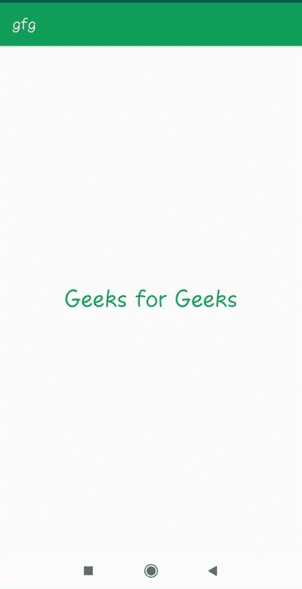

# 如何在安卓应用中改变动作栏的颜色？

> 原文:[https://www . geeksforgeeks . org/如何更改安卓应用程序中的动作栏颜色/](https://www.geeksforgeeks.org/how-to-change-the-color-of-action-bar-in-an-android-app/)

在本文中，您将学习如何在[安卓应用程序](https://www.geeksforgeeks.org/android-app-development-fundamentals-for-beginners/)中更改动作栏的颜色。

有两种方法可以改变颜色。

1.  **通过更改 style . XML 文件:**

    ## style . XML

    ```
    <resources>

        <!-- Base application theme. -->
        <style name="AppTheme" parent="Theme.AppCompat.Light.DarkActionBar">
            <!-- Customize your theme here. -->
            <!-- This code is for changing the color of the bar. -->
            <!-- Type your colour code which you want to set in colorPrimary item -->
            <item name="colorPrimary">#0F9D58</item>
            <item name="colorPrimaryDark">@color/colorPrimaryDark</item>
            <item name="colorAccent">@color/colorAccent</item>
        </style>
        <style name="AppTheme.NoActionBar">
            <item name="windowActionBar">false</item>
            <item name="windowNoTitle">true</item>
        </style>
        <!-- Define other styles to fix theme -->
        <style name="AppTheme.AppBarOverlay" parent="ThemeOverlay.AppCompat.Dark.ActionBar" />
        <style name="AppTheme.PopupOverlay" parent="ThemeOverlay.AppCompat.Light" />
    </resources>
    ```

    ## activity _ main . XML

    ```
    <?xml version="1.0" encoding="utf-8"?>

    <!--Relative Layout-->
    <RelativeLayout
        xmlns:android="http://schemas.android.com/apk/res/android"
        xmlns:tools="http://schemas.android.com/tools"
        android:layout_width="match_parent"
        android:layout_height="match_parent"
        android:id="@+id/relativelayout">

        <!--Text View-->
       <TextView
           android:layout_width="wrap_content"
           android:layout_height="wrap_content"
           android:id="@+id/textview"
           android:textColor="#0F9D58"
           android:textSize="32dp"
           android:layout_centerInParent="true"/>
    </RelativeLayout>
    ```

    ## MainActivity.java

    *   只需转到**RES/values/style . XML 文件**
    *   编辑 xml 文件以更改动作栏的颜色。
    *   styles.xml 的代码如下

2.  **通过 Java 文件通过定义 ActionBar 对象:**

    ## 【MainActivity.java】

    ```
    package com.geeksforgeeks.changecolor;

    import android.support.v7.app.ActionBar;
    import android.graphics.Color;
    import android.graphics.drawable.ColorDrawable;
    import android.support.v7.app.AppCompatActivity;

    public class MainActivity extends AppCompatActivity {

        @Override
        protected void onCreate(Bundle savedInstanceState)
        {
            super.onCreate(savedInstanceState);
            setContentView(R.layout.activity_main);

            // Define ActionBar object
            ActionBar actionBar;
            actionBar = getSupportActionBar();

            // Define ColorDrawable object and parse color
            // using parseColor method
            // with color hash code as its parameter
            ColorDrawable colorDrawable
                = new ColorDrawable(Color.parseColor("#0F9D58"));

            // Set BackgroundDrawable
            actionBar.setBackgroundDrawable(colorDrawable);
        }
    }
    ```

    ## activity _ main . XML

    ```
    <?xml version="1.0" encoding="utf-8"?>

    <!--Relative Layout-->
    <RelativeLayout 
        xmlns:android="http://schemas.android.com/apk/res/android"
        xmlns:tools="http://schemas.android.com/tools"
        android:layout_width="match_parent"
        android:layout_height="match_parent"
        android:id="@+id/relativelayout">

        <!--Text View-->
       <TextView
           android:layout_width="wrap_content"
           android:layout_height="wrap_content"
           android:textColor="#0F9D58"
           android:textSize="30dp"
           android:text="Geeks for Geeks"
           android:layout_centerInParent="true"/>
    </RelativeLayout>
    ```

    *   为操作栏和可着色类定义对象
    *   使用 setBackgroundDrawable 函数设置颜色，以 colorDrawable 对象作为其参数。
    *   这是 MainActivity.java 的完整代码

**输出:**

*   动作栏默认颜色:
    [](https://media.geeksforgeeks.org/wp-content/uploads/20191217223810/hello.jpeg)
*   在主活动中，操作栏的颜色更改为上述代码中定义的哈希代码。
    [](https://media.geeksforgeeks.org/wp-content/uploads/20191214121507/WhatsApp-Image-2019-12-14-at-12.13.05-PM.jpeg)