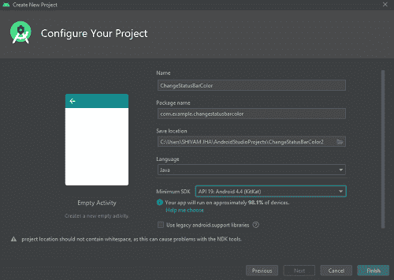
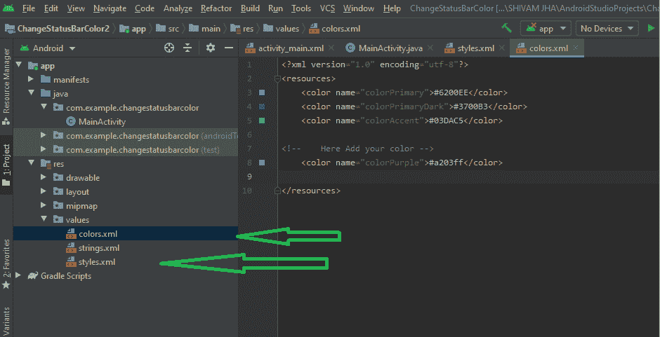
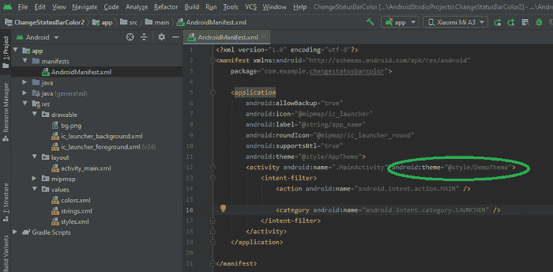

# 如何在安卓应用中改变状态栏的颜色？

> 原文:[https://www . geesforgeks . org/如何更改安卓应用中状态栏的颜色/](https://www.geeksforgeeks.org/how-to-change-the-color-of-status-bar-in-an-android-app/)

安卓系统中的状态栏是屏幕上引人注目的部分，所有的通知指示、电池寿命、时间、连接强度和许多东西都显示在这里。安卓用户在使用安卓应用程序时可能会多次查看状态栏。状态栏的颜色应该遵循布局的颜色组合，这是设计中非常重要的一部分。你可以查看手机上的许多安卓应用程序，看看它们是如何根据它的原色改变它的。可以有多种方法来改变状态栏的颜色，但是我们将告诉你最好的手工选择的两种方法，你可以在 Java 或者 Kotlin 中使用。

### 方法 1:创建新主题

您可以在用 Kotlin 或 Java 构建的应用程序中遵循这种方法。两者都可以。

**第一步:**打开 Android Studio，选择一个空的活动，开始一个新的项目。给它一个你选择的名字，然后选择你的语言和应用编程接口级别。最后点击完成。



**步骤 2:** 通过导航**RES/values/style . XML**找到一个名为 **styles.xml** 的 XML 文件。

**步骤 3:** 通过导航 **res/values/colors.xml** 找到另一个 XML 文件，并在此添加您想要为状态栏更改的颜色。



**第 4 步:**现在在 style.xml 文件中，在< /resources >标签前添加下面的代码，并根据您的选择更改其颜色。颜色主暗总是对你的状态栏颜色负责。

## 可扩展标记语言

```
<!-- Defined a new style with three items of color. -->
<style name="DemoTheme" parent="Theme.AppCompat.Light.NoActionBar">
<!-- Customize your theme here. -->
<item name="colorPrimary">@color/colorPrimary</item>

<!-- Defining that new color in ColorPrimaryDark -->
<item name="colorPrimaryDark">@color/colorOfStatusBar</item>
<item name="colorAccent">@color/colorAccent</item>
</style>
```

你可以用**安卓:statusBarColor** 做同样的操作，但是它只会在 API Level 21 以上的环境下工作。在应用编程接口级别 19 中，状态栏的颜色也不支持。默认情况下，在大多数应用编程接口级别中，颜色原色暗将是状态栏的默认颜色，因此最好更改颜色原色暗。

> **提示:**可以创建多个主题，可以在任何活动中使用。在任何主题中，都有一组需要定义的颜色，您也可以在同一个目录的 colors.xml 文件中创建新的颜色，并在 styles.xml 文件中使用它。

**第 6 步:**现在转到 manifest/AndroidManifest.xml，在这里搜索要应用该主题或更改状态栏颜色的活动。并添加一个属性 Android:theme = " @ style/Democheme "。



完成了！通过在模拟器或物理设备上运行应用程序来检查应用程序。

### 方法 2:使用设置状态颜色方法

这种方法只能在上述 API 等级 21 中使用。官方状态栏颜色不支持低于 API 等级 21。虽然，这里我们添加了一个 if 条件，因为如果你没有选择高于或等于 API 21，那么它将检查安卓 API 版本，然后它将执行代码。它不会改变状态栏的颜色是低于 API 级别 21，但其余的代码会很好地工作。

**第一步:**打开安卓工作室，创建一个活动为空的新项目后。

**第二步:**导航到 **res/values/colors.xml** ，并为状态栏添加一种您想要更改的颜色。

**第 3 步:**在您的主活动中，将此代码添加到 onCreate 方法中。别忘了用**颜色名称**替换你想要的颜色。

## Java 语言(一种计算机语言，尤用于创建网站)

```
if (Build.VERSION.SDK_INT >= 21) {
            Window window = this.getWindow();
            window.addFlags(WindowManager.LayoutParams.FLAG_DRAWS_SYSTEM_BAR_BACKGROUNDS);
            window.clearFlags(WindowManager.LayoutParams.FLAG_TRANSLUCENT_STATUS);
            window.setStatusBarColor(this.getResources().getColor(R.color.colorPrimaryDark));
        }
```

## 我的锅

```
if (Build.VERSION.SDK_INT >= 21) {
            val window = this.window
            window.addFlags(WindowManager.LayoutParams.FLAG_DRAWS_SYSTEM_BAR_BACKGROUNDS)
            window.clearFlags(WindowManager.LayoutParams.FLAG_TRANSLUCENT_STATUS)
            window.statusBarColor = this.resources.getColor(R.color.colorPrimaryDark)
        }
```

**第 4 步:**尝试在 android 模拟器或物理设备上运行应用程序。看变化。

### **两种方法的输出相同:**

<video class="wp-video-shortcode" id="video-523162-1" width="640" height="360" preload="metadata" controls=""><source type="video/mp4" src="https://media.geeksforgeeks.org/wp-content/uploads/20201128213615/output.mp4?_=1">[https://media.geeksforgeeks.org/wp-content/uploads/20201128213615/output.mp4](https://media.geeksforgeeks.org/wp-content/uploads/20201128213615/output.mp4)</video>