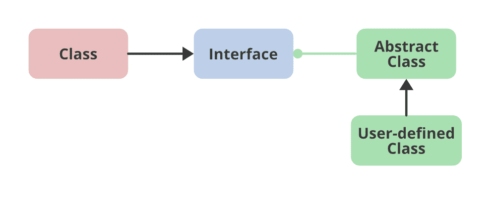

# 如何在 Java TreeSet 中更改比较器返回降序？

> 原文:[https://www . geeksforgeeks . org/如何更改 Java treeset 中的比较器返回降序/](https://www.geeksforgeeks.org/how-to-change-the-comparator-to-return-a-descending-order-in-java-treeset/)

比较器接口用于对用户定义类的对象进行排序。比较器对象能够比较两个不同类的两个对象。 [**TreeSet**](https://www.geeksforgeeks.org/treeset-in-java-with-examples/) 是 Java 中 [**SortedSet**](https://www.geeksforgeeks.org/sortedset-java-examples/) 接口最重要的实现之一，它使用 [**Tree**](https://www.geeksforgeeks.org/category/data-structures/tree/) 进行存储。无论是否提供了明确的 [**比较器**](https://www.geeksforgeeks.org/comparator-interface-java/) ，元素的顺序都由一个集合使用它们的自然顺序来维护。要正确实现 [**设置界面**](https://www.geeksforgeeks.org/set-in-java/) ，这必须与等号一致。它也可以由设置创建时提供的比较器排序，具体取决于使用的构造函数。

**语法:**比较器如下:

```
public int compare(Object obj1, Object obj2):
```



**方法:**通过改变比较器得到树集中的降序。

1.  使用用户定义的类
2.  没有用户定义的类

**方法 1:** 用户自定义类

为了更改比较器，创建了一个用户定义的类，该类实现了比较器接口，更具体地说，实现比较器之前，遵循伪代码来清楚地理解比较器。*在创建的初始状态下，作为参数在树集中传递降序比较器()*，以获得相应的降序集合。

**语法:**传递下降运算符()

```
Pseudo Code: TreeSet<String> set = new TreeSet<>(new descendingComparator());
```

```
Pseudo Code: Approach
class descendingComparator implements Comparator<String> {

public int compare(String i1, String i2) {

    // compare using compareTo() method
    return i2.compareTo(i1);
  }
}
```

**例**

## Java 语言(一种计算机语言，尤用于创建网站)

```
// Java Program to Change the Comparator to Return a
// Descending Order in Java TreeSet

// Importing all classes of
// java.util package
import java.util.*;

// User0defined class (Helper class)
// New class that implements comparator interface
class descendingComparator implements Comparator<Integer> {

    public int compare(Integer i1, Integer i2)
    {
        // compare using compareTo() method
        return i2.compareTo(i1);
    }
}

// Main class
public class GFG {

    // Main driver method
    public static void main(String[] args)
    {

        // Create a TreeSet and pass descendingComparator()
        // as made in another class as parameter
        // to it to get Descending Order
        TreeSet<Integer> set
            = new TreeSet<>(new descendingComparator());

        // Adding elements to Treeset
        // Custom inputs
        set.add(10);
        set.add(20);
        set.add(30);

        // Print Descending Ordered set in descending order
        // as above descendComparator() usage
        System.out.println("Descending Ordered set : "
                           + set);
    }
}
```

**方法 2:** 无自定义类

[**【比较器】**](https://www.geeksforgeeks.org/comparator-interface-java/) 在创建 TreeSet 时返回 Java TreeSet 中的降序，而不是创建一个新类。

```
Pseudo Code: Approach

TreeSet<Integer> set = new TreeSet<Integer>(new Comparator<Integer>()
{
    public int compare(Integer i1,Integer i2)
     {
          // comparing using compareTo() method
          return i2.compareTo(i1);
     }
 });
```

**例**

## Java 语言(一种计算机语言，尤用于创建网站)

```
// Java Program to Change the Comparator
// to Return Descending Order in Java TreeSet

// Importing all classes of
// java.utoil package
import java.util.*;

// Main class
public class GFG {

    // Main driver method
    public static void main(String[] args)
    {
        // implements comparator interface
        // to get Descending Order

        // Method 2: At the time of creation of TreeSet

        // Creating(defining) a TreeSet
        TreeSet<Integer> set = new TreeSet<Integer>(
            new Comparator<Integer>() {

              // Changing the comparator
                public int compare(Integer i1, Integer i2)
                {
                    return i2.compareTo(i1);
                }
            });

        // Add elements to above created TreeSet
        // Custom inputs
        set.add(10);
        set.add(20);
        set.add(30);

        // Print Descending Ordered TreeSet
        System.out.println("Descending Ordered Treeset : "
                           + set);
    }
}
```

**Output**

```
Descending Ordered set : [30, 20, 10]
```