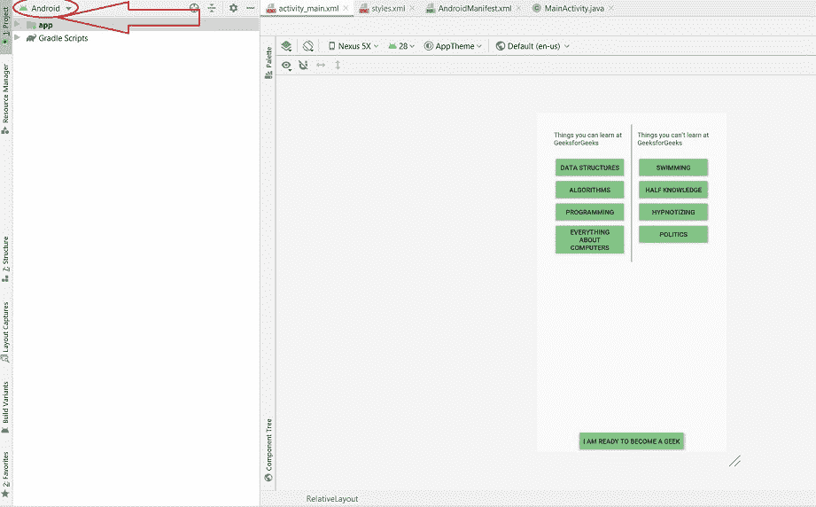
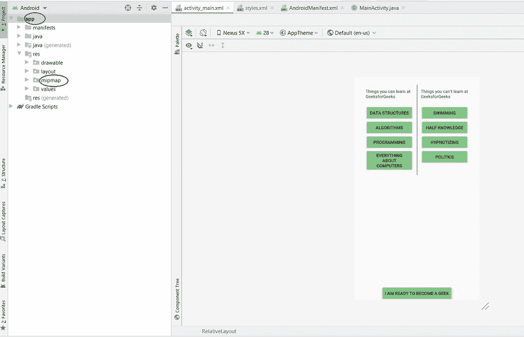
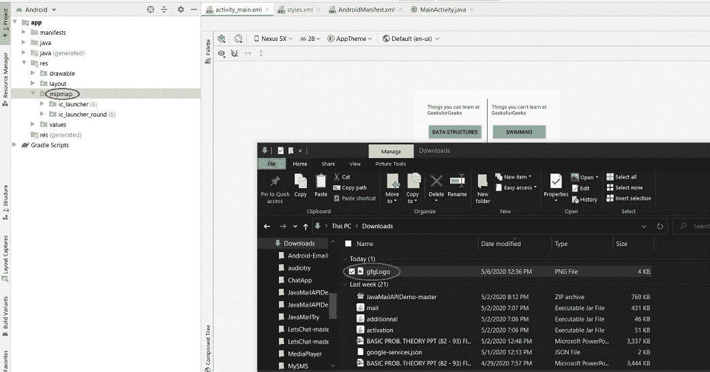
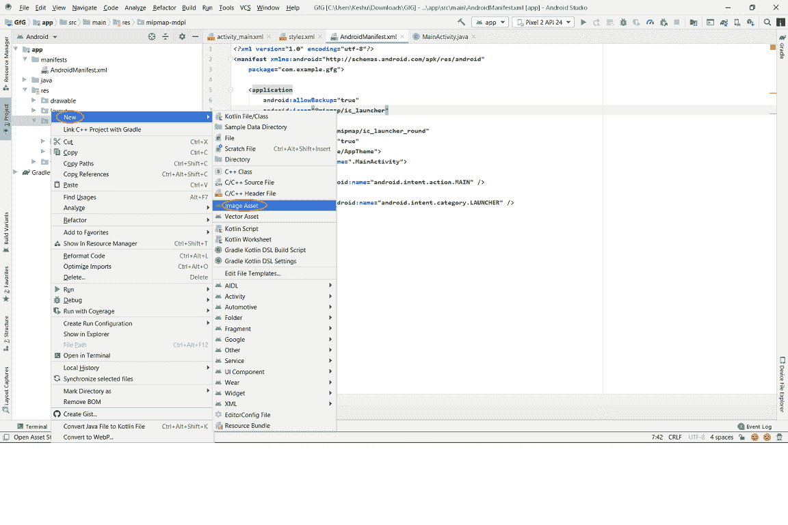
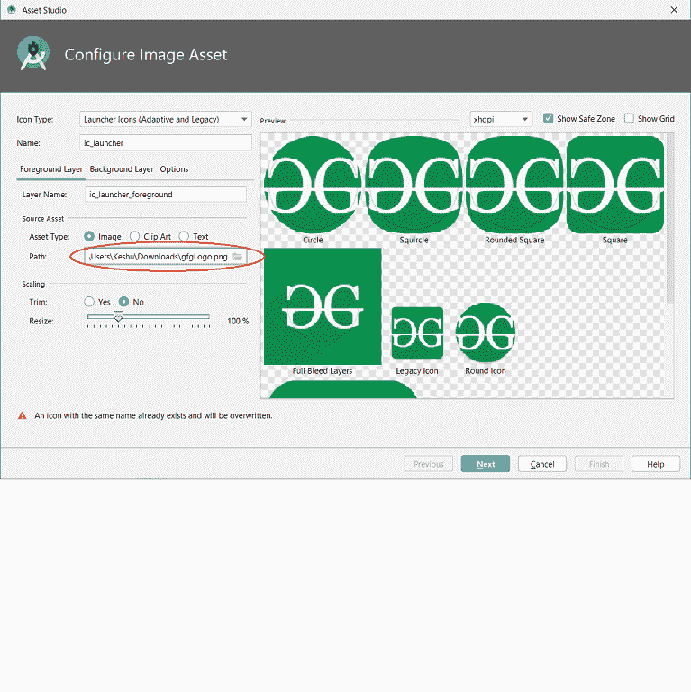
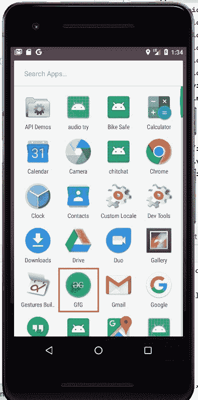

# 如何更改安卓 App 的默认图标

> 原文:[https://www . geesforgeks . org/如何更改默认安卓图标 app/](https://www.geeksforgeeks.org/how-to-change-the-default-icon-of-android-app/)

为了让应用程序在谷歌 Play 商店、亚马逊应用商店等商店发布，或者如果您只想个性化应用程序，可以更改默认图标。

我们可以通过使用安卓工作室本身并遵循以下步骤来更改安卓应用程序的图标:
 **步骤 1:** 
打开您的安卓工作室项目，并确保您的**项目**属于**安卓**类型。如果不是**安卓**，则从下拉列表中选择**安卓**。这不是必需的，但会使搜索所需的文件和目录变得更容易。

 
 **第二步:** 
现在点击强> app 目录然后点击 **mipmap** 文件夹。
顺序为:**app**>**MIP map**。

 **第三步:** 
确保图标的图像已经出现在电脑上。找到图像的**路径**。在这里，名为 **gfgLogo** 的文件存在于我们的**下载**文件夹中。如果我们找不到应用的图标，也无法设计图标，那么我们可以在[**【flat icon】**](https://www.flaticon.com/)或 [**Material.io**](https://material.io/resources/icons/?style=baseline) 中寻找。*但是我们必须注意，前者有其他设计师设计的图标，我们在使用时需要给各自的设计师赋予属性。*

 **第四步:** 
现在，一旦我们的图标位于所需的位置并且我们知道路径，右键单击 **mipmap** 目录，然后单击**新建**并从下拉菜单中选择**图像资产**。动作的顺序是:
**mipmap** *(右击)*>**New**>**Image Asset**

 **第五步:** 
现在点击**影像资产**会打开如下窗口:

在**资源**下的**路径**中给出图像图标的位置。在我们的示例中，**路径**为:

> *C:\ Users \ UserName \ Downloads \ gfgLogo*

 **第 6 步:** 
如果需要，可以使用**调整大小**选项调整图像大小，或者通过前往**背景层**选项来更改我们徽标的颜色。一旦完成所有需要的更改，我们将点击**下一步**按钮，然后点击**完成**，然后应用程序的图标将被更改！

