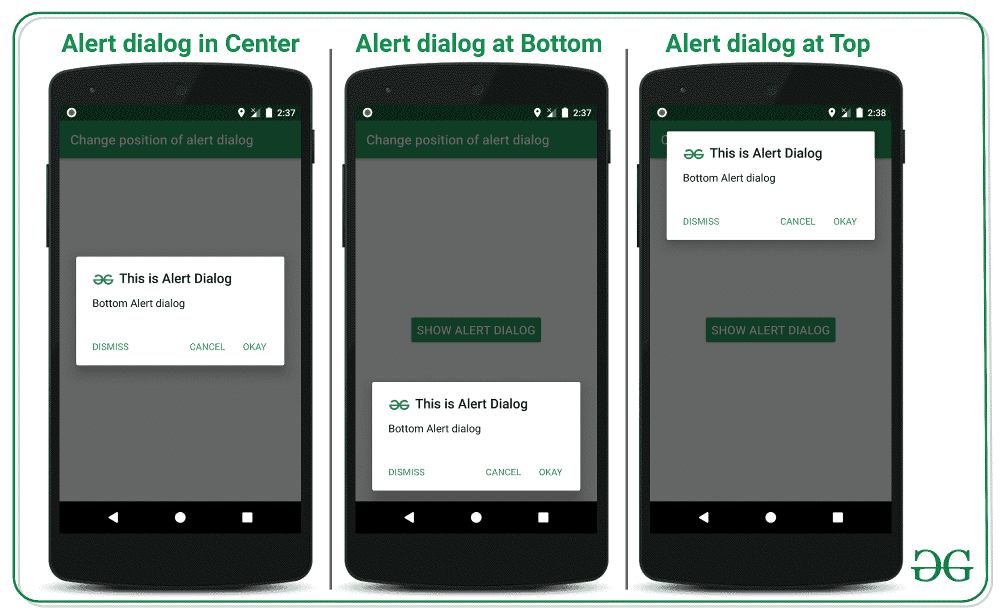
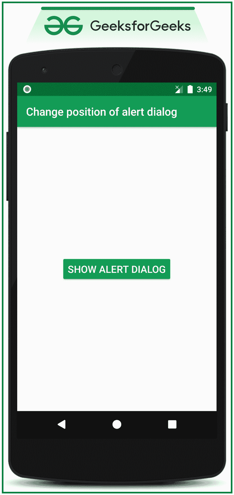

# 如何改变 AlertDialog 在安卓中的位置？

> 原文:[https://www . geeksforgeeks . org/如何改变安卓系统中 alertdialog 的位置/](https://www.geeksforgeeks.org/how-to-change-the-position-of-alertdialog-in-android/)

[Android 中的 AlertDialog](https://www.geeksforgeeks.org/android-alert-dialog-box-and-how-to-create-it/) 是 UI 小部件之一，它会立即弹出以确认用户交互或确认用户所做的动作。在大多数应用程序中，警报对话框的位置在中央。在这篇文章中，已经讨论了如何在安卓系统中改变警告对话框的位置。请看下图，以区分具有中心位置的正常报警对话框和具有变化位置的报警对话框。注意，我们将使用 **Java** 语言来实现这个项目。



## **不同位置实现报警对话框的步骤**

**第一步:创建一个空的活动项目**

*   创建一个空的活动安卓工作室项目。并选择 **Java** 作为编程语言。
*   参考[安卓|如何在安卓工作室创建/启动新项目？](https://www.geeksforgeeks.org/android-how-to-create-start-a-new-project-in-android-studio/)了解如何用空活动安卓工作室项目创建项目。

**步骤 2:使用 activity_main.xml 文件**

*   应用程序的主布局包含一个按钮，用于在指定位置构建显示警报对话框。
*   在 **activity_main.xml** 文件中调用以下代码实现 UI。

## 可扩展标记语言

```java
<?xml version="1.0" encoding="utf-8"?>
<RelativeLayout 
    xmlns:android="http://schemas.android.com/apk/res/android"
    xmlns:tools="http://schemas.android.com/tools"
    android:layout_width="match_parent"
    android:layout_height="match_parent"
    tools:context=".MainActivity"
    tools:ignore="HardcodedText">

    <Button
        android:id="@+id/showAlertDialogButton"
        android:layout_width="wrap_content"
        android:layout_height="wrap_content"
        android:layout_centerInParent="true"
        android:backgroundTint="@color/colorPrimary"
        android:text="SHOW ALERT DIALOG"
        android:textColor="@android:color/white"
        android:textSize="18sp" />

</RelativeLayout>
```

**输出 UI:**



**步骤 3:使用 MainActivity.java 文件**

要更改安卓窗口顶部的警报对话框位置，请调用以下代码来实现。添加注释是为了更好地理解。

## Java 语言(一种计算机语言，尤用于创建网站)

```java
import androidx.appcompat.app.AlertDialog;
import androidx.appcompat.app.AppCompatActivity;

import android.content.DialogInterface;
import android.os.Bundle;
import android.view.Gravity;
import android.view.View;
import android.widget.Button;
import android.widget.Toast;

public class MainActivity extends AppCompatActivity {

    @Override
    protected void onCreate(Bundle savedInstanceState) {
        super.onCreate(savedInstanceState);
        setContentView(R.layout.activity_main);

        // register the button with it's appropriate ID
        Button bShowAlertDialog = findViewById(R.id.showAlertDialogButton);

        // handle the SHOW ALERT DIALOG BUTTON
        bShowAlertDialog.setOnClickListener(new View.OnClickListener() {
            @Override
            public void onClick(View v) {

                // instance of alert dialog to build alert dialog
                AlertDialog.Builder builder = new AlertDialog.Builder(MainActivity.this);
                builder.setIcon(R.drawable.logo);
                builder.setTitle("This is Alert Dialog");
                builder.setMessage("Bottom Alert dialog");

                // set the neutral button to do some actions
                builder.setNeutralButton("DISMISS", new DialogInterface.OnClickListener() {
                    @Override
                    public void onClick(DialogInterface dialog, int which) {
                        Toast.makeText(MainActivity.this, "Alert Dialog Dismissed", Toast.LENGTH_SHORT).show();
                    }
                });

                // set the positive button to do some actions
                builder.setPositiveButton("OKAY", new DialogInterface.OnClickListener() {
                    @Override
                    public void onClick(DialogInterface dialog, int which) {
                        Toast.makeText(MainActivity.this, "OKAY", Toast.LENGTH_SHORT).show();
                    }
                });

                // set the negative button to do some actions
                builder.setNegativeButton("CANCEL", new DialogInterface.OnClickListener() {
                    @Override
                    public void onClick(DialogInterface dialog, int which) {
                        Toast.makeText(MainActivity.this, "CANCEL", Toast.LENGTH_SHORT).show();
                    }
                });

                // show the alert dialog
                AlertDialog alertDialog = builder.create();
                alertDialog.show();

                // get the top most window of the android 
                  // screen using getWindow() method
                // and set the the gravity of the window to 
                  // top that is alert dialog will be now at
                // the topmost position
                alertDialog.getWindow().setGravity(Gravity.TOP);
            }
        });
    }
}
```

### **输出:在仿真器上运行**

<video class="wp-video-shortcode" id="video-529766-1" width="640" height="360" preload="metadata" controls=""><source type="video/mp4" src="https://media.geeksforgeeks.org/wp-content/uploads/20201216144348/GFG_nexus_5.mp4?_=1">[https://media.geeksforgeeks.org/wp-content/uploads/20201216144348/GFG_nexus_5.mp4](https://media.geeksforgeeks.org/wp-content/uploads/20201216144348/GFG_nexus_5.mp4)</video>

要更改安卓窗口底部的警报对话框位置，请调用以下代码来实现。添加注释是为了更好地理解。

## Java 语言(一种计算机语言，尤用于创建网站)

```java
import androidx.appcompat.app.AlertDialog;
import androidx.appcompat.app.AppCompatActivity;

import android.content.DialogInterface;
import android.os.Bundle;
import android.view.Gravity;
import android.view.View;
import android.widget.Button;
import android.widget.Toast;

public class MainActivity extends AppCompatActivity {

    @Override
    protected void onCreate(Bundle savedInstanceState) {
        super.onCreate(savedInstanceState);
        setContentView(R.layout.activity_main);

        // register the button with it's appropriate ID
        Button bShowAlertDialog = findViewById(R.id.showAlertDialogButton);

        // handle the SHOW ALERT DIALOG BUTTON
        bShowAlertDialog.setOnClickListener(new View.OnClickListener() {
            @Override
            public void onClick(View v) {

                // instance of alert dialog to build alert dialog
                AlertDialog.Builder builder = new AlertDialog.Builder(MainActivity.this);
                builder.setIcon(R.drawable.logo);
                builder.setTitle("This is Alert Dialog");
                builder.setMessage("Bottom Alert dialog");

                // set the neutral button to do some actions
                builder.setNeutralButton("DISMISS", new DialogInterface.OnClickListener() {
                    @Override
                    public void onClick(DialogInterface dialog, int which) {
                        Toast.makeText(MainActivity.this, "Alert Dialog Dismissed", Toast.LENGTH_SHORT).show();
                    }
                });

                // set the positive button to do some actions
                builder.setPositiveButton("OKAY", new DialogInterface.OnClickListener() {
                    @Override
                    public void onClick(DialogInterface dialog, int which) {
                        Toast.makeText(MainActivity.this, "OKAY", Toast.LENGTH_SHORT).show();
                    }
                });

                // set the negative button to do some actions
                builder.setNegativeButton("CANCEL", new DialogInterface.OnClickListener() {
                    @Override
                    public void onClick(DialogInterface dialog, int which) {
                        Toast.makeText(MainActivity.this, "CANCEL", Toast.LENGTH_SHORT).show();
                    }
                });

                // show the alert dialog
                AlertDialog alertDialog = builder.create();
                alertDialog.show();

                // get the top most window of the android 
                  // scree using getWindow() method
                // and set the the gravity of the window to 
                  // top that is alert dialog will be now at
                // the bottom position
                alertDialog.getWindow().setGravity(Gravity.BOTTOM);
            }
        });
    }
}
```

### **输出:在仿真器上运行**

<video class="wp-video-shortcode" id="video-529766-2" width="640" height="360" preload="metadata" controls=""><source type="video/mp4" src="https://media.geeksforgeeks.org/wp-content/uploads/20201216144743/GFG_nexus_5.mp4?_=2">[https://media.geeksforgeeks.org/wp-content/uploads/20201216144743/GFG_nexus_5.mp4](https://media.geeksforgeeks.org/wp-content/uploads/20201216144743/GFG_nexus_5.mp4)</video>