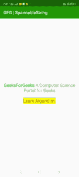

# 如何使用 SpannableString 类在安卓中更改子字符串的文本颜色？

> 原文:[https://www . geeksforgeeks . org/如何更改 Android-use-spannablestring-class 中子字符串的文本颜色/](https://www.geeksforgeeks.org/how-to-change-the-text-color-of-a-substring-in-android-using-spannablestring-class/)

在本文中，我们将学习如何更改字符串的子字符串的文本颜色。改变整个字符串的颜色很容易，但是要改变一个子字符串的颜色，我们必须使用一个特殊的类 [**SpannableString**](https://developer.android.com/reference/android/text/SpannableString) 。但是当涉及到改变文本的背景颜色时，SpannableString 类并没有真正的帮助。为此，我们必须使用[**SpannableStringBuilder**](https://developer.android.com/reference/android/text/SpannableStringBuilder)类。

**进场:**

1.  在 activity_main.xml 文件中添加以下代码。这将在 activity_main 布局中添加两个**文本视图**。

    ## activity _ main . XML

    ```java

    <?xml version="1.0" encoding="utf-8"?>
    <LinearLayout
        xmlns:android="http://schemas.android.com/apk/res/android"
        xmlns:tools="http://schemas.android.com/tools"
        android:layout_width="match_parent"
        android:layout_height="match_parent"
        android:orientation="vertical"
        android:gravity="center"
        tools:context=".MainActivity">

        <TextView
            android:id="@+id/text_view"
            android:layout_width="wrap_content"
            android:layout_height="wrap_content"
            android:layout_margin="10dp"
            android:textAlignment="center"
            android:text="GeeksForGeeks A 
                    Computer Science Portal for Geeks"
            android:textSize="20sp"
            />
        <TextView
            android:id="@+id/text_view2"
            android:layout_width="wrap_content"
            android:layout_height="wrap_content"
            android:layout_margin="10dp"
            android:textAlignment="center"
            android:text="Learn Algorithm."
            android:textSize="20sp"
            />
    </LinearLayout>
    ```

2.  现在在**MainActivity.java**文件中添加以下代码。在这段代码中，我们将使用 **SpannableString** 类更改第一个文本视图的子字符串颜色，并使用 **SpannableStringBuilder** 在第二个文本视图中添加背景颜色。用您想要显示的文本创建类的对象，并使用 **setSpan** 函数更改子字符串的颜色。

    ## MainActivity.java

    ```java
    package org.geeksforgeeks.gfgspannablestring;

    import android.graphics.Color;
    import android.os.Bundle;
    import android.text.SpannableString;
    import android.text.SpannableStringBuilder;
    import android.text.Spanned;
    import android.text.style.BackgroundColorSpan;
    import android.text.style.ForegroundColorSpan;
    import android.widget.TextView;
    import androidx.appcompat.app.AppCompatActivity;

    public class MainActivity extends AppCompatActivity {

        @Override
        protected void onCreate(Bundle savedInstanceState)
        {
            super.onCreate(savedInstanceState);
            setContentView(R.layout.activity_main);

            TextView textView = findViewById(R.id.text_view);
            TextView textView2 = findViewById(R.id.text_view2);

            String text = "GeeksForGeeks A Computer 
                           Science Portal for Geeks";
            String text2 = "Learn Algorithm.";

            SpannableString spannableString = new SpannableString(text);

            // we can only use backgroundcolor
            // span with a spannableStringBuilder.
            SpannableStringBuilder spannableStringBuilder = new SpannableStringBuilder(text2);

            // It is used to set foreground color.
            ForegroundColorSpan green = new ForegroundColorSpan(Color.GREEN);
            ForegroundColorSpan cyan = new ForegroundColorSpan(Color.CYAN);

            // It is used to set background color.
            BackgroundColorSpan yellow = new BackgroundColorSpan(Color.YELLOW);

            // It is used to set the span to the string
            spannableString.setSpan(green,
                                    0, 13, Spanned.SPAN_EXCLUSIVE_EXCLUSIVE);
            spannableString.setSpan(cyan,
                                    40, 43, Spanned.SPAN_EXCLUSIVE_EXCLUSIVE);

            spannableStringBuilder.setSpan(yellow,
                                           0, 16, Spanned.SPAN_EXCLUSIVE_EXCLUSIVE);

            textView.setText(spannableString);
            textView2.setText(spannableStringBuilder);
        }
    }
    ```

**输出:**
