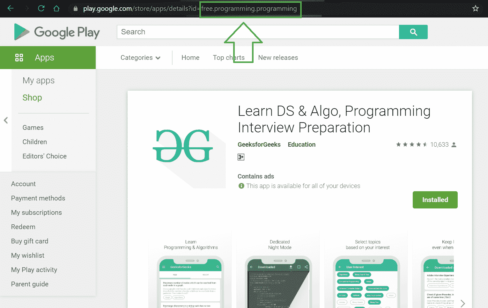
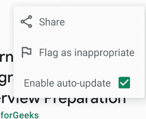
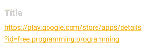

# 如何检查你的安卓手机是否安装了应用程序并打开应用程序？

> 原文:[https://www . geesforgeks . org/如何检查应用程序是否安装在您的安卓手机中并打开应用程序/](https://www.geeksforgeeks.org/how-to-check-if-application-is-installed-in-your-android-phone-and-open-the-app/)

在本文中，我们将检查我们的手机上是否安装了特定的应用程序。如果是，那么我们将有一个打开应用程序的选项。否则，它将显示一条祝酒信息，表示不可用。所以在这里，我们将学习如何实现这个特性。注意，我们将使用 **Java** 语言来实现这个项目。

### **分步实施**

**第一步:创建新项目**

要在安卓工作室创建新项目，请参考[如何在安卓工作室创建/启动新项目。](https://www.geeksforgeeks.org/android-how-to-create-start-a-new-project-in-android-studio/)注意选择 **Java** 作为编程语言。

**步骤 2:** **使用 activity_main.xml 文件**

导航到**应用程序> res >布局> activity_main.xml** 并将下面的代码添加到该文件中。下面是 **activity_main.xml** 文件的代码。

## 可扩展标记语言

```java
<?xml version="1.0" encoding="utf-8"?>
<androidx.constraintlayout.widget.ConstraintLayout
    xmlns:android="http://schemas.android.com/apk/res/android"
    xmlns:app="http://schemas.android.com/apk/res-auto"
    xmlns:tools="http://schemas.android.com/tools"
    android:layout_width="match_parent"
    android:layout_height="match_parent"
    android:layout_gravity="center"
    android:gravity="center"
    android:orientation="vertical"
    android:padding="16sp"
    tools:context=".MainActivity">

    <EditText
        android:id="@+id/name"
        android:layout_width="match_parent"
        android:layout_height="wrap_content"
        android:layout_marginTop="200dp"
        android:hint="Type a Package Name"
        app:layout_constraintTop_toTopOf="parent" />

    <Button
        android:id="@+id/check"
        android:layout_width="match_parent"
        android:layout_height="wrap_content"
        android:layout_marginTop="300dp"
        android:text="Check"
        app:layout_constraintTop_toTopOf="parent" />

    <Button
        android:id="@+id/open"
        android:layout_width="match_parent"
        android:layout_height="wrap_content"
        android:layout_marginTop="350dp"
        android:text="Open"
        android:visibility="invisible"
        app:layout_constraintTop_toTopOf="parent" />

</androidx.constraintlayout.widget.ConstraintLayout>
```

**步骤 3:使用 MainActivity.java 文件**

转到**MainActivity.java**文件，参考以下代码。下面是文件**的代码。代码中添加了注释，以更详细地理解代码。**

## Java 语言(一种计算机语言，尤用于创建网站)

```java
package com.example.checkifappisinstalled;

import android.content.Intent;
import android.content.pm.PackageManager;
import android.os.Bundle;
import android.view.View;
import android.widget.Button;
import android.widget.EditText;
import android.widget.Toast;

import androidx.appcompat.app.AppCompatActivity;

public class MainActivity extends AppCompatActivity {

    EditText editText;
    Button check, open;
    boolean flag = false;

    @Override
    protected void onCreate(Bundle savedInstanceState) {
        super.onCreate(savedInstanceState);
        setContentView(R.layout.activity_main);
        check = findViewById(R.id.check);
        open = findViewById(R.id.open);
        editText = findViewById(R.id.name);
        check.setOnClickListener(new View.OnClickListener() {
            @Override
            public void onClick(View view) {
                // check if app is available or not
                if (abailable(editText.getText().toString())) {
                    Toast.makeText(MainActivity.this, "Available", Toast.LENGTH_LONG).show();
                    // if available se flag as true
                    flag = true;
                    setvalue(flag);
                } else {
                    flag = false;
                    setvalue(flag);
                    Toast.makeText(MainActivity.this, "Not Available", Toast.LENGTH_LONG).show();
                }
            }
        });
        if (flag) {
            open.setVisibility(View.VISIBLE);
        } else {
            open.setVisibility(View.INVISIBLE);
        }
        open.setOnClickListener(new View.OnClickListener() {
            @Override
            public void onClick(View view) {
                // open the app using the package name
                Intent intent = getPackageManager().getLaunchIntentForPackage(editText.getText().toString());
                if (intent != null) {
                    startActivity(intent);
                }
            }
        });
    }

    private void setvalue(boolean flag) {
        if (flag) {
            open.setVisibility(View.VISIBLE);
        } else {
            open.setVisibility(View.INVISIBLE);
        }
    }

    // check with the package name
    // if app is available or not
    private boolean abailable(String name) {
        boolean available = true;
        try {
            // check if available
            getPackageManager().getPackageInfo(name, 0);
        } catch (PackageManager.NameNotFoundException e) {
            // if not available set
            // available as false
            available = false;
        }
        return available;
    }

    @Override
    protected void onStart() {
        super.onStart();

    }
}
```

**第四步:查找安卓应用包名的步骤**

我们将需要一个应用程序的包名来搜索该应用程序。

**在你的电脑/Mac 上:**

**第一步:**在浏览器中打开[https://play.google.com/store](https://play.google.com/store)。

**第二步:**在搜索栏中输入应用的名称，查找该应用。

**第三步:**打开 app 页面，看网址。包名构成了网址的结尾部分，即 id=？。例如，极客公司的安卓应用是**免费编程编程**



**安卓移动设备:**

**第一步:**点击(分享)按钮。



**第 2 步:**使用它，将 Play Store 应用程序链接共享到任何服务，您可以从中选择和复制文本



app 包名在 **id=** 后的 app 链接末尾

**输出:**

<video class="wp-video-shortcode" id="video-623357-1" width="640" height="360" preload="metadata" controls=""><source type="video/mp4" src="https://media.geeksforgeeks.org/wp-content/uploads/20210611125244/appcheck.mp4?_=1">[https://media.geeksforgeeks.org/wp-content/uploads/20210611125244/appcheck.mp4](https://media.geeksforgeeks.org/wp-content/uploads/20210611125244/appcheck.mp4)</video>