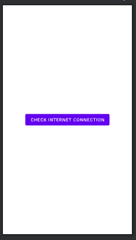

# 如何在没有互联网连接对话框的安卓系统中检查互联网连接？

> 原文:[https://www . geeksforgeeks . org/如何在没有互联网连接的安卓系统中检查互联网连接对话框/](https://www.geeksforgeeks.org/how-to-check-internet-connection-in-android-with-no-internet-connection-dialog/)

哈喽，极客们，今天我们将学习如何将互联网警报功能添加到我们的应用程序中。你肯定在几乎所有的应用程序中都看到过，当数据关闭或应用程序无法访问互联网时，它会弹出一条“没有互联网连接”的消息，然后再次连接到数据时，它会显示消息“重新联机”或“互联网处于连接状态”，我们将在我们的应用程序中实现同样的情况。

**互联网提醒的目标/目的:**

*   通知用户他/她没有连接到网络。
*   停止应用程序中所有与互联网相关的活动或服务。

### 我们将在本文中构建什么？

在这里，我们将创建一个按钮。只要用户按下按钮，就会显示“互联网连接”消息。注意，我们将使用 **Java** 语言来实现这个应用程序。下面给出了一个示例视频，以了解我们将在本文中做什么。

<video class="wp-video-shortcode" id="video-643323-1" width="640" height="360" preload="metadata" controls=""><source type="video/mp4" src="https://media.geeksforgeeks.org/wp-content/uploads/20210710164252/WhatsApp-Video-2021-07-10-at-16.33.16.mp4?_=1">[https://media.geeksforgeeks.org/wp-content/uploads/20210710164252/WhatsApp-Video-2021-07-10-at-16.33.16.mp4](https://media.geeksforgeeks.org/wp-content/uploads/20210710164252/WhatsApp-Video-2021-07-10-at-16.33.16.mp4)</video>

### 逐步实施

**第一步:创建新项目**

*   打开一个新项目。
*   我们将使用 Java 语言来处理空活动。保持所有其他选项不变。
*   您可以在方便的时候更改项目的名称。
*   将有两个名为 **activity_main.xml 和 MainActivity.java**的默认文件。

如果你不知道如何在安卓工作室创建新项目，那么你可以参考[如何在安卓工作室创建/启动新项目？](https://www.geeksforgeeks.org/android-how-to-create-start-a-new-project-in-android-studio/)

**第二步:导航至 app >清单> AndroidManifest.xml 文件，粘贴以下代码添加互联网权限**

```
<uses-permission android:name="android.permission.ACCESS_NETWORK_STATE"/>
<uses-permission android:name="android.permission.INTERNET"/>
```

**第三步:使用 activity_main.xml 文件**

我们正在使用 **activity_main.xml** 文件中的一个按钮来执行该操作。在 **activity_main.xml** 文件中使用以下代码。

## 可扩展标记语言

```
<?xml version="1.0" encoding="utf-8"?>

<!-- Relative layout as parent layout-->
<RelativeLayout 
    xmlns:android="http://schemas.android.com/apk/res/android"
    xmlns:tools="http://schemas.android.com/tools"
    android:layout_width="match_parent"
    android:layout_height="match_parent"
    tools:context=".MainActivity">

    <!-- Button to perform the action of Internet alert-->
    <Button
        android:id="@+id/btn_check"
        android:layout_width="wrap_content"
        android:layout_height="wrap_content"
        android:layout_centerInParent="true"
        android:text="Check Internet Connection" />

</RelativeLayout>
```

实现上述代码后，activity_main.xml 文件的设计将如下所示。



**第 4 步:使用 java 文件**

使用以下方法创建一个名为 **ConnectionReceiver** 的新 java 类


在**ConnectionReceiver.java**文件中使用以下代码。

## Java 语言(一种计算机语言，尤用于创建网站)

```
import android.content.BroadcastReceiver;
import android.content.Context;
import android.content.Intent;
import android.net.ConnectivityManager;
import android.net.NetworkInfo;

public class ConnectionReceiver extends BroadcastReceiver {

    // initialize listener
    public static ReceiverListener Listener;

    @Override
    public void onReceive(Context context, Intent intent) {

        // initialize connectivity manager
        ConnectivityManager connectivityManager = (ConnectivityManager)
                context.getSystemService(Context.CONNECTIVITY_SERVICE);

        // Initialize network info
        NetworkInfo networkInfo = connectivityManager.getActiveNetworkInfo();

        // check condition
        if (Listener != null) {

            // when connectivity receiver
            // listener  not null
            // get connection status
            boolean isConnected = networkInfo != null && networkInfo.isConnectedOrConnecting();

            // call listener method
            Listener.onNetworkChange(isConnected);
        }
    }

    public interface ReceiverListener {
        // create method
        void onNetworkChange(boolean isConnected);
    }
}
```

转到**文件，参考以下代码。以下是**MainActivity.java**文件的代码。代码中添加了注释，以更详细地理解代码。**

## **Java 语言(一种计算机语言，尤用于创建网站)**

```
import android.content.Context;
import android.content.IntentFilter;
import android.graphics.Color;
import android.net.ConnectivityManager;
import android.net.NetworkInfo;
import android.os.Bundle;
import android.view.View;
import android.widget.Button;
import android.widget.TextView;

import androidx.appcompat.app.AppCompatActivity;

import com.google.android.material.snackbar.Snackbar;

public class MainActivity extends AppCompatActivity implements ConnectionReceiver.ReceiverListener {

    Button btn_check;

    @Override
    protected void onCreate(Bundle savedInstanceState) {
        super.onCreate(savedInstanceState);
        setContentView(R.layout.activity_main);

        // assign variable
        btn_check = findViewById(R.id.btn_check);

        // create method
        checkConnection();
        btn_check.setOnClickListener(new View.OnClickListener() {
            @Override
            public void onClick(View view) {
                // call method
                checkConnection();
            }
        });
    }

    private void checkConnection() {

        // initialize intent filter
        IntentFilter intentFilter = new IntentFilter();

        // add action
        intentFilter.addAction("android.new.conn.CONNECTIVITY_CHANGE");

        // register receiver
        registerReceiver(new ConnectionReceiver(), intentFilter);

        // Initialize listener
        ConnectionReceiver.Listener = this;

        // Initialize connectivity manager
        ConnectivityManager manager = (ConnectivityManager) getApplicationContext().getSystemService(Context.CONNECTIVITY_SERVICE);

        // Initialize network info
        NetworkInfo networkInfo = manager.getActiveNetworkInfo();

        // get connection status
        boolean isConnected = networkInfo != null && networkInfo.isConnectedOrConnecting();

        // display snack bar
        showSnackBar(isConnected);
    }

    private void showSnackBar(boolean isConnected) {

        // initialize color and message
        String message;
        int color;

        // check condition
        if (isConnected) {

            // when internet is connected
            // set message
            message = "Connected to Internet";

            // set text color
            color = Color.WHITE;

        } else {

            // when internet 
            // is disconnected
            // set message
            message = "Not Connected to Internet";

            // set text color
            color = Color.RED;
        }

        // initialize snack bar
        Snackbar snackbar = Snackbar.make(findViewById(R.id.btn_check), message, Snackbar.LENGTH_LONG);

        // initialize view
        View view = snackbar.getView();

        // Assign variable
        TextView textView = view.findViewById(R.id.snackbar_text);

        // set text color
        textView.setTextColor(color);

        // show snack bar
        snackbar.show();
    }

    @Override
    public void onNetworkChange(boolean isConnected) {
        // display snack bar
        showSnackBar(isConnected);
    }

    @Override
    protected void onResume() {
        super.onResume();
        // call method
        checkConnection();
    }

    @Override
    protected void onPause() {
        super.onPause();
        // call method
        checkConnection();
    }
}
```

**恭喜你！我们已经成功地使应用程序检查互联网连接并提醒用户。这是我们应用程序的最终输出。**

****输出:****

**<video class="wp-video-shortcode" id="video-643323-2" width="640" height="360" preload="metadata" controls=""><source type="video/mp4" src="https://media.geeksforgeeks.org/wp-content/uploads/20210710164252/WhatsApp-Video-2021-07-10-at-16.33.16.mp4?_=2">[https://media.geeksforgeeks.org/wp-content/uploads/20210710164252/WhatsApp-Video-2021-07-10-at-16.33.16.mp4](https://media.geeksforgeeks.org/wp-content/uploads/20210710164252/WhatsApp-Video-2021-07-10-at-16.33.16.mp4)</video>**