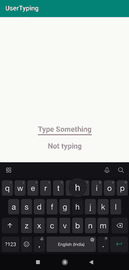

# 如何在安卓系统中查看 EditText 的打字状态？

> 原文:[https://www . geesforgeks . org/how-check-typing-status-of-edit text-in-Android/](https://www.geeksforgeeks.org/how-to-check-typing-status-of-edittext-in-android/)

在本文中，我们将实现一个重要且非常有趣的特性。在通过各种社交媒体平台与朋友聊天时，你可能会发现，如果你的朋友在打字，那么它会显示“正在打字”。这里要实现同样的。当我们开始打字时，它会显示打字，当我们抹掉所有内容时，它会显示停止打字。下面给出了一个 GIF 示例，来了解一下在本文中要做什么。请注意，我们将使用 **Java** 语言来实现这个项目。



### **分步实施**

**第一步:创建新项目**

要在安卓工作室创建新项目，请参考[如何在安卓工作室创建/启动新项目](https://www.geeksforgeeks.org/android-how-to-create-start-a-new-project-in-android-studio/)。注意选择 **Java** 作为编程语言。

**步骤 2:使用 activity_main.xml 文件**

导航到**应用程序> res >布局> activity_main.xml** 并将下面的代码添加到该文件中。下面是 **activity_main.xml** 文件的代码。

## 可扩展标记语言

```
<?xml version="1.0" encoding="utf-8"?>
<LinearLayout 
    xmlns:android="http://schemas.android.com/apk/res/android"
    xmlns:tools="http://schemas.android.com/tools"
    android:layout_width="match_parent"
    android:layout_height="match_parent"
    android:gravity="center"
    android:orientation="vertical"
    tools:context=".MainActivity">

    <EditText
        android:id="@+id/check"
        android:layout_width="wrap_content"
        android:layout_height="wrap_content"
        android:hint="Type Something"
        android:textSize="22sp"
        android:textStyle="bold" />

    <TextView
        android:id="@+id/confirm"
        android:layout_width="wrap_content"
        android:layout_height="wrap_content"
        android:layout_marginTop="10dp"
        android:hint="Not typing"
        android:textSize="22sp"
        android:textStyle="bold" />

</LinearLayout>
```

**第三步:使用****MainActivity.java 文件**

转到**MainActivity.java**文件，参考以下代码。以下是**MainActivity.java**文件的代码。代码中添加了注释，以更详细地理解代码。

## Java 语言(一种计算机语言，尤用于创建网站)

```
import android.os.Bundle;
import android.text.Editable;
import android.text.TextWatcher;
import android.widget.EditText;
import android.widget.TextView;

import androidx.appcompat.app.AppCompatActivity;

public class MainActivity extends AppCompatActivity {

    EditText msg;
    TextView confirm;

    @Override
    protected void onCreate(Bundle savedInstanceState) {
        super.onCreate(savedInstanceState);
        setContentView(R.layout.activity_main);
        msg = findViewById(R.id.check);
        confirm = findViewById(R.id.confirm);

        // When there is change in state of edittext input
        msg.addTextChangedListener(new TextWatcher() {
            @Override
            // when there is no text added
            public void beforeTextChanged(CharSequence s, int start, int count, int after) {
                if (s.toString().trim().length() == 0) {
                    // set text to Not typing
                    confirm.setText("Not Typing");
                } else {
                    // set text to typing
                    confirm.setText(" Typing");
                }
            }

            @Override
            public void onTextChanged(CharSequence s, int start, int before, int count) {
                confirm.setText(" Typing");
            }

            // after we input some text
            @Override
            public void afterTextChanged(Editable s) {
                if (s.toString().trim().length() == 0) {
                    // set text to Stopped typing
                    confirm.setText("Stopped Typing");
                }
            }
        });
    }
}
```

### **输出:**

<video class="wp-video-shortcode" id="video-567034-1" width="640" height="360" preload="metadata" controls=""><source type="video/mp4" src="https://media.geeksforgeeks.org/wp-content/uploads/20210226235048/typing.mp4?_=1">[https://media.geeksforgeeks.org/wp-content/uploads/20210226235048/typing.mp4](https://media.geeksforgeeks.org/wp-content/uploads/20210226235048/typing.mp4)</video>