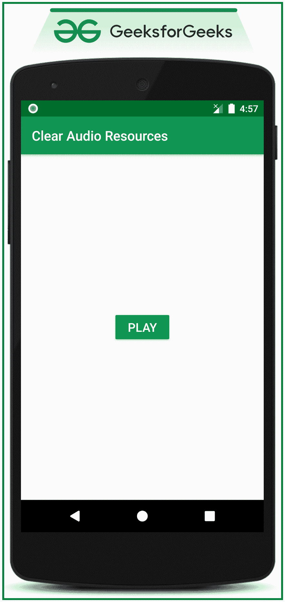

# 如何在安卓中清除或释放音频资源？

> 原文:[https://www . geesforgeks . org/how-to-clear-or-release-audio-resources in Android/](https://www.geeksforgeeks.org/how-to-clear-or-release-audio-resources-in-android/)

由于安卓系统的内存消耗更优先，如果应用程序使用媒体播放器应用编程接口，大部分内存资源都会被分配。当不再需要 Mediaplayer 实例时，或者在播放完媒体资源文件后，开发人员需要小心。因此，在本文中，我们讨论了如何在各种场景中逐步释放媒体播放器资源，从而稳定应用程序的内存消耗。

### **释放音频资源的步骤**

**第一步:创建一个空的活动安卓工作室项目。**

*   创建一个空的活动安卓工作室项目。
*   参考[安卓|如何在安卓工作室创建/启动新项目？](https://www.geeksforgeeks.org/android-how-to-create-start-a-new-project-in-android-studio/)关于如何创建 Empty 活动安卓工作室项目。不说我们要用 **Java** 语言来实现这个项目。

**第二步:准备要播放的音频样本文件。**

*   在这种情况下，在原始文件夹中获取一个示例 MP3 文件。
*   要创建“**raw*****”***文件夹，右键单击 r **es >新建>安卓资源目录**并选择资源类型作为 **raw。**
*   并且在创建文件夹后添加一些示例音频文件来播放。
*   如果无法获得上述步骤，请参考以下视频。

<video class="wp-video-shortcode" id="video-513744-1" width="640" height="360" preload="metadata" controls=""><source type="video/mp4" src="https://media.geeksforgeeks.org/wp-content/uploads/20201114165206/Untitled-Project.mp4?_=1">[https://media.geeksforgeeks.org/wp-content/uploads/20201114165206/Untitled-Project.mp4](https://media.geeksforgeeks.org/wp-content/uploads/20201114165206/Untitled-Project.mp4)</video>

**步骤 3:使用 activity_main.xml**

*   在 **activity_main.xml** 文件中，实现了一个简单的 PLAY 按钮，点击后开始播放音频文件。
*   调用以下代码。

## 可扩展标记语言

```
<?xml version="1.0" encoding="utf-8"?>
<RelativeLayout 
    xmlns:android="http://schemas.android.com/apk/res/android"
    xmlns:tools="http://schemas.android.com/tools"
    android:layout_width="match_parent"
    android:layout_height="match_parent"
    tools:context=".MainActivity"
    tools:ignore="HardcodedText">

    <!--simple button to play the audio file-->
    <!--give appropriate id to handle it in the java file-->
    <Button
        android:id="@+id/play_button"
        android:layout_width="wrap_content"
        android:layout_height="wrap_content"
        android:layout_centerInParent="true"
        android:backgroundTint="@color/colorPrimary"
        android:text="PLAY"
        android:textColor="@android:color/white"
        android:textSize="18sp" />

</RelativeLayout>
```

**输出 UI:**



**步骤 4:使用 MainActivity.java 文件**

*   使用原始资源启动 MediaPlayer 实例来播放音频文件。
*   调用下面的代码来处理播放按钮，开始播放音频文件。
*   为了更好地理解，在代码中添加了注释。

## Java 语言(一种计算机语言，尤用于创建网站)

```
import androidx.appcompat.app.AppCompatActivity;
import android.media.MediaPlayer;
import android.os.Bundle;
import android.view.View;
import android.widget.Button;

public class MainActivity extends AppCompatActivity {

    // Mediaplayer instance to initiate the audio file to play
    MediaPlayer mediaPlayer;

    // Button instance to handle the PLAY button
    Button bPlay;

    @Override
    protected void onCreate(Bundle savedInstanceState) {
        super.onCreate(savedInstanceState);
        setContentView(R.layout.activity_main);

        // register the PLAY button with appropriate id.
        bPlay = findViewById(R.id.play_button);

        // prepare the audio file for mediaPlayer instance to play it.
        mediaPlayer = MediaPlayer.create(this, R.raw.song);

        // handle the play button
        bPlay.setOnClickListener(new View.OnClickListener() {
            @Override
            public void onClick(View v) {
                mediaPlayer.start();
            }
        });
    }
}
```

**输出:在仿真器上运行**

<video class="wp-video-shortcode" id="video-513744-2" width="640" height="360" preload="metadata" controls=""><source type="video/mp4" src="https://media.geeksforgeeks.org/wp-content/uploads/20201114172954/GFG_nexus_5.mp4?_=2">[https://media.geeksforgeeks.org/wp-content/uploads/20201114172954/GFG_nexus_5.mp4](https://media.geeksforgeeks.org/wp-content/uploads/20201114172954/GFG_nexus_5.mp4)</video>

### **可以释放或清除音频资源的各种场景**

> ***注:*** 在这种情况下，出于演示目的，显示了两种场景。
> 还可以有更多的其他场景可以释放音频资源。

**场景一:完全播放完音频文件后**

*   这是可以释放音频资源的场景之一。
*   在这种情况下，资源在完全播放完音频文件后被释放。
*   调用以下代码来实现 mediaPlayer 实例的完成时侦听器，并释放音频资源。

## Java 语言(一种计算机语言，尤用于创建网站)

```
import androidx.appcompat.app.AppCompatActivity;
import android.media.MediaPlayer;
import android.os.Bundle;
import android.view.View;
import android.widget.Button;

public class MainActivity extends AppCompatActivity {

    // Mediaplayer instance to initiate 
      // the audio file to play
    MediaPlayer mediaPlayer;

    // Button instance to handle the PLAY button
    Button bPlay;

    // Implement the on completion listener callback to do the 
      // actions on the media player instance
    // when the audio file gets completely played
    MediaPlayer.OnCompletionListener onCompletionListener = new MediaPlayer.OnCompletionListener() {
        @Override
        public void onCompletion(MediaPlayer mp) {
            releaseMediaPlayerResources();
        }
    };

    @Override
    protected void onCreate(Bundle savedInstanceState) {
        super.onCreate(savedInstanceState);
        setContentView(R.layout.activity_main);

        // register the PLAY button with appropriate id.
        bPlay = findViewById(R.id.play_button);

        // prepare the audio file for 
          // mediaPlayer instance to play it.
        mediaPlayer = MediaPlayer.create(this, R.raw.song);

        // handle the play button
        bPlay.setOnClickListener(new View.OnClickListener() {
            @Override
            public void onClick(View v) {
                mediaPlayer.start();

                mediaPlayer.setOnCompletionListener(onCompletionListener);
            }
        });
    }

    // dedicated function is made to check the 
      // mediaPlayer instance is null or not
    // based on that the actions are taken on
      // the mediaPlayer instance
    void releaseMediaPlayerResources() {
        if (mediaPlayer != null) {

            // it is safe to stop playing the audio 
              // file before releasing the audio file
            mediaPlayer.stop();

            // after stop playing the audio file 
              // release the audio resources
            mediaPlayer.release();
        }
    }
}
```

**场景 2:当用户按下后退或主页按钮时。**

*   如果应用程序是新闻阅读或播客类型的，每当用户按下后退按钮或主页按钮时，应用程序将处于停止状态。
*   所以在这种情况下，onStop 方法需要被覆盖，分配的音频资源应该被释放或清除。
*   调用以下代码到**MainActivity.java**文件。

## Java 语言(一种计算机语言，尤用于创建网站)

```
import androidx.appcompat.app.AppCompatActivity;
import android.media.MediaPlayer;
import android.os.Bundle;
import android.view.View;
import android.widget.Button;

public class MainActivity extends AppCompatActivity {

    // Mediaplayer instance to initiate the audio file to play
    MediaPlayer mediaPlayer;

    // Button instance to handle the PLAY button
    Button bPlay;

    // Implement the on completion listener callback to do 
      // the actions on the media player instance
    // when the audio file gets completely played
    MediaPlayer.OnCompletionListener onCompletionListener = new MediaPlayer.OnCompletionListener() {
        @Override
        public void onCompletion(MediaPlayer mp) {
            releaseMediaPlayerResources();
        }
    };

    @Override
    protected void onCreate(Bundle savedInstanceState) {
        super.onCreate(savedInstanceState);
        setContentView(R.layout.activity_main);

        // register the PLAY button with appropriate id.
        bPlay = findViewById(R.id.play_button);

        // prepare the audio file for mediaPlayer instance to play it.
        mediaPlayer = MediaPlayer.create(this, R.raw.song);

        // handle the play button
        bPlay.setOnClickListener(new View.OnClickListener() {
            @Override
            public void onClick(View v) {
                mediaPlayer.start();

                mediaPlayer.setOnCompletionListener(onCompletionListener);
            }
        });
    }

    @Override
    protected void onStop() {

        // Before going to stop state release the 
          // allocated mediaplyer resources
        releaseMediaPlayerResources();

        super.onStop();
    }

    // dedicated function is made to check the 
      // mediaPlayer instance is null or not
    // based on that the actions are taken 
      // on the mediaPlayer instance
    void releaseMediaPlayerResources() {
        if (mediaPlayer != null) {

            // it is safe to stop playing the audio file 
              // before releasing the audio file
            mediaPlayer.stop();

            // after stop playing the audio file 
              // release the audio resources
            mediaPlayer.release();
        }
    }
}
```

**按下 home 键时应停止音频。如下所示:**

<video class="wp-video-shortcode" id="video-513744-3" width="640" height="360" preload="metadata" controls=""><source type="video/mp4" src="https://media.geeksforgeeks.org/wp-content/uploads/20201114230307/GFG_nexus_5.mp4?_=3">[https://media.geeksforgeeks.org/wp-content/uploads/20201114230307/GFG_nexus_5.mp4](https://media.geeksforgeeks.org/wp-content/uploads/20201114230307/GFG_nexus_5.mp4)</video>