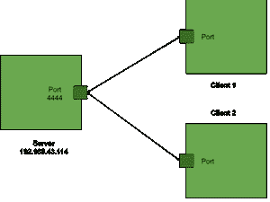

# 如何使用安卓与 PC 通信？

> 原文:[https://www . geeksforgeeks . org/如何使用安卓与 pc 通信/](https://www.geeksforgeeks.org/how-to-communicate-with-pc-using-android/)

在本文中，我们将讨论个人电脑上的程序和安卓设备之间的基本通信方式之一。这里我们将使用套接字编程的概念。我们知道通信发生在发送者和接收者之间，套接字编程涉及到客户端-服务器设置，客户端连接到服务器，发送消息，另一端的服务器接收消息。根据您的代码，这可以是单向的，也可以是双向的。

### 什么是套接字编程？

套接字编程是连接到同一网络的两个设备之间的通信方法。两个套接字相互作用，一个在客户端，一个在服务器端。一个 IP 地址加上一个端口组成了一个套接字地址。通过指定的端口，服务器应用程序开始监听客户端。客户端使用服务器的 IP 地址和它打开的端口连接到服务器。之后，双向通信成为可能。深度概念请参考此处: [在 Java 套接字编程中引入线程](https://www.geeksforgeeks.org/introducing-threads-socket-programming-java/)



首先，让我们构建要在服务器套接字上执行的程序。我们将把个人电脑作为服务器，安卓设备作为客户端。

**步骤 1:** 在 Eclipse 中创建新项目。

**步骤 2:** 创建类服务器。

## Java 语言(一种计算机语言，尤用于创建网站)

```
import java.io.BufferedReader;
import java.io.IOException;
import java.io.InputStreamReader;
import java.net.ServerSocket;
import java.net.Socket;

public class Server {

// declaring required variables
private static ServerSocket serverSocket;
private static Socket clientSocket;
private static InputStreamReader inputStreamReader;
private static BufferedReader bufferedReader;
private static String message="";

public static void main(String[] args) {

    try {
        // creating a new ServerSocket at port 4444
        serverSocket = new ServerSocket(4444); 

    } catch (IOException e) {
        System.out.println("Could not listen on port: 4444");
    }

    System.out.println("Server started. Listening to the port 4444");

    // we keep listening to the socket's 
      // input stream until the message
    // "over" is encountered
    while (!message.equalsIgnoreCase("over")) {
        try {

            // the accept method waits for a new client connection
            // and and returns a individual socket for that connection
            clientSocket = serverSocket.accept(); 

            // get the inputstream from socket, which will have 
              // the message from the clients
            inputStreamReader = new InputStreamReader(clientSocket.getInputStream());
            bufferedReader = new BufferedReader(inputStreamReader);                     

              // reading the message
            message = bufferedReader.readLine();

            // printing the message
            System.out.println(message);

            // finally it is very important
              // that you close the sockets
            inputStreamReader.close();
            clientSocket.close();

        } catch (IOException ex) {
            System.out.println("Problem in message reading");
        }
     }
  }
}
```

这个程序在执行时会在一个特定的端口 4444 上创建一个服务器套接字。现在我们的服务器开始监听客户端的连接，在这种情况下，客户端是安卓设备。更多详情请参考本文:[【Java Socket 编程】](https://www.geeksforgeeks.org/socket-programming-in-java/) 。现在让我们为客户端编程安卓应用。

### **分步实施**

**第一步:创建新项目**

要在安卓工作室创建新项目，请参考[如何在安卓工作室创建/启动新项目](https://www.geeksforgeeks.org/android-how-to-create-start-a-new-project-in-android-studio/)。注意选择 **Java** 作为编程语言。

**步骤 2:** **使用 AndroidManifest.xml 文件**

## 可扩展标记语言

```
<?xml version="1.0" encoding="utf-8"?>
<manifest xmlns:android="http://schemas.android.com/apk/res/android"
    package="com.raghav.clientsocketapp">

    <!--We require internet permission to perform networking tasks-->
    <uses-permission android:name="android.permission.INTERNET"/>
    <application
        android:allowBackup="true"
        android:icon="@mipmap/ic_launcher"
        android:label="@string/app_name"
        android:roundIcon="@mipmap/ic_launcher_round"
        android:supportsRtl="true"
        android:theme="@style/Theme.ClientSocketApp">
        <activity android:name=".MainActivity">
            <intent-filter>
                <action android:name="android.intent.action.MAIN" />

                <category android:name="android.intent.category.LAUNCHER" />
            </intent-filter>
        </activity>
    </application>

</manifest>
```