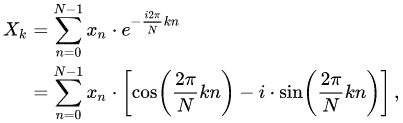

# 如何用 Java 直接计算离散傅里叶变换系数？

> 原文:[https://www . geeksforgeeks . org/如何用 java 直接计算离散傅立叶变换系数/](https://www.geeksforgeeks.org/how-to-compute-a-discrete-fourier-transform-coefficients-directly-in-java/)

**离散傅里叶变换** (DFT)一般在 0 到 360 之间变化。基本上有 N 样本 DFT，其中 N 是样本数。范围从 n=0 到 N-1。我们可以通过得到实部的余弦项和虚部的正弦项得到系数。

**DFT 的公式:**



**示例:**

```java
Input:

Enter the values of simple linear equation
ax+by=c
3
4
5
Enter the k DFT value
2

Output:

(-35.00000000000003) - (-48.17336721649107i)

Input:

Enter the values of simple linear equation
ax+by=c
2
4
5
Enter the k DFT value
4

Output:

(-30.00000000000001) - (-9.747590886987172i)
```

**进场:**

*   首先，让我们声明 N 的值是 10
*   我们知道 DFT 序列的公式是 X(k)= e^jw 范围从 0 到 N-1
*   现在我们先取 a，b，c 的输入，然后我们试着用**“ax+by = c”**线性形式计算
*   我们尝试在一个名为“newvar”的数组中使用该函数。

```java
newvar[i] = (((a*(double)i) + (b*(double)i)) -c);
```

*   现在让我们取输入变量 k，也声明 sin 和余弦数组，这样我们就可以分别计算实部和虚部。

```java
cos[i]=Math.cos((2*i*k*Math.PI)/N);
```

```java
sin[i]=Math.sin((2*i*k*Math.PI)/N);
```

*   现在让我们来看看实变量和虚变量
*   计算虚变量和实变量，比如

```java
real+=newvar[i]*cos[i];
```

```java
img+=newvar[i]*sin[i];
```

*   现在我们将以 **a+ ib** 的形式打印该输出

**实施:**

## Java 语言(一种计算机语言，尤用于创建网站)

```java
// Java program  to Compute a Discrete-Fourier
// Transform Coefficients Directly

import java.io.*;
import java.util.Scanner;

class GFG {

    public static void main(String[] args)
    {

        // Size of the N value
        int N = 10;

        // Enter the values of simple linear equation
        System.out.println(
            "Enter the values of simple linear equation");
        System.out.println("ax+by=c");

        // We declare them in data_type double..
        double a = 3.0;
        double b = 4.0;
        double c = 5.0;

        // Here newvar function array is declared in size
        // N..
        double[] newvar = new double[N];

        // Now let us loop it over N and take the function
        // Now the newvar array will calculate the function
        // ax+by=c for N times

        for (int i = 0; i < N; i++) {
            // This is the way we write that,
            // We are taking array A as of 'a'x
            // array B as of 'b'y
            newvar[i]
                = (((a * (double)i) + (b * (double)i)) - c);
        }

        System.out.println("Enter the k DFT value");

        // Here we declare the variable k
        int k = 2;

        // Here we take 2 terms cos and sin arrays
        // which will be useful to calculate the real and
        // imaginary part The size of both arrays will be 10

        double[] cos = new double[N];
        double[] sin = new double[N];

        // Iterating it to N
        // Now let us calculate the formula of cos and sin

        for (int i = 0; i < N; i++) {

            // Here cos term is real part which is
            // multiplied into 2ikpie/N
            cos[i] = Math.cos((2 * i * k * Math.PI) / N);

            // Here sin term is imaginary part which is also
            // multiplied into 2ikpie/N
            sin[i] = Math.sin((2 * i * k * Math.PI) / N);
        }

        // Now to know the value of real and imaginary terms
        // First we declare their respective variables
        double real = 0, img = 0;

        // Now let us iterate it till N

        for (int i = 0; i < N; i++) {

            // real part  can be calculated by adding it
            // with newvar and multiplying it with cosine
            // array
            real += newvar[i] * cos[i];

            // Imaginary part is calculated by adding it
            // with newvar and multiplying it with sine
            // array
            img += newvar[i] * sin[i];
        }

        // Now real and imaginary part can be written in
        // this equation form
        System.out.println("(" + real + ") - "
                           + "(" + img + "i)");
    }
}
```

**Output**

```java
Enter the values of simple linear equation
ax+by=c
Enter the k DFT value
(-35.00000000000003) - (-48.17336721649107i)
```