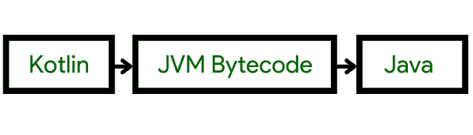

# 如何在安卓系统中将 Kotlin 源文件转换成 Java 源文件？

> 原文:[https://www . geesforgeks . org/how-convert-a-kot Lin-source-file-to-a-Java-source-file-in-Android/](https://www.geeksforgeeks.org/how-to-convert-a-kotlin-source-file-to-a-java-source-file-in-android/)

我们使用安卓工作室将我们的 Java 代码翻译成柯特林，同时从 Java 转换成柯特林。但是如果我们需要将一个 Kotlin 文件转换成它的 Java 对等文件呢？在这篇博客中，我们将研究如何将 Kotlin 源文件转换为 Java 源文件。我们开始派对吧。由于与 Java 的互操作性，Kotlin 在首次出现时以指数级的速度增长。这是因为 Java 虚拟机同时执行 Java 和 Kotlin (JVM)。



图 1:理解转换结构。

将 Kotlin 代码编译成 JVM 字节码，然后将字节码反编译成 Java 代码，这是将 Kotlin 文件转换成 Java 文件的两个过程。因此，将 Java 代码转换为 Kotlin，反之亦然非常简单。将 Kotlin 代码翻译成 Java 代码的一些好处或动机如下:

1.  加入易于在 Java 中构建的功能。
2.  调查性能问题。
3.  要从项目中删除 Kotlin，请按照下列步骤操作。

### 如前所述，要转换文件，请遵循以下步骤

在您喜欢的 IDE 中打开您的 Kotlin 项目，这里我们使用的是 IntelliJ

1.  然后转到 Kotlin >在工具> Kotlin 中显示 Kotlin 字节码。
2.  您的 Kotlin 文件的字节码将被返回给您。
3.  要从字节码中提取 Java 代码，请单击反编译按钮。

智能创意在幕后使用蕨类植物。

因此，我们可以直接使用蕨类植物，而不是使用 IntelliJ IDEA。使用这种方法的唯一缺点是，您将获得蕨类植物花文件，稍后您将不得不将其转换为纯 java 类。

1.  使用命令:kotlinc filename.kt 执行编译过程
2.  现在我们必须反编译上一步创建的类文件。
3.  fernflower.jar 文件可以在这里下载。
4.  下载完 jar 文件后，使用下面的命令从。类文件:

```
java -jar fernflower.jar filename.class
```

虽然上面的过程会生成一个 Java 文件，但是代码很难理解。另外，阅读也会差。因此，建议使用 IntelliJ IDEA 将 Kotlin 代码转换为 Java 代码。