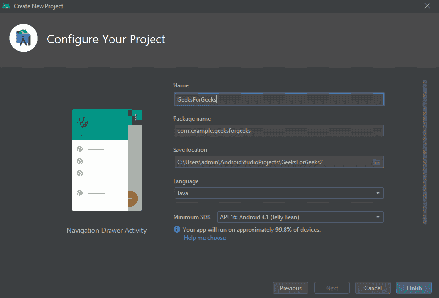
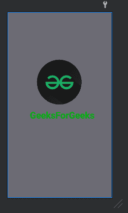
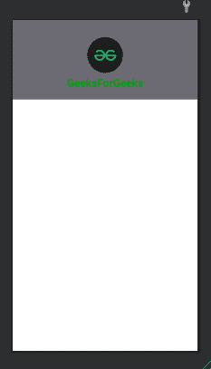
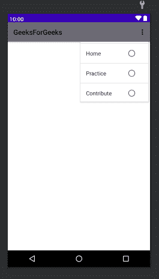
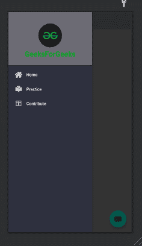
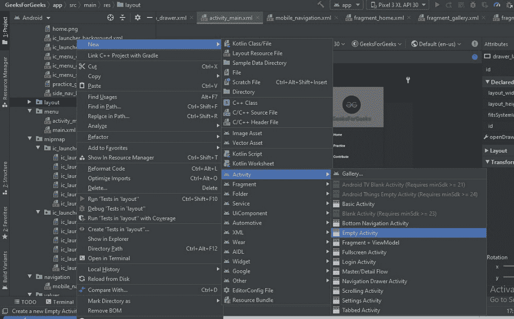
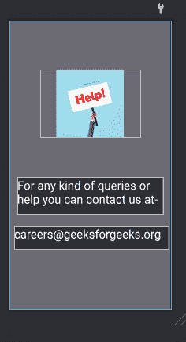

# 如何在安卓工作室将任意网站转换为安卓 App？

> 原文:[https://www . geesforgeks . org/如何将任何网站转换为安卓应用程序在安卓工作室/](https://www.geeksforgeeks.org/how-to-convert-any-website-to-android-app-in-android-studio/)

在这里，我们将为“极客博客”网站制作一个应用程序。通过制作这个应用程序，我们将能够了解如何通过简单的步骤将网站转换为安卓应用程序。你也可以把这个概念用在你的个人网站上，学习一些新的东西。


### **本文我们要构建什么？**

在这个应用程序中，我们将学习如何使用一个网站的不同门户，并在我们的安卓应用程序中将它们显示为片段。在这个应用程序中，极客网站的三个入口——主页、练习和投稿将在我们的应用程序中作为片段使用。因此，您可以看到一个将网站转换为应用程序的实时示例。 [WebView](https://www.geeksforgeeks.org/how-to-use-webview-in-android/) 的概念就是用来做这个想要的工作。下面给出了一个示例视频，以了解我们将在本文中做什么。请注意，我们将使用 **Java** 语言来实现这个项目。

<video class="wp-video-shortcode" id="video-614134-1" width="640" height="360" preload="metadata" controls=""><source type="video/mp4" src="https://media.geeksforgeeks.org/wp-content/uploads/20210525184612/WhatsApp-Video-2021-05-25-at-18.42.13.mp4?_=1">[https://media.geeksforgeeks.org/wp-content/uploads/20210525184612/WhatsApp-Video-2021-05-25-at-18.42.13.mp4](https://media.geeksforgeeks.org/wp-content/uploads/20210525184612/WhatsApp-Video-2021-05-25-at-18.42.13.mp4)</video>

**将您的网站转换为安卓应用程序的简单步骤:**

*   添加应用程序的徽标。
*   向应用程序添加闪屏。
*   在我们的应用程序中使用导航抽屉，以便我们网站的不同门户可以用作导航抽屉中的片段。
*   使用网络视图，以便可以轻松访问网络内容。
*   使用 WebViewController 类，以便网站上的内容可以直接在应用程序中显示，而不是在浏览器中打开。
*   添加帮助热线活动。

按照这些步骤，你可以用最简单的方式把你的网站转换成一个应用程序。因此，让我们看一步一步的实现，将极客网站转换成一个应用程序。

### **分步实施**

**第一步:创建新项目**

*   打开一个新项目。
*   我们将使用 Java 语言进行[导航抽屉活动](https://www.geeksforgeeks.org/navigation-drawer-in-android/)。保持所有其他选项不变。
*   您可以在方便的时候更改项目的名称。
*   会有很多默认文件。



如果你不知道如何在安卓工作室创建新项目，那么你可以参考[如何在安卓工作室创建/启动新项目？](https://www.geeksforgeeks.org/android-how-to-create-start-a-new-project-in-android-studio/)

**第二步:给我们的应用添加一个标志**

*   将应用程序的徽标粘贴到 **res >可绘制的**中。
*   跟随“[如何更改安卓 App](https://www.geeksforgeeks.org/how-to-change-the-default-icon-of-android-app/) 默认图标”了解更多步骤。

**第 3 步:将闪屏添加到我们的应用程序中**

按照-[创建闪屏](https://www.geeksforgeeks.org/android-creating-a-splash-screen/)了解如何向我们的应用程序添加闪屏。我们的应用程序的闪屏示例设计。



**第 4 步:处理 xml 文件**

打开**布局> nav_header_main.xml** 文件，设计我们导航抽屉的标题。为此，请在其中使用以下代码。

## 可扩展标记语言

```java
<?xml version="1.0" encoding="utf-8"?>
<!--Constraint Layout to display all the details of header file-->
<androidx.constraintlayout.widget.ConstraintLayout
    xmlns:android="http://schemas.android.com/apk/res/android"
    xmlns:app="http://schemas.android.com/apk/res-auto"
    android:layout_width="match_parent"
    android:layout_height="@dimen/nav_header_height"
    android:background="#6C6B74"
    android:gravity="bottom"
    android:orientation="vertical"
    android:paddingLeft="@dimen/activity_horizontal_margin"
    android:paddingTop="@dimen/activity_vertical_margin"
    android:paddingRight="@dimen/activity_horizontal_margin"
    android:paddingBottom="@dimen/activity_vertical_margin"
    android:theme="@style/ThemeOverlay.AppCompat.Dark">

    <!--Image View to display logo of application in header-->
    <ImageView
        android:id="@+id/imageView"
        android:layout_width="107dp"
        android:layout_height="87dp"
        android:layout_gravity="center"
        android:contentDescription="@string/nav_header_desc"
        android:foregroundGravity="center"
        android:paddingTop="@dimen/nav_header_vertical_spacing"
        app:layout_constraintBottom_toBottomOf="parent"
        app:layout_constraintEnd_toEndOf="parent"
        app:layout_constraintStart_toStartOf="parent"
        app:layout_constraintTop_toTopOf="parent"
        app:layout_constraintVertical_bias="0.247"
        app:srcCompat="@drawable/gfg_round" />

    <!--TextView for name of application -->
    <TextView
        android:layout_width="wrap_content"
        android:layout_height="51dp"
        android:layout_gravity="center"
        android:gravity="center"
        android:paddingTop="@dimen/nav_header_vertical_spacing"
        android:text="GeeksForGeeks"
        android:textAppearance="@style/TextAppearance.AppCompat.Body1"
        android:textColor="#01A109"
        android:textSize="24sp"
        android:textStyle="bold"
        app:layout_constraintBottom_toBottomOf="parent"
        app:layout_constraintEnd_toEndOf="parent"
        app:layout_constraintStart_toStartOf="parent"
        app:layout_constraintTop_toTopOf="@+id/imageView"
        app:layout_constraintVertical_bias="1.0" />

</androidx.constraintlayout.widget.ConstraintLayout>
```

实现上述代码后，导航抽屉的标题如下所示:



将动作栏的颜色改为“# **6C6B74** ，这样就可以与我们应用的 logo 的颜色代码相匹配，我们的 UI 也可以变得更有吸引力。如果你不知道如何改变动作栏的颜色，那么你可以[点击这里](https://www.geeksforgeeks.org/how-to-change-the-color-of-action-bar-in-an-android-app/#:~:text=Just%20go%20to%20res%2Fvalues%2Fstyles.&text=edit%20the%20xml%20file%20to%20change%20the%20color%20of%20action%20bar.)来学习它。打开**菜单> activity_main_drawer.xml** 文件，并在其中使用以下代码，这样我们就可以将不同的项目(我们网站的门户)添加到我们的导航抽屉中并使用它们的片段。

## 可扩展标记语言

```java
<?xml version="1.0" encoding="utf-8"?>
<menu xmlns:android="http://schemas.android.com/apk/res/android">

    <!--Group is used to group all these items together-->
    <group android:checkableBehavior="single">

        <!--Three items are added as name of three portals-->
        <!-- Portal number 1- Home-->
        <!-- menucategory is used as secondary so that
             backstack(going back by pressing back button) can be used -->
        <item
            android:id="@+id/nav_home"
            android:icon="@drawable/home"
            android:menuCategory="secondary"
            android:title="@string/menu_home" />

        <!-- Portal number 2- Practice-->
        <item
            android:id="@+id/nav_gallery"
            android:icon="@drawable/practice_gfg"
            android:menuCategory="secondary"
            android:title="Practice" />

        <!-- Portal number 3- Contribute-->
        <item
            android:id="@+id/nav_slideshow"
            android:icon="@drawable/contribute_gfg"
            android:menuCategory="secondary"
            android:title="Contribute" />
    </group>
</menu>
```

实现上述代码后，我们对 **activity_main_drawer.xml** 文件的设计如下所示。



转到**布局> activity_main.xml** ，并在其中使用以下代码。

## 可扩展标记语言

```java
<?xml version="1.0" encoding="utf-8"?>
<!-- DrawerLayout acts as top level container for window content that allows for
     interactive “drawer” views to be pulled out from one or both vertical edges of the window-->
<androidx.drawerlayout.widget.DrawerLayout
    xmlns:android="http://schemas.android.com/apk/res/android"
    xmlns:app="http://schemas.android.com/apk/res-auto"
    xmlns:tools="http://schemas.android.com/tools"
    android:id="@+id/drawer_layout"
    android:layout_width="match_parent"
    android:layout_height="match_parent"
    android:fitsSystemWindows="true"
    tools:openDrawer="start">

    <!-- To reuse layouts include tag is used-->
    <include
        layout="@layout/app_bar_main"
        android:layout_width="match_parent"
        android:layout_height="match_parent" />

    <!-- Navigation view to make navigation drawer -->
    <com.google.android.material.navigation.NavigationView
        android:id="@+id/nav_view"
        android:layout_width="wrap_content"
        android:layout_height="match_parent"
        android:layout_gravity="start"
        android:background="#2E303E"
        android:fitsSystemWindows="true"
        app:headerLayout="@layout/nav_header_main"
        app:itemIconTint="#fff"
        app:itemTextColor="#fff"
        app:menu="@menu/activity_main_drawer" />

</androidx.drawerlayout.widget.DrawerLayout>
```

实现以上代码设计后的 **activity_main.xml** 文件看起来像。



转到**导航> mobile_navigation.xml** 文件，并在其中使用以下代码，以便我们可以指定网站门户的标题和标签，并可以在 java 文件中轻松使用它们。

## 可扩展标记语言

```java
<?xml version="1.0" encoding="utf-8"?>
<navigation
    xmlns:android="http://schemas.android.com/apk/res/android"
    xmlns:app="http://schemas.android.com/apk/res-auto"
    xmlns:tools="http://schemas.android.com/tools"
    android:id="@+id/mobile_navigation"
    app:startDestination="@+id/nav_home">

    <!--These fragments are made to work on all
        the items listed in navigation drawer
        so that there java files can be managed separately -->

    <!-- Fragment for Home portal-->
    <fragment
        android:id="@+id/nav_home"
        android:name="com.example.geeksforgeeks.ui.home.HomeFragment"
        android:label="@string/menu_home"
        tools:layout="@layout/fragment_home" />

    <!-- Fragment for Practice portal-->
    <fragment
        android:id="@+id/nav_gallery"
        android:name="com.example.geeksforgeeks.ui.gallery.GalleryFragment"
        android:label="Practice"
        tools:layout="@layout/fragment_gallery" />

    <!-- Fragment for Contribute-->
    <fragment
        android:id="@+id/nav_slideshow"
        android:name="com.example.geeksforgeeks.ui.slideshow.SlideshowFragment"
        android:label="Contribute"
        tools:layout="@layout/fragment_slideshow" />

</navigation>
```

现在是时候在所有片段中插入网络视图了——打开**片段 _ 主页、片段 _ 图库、片段 _ 幻灯片** XML 文件，分别使用代码。

## 可扩展标记语言

```java
<?xml version="1.0" encoding="utf-8"?>
<androidx.constraintlayout.widget.ConstraintLayout
    xmlns:android="http://schemas.android.com/apk/res/android"
    xmlns:app="http://schemas.android.com/apk/res-auto"
    xmlns:tools="http://schemas.android.com/tools"
    android:layout_width="match_parent"
    android:layout_height="match_parent"
    tools:context=".ui.home.HomeFragment">

    <!--WebView is added on full screen so that
        application interface can be interactive and
        user can the web content is visible on full screen -->
    <WebView
        android:id="@+id/web_view_home"
        android:layout_width="match_parent"
        android:layout_height="match_parent"
        app:layout_constraintBottom_toBottomOf="parent"
        app:layout_constraintEnd_toEndOf="parent"
        app:layout_constraintStart_toStartOf="parent"
        app:layout_constraintTop_toTopOf="parent" />

</androidx.constraintlayout.widget.ConstraintLayout>
```

## 可扩展标记语言

```java
<?xml version="1.0" encoding="utf-8"?>
<androidx.constraintlayout.widget.ConstraintLayout
    xmlns:android="http://schemas.android.com/apk/res/android"
    xmlns:app="http://schemas.android.com/apk/res-auto"
    xmlns:tools="http://schemas.android.com/tools"
    android:layout_width="match_parent"
    android:layout_height="match_parent"
    tools:context=".ui.gallery.GalleryFragment">

    <WebView
        android:id="@+id/web_view_practice"
        android:layout_width="match_parent"
        android:layout_height="match_parent"
        app:layout_constraintBottom_toBottomOf="parent"
        app:layout_constraintEnd_toEndOf="parent"
        app:layout_constraintHorizontal_bias="0.0"
        app:layout_constraintStart_toStartOf="parent"
        app:layout_constraintTop_toTopOf="parent"
        app:layout_constraintVertical_bias="0.0" />

</androidx.constraintlayout.widget.ConstraintLayout>
```

## 可扩展标记语言

```java
<?xml version="1.0" encoding="utf-8"?>
<androidx.constraintlayout.widget.ConstraintLayout
    xmlns:android="http://schemas.android.com/apk/res/android"
    xmlns:app="http://schemas.android.com/apk/res-auto"
    xmlns:tools="http://schemas.android.com/tools"
    android:layout_width="match_parent"
    android:layout_height="match_parent"
    tools:context=".ui.slideshow.SlideshowFragment">

    <WebView
        android:id="@+id/web_view_contribute"
        android:layout_width="match_parent"
        android:layout_height="match_parent"
        app:layout_constraintBottom_toBottomOf="parent"
        app:layout_constraintEnd_toEndOf="parent"
        app:layout_constraintStart_toStartOf="parent"
        app:layout_constraintTop_toTopOf="parent" />

</androidx.constraintlayout.widget.ConstraintLayout>
```

现在我们必须创建一个名为“**帮助**的新活动。这样，应用程序用户就可以从服务提供商那里获得信息以获得帮助。进入**布局>右键>新建>活动>清空活动。**



根据您的选择输入活动名称(此应用程序中使用的名称-“帮助”)。打开**布局> activity_help.xml** ，并在其中使用以下代码。

## 可扩展标记语言

```java
<?xml version="1.0" encoding="utf-8"?>
<androidx.constraintlayout.widget.ConstraintLayout
    xmlns:android="http://schemas.android.com/apk/res/android"
    xmlns:app="http://schemas.android.com/apk/res-auto"
    xmlns:tools="http://schemas.android.com/tools"
    android:layout_width="match_parent"
    android:layout_height="match_parent"
    android:background="#6C6B74"
    tools:context=".help">

    <!-- Image to display help sign-->
    <ImageView
        android:id="@+id/imageView3"
        android:layout_width="255dp"
        android:layout_height="173dp"
        app:layout_constraintBottom_toBottomOf="parent"
        app:layout_constraintEnd_toEndOf="parent"
        app:layout_constraintStart_toStartOf="parent"
        app:layout_constraintTop_toTopOf="parent"
        app:layout_constraintVertical_bias="0.222"
        app:srcCompat="@drawable/help" />

    <!-- Indicating user that we are here
         to help by using a textview-->
    <TextView
        android:id="@+id/textView2"
        android:layout_width="371dp"
        android:layout_height="95dp"
        android:background="#2E303E"
        android:text="For any kind of queries or help you can contact us at-"
        android:textColor="#FFFCFC"
        android:textSize="30sp"
        app:layout_constraintBottom_toBottomOf="parent"
        app:layout_constraintEnd_toEndOf="parent"
        app:layout_constraintStart_toStartOf="parent"
        app:layout_constraintTop_toBottomOf="@+id/imageView3"
        app:layout_constraintVertical_bias="0.296" />

    <!-- Contact details for help-->
    <TextView
        android:id="@+id/textView3"
        android:layout_width="393dp"
        android:layout_height="59dp"
        android:background="#2E303E"
        android:text="careers@geeksforgeeks.org"
        android:textColor="#FFFFFF"
        android:textSize="30sp"
        app:layout_constraintBottom_toBottomOf="parent"
        app:layout_constraintEnd_toEndOf="parent"
        app:layout_constraintHorizontal_bias="0.666"
        app:layout_constraintStart_toStartOf="parent"
        app:layout_constraintTop_toBottomOf="@+id/textView2"
        app:layout_constraintVertical_bias="0.159" />

</androidx.constraintlayout.widget.ConstraintLayout>
```

实现上述代码后，activity_help.xml 文件的设计如下所示。



现在，我们添加了一段代码来获取访问互联网的权限，这样我们的网络视图就可以轻松工作了。转到**清单> AndroidManifest.xml** 文件，并向其中添加以下代码。

**第 5 步:使用 java 文件**

如下所示创建一个新的 java 类，并将其命名为“ **WebViewController** ”


在**WebViewController.java**文件中使用以下代码，以便可以执行使用网站网址的代码。

## Java 语言(一种计算机语言，尤用于创建网站)

```java
package com.example.geeksforgeeks;

import android.webkit.WebView;
import android.webkit.WebViewClient;

// class is extended to WebViewClient to access the WebView
public class WebViewController extends WebViewClient {
    @Override
    public boolean shouldOverrideUrlLoading(WebView view, String url) {
        // loadurl function will load the
        // url we will provide to our webview 
        view.loadUrl(url);
        return true;
    }
}
```