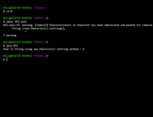

# Java 中如何将 Char 转换为 String？

> 原文:[https://www . geesforgeks . org/如何在 java 中将字符转换为字符串/](https://www.geeksforgeeks.org/how-to-convert-char-to-string-in-java/)

如果我们有一个像“G”这样的字符值，并且我们想把它转换成一个像“G”这样的等价字符串，那么我们可以通过使用 Java 中列出的以下四种方法中的任何一种来实现:

插图:

```java
Input  : 'G'
Output : "G"
```

**方法:**

有各种各样的方法，通过使用包装类和 java 类中提供的方法，我们可以将所需的字符转换为字符串。

1.  使用字符串串联
2.  使用字符类的 toString()方法
3.  使用字符包装类
4.  使用字符串类的 valueOf()方法

让我们在下面用干净的 java 程序详细讨论这些方法，如下所示:

**方法 1:** 使用字符串串联

我们可以在 java 中将一个字符转换成一个字符串对象，方法是将给定的字符与一个空字符串连接起来。

**例**

## Java 语言(一种计算机语言，尤用于创建网站)

```java
// Java Program to Convert Char to String
// Using Concatenation in Strings 

// Importing the required packages
import java.io.*;
import java.util.*;

// Main class
class GFG {

    // Main driver method
    public static void main(String[] args)
    {

        // Declaring a char variable
        char c = 'G';

        // Concatenating the char variable
        // with an empty string
        String s = "" + c;

        // Print and display the above string
        System.out.println(
            "Char to String using Concatenation :"
            + " " + s);
    }
}
```

**Output**

```java
Char to String using Concatenation : G
```

**方法 2:** 使用字符类的 toString()方法

在 java 中，我们可以使用 Character.toString()方法将字符转换为字符串对象。

**例**

## Java 语言(一种计算机语言，尤用于创建网站)

```java
// Java Program to Convert Chhar to String
// Using toString() method of Character class

// Importing the required packages
import java.io.*;
import java.util.*;

// Main class
class GFG {

    // Main driver method
    public static void main(String[] args)
    {

        // Declaring a char variable
        char c = 'G';

        // Converting the char to String using toString
        // method of Character class and storing it in a
        // string
        String s = Character.toString(c);

        // Print and display the above string
        System.out.println(
            "Char to String using Character.toString method :"
            + " " + s);
    }
}
```

**Output**

```java
Char to String using Character.toString method : G
```

**方法 3:** 使用字符包装类

我们可以使用 [java.lang.Character 类](https://www.geeksforgeeks.org/character-class-java/)将一个 char 转换成 java 中的字符串对象，这个类是 char 原语类型的包装器。

> **注意:**由于字符中的字符(char)已被弃用并标记为删除，该方法可能会因新关键字而出现警告。

**例**

## Java 语言(一种计算机语言，尤用于创建网站)

```java
// Java Program to Convert Chhar to String
// Using Character wrapper class

// Importing required classes from packages
import java.io.*;
import java.util.*;

// Main class
class GFG {

    // Main driver method
    public static void main(String[] args)
    {

        // Declaring a random char variable
        char c = 'G';

        // Converting char to String by
        // using new Character() Wrapper class method
        String s = new Character(c).toString();

        // Print and display the above-stored string
        System.out.println(
            "Char to String using new Character().toString method :"
            + " " + s);
    }
}
```



**方法 4-A:** 使用 String 类的 String.valueOf()方法

我们可以在 java 中使用 String.valueOf(char[])方法将一个 char 转换为一个字符串对象。

**例**

## Java 语言(一种计算机语言，尤用于创建网站)

```java
// Java Program to Convert Chhar to String
// Using String.valueOf() method of String class

// Importing the required packages
import java.io.*;
import java.util.*;

// Main class
class GFG {

    // Main driver method
    public static void main(String[] args)
    {

        // Declaring a char variable
        char c = 'G';

        // Converting char to String by
        // using String.valueOf() method
        String s = String.valueOf(new char[] { c });

        // Print and display the above-stored string
        System.out.println(
            "Char to String using String.valueOf(new char[]) method :"
            + " " + s);
    }
}
```

**Output**

```java
Char to String using String.valueOf(new char[]) method : G
```

**方法 4-B:** 使用字符串类**的 valueOf()方法**

我们可以使用 String.valueOf()方法在 java 中将一个字符转换成一个字符串对象。

**例**

## Java 语言(一种计算机语言，尤用于创建网站)

```java
// Java Program to Convert Chhar to String
// Using valueOf() method of String class

// Importing the required packages
import java.io.*;
import java.util.*;

// Main class
class GFG {

    // Main driver method
    public static void main(String[] args)
    {
        // Declaring a char variable
        char c = 'G';

        // Converting char to String
        // using String.valueOf() method
        String s = String.valueOf(c);

        // Print and display the String s
        System.out.println(
            "Char to String using String.valueOf() method :"
            + " " + s);
    }
}
```

**Output**

```java
Char to String using String.valueOf() method : G
```