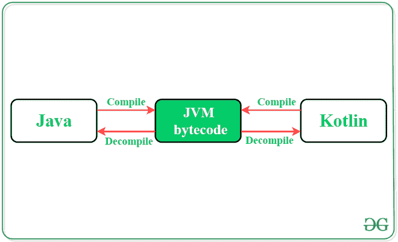
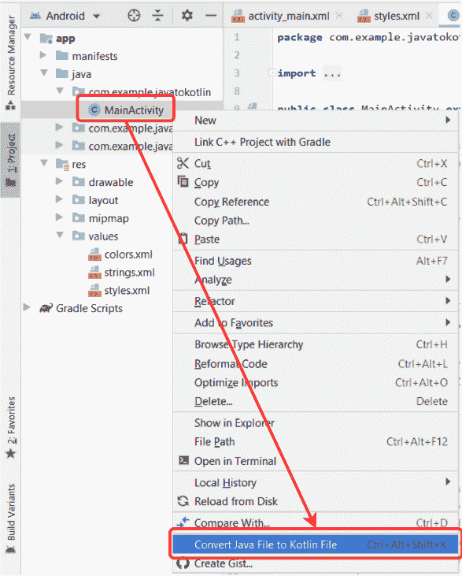
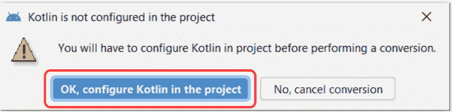
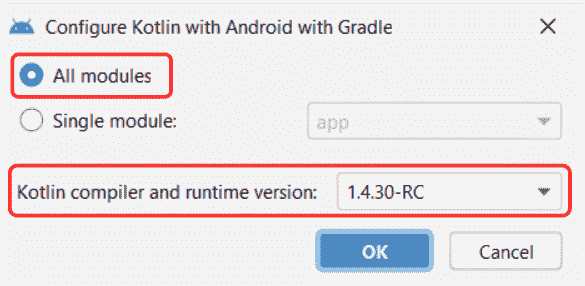
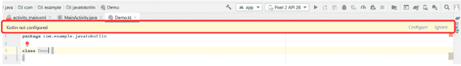

# 如何在 Android Studio 中将 Java 代码转换为 Kotlin 代码？

> 原文:[https://www . geesforgeks . org/how-convert-Java-code-to-kot Lin-code-in-Android-studio/](https://www.geeksforgeeks.org/how-to-convert-java-code-to-kotlin-code-in-android-studio/)

在**谷歌 I/O 2017** 、[T3Kotlin](https://www.geeksforgeeks.org/kotlin-programming-language/)已经被宣布为[安卓 app 开发](https://www.geeksforgeeks.org/kotlin-android-tutorial/)的官方语言。这种语言因为与 [**Java**](https://www.geeksforgeeks.org/java/) **语言**的相似性和互操作性，很快在开发人员中流行起来。人们可以在设计安卓项目时混合使用 Java 和 Kotlin 的代码。开发人员面临的一些主要挑战，如避免空指针异常，很容易由 Kotlin 处理。因为所有这些原因，学习柯特林变得至关重要。然而，安卓工作室照顾到了这一需求。开发人员可以在[安卓工作室](https://www.geeksforgeeks.org/guide-to-install-and-set-up-android-studio/)中轻松将自己的 Java 代码转换成 Kotlin。在开发人员面前可以有 2 种场景:

*   **将一个完整的 Java 文件/类转换成 Kotlin 文件/类**
*   **在项目中添加一个新的 Kotlin 文件/类，转换一段 Java 代码。**

本文广泛描述了在这两种情况下执行代码转换所涉及的步骤。



## 代码转换

### 方法 1:将一个完整的类/文件转换成 Kotlin

**第一步:打开源代码文件**

打开要转换的 java 源代码文件。考虑要转换成柯特林的**主活动**文件的给定代码。

## Java 语言(一种计算机语言，尤用于创建网站)

```
import androidx.appcompat.app.AppCompatActivity;
import android.os.Bundle;
import android.view.View;
import android.widget.TextView;

public class MainActivity extends AppCompatActivity {

    // declaring variable for TextView component
    private TextView textView;

    // declaring variable to store
    // the number of button click
    private int count;

    @Override
    protected void onCreate( Bundle savedInstanceState ) {
        super.onCreate(savedInstanceState);
        setContentView(R.layout.activity_main);

        // assigning ID of textView2 to the variable
        textView = findViewById(R.id.textView2);

        // initializing the value of count with 0
        count = 0;
    }

    // function to perform operations
    // when button is clicked
    public void buttonOnClick( View view){

        // increasing count by one on
        // each tap on the button
        count++;

        // changing the value of the
        // textView with the current
        // value of count variable
        textView.setText(Integer.toString(count));
    }
}
```

**第二步:选择选项**

从左侧的选项菜单中，选择安卓项目，右键单击源代码文件。选择**“将 Java 文件转换为 Kotlin 文件”**选项。在安卓工作室打开文件时，也可以使用快捷命令**“Ctrl+Alt+Shift+K”**。



将出现一个对话框，请求在项目中配置 Kotlin 的权限。要执行代码转换，必须授予此权限。进一步，选择**“所有模块”**选项，选择计算机上安装的最新 Kotlin 编译器。点击**“确定”后，**安卓工作室会在 app 模块 [build.gradle](https://www.geeksforgeeks.org/android-build-gradle/) 文件中做一些修改，成功进行代码转换。

 

**第三步:制作柯特林文件**

再次选择**“将 java 文件转换为 Kotlin 文件”**选项，方法是右键单击 Java 类/文件。这一次将进行所需的转换，并且文件扩展名将从**更改。爪哇**到**。kt** 。以下是转换上述**MainActivity.java**文件时产生的等效柯特林代码。

## 我的锅

```
import android.os.Bundle
import android.view.View
import android.widget.TextView
import androidx.appcompat.app.AppCompatActivity

class MainActivity : AppCompatActivity() {

    // declaring variable for TextView component
    private var textView: TextView? = null

    // declaring variable to store
    // the number of button click
    private var count = 0

    override fun onCreate(savedInstanceState: Bundle?) {
        super.onCreate(savedInstanceState)
        setContentView(R.layout.activity_main)

        // assigning ID of textView2 to the variable
        textView = findViewById(R.id.textView2)

        // initializing the value of count with 0
        count = 0
    }

    // function to perform operations
    // when button is clicked
    fun buttonOnClick(view: View?) {

        // increasing count by one on
        // each tap on the button
        count++

        // changing the value of the
        // textView with the current
        // value of count variable
        textView!!.text = Integer.toString(count)
    }
}
```

### 方法 2:在项目中添加一个单独的 Kotlin 文件

安卓工作室允许在一个项目中混合使用 Java 和 Kotlin 代码。如果需要通过用 Kotlin 编写来重用一段 Java 代码，可以遵循下面提到的步骤。

**步骤 1:创建柯特林类/文件**

在应用程序项目文件的 java 文件夹中创建一个新的 Kotlin 类/文件扩展名。给它一个想要的名字。文件创建后，安卓工作室会显示一条警告消息**“Kotlin 未配置”**。



**第二步:将科特林配置到项目中**

点击报警信息上的**“配置”**选项。将出现一个对话框，选择“所有模块”并选择计算机上安装的最新 Kotlin 编译器。单击**“确定”**并让更改发生在 [build.gradle](https://www.geeksforgeeks.org/android-build-gradle/) 文件中。


**第三步:复制粘贴**

安卓工作室完成项目文件的构建后，打开创建的科特林类/文件。复制要转换的 Java 代码。将代码粘贴到创建的扩展名为 Kotlin 的文件/类中。安卓工作室会自动将这些 Java 代码转换成 Kotlin。

### 柯特林相对于 Java 的优势

1.  Kotlin 代码比 Java 更简洁。
2.  它可以与 Java 互操作(兼容)。
3.  Kotlin 通过在其类型系统中放置**“空”**来解决可空性问题。
4.  更干净更安全的代码。