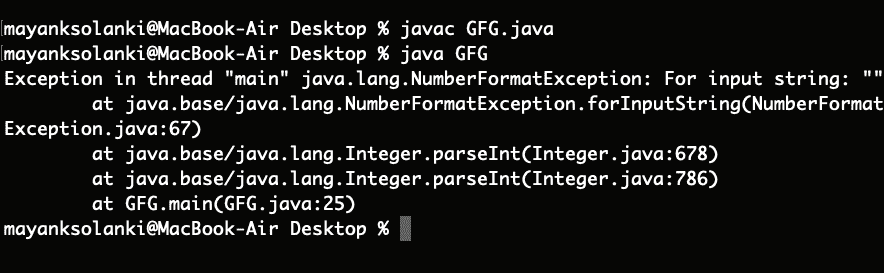

# Java 中如何将 String 转换为 int？

> 原文:[https://www . geesforgeks . org/如何在 java 中将字符串转换为 int/](https://www.geeksforgeeks.org/how-to-convert-string-to-int-in-java/)

在对字符串进行操作时，有时我们需要在 Java 中将表示为字符串的数字转换为整数类型。Java 中一般用来将 String 转换为 Integer 的方法是***parsent***()。

## **parsent()方法的变体**

**该方法有两种变体:**

**变量 1:** 该函数将字符串参数解析为带符号的十进制整数。

```java
public static int parseInt(String s) throws NumberFormatException 
```

**变量 2:** 该函数将字符串参数解析为由第二个参数指定的基数中的有符号整数

```java
public static int parseInt(String s, int radix) throws NumberFormatException
```

**参数:**

*   需要转换为整数的字符串。它还可以将第一个字符作为减号'-' ('\u002D ')或加号'+' ('\u002B ')来表示数字的符号。
*   解析字符串时使用基数。

> **注:**该参数仅针对该方法的第二种变体。

**返回类型:**两种方法都将字符串转换为其整数等价物。唯一不同的是参数基数。第一种方法可以视为基数= 10(十进制)的第二种方法的等价物。

> **注意:**如果您的字符串有前导零，parseInt()方法将忽略它们。

**抛出异常:**[numberformateexception](https://www.geeksforgeeks.org/numberformatexception-in-java-with-examples/)如果出现以下任一情况，则通过此方法抛出。

现在，极客们确实记住了与这两种变体相关的某些关键点:

*   字符串为空或长度为零
*   字符串表示的值不是 int 类型的值
*   特别是对于函数的 parseInt(字符串，整数基数)变体:
    *   第二个参数基数要么小于[字符。最小基数](https://docs.oracle.com/javase/7/docs/api/java/lang/Character.html#MIN_RADIX)或大于[字符。最大基数](https://docs.oracle.com/javase/7/docs/api/java/lang/Character.html#MAX_RADIX)
    *   字符串的任何字符都不是指定基数的数字，除了第一个字符可以是减号'-' ('\u002D ')或加号'+' ('\u002B ')，前提是字符串长度大于 1

插图:

```java
String str=”0111”;
int t=Integer.parseInt(str);
System.out.println(t); 
```

上述代码片段的输出将是 111。所以在前导零很重要的情况下(在二进制表示中)，避免使用 parseInt()方法。

**插图:**

```java
parseInt("20") returns 20
parseInt("+20") returns 20
parseInt("-20") returns -20
```

```java
parseInt("20", 16) returns 16, (2)*16^1 + (0)*16^0 = 32
parseInt("2147483648", 10) throws a NumberFormatException
```

```java
parseInt("99", 8) throws a NumberFormatException 
                  as 9 is not an accepted digit of octal number system
```

```java
parseInt("geeks", 28) throws a NumberFormatException
```

```java
parseInt("geeks", 29) returns 11670324, 
                  Number system with base 29 can have digits 0-9 
                  followed by characters a,b,c... upto s
```

```java
parseInt("geeksforgeeks", 29) throws a NumberFormatException as the 
                             result is not an integer.
```

## **如何使用 parseInt()方法？**

让我们直接举一个例子，以便获得用法，那么 parseint()方法的工作和实现上面提到的如下:

**实施例 1-A**

## Java 语言(一种计算机语言，尤用于创建网站)

```java
// Java program to demonstrate working parseInt()
// Where No NumberFormatException is Thrown

// Main class
public class GFG {

    // Main driver method
    public static void main(String args[])
    {
        // Custom wide-varied inputs to illustrate
        // usage of valueOf() method
        int decimalExample = Integer.parseInt("20");
        int signedPositiveExample = Integer.parseInt("+20");
        int signedNegativeExample = Integer.parseInt("-20");
        int radixExample = Integer.parseInt("20", 16);
        int stringExample = Integer.parseInt("geeks", 29);

        // Print commands on console
        System.out.println(decimalExample);
        System.out.println(signedPositiveExample);
        System.out.println(signedNegativeExample);
        System.out.println(radixExample);
        System.out.println(stringExample);
    }
}
```

**Output**

```java
20
20
-20
32
11670324
```

**例 1-B**

## Java 语言(一种计算机语言，尤用于创建网站)

```java
// Java Program to Demonstrate Working of parseInt() Method 
// Where NumberFormatException is Thrown

// Main class
public class GFG {

    // Main driver method
    public static void main(String args[])
    {
        // Custom wide-varied inputs to illustrate
        // usage of valueOf() method 
        int decimalExample = Integer.parseInt("20");
        int signedPositiveExample = Integer.parseInt("+20");
        int signedNegativeExample = Integer.parseInt("-20");
        int radixExample = Integer.parseInt("20", 16);
        int stringExample = Integer.parseInt("geeks", 29);

        // It will raise NumberFormatException
        String invalidArguments = "";
        int emptyString
            = Integer.parseInt(invalidArguments);
        int outOfRangeOfInteger
            = Integer.parseInt("geeksforgeeks", 29);
        int domainOfNumberSystem
            = Integer.parseInt("geeks", 28);

        // Print commands on console
        System.out.println(decimalExample);
        System.out.println(signedPositiveExample);
        System.out.println(signedNegativeExample);
        System.out.println(radixExample);
        System.out.println(stringExample);
    }
}
```

**输出:**



同样，我们可以将字符串转换为任何其他原始数据类型:

1.  **parseLong():** 将字符串解析为 Long
2.  **parseDouble():** 将字符串解析为 Double
    如果要在不使用 parseInt() 的情况下将字符串转换为整数**，可以使用 ***valueOf()** 方法*。它还有两个类似于 parseInt()的变体**
3.  **parsent()和 valueOf()的区别:**parsent()解析字符串并返回原始整数类型。但是，valueOf()返回一个整数对象。

> **注意:** valueOf()内部使用 parseInt()转换为整数。

**例 2:**

## Java 语言(一种计算机语言，尤用于创建网站)

```java
// Java Program to Demonstrate Working of valueOf() Method

// Main class 
public class GFG {

    // Main driver method  
    public static void main(String args[])
    {
        // Custom wide-varied inputs to illustrate
        // usage of valueOf() method 
        int decimalExample = Integer.valueOf("20");
        int signedPositiveExample = Integer.valueOf("+20");
        int signedNegativeExample = Integer.valueOf("-20");
        int radixExample = Integer.valueOf("20", 16);
        int stringExample = Integer.valueOf("geeks", 29);

        // Print statements 
        System.out.println(decimalExample);
        System.out.println(signedPositiveExample);
        System.out.println(signedNegativeExample);
        System.out.println(radixExample);
        System.out.println(stringExample);
    }
}
```

**Output**

```java
20
20
-20
32
11670324
```

本文由 **Shikhar Goel** 供稿。如果你喜欢 GeeksforGeeks 并想投稿，你也可以使用[write.geeksforgeeks.org](https://write.geeksforgeeks.org)写一篇文章或者把你的文章邮寄到 review-team@geeksforgeeks.org。看到你的文章出现在极客博客主页上，帮助其他极客。如果你发现任何不正确的地方，或者你想分享更多关于上面讨论的话题的信息，请写评论。