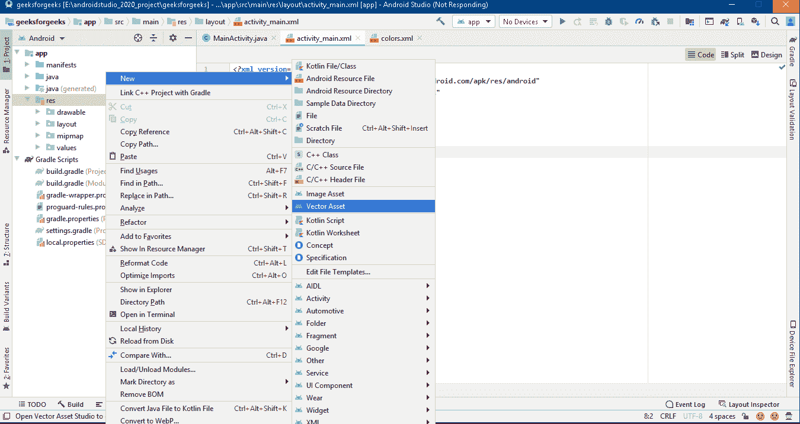
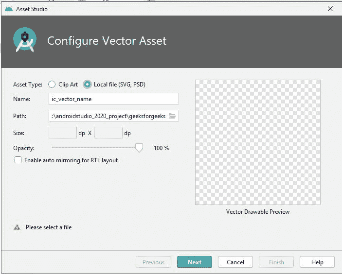
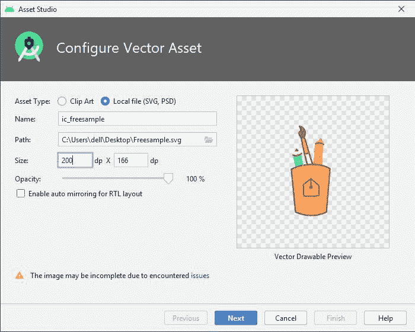
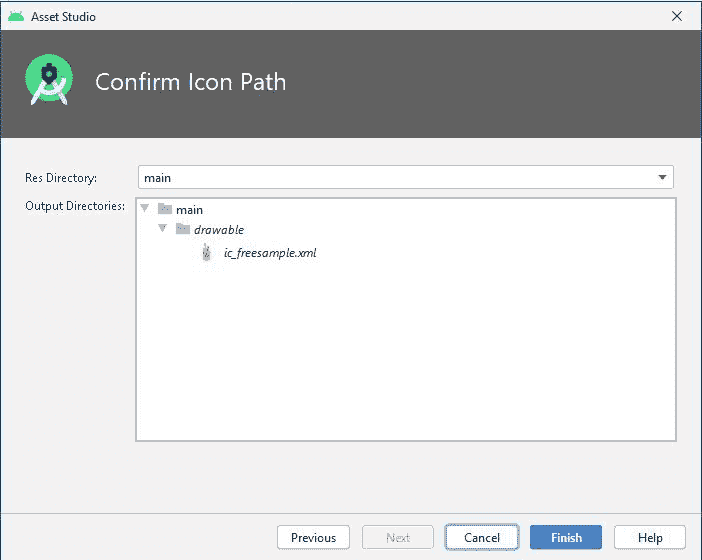

# 如何在 Android Studio 中将 SVG、PSD 图像转换为矢量可绘制文件？

> 原文:[https://www . geesforgeks . org/how-convert-SVG-PSD-images-to-vector-drawing-in-Android-studio/](https://www.geeksforgeeks.org/how-to-convert-svg-psd-images-to-vector-drawable-file-in-android-studio/)

为了在您的[**【安卓工作室】**](https://www.geeksforgeeks.org/guide-to-install-and-set-up-android-studio/) 项目中使用 [**SVG**](https://www.geeksforgeeks.org/difference-between-svg-and-jpeg/) ( 可伸缩矢量图形)或[**PSD**](https://www.geeksforgeeks.org/difference-between-jpeg-and-psd/)****)图像文件，您必须首先将它们转换为 XML(**Vector****)文件。**为什么是 XML(Vector drawing able)文件？********

*   **体积小**
*   **可扩展性(在不损失显示质量的情况下进行扩展)**
*   **高度和宽度可以很容易地改变**
*   **支持透明度**
*   **颜色可以改变**

**在本文中，我们将讨论如何将 **SVG** 和 **PSD** 图像文件转换为 XML Vector drawing able 并在安卓应用中显示。**

### **将奇异值分解、PSD 图像转换为矢量绘图文件的步骤**

****第一步:创建新项目****

**要在安卓工作室创建新项目，请参考[如何在安卓工作室创建/启动新项目](https://www.geeksforgeeks.org/android-how-to-create-start-a-new-project-in-android-studio/)。**

****第二步:转换文件****

*   **右键单击 **app - > res、**然后选择 **New- >矢量资产****

****

*   ****资产工作室**窗口将打开，选择**本地文件(SVG，PSD)****

****

*   **在路径中找到 SVG 或 PSD 文件。(下载文件)**

****

*   **更改文件的**名称、大小、不透明度**，点击**下一步**。现在你的 **SVG** 文件被转换成 **XML** 文件。**

****

*   **当您点击 **ic_freesample.xml** 文件时，下面是自动生成的 xml 代码。**

## **可扩展标记语言**

```
<vector android:height="166.1017dp" android:viewportHeight="392"
    android:viewportWidth="472" android:width="200dp" xmlns:android="http://schemas.android.com/apk/res/android">
    <path android:fillColor="#FFB564" android:pathData="M288.7,187.7c-53.7,-32.6 -119.8,1 -119.8,1s11.6,92.6 11.4,121.4c-0.8,2 -1,4.1 -0.4,6.3c-0.2,1.2 -0.6,1.7 -1,1.7h1.7c1.1,3 2.9,4.3 5.8,5.3c10.9,4 21.5,6.8 33.1,7.7c3.6,0.3 7.1,0.2 10.5,-0.2c1.6,1.5 4,2.4 7.1,2.1c13.2,-1.2 28,-1.9 38.6,-10.3c1.7,-1.4 2.7,-2.7 3.1,-4.7h0.8L288.7,187.7z"/>
    <path android:fillColor="#52E2D7" android:pathData="M173.2,146.4l7.3,37.6l26.1,-6.8l-6.5,-33.2z"/>
    <path android:fillColor="#FFFBE8" android:pathData="M222.6,133.8c0,0 -17.9,-15.6 -5.3,39.9c0.6,2.5 19.4,3.4 19.4,3.4L222.6,133.8z"/>
    <path android:fillColor="#F9A035" android:pathData="M188.6,181.4c0,0 -20.6,0 -20.6,12.4c0.1,17.2 13.4,105.6 13.1,119.9c-0.2,9.3 19.1,13.6 19.1,13.6"/>
    <path android:fillColor="#FFB564" android:pathData="M200.2,93.3c0,0 9.7,50.2 11.6,48.4c2,-1.8 10.8,-7.9 10.8,-7.9l-13.5,-40.5H200.2z"/>
    <path android:fillColor="#FFFBE8" android:pathData="M184.1,123.6c0,0 -12.9,24.6 -10.9,22.8c2,-1.8 27,-2.4 27,-2.4L184.1,123.6z"/>
    <path android:fillColor="#F25F68" android:pathData="M257.9,92.8c-1.5,2 -3,4.1 -4.4,6.3c-1.2,1.9 -2.9,2.3 -4.6,1.9c-1.7,3.4 -3.5,6.7 -5.7,9.8c-6.2,22.4 -0.7,41.7 -8.7,63.8c-1.3,3.5 0.3,0.3 2.2,2.5c5.6,-3 31.1,3.5 38.7,4.2c1.7,-2.3 -9.1,-3.3 -10.3,-6.6c1.4,3.9 0.2,-5.2 0.2,-6.1c0.3,-2.6 0,-5.5 0.3,-8.1c0.7,-4.6 -1.4,-6.4 -0.8,-11c1.9,-14.5 3.4,-29.4 3,-44.1c-2.2,-3.9 -4.1,-7.9 -5.6,-12.1C261,92.9 259.4,92.7 257.9,92.8z"/>
    <path android:fillColor="#00000000"
        android:pathData="M218.2,174.8c0,0 -4.5,-16.5 -9,-36.4c-4.8,-21.3 -9.7,-43.8 -9,-45.1c1.3,-2.6 5.4,-4.8 8.9,0c2,2.7 7.9,21.6 13.5,40.5c6.3,21.1 12.2,42.3 11.9,40.8"
        android:strokeColor="#AF3A46" android:strokeLineCap="square"
        android:strokeLineJoin="round" android:strokeWidth="4.9763"/>
    <path android:fillColor="#AF3A46"
        android:pathData="M200.2,93.3c-11.6,-12.2 -10.4,-19.2 -6.6,-23c6.6,-6.6 -2.8,-16.6 -0.9,-16.8c6.6,-0.6 28.6,9.6 17.3,36.9"
        android:strokeColor="#AF3A46" android:strokeWidth="2.4882"/>
    <path android:fillColor="#00000000"
        android:pathData="M245.2,109c0,0 11.3,-4.8 22.5,1.9"
        android:strokeColor="#AF3A46" android:strokeLineCap="round"
        android:strokeLineJoin="round" android:strokeWidth="4.9763"/>
    <path android:fillColor="#FFFBE8"
        android:pathData="M200.1,139.2c0,4.7 -12.2,4.7 -12.2,4.7c-3.2,5.3 -14.1,0 -14.1,0"
        android:strokeColor="#AF3A46" android:strokeLineCap="round"
        android:strokeLineJoin="round" android:strokeWidth="4.9763"/>
    <path android:fillColor="#AF3A46" android:pathData="M190.9,130.3c3.4,3.3 -12,3.5 -12,3.5l5.1,-10.2L190.9,130.3z"/>
    <path android:fillColor="#00000000"
        android:pathData="M211.8,141.6c7.7,0 11.4,-6 11.4,-6"
        android:strokeColor="#AF3A46" android:strokeLineCap="round"
        android:strokeLineJoin="round" android:strokeWidth="4.9763"/>
    <path android:fillColor="#00000000"
        android:pathData="M169,188.8L169,188.8c43.9,-21.5 94.3,-16.6 119.8,-1.1L277,321.9c0,0 -39.9,23.2 -95.2,-1.1L169,188.8z"
        android:strokeColor="#AF3A46" android:strokeLineCap="round"
        android:strokeLineJoin="round" android:strokeWidth="4.9763"/>
    <path android:fillColor="#00000000"
        android:pathData="M255.7,270.4l-2.2,-32.6l-24.4,-18.9L205,236.6c0.3,11.8 1.4,22.8 1.7,34.6C206.6,271.2 236,275.9 255.7,270.4z"
        android:strokeColor="#AF3A46" android:strokeLineCap="round"
        android:strokeLineJoin="round" android:strokeWidth="4.8228"/>
    <path android:fillColor="#00000000"
        android:pathData="M229.5,219L229.5,246"
        android:strokeColor="#AF3A46" android:strokeLineCap="round"
        android:strokeLineJoin="round" android:strokeWidth="5"/>
    <path android:fillColor="#00000000"
        android:pathData="M233.2,240.8c-1.5,0 -2.9,0.3 -6.8,0.4c0,0 -1,-0.9 -0.1,5.9c2.9,0.1 4,0.2 6.9,0.2C233.2,247.4 233.2,242.5 233.2,240.8z"
        android:strokeColor="#AF3A46" android:strokeLineCap="round"
        android:strokeLineJoin="round" android:strokeWidth="3.8582"/>
</vector>
```

****第三步:在安卓应用中展示图片****

*   **现在我们将在 app 中显示这个 **XML 矢量可绘制**文件。**
*   **下面是 **activity_main.xml** 文件的代码。**

## **可扩展标记语言**

```
<?xml version="1.0" encoding="utf-8"?>
<RelativeLayout 
    xmlns:android="http://schemas.android.com/apk/res/android"
    xmlns:tools="http://schemas.android.com/tools"
    android:layout_width="match_parent"
    android:layout_height="match_parent"
    tools:context=".MainActivity">

    <!-- Imageview to show the converted svg file -->
    <ImageView
        android:src="@drawable/ic_freesample"
        android:layout_centerInParent="true"
        android:layout_width="wrap_content"
        android:layout_height="wrap_content"/>

</RelativeLayout>
```

*   ****MainActivity.java**T2 文件**

**与**MainActivity.java**文件无关。**

## **Java 语言(一种计算机语言，尤用于创建网站)**

```
// MainActivity.java file
import androidx.appcompat.app.AppCompatActivity;
import android.os.Bundle;

public class MainActivity extends AppCompatActivity {

    @Override
    protected void onCreate(Bundle savedInstanceState) {
        super.onCreate(savedInstanceState);
        setContentView(R.layout.activity_main);

    }

}
```

### ****输出:****

****