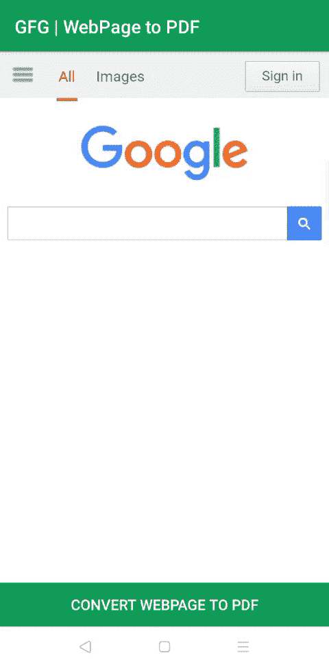

# 如何在安卓系统中将 WebView 转换为 PDF？

> 原文:[https://www . geesforgeks . org/how-convert-web view-to-pdf-in-Android/](https://www.geeksforgeeks.org/how-to-convert-webview-to-pdf-in-android/)

有时需要以 PDF 文件的形式保存互联网上的一些文章。要做到这一点有很多方法，你可以使用任何浏览器扩展或任何软件或任何网站来做到这一点。但是为了在安卓应用中实现这个功能，不能依赖其他软件或网站来实现。因此，要在 android 应用程序中实现这一惊人的功能，请遵循本教程。下面给出了一个 GIF 示例，来了解一下在本文中要做什么。



### 将网页视图转换为 PDF 的步骤

**步骤 1:创建新项目**

要在安卓工作室创建新项目，请参考[如何在安卓工作室创建/启动新项目。](https://www.geeksforgeeks.org/android-how-to-create-start-a-new-project-in-android-studio/)注意，选择 [Java](https://www.geeksforgeeks.org/java/) 作为编程语言，虽然我们要用 Java 语言实现这个项目。

**第二步:去编码区之前先做一些前置任务**

*   转到 **app - >清单- > AndroidManifest.xml** 部分，允许“[互联网许可](https://www.geeksforgeeks.org/android-how-to-request-permissions-in-android-application/)”。

**第三步:设计 UI**

在 **activity_main.xml 文件**中，有一个 [**WebView**](https://www.geeksforgeeks.org/how-to-use-webview-in-android/) 用于加载网站，还有一个[按钮](https://www.geeksforgeeks.org/button-in-kotlin/)用于将加载的网页保存为 PDF 文件。下面是 **activity_main.xml** 文件的代码。

## 可扩展标记语言

```
<?xml version="1.0" encoding="utf-8"?>
<RelativeLayout
    xmlns:android="http://schemas.android.com/apk/res/android"
    xmlns:tools="http://schemas.android.com/tools"
    android:layout_width="match_parent"
    android:layout_height="match_parent"
    tools:context=".MainActivity">

  <!-- WebView to load webPage  -->
  <WebView
      android:id="@+id/webViewMain"
      android:layout_width="match_parent"
      android:layout_height="match_parent"/>

  <!-- Button To save the Pdf file when clicked -->
  <Button
      android:layout_alignParentBottom="true"
      android:textColor="#ffffff"
      android:background="@color/colorPrimary"
      android:text="Convert WebPage To PDF"
      android:id="@+id/savePdfBtn"
      android:layout_width="match_parent"
      android:layout_height="wrap_content"/>

</RelativeLayout>
```

**第四步:使用 MainActivity.java 文件**

*   打开类内的**MainActivity.java**文件，首先创建**网络视图**类的对象。

> //创建 WebView 的对象
> 
> Web 检视列印网页；

*   现在在 **onCreate()** 方法中，用在 **activity_main.xml** 文件中给出的各自的标识初始化网络视图和按钮。

> //初始化网络视图
> 
> webview web view =(webview)findviewbyid(r . id . webview main)；
> 
> //初始化按钮
> 
> button savepdf BTN =(button)findviewbyid(r . id . savepdf BTN)；

*   现在**设置 W **ebView** 的 WebViewClient** ，在 **onPageFinished()** 内部，用 **WebView** 初始化**打印 Web** 对象。

> //设置网络视图客户端
> 
> webview . setwebview client(new webview client()
> 
> {
> 
> @覆盖
> 
> 公共 void OnPageFinded(WebView 视图，字符串 URL){ 0
> 
> super.onPageFinished(视图，URL)；
> 
> //初始化打印网页对象
> 
> 打印 web = web 视图；
> 
> }
> 
> });

*   现在加载网址

> //正在加载网址
> 
> webview . LoadURl(" https://www . Google . com ")；

*   接下来，调用稍后创建的 **createWebPrintJob()** 方法，在 **onClick()** 、**T5】中显示各自的[祝词](https://www.geeksforgeeks.org/android-what-is-toast-and-how-to-use-it-with-examples/)。**

> //设置点击保存 Pdf 按钮的监听器
> 
> savepdfbtn . setonclicklistener(新视图)。onclicklistener()& gt
> 
> @覆盖
> 
> 公共空间单击(查看视图){ 0
> 
> if(printWeb！=null)
> 
> {
> 
> 如果(构建。版本。版本代码。棒棒糖){ 0
> 
> //调用 createWebPrintJob()
> 
> printwebpage(printwebage)；
> 
> }其他
> 
> {
> 
> //向用户显示祝酒词
> 
> toast . make text(main activity . this，“不适用于安卓棒棒糖以下的设备”，
> 
> 干杯。LENGTH_SHORT)。show()；
> 
> }
> 
> }
> 
> 其他
> 
> {
> 
> //向用户显示祝酒词
> 
> Toast . make text(main activity . this，“网页未完全加载”，Toast。LENGTH_SHORT)。show()；
> 
> }
> 
> }
> 
> });

*   创建一个**打印作业**的对象，并创建一个**布尔打印表达式**，用于检查打印网页的状态。

> //打印作业的对象
> 
> print job；
> 
> //检查打印状态的布尔值
> 
> boolean printBtnPressed = false

*   现在在**MainActivity.java**类中创建一个**printwebpage()**方法，下面是**printwebpage()**方法的完整代码。

> @RequiresApi(api = Build。版本代码。棒棒糖)
> 
> private void printwebpage(WebView WebView){ 0
> 
> //将 printBtnPressed 设置为 true
> 
> printBtnPressed = true
> 
> //创建打印管理器实例
> 
> print manager print manager =(print manager)此
> 
> 。获取系统服务(上下文。PRINT _ SERVICE)；
> 
> //设置作业名称
> 
> string job name = GetString(r . StrIng . app _ name)+“网页”+WebView . GetURl()；
> 
> //创建打印文档适配器实例
> 
> printdocumentadapter printadapter = webview . createprindocumentadapter(job name)；
> 
> //使用名称和适配器实例创建打印作业
> 
> 断言打印管理器！= null
> 
> print job = print manager . print(job name、printAdapter、
> 
> 新的打印属性。Builder()。build())；
> 
> }

*   接下来，在 **onResume()** 方法中显示保存 PDF 的状态，并检查打印状态。下面是 **onResume()** 方法的完整代码。

> @覆盖
> 
> 受保护的 void on resume(){ 0
> 
> super . onresume()；
> 
> if(printJob！= null & & printbntPresented){ 0
> 
> if(printjob . is completed()){ 0
> 
> //显示祝酒词
> 
> 吐司。制作文本(这，“完成”，吐司。LENGTH_SHORT)。show()；
> 
> } else if(printjob . Isstarted()){ 0
> 
> //显示祝酒词
> 
> 吐司. makeText(这个，“isStarted”，吐司。LENGTH_SHORT)。show()；
> 
> } else if(printjob . ISblocked()){ 0
> 
> //显示祝酒词
> 
> 吐司. makeText(这个，“被锁定”，吐司。LENGTH_SHORT)。show()；
> 
> } else if(printjob . iscanceled()){ 0
> 
> //显示祝酒词
> 
> 吐司. makeText(这个，“isCancelled”，吐司。LENGTH_SHORT)。show()；
> 
> } else if(printjob . Isfailed()){ 0
> 
> //显示祝酒词
> 
> 吐司。制作文本(这个，“失败了”，吐司。LENGTH_SHORT)。show()；
> 
> } else if(printjob . isqueued()){ 0
> 
> //显示祝酒词
> 
> 吐司. makeText(这个，“isQueued”，吐司。LENGTH_SHORT)。show()；
> 
> }
> 
> //将 printBtnPressed 设置为 false
> 
> printBtnPressed = false
> 
> }
> 
> }

*   以下是**MainActivity.java**文件的完整代码。

## Java 语言(一种计算机语言，尤用于创建网站)

```
import android.content.Context;
import android.os.Build;
import android.os.Bundle;
import android.print.PrintAttributes;
import android.print.PrintDocumentAdapter;
import android.print.PrintJob;
import android.print.PrintManager;
import android.view.View;
import android.webkit.WebView;
import android.webkit.WebViewClient;
import android.widget.Button;
import android.widget.Toast;
import androidx.annotation.RequiresApi;
import androidx.appcompat.app.AppCompatActivity;

public class MainActivity extends AppCompatActivity {

    // creating object of WebView
    WebView printWeb;

    @Override
    protected void onCreate(Bundle savedInstanceState) {
        super.onCreate(savedInstanceState);
        setContentView(R.layout.activity_main);

        // Initializing the WebView
        final WebView webView = (WebView) findViewById(R.id.webViewMain);

        // Initializing the Button
        Button savePdfBtn = (Button) findViewById(R.id.savePdfBtn);

        // Setting we View Client
        webView.setWebViewClient(new WebViewClient() {
            @Override
            public void onPageFinished(WebView view, String url) {
                super.onPageFinished(view, url);
                // initializing the printWeb Object
                printWeb = webView;
            }
        });

        // loading the URL
        webView.loadUrl("https://www.google.com");

        // setting clickListener for Save Pdf Button
        savePdfBtn.setOnClickListener(new View.OnClickListener() {
            @Override
            public void onClick(View view) {
                if (printWeb != null) {
                    if (Build.VERSION.SDK_INT >= Build.VERSION_CODES.LOLLIPOP) {
                        // Calling createWebPrintJob()
                        PrintTheWebPage(printWeb);
                    } else {
                        // Showing Toast message to user
                        Toast.makeText(MainActivity.this, "Not available for device below Android LOLLIPOP", Toast.LENGTH_SHORT).show();
                    }
                } else {
                    // Showing Toast message to user
                    Toast.makeText(MainActivity.this, "WebPage not fully loaded", Toast.LENGTH_SHORT).show();
                }
            }
        });

    }

    // object of print job
    PrintJob printJob;

    // a boolean to check the status of printing
    boolean printBtnPressed = false;

    @RequiresApi(api = Build.VERSION_CODES.LOLLIPOP)
    private void PrintTheWebPage(WebView webView) {

        // set printBtnPressed true
        printBtnPressed = true;

        // Creating  PrintManager instance
        PrintManager printManager = (PrintManager) this
                .getSystemService(Context.PRINT_SERVICE);

        // setting the name of job
        String jobName = getString(R.string.app_name) + " webpage" + webView.getUrl();

        // Creating  PrintDocumentAdapter instance
        PrintDocumentAdapter printAdapter = webView.createPrintDocumentAdapter(jobName);

        // Create a print job with name and adapter instance
        assert printManager != null;
        printJob = printManager.print(jobName, printAdapter,
                new PrintAttributes.Builder().build());
    }

    @Override
    protected void onResume() {
        super.onResume();
        if (printJob != null && printBtnPressed) {
            if (printJob.isCompleted()) {
                // Showing Toast Message
                Toast.makeText(this, "Completed", Toast.LENGTH_SHORT).show();
            } else if (printJob.isStarted()) {
                // Showing Toast Message
                Toast.makeText(this, "isStarted", Toast.LENGTH_SHORT).show();

            } else if (printJob.isBlocked()) {
                // Showing Toast Message
                Toast.makeText(this, "isBlocked", Toast.LENGTH_SHORT).show();

            } else if (printJob.isCancelled()) {
                // Showing Toast Message
                Toast.makeText(this, "isCancelled", Toast.LENGTH_SHORT).show();

            } else if (printJob.isFailed()) {
                // Showing Toast Message
                Toast.makeText(this, "isFailed", Toast.LENGTH_SHORT).show();

            } else if (printJob.isQueued()) {
                // Showing Toast Message
                Toast.makeText(this, "isQueued", Toast.LENGTH_SHORT).show();

            }
            // set printBtnPressed false
            printBtnPressed = false;
        }
    }
}
```

### **输出:在仿真器上运行**

<video class="wp-video-shortcode" id="video-484907-1" width="640" height="360" preload="metadata" controls=""><source type="video/mp4" src="https://media.geeksforgeeks.org/wp-content/uploads/20200912005525/converting-webpage-to-pdf-file-in-android-studio-.mp4?_=1">[https://media.geeksforgeeks.org/wp-content/uploads/20200912005525/converting-webpage-to-pdf-file-in-android-studio-.mp4](https://media.geeksforgeeks.org/wp-content/uploads/20200912005525/converting-webpage-to-pdf-file-in-android-studio-.mp4)</video>

**资源:**

*   从 [github](https://github.com/olyklohan/converting-webpage-to-pdf-in-android-studio-app) 下载完整项目
*   下载 [apk 文件](https://github.com/olyklohan/converting-webpage-to-pdf-in-android-studio-app/blob/master/web%20page%20to%20pdf%20file%20android%20studio%20.apk)